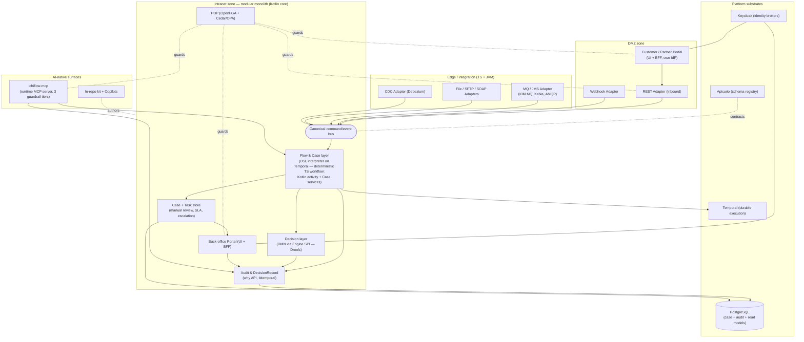
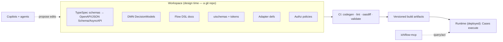

# 01 — System Overview

**What this covers.** The integrating map of ichiflow: every module and how the modules
compose, a container-level diagram, the design-time **Workspace** vs runtime split, an
end-to-end worked example (a loan application arriving by REST *and* by IBM MQ, decided,
routed to manual review, producing a queryable DecisionRecord), and the deployment shapes
(modular monolith → split; Dev/Team/Enterprise tiers; DMZ/intranet zones) at overview
altitude with pointers into the deep-dive docs.

**Position in the system.** This sits directly under
[`00-vision-and-principles.md`](00-vision-and-principles.md). It is the "you are here" map:
enough of each module to see how the pieces fit, and a filename pointer to the doc that owns
each one. Deep dives: [`02-schema-foundation.md`](02-schema-foundation.md),
[`03-decision-layer.md`](03-decision-layer.md),
[`04-flow-and-case-layer.md`](04-flow-and-case-layer.md),
[`05-adapters.md`](05-adapters.md),
[`06-identity-and-access.md`](06-identity-and-access.md),
[`07-ui-and-portals.md`](07-ui-and-portals.md),
[`08-audit-and-observability.md`](08-audit-and-observability.md),
[`09-deployment-and-topology.md`](09-deployment-and-topology.md),
[`10-ai-native-experience.md`](10-ai-native-experience.md),
[`11-migration-in-and-out.md`](11-migration-in-and-out.md). Target design, present tense;
phasing marked where it matters.

---

## 1. The modules and how they compose

ichiflow is one framework composed of layered modules. Each is owned by a deep-dive doc; the
one-liners below say what it is and how it plugs into its neighbors. Naming follows the
[BRIEF](BRIEF.md) vocabulary exactly.

| Module | What it is | Composes with | Deep dive |
|---|---|---|---|
| **Schema foundation** | The canonical typed model. Authored in TypeSpec; emits OpenAPI 3.1 / JSON Schema 2020-12 / AsyncAPI 3.1 as the checked-in contracts. Every type, validator, form, and message payload derives from it. | Feeds *everything* — it is the single source of truth. | [`02-schema-foundation.md`](02-schema-foundation.md) |
| **Decision layer** | Rule-evaluated determinations. Authored as DMN (DRD + FEEL); evaluated by an Engine behind the Decision Engine SPI (Drools reference; ZEN planned). Adds the governance/simulation/explainability layer Drools lacks. | Called by Flows and Adapters; emits fired-rule traces to the DecisionRecord. | [`03-decision-layer.md`](03-decision-layer.md) |
| **Flow & Case layer** | Declarative long-running processes (JSON/YAML, CNCF-Serverless-Workflow-aligned) interpreted on Temporal. A **Case** is the unit of work carrying `case_id` + DecisionRecord; **Tasks** are human work items (assignment, SLA, escalation); manual review is a first-party module. | Invokes Decisions; drives Portals via Tasks; writes to Audit. | [`04-flow-and-case-layer.md`](04-flow-and-case-layer.md) |
| **Adapters** | Declared, schema'd, versioned ports in/out: REST, MQ/JMS/Kafka/AMQP, file/SFTP, SOAP, webhook, CDC. Inbound normalizes to a canonical command/event; outbound de-normalizes from canonical. | Bridge the outside world to the canonical bus; never leak broker clients into the core. | [`05-adapters.md`](05-adapters.md) |
| **Identity & Access** | Identity brokers per audience (Keycloak primary), OIDC/SAML/LDAP/legacy via broker strategies, token exchange for propagation; a central PDP (OpenFGA ReBAC + Cedar/OPA ABAC) whose decisions are themselves explainable logs. | Guards every Adapter, Portal, Flow action, and agent; the *same* PDP drives API and UI. | [`06-identity-and-access.md`](06-identity-and-access.md) |
| **Portals / UI** | Audience-scoped UI + BFF (back-office, customer, partner), each with its own IdP config and entitlements. Auto-generated from schemas via the JSON Forms model; designer overrides are durable. | Render Tasks and Cases; enforce field/row-level authz from the PDP. | [`07-ui-and-portals.md`](07-ui-and-portals.md) |
| **Audit & DecisionRecord** | The per-`case_id` DecisionRecord domain object + the "why" API. Stitches workflow history + rule traces + DMN results + human review + agent actions into one causal, bitemporal chain. | Written to by Decisions, Flows, Portals, agents; read by auditors and `ichiflow-mcp`. | [`08-audit-and-observability.md`](08-audit-and-observability.md) |
| **AI-native surfaces** | In-repo agent kit (`AGENTS.md`, `.claude/` skills/hooks/subagents/plugin) for build time + the first-party **`ichiflow-mcp`** runtime server exposing the why/case/flow query APIs under three server-enforced guardrail tiers. | Reads the DecisionRecord/Flow APIs; acts as a non-human identity under Identity & Access. | [`10-ai-native-experience.md`](10-ai-native-experience.md) |
| **Copilots** | Domain Modeling Copilot (greenfield), Migration Copilot (brownfield), Rule Authoring assistance. All follow "AI proposes, deterministic tools + humans dispose," with provenance. | Operate on the Workspace and legacy DBs; gated by human approval + dry-run. | [`11-migration-in-and-out.md`](11-migration-in-and-out.md) |

The composition rule that ties them together: **the Schema foundation is the hub, and the
canonical command/event bus is the spine.** Adapters translate the world into canonical
messages; Flows orchestrate; Decisions determine; Portals present; the PDP guards every edge;
and every step deposits provenance into the DecisionRecord. No module reaches around this
spine — that is what makes the async-first, split-later topology possible.

## 2. Container diagram (C4-ish)

The diagram shows the **default modular-monolith** shape: the core modules share a process and
a PostgreSQL instance, Temporal is the durable-execution substrate, and the Portals/Adapters
sit at the edges. The DMZ/intranet split is drawn because it is designed in from day one
([`09-deployment-and-topology.md`](09-deployment-and-topology.md)), even though at the Dev tier
everything collapses into one binary.

## 3. Design-time Workspace vs runtime

ichiflow has two clearly separated worlds, and keeping them separate is what lets an AI agent
operate safely on the design without touching the running system.

**Design time — the Workspace.** A **Workspace** is a git repository: the design-time project
holding all declarative artifacts — TypeSpec schemas and their emitted contracts, DMN
DecisionModels, Flow DSL documents, uischemas + design tokens, Adapter definitions, and
authorization policies. It is what a developer, a domain user, or a Copilot edits. Because it
is all typed, versioned text, changes are diffable and reviewable; CI runs codegen, schema
lint, uischema-scope checks, `oasdiff` breaking-change gates, and decision/flow validation.
The Workspace is the "source"; nothing here executes business cases.

**Runtime — the deployed system.** The runtime loads *built, versioned artifacts* from the
Workspace and executes real Cases: Adapters accept traffic, the Flow interpreter runs on
Temporal, Decisions evaluate, Tasks land in Portals, and DecisionRecords accumulate. Long-
running Flow instances are pinned (Temporal patching) to the artifact version they started on,
so evolving the Workspace never corrupts in-flight Cases.

Note the two agent doors: **Copilots act on the Workspace** (build time, via pull requests a
human approves), while **`ichiflow-mcp` acts on the runtime** (query always; mutate only under
the guardrail tiers). They never cross.

## 4. Worked example — a loan application, end to end

The same canonical Case is produced whether the application arrives synchronously over REST or
asynchronously over IBM MQ. This is the payoff of the canonical-bus spine.

**4a. Arrival by REST.** A customer submits via the Customer Portal in the DMZ. The **REST
Adapter** validates the payload against the JSON Schema (2020-12) generated from the Schema
foundation, the PDP authorizes the submission, and the adapter normalizes it into a canonical
`LoanApplicationSubmitted` command placed on the bus. A new **Case** is created with a global
`case_id` and an empty **DecisionRecord**.

**4b. Arrival by IBM MQ.** A partner bank drops an XML message on an IBM MQ queue. The **MQ/JMS
Adapter** (Camel-backed on the JVM edge — see
[`../research/04-adapters-and-auth.md`](../research/04-adapters-and-auth.md)) applies its
mapping (XML → canonical), dedups on an idempotency key (Idempotent Receiver), and emits the
*same* canonical `LoanApplicationSubmitted` command. From here the two paths are identical —
the core never learns which transport the work came from.

**4c. Decision.** The **Flow** interpreter (running as a Temporal workflow) walks the loan Flow
DSL. At a decision node it invokes the **Decision layer** over the Decision Engine SPI: the DMN
`CreditRisk` DecisionModel (decision table + FEEL) evaluates on the canonical facts. Every
fired rule and per-decision result is captured and appended to the DecisionRecord. The Decision
returns, say, `REFER` (neither auto-approve nor auto-deny).

**4d. Routing to manual review.** The Flow's content-based routing sends a `REFER` outcome to a
manual-review node. Assignment is *itself a Decision* (which queue / which reviewer, by policy),
producing a **Task** with an SLA timer and escalation path. The Flow blocks on an await-signal
for that Task. The Task surfaces in the **Back-office Portal**, whose generated UI and
field/row-level visibility are enforced by the same PDP that guarded the inbound REST call.

**4e. Human acts.** A reviewer opens the Case, sees the decision trace so far, and approves. The
Portal emits an `approve` signal; the Flow resumes, records the human review step (who, when,
what they saw — bitemporally) in the DecisionRecord, and completes the Case with `APPROVED`. An
outbound Adapter de-normalizes the outcome back to the partner (e.g., a response message).

**4f. The auditor and the agent both ask "why."** Months later, an **auditor** queries the
"why" API for `case_id`: it returns the one causal chain — inputs known at the time, the policy
version in force, which rules fired, the DMN result, the assignment decision, the reviewer's
action, the final outcome — answerable *as of the decision date*. **Claude Code**, paged
about a similar stuck case, asks the *same* store through **`ichiflow-mcp`** tools
(`get_case_trace`, `explain_decision`, `list_stuck_cases`), reproduces the case deterministically
from captured event history, and proposes a fix as a Workspace pull request — read-only against
production the whole time (Tier-0), never mutating without approval
([`../research/07-ai-native-operations.md`](../research/07-ai-native-operations.md) §0.2, §0.5).

## 5. Deployment shapes (overview)

Full treatment is in [`09-deployment-and-topology.md`](09-deployment-and-topology.md); the
overview view:

**Modular monolith → split.** The default is a modular monolith with **async-first module
boundaries** (Spring Modulith-style enforcement — see
[`../research/05-audit-observability-deployment.md`](../research/05-audit-observability-deployment.md)
§3). Because modules already talk over the canonical bus, any module (a hot Adapter, the
Decision layer, a Portal BFF) can be promoted to an independently scalable service without a
rewrite. You adopt distribution only when load or team boundaries demand it.

**Tiers — same code, config only.**

| Tier | Shape | Store | Identity / zones |
|---|---|---|---|
| **Dev** | Single binary / docker-compose | SQLite / embedded | Local; no zone split |
| **Team** | docker-compose or small K8s | PostgreSQL | Single IdP; optional split |
| **Enterprise** | HA on K8s (Helm/operator), air-gap capable | Postgres HA + storage SPIs (ledger/search/warehouse) | SSO brokers, DMZ/intranet zones, compliance packs |

The application code is identical across tiers; only configuration changes ("Same code from
laptop to zoned HA").

**DMZ / intranet zones.** Designed in from day one: the customer/partner **Portal and inbound
Adapters run in the DMZ**, the Decision/Flow/Case **core runs in the intranet**, and the two
zones communicate only over a **one-way async relay / message replication** (up to hardware
data-diode strictness for the most regulated adopters). Secrets stay in Vault/ESO; agent
credentials are non-human identities under the same regime.

---

## Open questions

- **Where exactly is the DMZ↔intranet boundary crossed for synchronous portal reads?** The
  async relay is clear for commands/events; the pattern for a customer reading live Case status
  across the zone boundary needs to be pinned in [`09-deployment-and-topology.md`](09-deployment-and-topology.md).
- **Adapter runtime placement.** Heavy enterprise protocols (IBM MQ, SOAP) point to a
  Camel/Quarkus JVM edge; lightweight/streaming paths point to a TS/Benthos edge. The default
  split and how it appears in the monolith tier is owned by [`05-adapters.md`](05-adapters.md).
- **Read-model ownership.** Whether Portal read models are projected in-core or via CDC into a
  separate store at the Team tier (vs only at Enterprise) is undecided
  ([`08-audit-and-observability.md`](08-audit-and-observability.md)).
- **Second Flow/Decision engine surfacing.** How and when the ZEN (TS/edge) Decision engine and
  any edge Flow execution appear in this map alongside the Drools/Temporal defaults.
