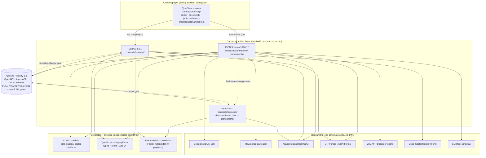

# 02 — Schema Foundation

## What this covers

The schema-first core of ichiflow: how every typed contract in the system is authored once
and consumed everywhere. Specifically —

- the **two-layer contract model**: TypeSpec as the authoring surface, emitted OpenAPI 3.1 /
  JSON Schema 2020-12 (and AsyncAPI 3.1 for messages) as the canonical, checked-in artifacts;
- the **codegen pipeline** to Kotlin (Fabrikt) and TypeScript (hey-api/orval, pinned), with
  generated code checked in and a regenerate-and-diff CI gate;
- **runtime validation** derived from the same schemas at every adapter boundary, so static
  types and runtime validators provably share one origin;
- the **schema registry** (Apicurio) and the **evolution rules** (FULL_TRANSITIVE for events,
  oasdiff breaking-change gates for APIs, expand/contract at the contract level);
- how every other pillar — **Decisions, Flows, Adapters, Portals/UI, the why API** — consumes
  this one schema source;
- the **domain entity store** (§11): schema-defined business entities persisted PostgreSQL-first via
  generated repositories with a query/pagination/search contract (v1-kernel; ADR-0018);
- the **monorepo layout** for schemas and generated artifacts;
- how **AI coding agents** author and consume schemas (LLM-legible IDL; JSON Schema doubling as
  LLM tool schemas).

## Position in the system

This document is the substrate the rest of the architecture stands on. The **Schema** is the
first noun in ichiflow's vocabulary (BRIEF §"Core vocabulary"), and locked decision §5 fixes the
strategy: *author in TypeSpec; emitted OpenAPI 3.1+ / JSON Schema 2020-12 are the canonical
checked-in contract artifacts; AsyncAPI 3.1 for message contracts.* Everything else references
back here: Adapters ([04](../research/04-adapters-and-auth.md)) declare their contracts against
these schemas, the UI layer ([07-ui-and-portals.md](07-ui-and-portals.md)) generates from them,
the DecisionRecord/why API ([research 05](../research/05-audit-observability-deployment.md))
`$ref`s them, and the AI-native surfaces ([research 07](../research/07-ai-native-operations.md))
reuse them as tool schemas. Research basis: [03-schema-and-types.md](../research/03-schema-and-types.md).

---

## 1. The two-layer contract model

The apparent tension in the brief — "author in TypeSpec" *and* "JSON Schema is canonical" — is
resolved by separating the **editing surface** from the **contract of record**.

- **Authoring layer — TypeSpec** (`@typespec/compiler` 1.13.x). Humans and agents write contracts
  in TypeSpec's concise, TypeScript-like DSL: the most LLM-legible IDL available, with first-class
  discriminated unions (`@discriminated`) and a real versioning story (`@typespec/versioning`).
  A ~500-line OpenAPI document is ~50 lines of TypeSpec.
- **Canonical artifact layer — emitted OpenAPI 3.1 + JSON Schema 2020-12** (plus AsyncAPI 3.1 for
  messages). These are *build outputs, checked into the repo*, and they are the single source of
  truth every downstream tool reads: Kotlin codegen, TS codegen, runtime validators on both sides
  of every boundary, the UI generator, the docs pipeline, and the schema registry.

**Nothing downstream ever depends on TypeSpec directly.** TypeSpec compiles in CI; the emitted,
deterministic specs are what consumers see. This makes the authoring tool swappable (TypeSpec
itself, or any single emitter, can be replaced) without breaking a single consumer — and it means
downstream tools only ever handle industry-standard formats with the deepest tooling ecosystems.

**Why not the alternatives** (from [research 03 §3.3](../research/03-schema-and-types.md)):

| Rejected source-of-truth | Why rejected |
|---|---|
| **Zod-first** (TS) → project to JSON Schema | Lossy: `z.transform`/refinements don't survive projection, so Kotlin silently under-enforces — drift by construction. Zod is fine as *generated* TS output, never as source. |
| **Kotlin-first** (annotations) | Contract trails implementation (implementation-first, not API-first); TS becomes second-class. |
| **Raw OpenAPI YAML-first** | Verbose, error-prone, no versioning projection, worst human/LLM authoring ergonomics at scale. |

**Pinned toolchain (July 2026):** TypeSpec 1.13.x · OpenAPI 3.1 (target 3.2 as Fabrikt/hey-api
catch up) · JSON Schema 2020-12 · AsyncAPI 3.1.0 · Fabrikt 27.4.x (Kotlin) · hey-api 0.99.x
(pinned) or orval 8.0 (TS) · Modelina (event models) · Apicurio Registry 3.3.x.

**Named risks carried from research** (design around these): Stainless was acquired by Anthropic
(May 2026) and its hosted generator is winding down — not in the design. `openapi-fetch` /
`openapi-react-query` are in maintenance mode — excluded (BRIEF §14). `zod-to-json-schema` is
deprecated — use Zod v4's native `z.toJSONSchema()`. hey-api is still 0.x — **pin exactly**;
orval 8 is the validated drop-in.

### 1.1 Which types are canonical — the boundary-crossing test

"Author in TypeSpec" scopes the **contracts**, not *every struct in the system*. The brief locks
"TypeSpec → JSON Schema canonical" for contracts but never says which types are contracts — so a
naive reader (or agent) could TypeSpec every internal struct, which is exactly the over-ceremony to
avoid. Forcing a canonical schema on a shape with one consumer in one language adds a codegen
indirection, a checked-in artifact, and a diff-gate that buy nothing. The rule:

**A type MUST be lifted into the canonical schema (TypeSpec → JSON Schema) if, and only if, it
crosses a governed boundary** — i.e. a second, independently-deployed or independently-versioned
consumer reads it. Concretely: adapter wire contracts, portal/BFF APIs, Flow step payloads,
Decision input/output, canonical commands/events, persisted Case data, and MCP tool I/O. At those
boundaries the one schema pays for itself — cross-language Kotlin+TS parity, runtime validation,
versioning/compat gates, UI generation, and an LLM tool schema, all from one source.

**A module-internal shape stays native.** A helper struct between two Kotlin functions in one
module, a small config read at startup by one component, an internal DTO that never serializes
across a boundary — a plain Kotlin `data class` / TS `interface` is enough, and is *more* readable
and auditable than a TypeSpec round-trip.

**The litmus:** *does this shape cross a boundary where a second, independently-deployed or
independently-versioned consumer — the other language, an external system, an auditor, or an agent
— reads it?* Yes → canonical schema. No (one module, one language, one lifetime) → native type.

**Tie-breaker on cost asymmetry.** Getting it wrong toward "lift to schema" costs ceremony now;
getting it wrong toward "keep native" costs future drift *only if* it later crosses a boundary —
and lifting a stable data class into TypeSpec is mechanical, made safe by the expand/contract
discipline (§6.3). So lift when a shape is on a boundary or clearly heading for one; otherwise keep
it native and lift later. Small config shapes follow the same test: one module's internal config
(timeouts, pool sizes) is a native type; operator-facing config that ships in Helm values / the
deployment contract crosses the ops boundary and *is* schema'd.

---

## 2. The artifact pipeline



The invariant: **one source (TypeSpec) → canonical artifacts (checked in) → everything else reads
the artifacts.** A tool anywhere in the fan-out can be swapped without touching the source.

---

## 3. Message contracts (AsyncAPI) share payload schemas by `$ref`

ichiflow has message-queue Adapters (BRIEF §"Adapter"; [research 04](../research/04-adapters-and-auth.md)),
so async contracts are first-class, not an afterthought.

- **AsyncAPI 3.1** describes channels/operations/messages with Kafka, AMQP, MQTT, JMS/MQ, and
  WebSocket bindings — exactly ichiflow's async ports.
- TypeSpec has **no first-party AsyncAPI emitter** (community efforts only), so AsyncAPI documents
  are **hand-authored** — but they `$ref` the **same JSON Schema components** the TypeSpec emitter
  produces. The part that matters (the payload shape) stays single-sourced.
- **Modelina** generates Kotlin and TypeScript payload models from AsyncAPI / JSON Schema. Where
  Modelina's Kotlin output falls short, the payload JSON Schema is fed to **Fabrikt** directly
  (it accepts component schemas), so event types and API types descend from the same artifact.

Say it plainly: hand-authored AsyncAPI is a **second hand-maintained surface** — a bounded, named
dent in "one schema, no drift." Only the *channel/operation* wrapper is hand-authored; the payload
shape stays single-sourced by `$ref`, so the drift risk is scoped to the wrapper, not the data. It
is a real v1 maintenance cost, tracked in open-q2, not a silent one.

This is what lets a single `LoanApplication` schema back both a `POST /loan-applications` REST
endpoint and a `loan.application.submitted.v1` event with no divergence.

---

## 4. Codegen: generated code is checked in

### 4.1 Kotlin — Fabrikt 27.4.x

KotlinPoet-based, so output is deterministic, idiomatic, and prettier-clean. Emits data classes
with validation annotations and **sealed interfaces for `oneOf` discriminated unions**; supports
both Jackson and kotlinx.serialization; can also emit Spring/Micronaut/Ktor server bindings.
Fallback: openapi-generator 7.24 (broader targets, less idiomatic) as an emergency substitute.

### 4.2 TypeScript — hey-api 0.99.x (pinned) or orval 8.0

Both emit types + client + **Zod v4** schemas from one spec. hey-api has strong momentum but is
0.x — **pin the exact version and upgrade deliberately**. orval 8 (types + clients + TanStack
Query hooks + Zod v4 + MSW mocks) is the validated drop-in if hey-api churn bites. Because
generated code is checked in, any upgrade is a reviewable diff, not a silent shift.

### 4.3 Why check generated code in

Industry practice distinguishes transient build-time generation from checked-in codegen. For
ichiflow, **checked-in wins**:

- **AI agents and humans must read generated types without running a toolchain** — the generated
  Kotlin/TS *is* the interface most contributors touch.
- **PR diffs of generated code are themselves a contract-review surface** — a breaking change is
  visible as a diff a reviewer (or agent) can reason about.

The classic drift risk is closed by a **regenerate-and-diff CI gate**: CI recompiles TypeSpec,
regenerates all outputs, and runs `git diff --exit-code`. Any uncommitted delta fails the build.

**Incremental regen keeps the local loop tight.** So the regenerate step never taxes an agent doing
many micro-edits, the CLI ships an **`ichiflow watch` / incremental-regen affordance**: it recompiles
and regenerates only the artifacts affected by the changed source (dependency-scoped, not the whole
tree), targeting a sub-second local edit→typed-feedback loop. The full regenerate-and-diff remains the
CI gate of record; `watch` is the fast inner loop that keeps an agent's *edit → regenerate → validate
→ `ichiflow verify`* cycle (§10; [10-ai-native-experience.md](10-ai-native-experience.md) §2.1) from
paying a full-tree regen cost per keystroke.

**Conventions for generated files:** standardized paths (§7); `@generated` header carrying the
**source-schema hash**; `linguist-generated` in `.gitattributes`; **no autoformatting** of
generated files (formatting churn would defeat the diff gate).

---

## 5. Runtime validation from the same schemas

Static types alone don't stop bad data crossing a boundary. ichiflow validates **at every adapter
boundary** — HTTP ingress/egress, MQ consume/produce, Flow step payload handoff, Decision engine
input/output — against the **same JSON Schema** that generated the types. Types and validators
therefore provably share one origin (BRIEF §5; requirement R1, "no drift").

The no-drift ranking (from [research 03 §6.1](../research/03-schema-and-types.md)):

1. **Best (within TS):** an artifact that *is* both type and validator — **TypeBox** (its schemas
   are JSON Schema 2020-12 with inferred TS types) or generated **Zod v4**. Drift is impossible.
2. **Cross-language canonical (ichiflow's pattern):** JSON Schema 2020-12 as the contract of
   record; validate the *same document* on both sides —
   - **TypeScript:** Zod v4 (generated) for typed boundaries; **Ajv** or **TypeBox** for raw
     JSON Schema documents (registry-fetched schemas, dynamic adapter payloads);
   - **Kotlin:** **OptimumCode/json-schema-validator** (pure-Kotlin multiplatform, 2020-12, over
     `kotlinx.serialization`'s `JsonElement`); **networknt/json-schema-validator** on JVM-only
     paths. kotlinx.serialization (de)serializes but performs **no constraint validation** — it
     must be paired with a schema validator.
3. **Avoid:** hand-maintained parallel schemas, or Zod-first-as-source (lossy projection → Kotlin
   under-enforces).

A **shared cross-language conformance suite** runs the same fixtures against Ajv and against
OptimumCode/networknt in CI, so the two validator families are proven to agree on the canonical
schemas.

**v1 phasing.** Running *multiple* validators per language (and the cross-validator conformance
suite that proves them equivalent) is a standing tax. For **v1, standardize on one runtime validator
per language** — generated **Zod v4** on TS, **OptimumCode/json-schema-validator** on Kotlin — and
treat the cross-validator conformance suite (Ajv ↔ OptimumCode/networknt) as **v1-optional /
later**, adopted when a deployment actually runs a second validator family (Ajv for
registry-fetched/dynamic schemas, or networknt on a JVM-only path). This keeps the no-drift
guarantee — one canonical schema, one validator per side — without the standing dual-validator
burden.

---

## 6. Registry and evolution

### 6.1 Schema registry — Apicurio 3.3

One self-hosted, Apache-2.0 registry stores **Avro, Protobuf, JSON Schema, OpenAPI, AsyncAPI** —
covering ichiflow's message *and* API artifacts in a single place. It is Confluent-API-compatible
(Kafka serdes work unchanged) and added a data-contracts feature in 3.3.0.

**Invariant — the registry never holds an artifact version that did not arrive by git merge.** The
pipeline is one-directional: `TypeSpec → canonical checked-in artifacts → Registry` (§2 diagram). The
registry is a **downstream consumer + CI gate + pin surface**, *never* an editing surface and never a
parallel source of truth: an Adapter or CodeSet that "points at a versioned artifact in the registry"
([05-adapters.md](05-adapters.md) §9) references registry *coordinates*, but the artifact's authored
form is the checked-in file. Nothing publishes a schema version to the registry except the CI job that
runs on a merged commit — so version control remains the sole write path for contracts (BRIEF §21;
[00-vision-and-principles.md](00-vision-and-principles.md) "Version control is the write path").

### 6.2 Compatibility policy

- **Events:** registered with **FULL_TRANSITIVE** compatibility, so producers and consumers can
  upgrade independently — critical for the async-first module boundaries (BRIEF §11) and for
  running-enterprise safety.
- **APIs:** evolve via `@typespec/versioning` on the source, with **oasdiff-style breaking-change
  detection in CI** as the machine-enforced complement to the human-side version projection.

### 6.3 Versioning / evolution workflow — expand/contract at the contract level

A running enterprise cannot take breaking flag-days. ichiflow applies the **expand/contract
(parallel change)** discipline — the same pattern the Migration Copilot uses for DDL
([research 06 §A.3](../research/06-migration-and-onboarding.md)) — but at the *contract* level:

1. **Expand.** Add the new shape additively in TypeSpec — `@added(Versions.v2)` a new field or a
   new `oneOf` member; never remove or retype in place. The emitted spec is backward-compatible;
   the registry compatibility check passes. Both old and new consumers keep working.
2. **Migrate.** Producers start emitting the new shape; consumers upgrade on their own cadence.
   `@renamedFrom` carries the old→new field mapping, which also drives auto-migration of UI
   `uischema` scopes ([07-ui-and-portals.md](07-ui-and-portals.md) §CI lint).
3. **Contract.** Once the registry confirms no reader/writer depends on the old shape, `@removed`
   retires it — a new spec version, gated again by oasdiff.

A genuinely breaking change bumps the **canonical type version** — `loan.application.submitted.v1`
→ `.v2` — never a silent retype. `@typespec/versioning` projects one source into N emitted spec
versions, so the historical contracts stay reproducible from a single editing surface.

---

## 7. Monorepo layout

```
contracts/
  src/                  # TypeSpec sources — THE EDITING SURFACE (only hand-authored contracts)
  openapi/              # emitted OpenAPI 3.1        (checked in, CI-verified, @generated)
  jsonschema/           # emitted JSON Schema 2020-12 components (checked in)
  asyncapi/             # AsyncAPI 3.1 docs ($ref → ../jsonschema) — hand-authored
  ui/                   # uischema / viewschema override documents (designer-owned; see doc 07)
packages/
  contracts-ts/         # GENERATED: hey-api/orval output + Zod v4 schemas   (@generated)
  ui-renderers/         # tester/priority renderer registry + design tokens  (see doc 07)
kotlin/
  contracts-kt/         # GENERATED: Fabrikt output (data classes, sealed interfaces) (@generated)
```

Rules: `contracts/src/` is the only place a human or agent edits contracts. Everything under
`openapi/`, `jsonschema/`, `contracts-ts/`, `contracts-kt/` is generated and guarded by the
regenerate-and-diff gate. `contracts/asyncapi/` and `contracts/ui/` are hand-authored but
validated against the emitted JSON Schema (async payloads `$ref` it; uischema scopes lint against
it, doc 07).

---

## 8. Worked example — `LoanApplication`

### 8.1 Authored once, in TypeSpec (`contracts/src/loan.tsp`)

```typespec
import "@typespec/http";
import "@typespec/json-schema";
import "@typespec/versioning";
using TypeSpec.Http;

@jsonSchema
@doc("A submitted loan application flowing through the origination Flow.")
model LoanApplication {
  @doc("Global correlation id; the Case carries this as case_id.") id: string;
  @doc("Applicant declared gross annual income, minor units.") @minValue(0) annualIncomeCents: int64;
  @doc("Requested principal, minor units.") @minValue(100000) amountRequestedCents: int64;
  term: LoanTerm;
  applicant: Applicant;
  @added(Versions.v2) @doc("Debt-to-income ratio, computed at intake.") dtiRatio?: float32;
}

enum LoanTerm { months12: "P12M", months24: "P24M", months36: "P36M" }

model Applicant {
  fullName: string;
  @format("email") email: string;
  @minValue(18) age: int32;
}
```

### 8.2 What gets emitted and generated (all checked in)

| Artifact | Path | Content |
|---|---|---|
| **JSON Schema 2020-12** | `contracts/jsonschema/LoanApplication.json` | `$id`, `properties`, `required`, `minimum` (from `@minValue`), `format:email` — the **canonical data shape**. |
| **OpenAPI 3.1** | `contracts/openapi/loan.yaml` | `POST /loan-applications` request/response referencing the component schema. |
| **AsyncAPI 3.1** | `contracts/asyncapi/loan.yaml` (hand-authored) | channel `loan.application.submitted`, message payload `$ref: ../jsonschema/LoanApplication.json`. |
| **Kotlin** (Fabrikt) | `kotlin/contracts-kt/.../LoanApplication.kt` | `data class LoanApplication(...)`, `enum class LoanTerm`, nullable `dtiRatio`. |
| **TypeScript** (hey-api) | `packages/contracts-ts/loan.ts` | `type LoanApplication`, typed client, and a **Zod v4** `loanApplicationSchema`. |

### 8.3 How each consumer uses the very same schema

- **Decision** (BRIEF §"Decision"): the origination DMN's input `LoanApplication` and output
  `LoanDecision` are the same JSON Schemas; the Decision engine validates inputs/outputs against
  them before/after evaluation.
- **Flow** (BRIEF §"Flow"): the origination Flow's step payloads `$ref` `LoanApplication`; the
  Temporal worker validates the payload at each step handoff.
- **Adapter** (BRIEF §"Adapter"): an inbound REST or MQ Adapter maps a wire message to the
  canonical `LoanApplication` and validates before it reaches the core
  ([research 04](../research/04-adapters-and-auth.md)).
- **UI / Portal** ([07-ui-and-portals.md](07-ui-and-portals.md)): the JSON Forms generator emits
  a baseline `uischema` from `LoanApplication`; the applicant intake form renders from the data
  schema + uischema pair.
- **why API / DecisionRecord** ([research 05](../research/05-audit-observability-deployment.md)):
  the per-case DecisionRecord references the `LoanApplication` `$id` + version it was decided
  against, and bitemporal as-of queries reconstruct the exact shape known at decision time.
- **LLM tool schema** (§10): `LoanApplication.json` is handed verbatim to `ichiflow-mcp` tools
  like `simulate_decision` as their input schema — no translation step.

---

## 9. Reference data (CodeSets) and canonical decision contracts

Two artifact classes ride the same pipeline as the schemas above but are not the everyday
request/response payloads of §1–§8: **governed reference data** and the **typed decision contracts**
every Decision and outbound decision event speaks in. Both are canonical, checked-in, registry-governed
artifacts; neither is inlined ad-hoc where it is used.

### 9.1 `CodeSet` — reference data as a first-class governed artifact

Alongside Schema, DecisionModel ([03-decision-layer.md](03-decision-layer.md)), and Flow
([04-flow-and-case-layer.md](04-flow-and-case-layer.md)), ichiflow treats **reference data** as its own
governed artifact class: a **CodeSet**. A CodeSet is a schema'd, row-structured reference table — reason
codes, condition codes, cancellation reasons, field-eligibility (amendability) rules, and fee/rate
tables — that is **semver-versioned and effective-dated**, checked into the Workspace, registered in
Apicurio, and gated by the same regenerate-and-diff / oasdiff breaking-change CI machinery as any other
contract (§4.3, §6.2).

The rationale is separation of governance cadence: legally-precise codes and rate tables evolve on their
own schedule, independent of the logic that emits them. So **Decisions, Flows, and the UI reference a
CodeSet by `id@version`; they never inline its rows.** A released Decision pins the exact CodeSet
version it evaluated against ([03-decision-layer.md](03-decision-layer.md) §2.2), and that pin flows into
the DecisionRecord ([08-audit-and-observability.md](08-audit-and-observability.md) §1) so "which code,
under which table version" is reconstructable.

```yaml
# A governed CodeSet — checked in, registry-versioned, effective-dated (illustrative)
kind: CodeSet
metadata:
  id: obligations
  version: 4.3.0                       # semver; breaking row/schema changes gated like any contract
  governanceState: released           # draft | in-review | released | deprecated
  effective: { from: 2026-08-01, to: null }
  owner:                               # ownership is BOTH metadata here AND an authz relation (doc 06 Part 4)
    team: trade-policy-team            # owning Team — drives who may view/edit/approve this CodeSet
    stewards: [ "u:steward-ap" ]       # named steward(s) accountable for the rows
  governance: { level: full, routeApprovalBy: owning-team-role }   # per-artifact override of the Workspace/tier dial (doc 03 §5.6, §5.8)
schema: contracts/jsonschema/ConditionCode.json    # the row shape (§9.2)
rows:
  - code: PRESENT_FOR_INSPECTION
    kind: blocking
    display:
      technical: "INSP"
      professionalLabel: "Present goods/records for inspection"
      plainLanguage:
        en: "You must make the item available for inspection before it can be released."
  - code: RETAIN_RECORDS
    kind: post-approval-obligation
    retainFor: P5Y
    display:
      technical: "RET5"
      professionalLabel: "Retain records five years"
      plainLanguage:
        en: "Keep your supporting documents for five years in case of an audit."
```

**Ownership is first-class on every CodeSet.** The `owner` block names an **owning Team** and its
**stewards** — the same ownership model applied uniformly to every governed Workspace artifact (Schemas,
DecisionModels, Flows, uischemas, policies), specified once in
[06-identity-and-access.md](06-identity-and-access.md) Part 4. Ownership is *both* metadata on the artifact
(above) *and* an `owned_by`/`steward` relation in the authz model, so "who may edit or approve this table"
is answered by the same PDP that guards runtime data (doc 06 Part 4). A CodeSet may also carry a
per-artifact `governance` override (level + approval routing), so a high-stakes reference table can run
`full` governance inside an otherwise `light` Workspace ([03-decision-layer.md](03-decision-layer.md)
§5.6, §5.8). CodeSets are **interdependent** — a row in one CodeSet can reference a row in another — and
that referential integrity is validated at publish across versions and effective dates (§9.4).

### 9.2 Standard code-row shape with per-audience display metadata

Every CodeSet row conforms to a canonical `Code` shape so that machine consumers and every Portal
audience read from **one** source:

```typespec
@jsonSchema
@doc("A single governed reference-data row (reason / condition / cancellation / eligibility code).")
model Code {
  @doc("Stable machine identifier with legal meaning; the key Decisions and events carry.") code: string;
  @doc("Behavioural class where applicable (e.g. condition kind).") kind?: string;
  // ...domain-specific fields (retainFor, gates, rate, eligibility, ...)
  display: CodeDisplay;
}

@jsonSchema
model CodeDisplay {
  @doc("Raw token professionals recognise instantly.") technical: string;
  @doc("Short professional-facing label.") professionalLabel: string;
  @doc("Plain-language explanation for lay audiences, per locale (i18n map).")
  plainLanguage: Record<string>;
  @doc("Declared extension audiences, keyed by audience id (e.g. x-partnerLabel, x-voiceScript). Open at a declared seam; the three reserved keys above always exist.")
  extensions?: Record<AudienceDisplay>;
}
```

The UI selects the layer by Portal audience — technical code + professional label for professional /
back-office audiences, plain-language + i18n for lay / customer audiences
([07-ui-and-portals.md](07-ui-and-portals.md) §11) — but no rendering duplicates the code meaning: it
all resolves against the referenced CodeSet.

**Audience layers are open at a declared seam** (BRIEF §21; the "closed core, declared extension
points" rule). The three layers above are **reserved keys** covering the professional/lay split; a
*new* audience (a partner label, a voice/IVR script, a screen-reader long-form) is added as an
`extensions` entry **keyed by audience id under an `x-` namespace**, not by editing `CodeDisplay`'s
closed shape — so a new audience is additive and discoverable (a Portal audience declares which layer
key it renders, [07-ui-and-portals.md](07-ui-and-portals.md) §4.1) rather than forcing a schema
change on every CodeSet.

### 9.3 Canonical `Outcome` and `CompositeOutcome`

A Decision result is richer than approve/deny. ichiflow canonicalises a first-class **`Outcome`** type in
the shared contracts, so every Decision output and every outbound decision event references it instead of
ad-hoc `{outcome, reasonCodes}` pairs:

```typespec
@jsonSchema
@doc("The typed result of a Decision.")
model Outcome {
  @doc("Reserved canonical types + declared x-<org>/<type> extensions (see below).") type: OutcomeType;   // approve | deny | refer | conditional-approve | partial | x-<org>/<type>…
  @doc("Machine-readable reasons drawn from governed CodeSets.") reasons: CodeRef[];
  @doc("Attached, individually-stateful conditions (see doc 04).") conditions: Condition[];
  @doc("Set when this Outcome is a member of a CompositeOutcome.") authority?: string;
  @doc("Itemized per-criterion points tally (points-based decisions).") scoreBreakdown?: ScoreLine[];
  @doc("Itemized fee/tariff computation (an operative fee's line items).") feeBreakdown?: FeeLine[];
}

@jsonSchema
@doc("One criterion's contribution to a points tally.")
model ScoreLine {
  @doc("The scored criterion.") criterion: string;
  @doc("Points awarded for this criterion.") points: number;
  @doc("The band/tier the points fall in.") band: string;
  @doc("Trace/why reference explaining the award.") whyRef: string;
}

@jsonSchema
@doc("One line item of an itemized fee.")
model FeeLine {
  @doc("The fee component (duty, GST, processing fee, …).") component: string;
  @doc("The base amount the rate applies to.") base: number;
  @doc("CodeRef into the governed rate table used (§2.2, §9.4).") rateRef: CodeRef;
  @doc("The computed amount for this component.") amount: number;
}

@jsonSchema
@doc("N independent authority Outcomes composed into one result.")
model CompositeOutcome {
  @doc("Declared composition policy.") policy: CompositionPolicy;   // all-must-approve | any-blocks | quorum(k) | weighted
  members: Outcome[];                 // each attributed to its originating authority
  @doc("Rolled-up result computed from policy over members.") rolledUp: OutcomeType;
}

@jsonSchema
@doc("A reference to a governed CodeSet row, pinning the version used.")
model CodeRef { code: string; codeSet: string; }   // e.g. codeSet: "obligations@4.3.0"
```

**The typed breakdowns make a points tally / an itemized fee a first-class CONTRACT, not an audit-time
reconstruction.** `scoreBreakdown?: ScoreLine[]` (`{ criterion, points, band, whyRef }`) and
`feeBreakdown?: FeeLine[]` (`{ component, base, rateRef, amount }`) are $ref-able contracts in their own
right, so a statutory per-criterion breakdown or a permit's operative fee travels *as data* through the
Decision output, the UI, and the DecisionRecord — instead of being reconstructed after the fact from the
DecisionTrace ([03-decision-layer.md](03-decision-layer.md) §7). Both are optional, so a plain approve/deny
Outcome carries neither. They **survive `CompositeOutcome` composition**: when member Outcomes roll up, each
member's breakdown stays attributed to its originating authority (the per-member tallies roll into a
consensus without losing member attribution) — see the composition semantics in
[03-decision-layer.md](03-decision-layer.md) §2.3, which also fixes when a points system is a single-authority
DRD rather than a composite.

**`OutcomeType` is open at a declared seam, not silently open** (BRIEF §21; the "closed core, declared
extension points" rule). The reserved canonical types (`approve | deny | refer | conditional-approve |
partial`) are closed-vocabulary and understood by every downstream consumer; a domain that needs a new
outcome kind declares it under an **`x-<org>/<type>` extension namespace** in the Workspace, so the
extension is enumerable and discoverable rather than an ad-hoc string. Unknown-type handling is
defined: **CompositeOutcome roll-up** treats an unrecognised member type as `refer`-equivalent (never
silently `approve`) so an unknown never clears a composition; **per-audience rendering** falls back to
the code's own `CodeDisplay` label (§9.2) and, absent a declared renderer, to a safe "needs-attention"
presentation — so an unknown type degrades to *visible + non-approving*, never to a false positive.

`Condition` (its `kind`/`state` lifecycle) and the composition semantics live with the Case and Decision
layers that own them ([04-flow-and-case-layer.md](04-flow-and-case-layer.md) §5.5,
[03-decision-layer.md](03-decision-layer.md) §2.3); this document only fixes their **shape** as canonical,
$ref-able contracts so the same typed outcome travels through Decisions, Flows, outbound Adapters
([05-adapters.md](05-adapters.md) §4.1), the UI, and the DecisionRecord without divergence.

### 9.4 CodeSet interdependencies, cross-version referential integrity, and the dependency graph

Reference data is not a set of flat, isolated lookup tables — CodeSets are **living, interdependent
assets**. A row in one CodeSet can reference a row in another via a **`codeRef` column** — a
foreign-key-like field typed as the canonical **`CodeRef`** shape (§9.3, `{ code, codeSet }`) pointing at
a pinned `id@version` of another CodeSet. For example, a `natures-covered` CodeSet whose rows each carry a
`country` `codeRef` into a `countries` CodeSet:

```yaml
# natures-covered — rows reference the countries CodeSet by codeRef (illustrative)
kind: CodeSet
metadata:
  id: natures-covered
  version: 2.0.0
  owner: { team: trade-policy-team, stewards: [ "u:steward-ap" ] }
schema: contracts/jsonschema/NatureCode.json
rows:
  - code: NC_TEMP_IMPORT
    country: { code: XA, codeSet: countries@2026.2.0 }   # codeRef → another governed CodeSet, version-pinned
    display: { technical: "TIMP", professionalLabel: "Temporary import", plainLanguage: { en: "…" } }
```

**Referential integrity is validated at publish time, across versions and effective dates.** A CodeSet
cannot be released while any of its `codeRef` columns dangle. The publish gate enforces, for every
`codeRef`:

- **Resolution** — the referenced `codeSet@version` exists and contains a **live (non-deprecated)** row
  with the referenced `code`;
- **Effective-window compatibility** — the referenced row's `effective` window (§9.1) **covers** the
  referencing row's effective window, so a code can never point at a target that is not yet, or no longer,
  in force on the dates it is used. Because both sides are `id@version`-pinned and effective-dated, the
  check is bitemporal, not just "does the id exist today."

**Deprecating a referenced row triggers impact analysis, not a silent break.** When a CodeSet publish
would **deprecate or remove** a row that other CodeSets (or Decisions/Flows/UI) reference, the publish
gate runs an **impact analysis** over the dependency graph and either **blocks the publish** or **forces a
review of every dependent** — routed as a reference-data change Flow to the dependents' owning-team
approvers ([03-decision-layer.md](03-decision-layer.md) §5.8). A referenced row cannot vanish out from
under a live dependent without a governed, audited decision.

**The dependency graph is first-class and queryable.** ichiflow maintains a directed graph of
CodeSet→CodeSet (and Decision/Flow/UI→CodeSet) references, answering **"what depends on this code / this
CodeSet version?"** for humans in the authoring UI and for agents via `ichiflow-mcp` (BRIEF §12). The same
graph drives publish-time impact analysis (above) and per-audience **code rendering** — resolving a
`codeRef` to the referenced CodeSet's display metadata follows the graph
([07-ui-and-portals.md](07-ui-and-portals.md) §4.1).

---

## 10. How AI agents interact with schemas

ichiflow is AI-native at build time and run time (BRIEF §12), and the schema layer is deliberately
shaped for agents ([research 03 §8](../research/03-schema-and-types.md),
[research 07](../research/07-ai-native-operations.md)):

- **LLM-legible authoring.** TypeSpec is the best LLM authoring surface measured by
  tokens-per-concept (TS-like syntax, ~10× more compact than equivalent OpenAPI YAML). A build-time
  skill (`author-schema`) has an agent draft a `.tsp` model, compile it, and validate the emitted
  artifacts — the "declare, don't code" loop.
- **JSON Schema doubles as tool schemas.** JSON Schema 2020-12 is the lingua franca of LLM
  function-calling, and the MCP spec (`2026-07-28`) uses full JSON Schema 2020-12 for tool I/O.
  Every ichiflow schema is therefore **directly usable as an `ichiflow-mcp` tool schema** with no
  adapter — the same document validates the API boundary, generates the types, *and* constrains an
  agent's tool call.
- **Deterministic generation.** Fabrikt (KotlinPoet) and the modern TS generators produce stable,
  prettier-clean output, so an agent can re-run generation and get a clean, reviewable diff. The
  regenerate-and-diff gate (§4.3) means an agent's schema edit either produces a coherent diff or
  fails loudly.
- **Interchange over training data.** Downstream consumers see only OpenAPI/JSON Schema/AsyncAPI —
  the formats with by far the most LLM training data — so agents reason about the *artifacts*
  fluently even though the *source* is the less-common TypeSpec.
- **A machine-readable artifact-type catalog for discovery.** An agent onboarding to a Workspace can
  enumerate *every* governed artifact class in one call: `ichiflow artifacts list --json` (and the
  MCP Tier-0 `list_artifact_types`) returns each class — Schema, DecisionModel, CodeSet, Flow,
  compute-step/code-activity, uischema, viewschema, pageschema, copyset, **doctemplate** (the
  document-rendering template, [07-ui-and-portals.md](07-ui-and-portals.md) §15), **CaseType catalog** (the
  case-type manifest, below), Entitlement, Portal, Adapter, tokens, Harness — with its canonical JSON
  Schema, its authoring surfaces, and its declared extension seams (the `x-`/SPI points of BRIEF §21). This
  complements the per-CodeSet dependency graph (§9.4, "what depends on this code?") with a *global*
  artifact-type index, so an agent discovers what it can author without reading the docs first (cross-ref
  [10-ai-native-experience.md](10-ai-native-experience.md) §2.2).

**The `CaseType` catalog — an additive, optional governed manifest.** A `CaseType` is a versioned governed
manifest that **binds a case type's artifact bundle** — its schema, applicability Decision, Flow, fee
CodeSet, `doctemplate`, SLA, operation set, and issuance mode — together with **applicability metadata**
(e.g. an industry/activity classification a guided journey can match on). It is **owned by a Team**,
**versioned as a unit**, and **discoverable** — enumerable, pinnable, and resolvable via `ichiflow-mcp`
(BRIEF §12). Crucially it **adds no new runtime mechanism**: every member of the bundle is an existing
governed ref, and the manifest merely names them as a coherent set, so a `CaseType` **resolves to the same
artifacts** a single-product Workspace pins directly. Its payoff is *aggregation and discovery* — a
**guided-journey Decision can quantify over the catalog** ("for each `CaseType` in the catalog, evaluate its
applicability Decision, then recommend the matching case types") instead of hard-coding the roster of
products, and a bundle's heterogeneous children resolve their per-member `caseType` through it
([04-flow-and-case-layer.md](04-flow-and-case-layer.md) §5.10). It is an **optional aggregation layer, never
a mandatory wrapper** (BRIEF §21b, closed-core/declared-extension): a **single-product Workspace needs
none** — it just pins its schema+decisions+flow+uischema directly; the catalog earns its place only where
many case types are governed together. See [ADR-0031](../adr/0031-set-level-cases.md) (the bundle's
per-member `caseType` resolves through it) and [ADR-0033](../adr/0033-packaging-and-placement.md) (its place
in the packaging/placement doctrine).

---

## 11. The domain entity store (v1-kernel)

The schema also defines ordinary business **entities** — the `LoanApplication` *record itself*, the
`Policy`, the `Claim` — that must be persisted, listed, edited, and searched. This is a distinct
concern from the **Case store** (case state + `case_id` registry, [04](04-flow-and-case-layer.md)) and
from the **DecisionRecord** (audit projection, [08-audit-and-observability.md](08-audit-and-observability.md)):
those model *process and provenance*; the entity store models the *business record*. It is a **v1-kernel**
module (ADR-0018), because the generated List/Detail/Form/CRUD screens ([07-ui-and-portals.md](07-ui-and-portals.md)
§5) and their ReBAC row filters presuppose a queryable entity store and a list/query API.

- **Schema-defined, generated persistence.** Entity tables are **generated from the canonical schema**
  — the same source that drives types, validators, and forms. No hand-maintained ORM mapping drifts
  from the contract.
- **PostgreSQL-first, behind a Repository SPI.** Persistence is PostgreSQL-first
  ([0012](../adr/0012-postgresql-first-storage-spis.md)) via **generated repositories / CRUD
  services** exposing a **query / pagination / search contract** emitted alongside the OpenAPI surface
  and consumed by the generated UI and by Flows. Search default is **Postgres FTS**, with an
  OpenSearch-class binding behind the search SPI.
- **CRUD + audit-log + outbox — not event-sourced.** Business entities are ordinary tables with an
  audit log and a transactional outbox. Event sourcing stays confined to the decision/flow core
  ([0011](../adr/0011-decisionrecord-and-selective-event-sourcing.md)); entities are *not*
  event-sourced. Their history is the audit log; the DecisionRecord supplies causal provenance.
- **Entity ↔ Case relationship.** An entity is referenced by `case_id`; entity lifecycle and Case
  lifecycle are **distinct** — an entity can precede or outlive any single Case that touches it.
- **PDP-shaped access.** The same central PDP that guards the API guards entity queries: ReBAC supplies
  the row-filter set for list/search, the generated UI renders exactly what the API would return. This is
  the mechanism that scopes issued **`Document`** fetches to the owning party
  ([07-ui-and-portals.md](07-ui-and-portals.md) §15.6).

**Binary large objects behind an object-storage SPI.** Most entities are pure rows, but some carry a
**derived binary** — the canonical case is an issued **`Document`** (a rendered permit/certificate/licence
PDF, doc 04 §2.9): its *metadata* (reference number, version, lifecycle, verification hash, data-snapshot
reference, `doctemplate` pin) is an ordinary schema-defined entity row, while its *binary* rides an
**object-storage SPI** (PostgreSQL large-object / local filesystem default at Dev/Team; an S3-compatible
object store at Enterprise). The invariant that keeps this clean: **the binary is a cache, not the truth** —
canonical truth is the *data snapshot + pinned template version*, from which the binary deterministically
re-renders (doc 04 §2.9.3), so the object store holds a re-derivable artifact and **crypto-shredding**
(purge the binary + destroy the snapshot's per-subject key) reconciles immutability with GDPR erasure
([08-audit-and-observability.md](08-audit-and-observability.md) §1.6). The SPI is the same "PostgreSQL-first,
pluggable-later" shape as the other storage SPIs
([08-audit-and-observability.md](08-audit-and-observability.md) §2.4).

The **ORM / data-access choice (jOOQ vs Exposed vs plain SQL)** is an explicit **Open question**
(below): this section fixes the entity store's *presence, generation, and query/pagination/search
contracts*; the data-access library is deliberately left open and contained behind the Repository SPI.

---

## Open questions

1. **OpenAPI 3.2 adoption timing.** 3.2 (Sept 2025) improves discriminators (`defaultMapping`,
   extensible Discriminator Object) but Fabrikt/hey-api support lags. Target 3.1 now; revisit 3.2
   when both generators fully support it.
2. **TypeSpec → AsyncAPI emitter.** No first-party emitter exists, so AsyncAPI is hand-authored
   against shared components. Track community emitters; revisit yearly. Until then, the dual
   authoring surface for events is a (bounded) maintenance cost.
3. **Fabrikt vendor risk.** Community-scale, not vendor-backed. Deterministic checked-in output
   limits blast radius; openapi-generator is the emergency fallback. Upstream sponsorship is an
   open option.
4. **Kotlin validator hardening.** OptimumCode (KMP) and networknt (JVM) are less battle-tested
   than Ajv. **v1 standardizes on one validator per language** (Zod v4 on TS, OptimumCode on Kotlin)
   and defers the cross-validator conformance suite to v1-optional (§5); the residual question is
   which second-family validators a given deployment tier enables (Ajv for dynamic/registry-fetched
   schemas, networknt on JVM-only paths) and when the equivalence suite becomes mandatory.
5. **uischema scope auto-migration fidelity.** `@renamedFrom` can drive automatic uischema-scope
   migration on field renames (§6.3), but how much can be automated vs. flagged for the designer
   is still to be validated — see [07-ui-and-portals.md](07-ui-and-portals.md).
6. **Where Zod ends and TypeBox begins on the TS side.** Both are valid; the boundary (generated
   Zod for typed endpoints vs. TypeBox/Ajv for dynamic/raw JSON Schema) is a convention that needs
   codifying in the contracts-ts package guidelines.
7. **Domain entity-store ORM / data-access layer (§11).** The entity store's presence, generated
   repositories, and query/pagination/search contracts are decided (ADR-0018), but the Kotlin
   data-access library — **jOOQ** (typed SQL DSL, generated from the DB), **Exposed** (Kotlin ORM/DSL),
   or **plain SQL** — is open, trading typed-query ergonomics against codegen fit and licensing. It is
   contained behind the Repository SPI, so the choice does not change the entity store's contracts.
