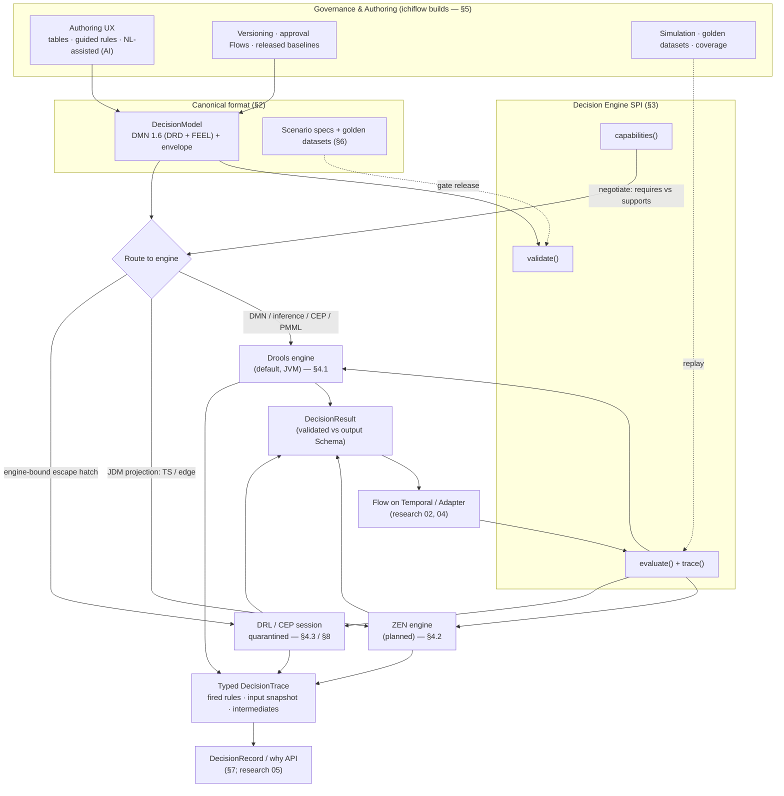

# 03 — The Decision Layer

> **What this covers.** How ichiflow represents, evaluates, governs, tests, and explains
> **Decisions** — the rule-evaluated determinations at the heart of every enterprise workflow.
> Covers the canonical decision format (DMN 1.6), the Decision Engine SPI and its engines
> (Apache KIE/Drools default, GoRules ZEN planned second), the escape-hatch/quarantine rules,
> the governance + authoring + simulation layer ichiflow builds itself, the explainability
> contract (typed traces into the DecisionRecord), testing as a first-class artifact, the
> CEP/temporal story, and an honest capability-parity assessment against IBM ODM and raw Drools.
>
> **Position in the system.** The Decision layer is ichiflow's heart. **Flows** (interpreted on
> Temporal — see research [`../research/02-workflow-orchestration.md`](../research/02-workflow-orchestration.md))
> call Decisions at branch points, routing points, and validation points; **Adapters** feed them
> canonical inputs; every evaluation emits a typed trace that the **DecisionRecord / why API**
> (see research [`../research/05-audit-observability-deployment.md`](../research/05-audit-observability-deployment.md))
> stitches into the per-Case causal chain. This document is grounded in research
> [`../research/01-rule-engines.md`](../research/01-rule-engines.md); the migration of decisions in
> and out of ichiflow is covered in [`11-migration-in-and-out.md`](./11-migration-in-and-out.md).
>
> These are design docs for a system that does not exist yet: present tense describes the target;
> phasing is marked **v1** (first shippable) vs **later**.

---

## 1. Position and design stance

The single most-litigated question in research 01 was "adopt Drools and be done?" The locked answer
(BRIEF §1) is **no**: ichiflow standardizes the *format*, not the *engine*. Two consequences shape
everything below.

1. **Format over engine.** The canonical, source-of-truth representation of a Decision is **DMN 1.6
   (DRD + FEEL)**, wrapped in a thin ichiflow envelope. Every engine — Drools, ZEN, and any future
   engine — is an importer/exporter/executor *behind an SPI*, never the center of gravity. This is
   the strongest available answer to the migration-in/out mandate (research 01 §8, §10).
2. **Own the governance layer.** The genuine gap versus IBM ODM is not the engine — Drools matches
   ODM on inference and beats it on openness — it is the **business-user governance, authoring,
   simulation, and turnkey explainability** layer (research 01 §6). ichiflow *builds* this layer on
   top of the canonical format. It is the largest single product investment in this document and is
   what makes ichiflow a Decision-Center-class product rather than "Drools with a UI."

The Decision layer therefore has four strata, top to bottom:

| Stratum | What it is | Who owns it |
|---|---|---|
| **Governance & Authoring** | Versioning, approval workflows, business-user authoring UX, simulation, coverage | **ichiflow builds** (§5) |
| **Canonical format** | DMN 1.6 DRD + FEEL + ichiflow envelope (the DecisionModel) | **ichiflow defines** (§2) |
| **Decision Engine SPI** | `evaluate` / `trace` / `validate` / capability descriptors | **ichiflow defines** (§3) |
| **Engines** | Drools (default), ZEN (planned), others | pluggable, behind SPI (§4) |

---

## 2. Canonical representation: the DecisionModel

### 2.1 DMN 1.6 as the semantic core

A **Decision** is authored as **DMN 1.6** — a Decision Requirements Diagram (DRD) of decision nodes,
input data, business knowledge models, and knowledge sources, with logic expressed as **FEEL**
(boxed expressions, decision tables, contexts, function definitions). DMN is chosen because it is the
*only* decision format that is simultaneously (research 01 §5, §8.3):

- an **open OMG standard**, not a vendor dialect;
- **executable on multiple independent conformant engines** (Drools, Camunda, Trisotech are all DMN
  TCK conformance level-3);
- **text/XML-serializable**, diffable, and reviewable in git;
- **executable/exportable as the interchange artifact** — DMN 1.6 XML runs on any TCK-L3 engine, the
  anti-lock-in keystone. It is, however, **LLM-hostile to author *directly*** (verbose, positional,
  deep boxed-expression nesting — the same trait that disqualified BPMN XML as a Flow surface), so
  ichiflow puts an LLM-friendly **decision source** projection in front of it — covering the **full DMN
  1.6 feature set**, not decision tables only — that compiles one-way to DMN XML (§2.6). FEEL itself
  stays comparatively LLM-friendly (functional, well-specified, far more constrained and reliable to
  generate than DRL — research 01 §3.1, §6); the projection is what makes *whole-model* authoring
  legible across DRDs, boxed expressions, and item definitions, not just the cell expressions.

We accept DMN's known interchange caveats (FEEL under-specification, "DMN-washing," weak diagram
round-trip) and manage them by pinning to **TCK-L3 engines** and running a differential-test harness
(§6.4, and [`11-migration-in-and-out.md`](./11-migration-in-and-out.md) §OUT).

### 2.2 The ichiflow envelope

A **DecisionModel** is the versioned, governed unit ichiflow tracks. It is the DMN document plus a
thin envelope of metadata that DMN itself does not standardize. The envelope is declarative data an
AI agent can propose and a human can diff (BRIEF doc conventions).

```yaml
# decisionmodel: loan-eligibility  (illustrative ichiflow envelope over a DMN 1.6 model)
apiVersion: ichiflow.dev/v1
kind: DecisionModel
metadata:
  id: loan-eligibility
  title: Loan Eligibility
  owner: credit-risk-team
  version: 3.2.0                 # semver; governed release (see §5.1)
  governanceState: released     # draft | in-review | released | deprecated
  effective: { from: 2026-08-01, to: null }   # bitemporal effectivity
  authoredIn: decision-source   # decision-source | dmn-xml | drl | ai-chat  (§2.6; provenance only)
model:
  dmn: ./loan-eligibility.dmn    # DMN 1.6 XML — the executed/exported source of truth (DRD + FEEL)
  source: ./loan-eligibility.decision-source   # full-DMN decision source; compiles one-way → dmn (§2.6)
  entryPoint: LoanEligibility    # named decision to evaluate
contracts:
  input:  { schema: schemas/LoanApplication.json }   # JSON Schema (BRIEF §5)
  output: { schema: schemas/Outcome.json }           # canonical typed Outcome (doc 02 §9.3)
references:                      # governed CodeSets this model reads (doc 02 §9.1); NOT inlined
  - credit-reasons@2.1.0         # reason-code CodeSet
  - fee-schedule@2026.3.0        # versioned rate table used by a fee decision (§2.4)
engine:
  preferred: drools              # capability-negotiated at deploy (§3.3)
  requires: [decisionTables, feel-full]
projections:                     # optional deployment projections, NOT the source of truth
  - { format: jdm, engine: zen, path: dist/loan-eligibility.jdm.json }   # §4.2
tests:
  scenarios: ./scenarios/        # first-class scenario specs (§6)
  goldenDatasets: [prod-2025-declines, edge-cases-v2]   # (§6.3)
provenance:                      # for migrated models (§11)
  source: none                   # none | dmn-import | drl-import | odm-mining | ...
  extensionMap: null
```

The envelope binds a Decision to its **Schema** contracts (input/output JSON Schema, BRIEF §5), its
**governance state**, its **tests**, its **provenance**, any **projections**, and — via `references:` —
the **CodeSets** it reads. Input and output are validated against their JSON Schema at the SPI boundary
using the same runtime validators as every other adapter (networknt/OptimumCode on Kotlin; BRIEF §5) —
a Decision is a schema'd port like any other.

**Decisions reference governed CodeSets; they do not inline them.** Reason codes, condition codes,
cancellation reasons, field-eligibility rules, and fee/rate tables are governed **reference data**
(`kind: CodeSet`, [02-schema-foundation.md](./02-schema-foundation.md) §9.1), versioned and effective-dated
on their own governance cadence. The `references:` block pins the exact `codeSet@version` the model reads,
so a **released** DecisionModel is reproducible against the reference-data version it evaluated against —
and that pin is captured in the typed trace (§7) and the DecisionRecord. A model's output is a canonical
typed **`Outcome`** (doc 02 §9.3), not an ad-hoc `{outcome, reasonCodes}` pair.

### 2.3 Composite decisions: multiple authorities, one CompositeOutcome

Some Cases are not decided by one rule-owner. A single Case can carry **N independent Decisions from N
authorities** (rule-owners / agencies / lines-of-business), each applying its own rules and emitting its
own `Outcome` with its own codes. The permit/approval issues only when the members compose to a positive
result; a rejection or condition from *any* member attaches to the one Case, **attributed to its
originating authority**.

Composition is **declared and governed**, never an ad-hoc FEEL merge. The **composition policy** — how
member Outcomes roll up — is itself a governed artifact (a small DMN or a typed policy value):

| Policy | Rolls up to a positive result when… |
|---|---|
| `all-must-approve` | every member approves (conditional-approve carries its conditions forward) |
| `any-blocks` | no member denies; a single deny blocks the whole |
| `quorum(k)` | at least *k* members approve |
| `weighted` | the weighted tally of member Outcomes clears a threshold |
| `custom` | a **governed DMN over the `members[]` array** emits the `rolledUp` OutcomeType — for composition rules the four closed policies cannot express (e.g. "approve if all fiscal authorities approve AND ≥1 of three environmental authorities approves, unless pre-cleared") |

The escape hatch for composition that the four closed policies cannot express is **`policy: custom`,
which resolves to a governed DMN over the `members[]` array — never to arbitrary code.** Composition
is business logic that must be governed, simulated, parity-tested, and explained like any other
Decision; routing it to opaque code would break exactly that. (Contrast the feature-prep and
inter-step-computation cases (§2.4), where the escape hatch *is* typed code — because there the work
is computation, not governed business logic. That distinction is the doctrine: **governed business
logic → a Decision; computation → schema'd typed code.**)

The result is a canonical **`CompositeOutcome`** (doc 02 §9.3): `{ policy, members[], rolledUp }`, each
member Outcome and its codes staying attributed to their authority all the way into the DecisionRecord
([08-audit-and-observability.md](./08-audit-and-observability.md) §1). *Which* authorities apply is itself a
**routing Decision over a CodeSet** (a classification/controlled-items table), not hard-wired — the same
"routing is a Decision" stance as Task assignment ([04-flow-and-case-layer.md](./04-flow-and-case-layer.md) §5.3).
The Flow executes the fan-out and the policy join ([04-flow-and-case-layer.md](./04-flow-and-case-layer.md)
§2.3, §5.7); this section governs the *shape and semantics* of the composition.

### 2.4 Fee, tariff, and tax decisions over versioned rate tables

Fee, tariff, and tax computation is an ordinary Decision — DMN decision tables are the natural fit for
rate tables — with one discipline: the **rate tables are governed CodeSets (§2.2, doc 02 §9.1), not
inlined in the DMN**, so a bundling rule, a tiered tariff, a time-based charge, or a pro-rated annual
fee reads its rates from a versioned, effective-dated table. The **rate-table version used** is recorded
in the DecisionRecord alongside the computed amount (§7; [08-audit-and-observability.md](./08-audit-and-observability.md) §1.5), so a fee is
reconstructable as of the rates in force at decision time.

**FEEL is the expression primitive for predicates, guards, and table logic — not for computation.**
Where ichiflow needs an inline predicate outside a full DecisionModel (a Flow guard condition, a
Task assignment expression), it uses FEEL as the single expression language so business authors
learn one syntax. FEEL is a real functional language and is the right tool for **predicates, guards,
and decision-table cell logic**. It becomes **write-only** when pushed into **derived-data / feature
preparation** *before* the table — multi-step arithmetic, date math across many fields, list
filter/reduce to compute an aggregate exposure, `monthsSinceLastX`. Deeply nested FEEL contexts
computing derived features are the decision-layer equivalent of inline data-plumbing in a Flow.

**Boundary rule for decisions.** The decision **table** (the business-rule matrix) always stays DMN
— it is the auditable artifact. **Non-trivial derived-input computation is a schema'd, ideally pure,
typed feature function** that runs *before* eval and populates the decision's input schema (§2.2);
its output — the derived features — is **snapshotted into the DecisionTrace** (§7, which already
snapshots inputs), so the auditor sees exactly what the table saw. FEEL stays for predicates;
computation moves to typed code. A feature function is non-portable in the same sense as the DRL
escape hatch (§4.3), so it inherits the same discipline — a declared, schema'd input/output contract
plus golden datasets, so its behaviour is *specified* even though the code does not port, and it
counts against the workspace portability score (G6). CEL is reserved for internal platform-guard use
(research 01 §3.7), not business logic.

**The feature function is the *same* unified code-activity contract** as a Flow `compute` step
([04-flow-and-case-layer.md](./04-flow-and-case-layer.md) §2.6) and an Adapter code-transform
([05-adapters.md](./05-adapters.md) §1) — one primitive, not three different hatches (BRIEF vocabulary
"compute step / code activity", ADR-0004). It is referenced by a versioned `ref`
(`<lang>://<module>/<Name>@<version>`), schema'd at its input/output boundary, unit-testable and
stub-able in scenario tests, and trace-emitting into the DecisionRecord. So "move computation to typed
code" means the same governed, audited primitive everywhere it appears, whether the computation feeds
a Decision, a Flow step, or an Adapter mapping.

### 2.5 Feature gating is a Decision

Turning a business behaviour on or off for a segment, region, tenant, or time window is **not a code
flag** — it is a **Decision over context**, the same stance as "routing is a Decision" (§2.3,
[04-flow-and-case-layer.md](./04-flow-and-case-layer.md) §5.3). A gate evaluates a small DMN (or a
CodeSet-eligibility lookup, doc 02 §9.1) over `{ segment, region, tenant, effectiveDate, ... }` and
returns an enable/disable Outcome, so the gate is versioned, effective-dated, simulated, and
explained like any other Decision — and *why* a feature was on for one Case and off for another is
answerable via the why API. Effective-dating (§2.2) and CodeSet eligibility already cover
time/region gating; framing gating as a Decision unifies them under one governed, auditable surface
rather than scattering boolean flags through code.

### 2.6 The decision source — an LLM-friendly authoring projection over the full DMN 1.6 surface

DMN 1.6 XML is the **executed, exported, interchange** artifact (§2.1, ADR-0001) and stays so — but it
is LLM-hostile to author directly. Every other core artifact class was given an LLM-legible **canonical
authoring projection that compiles one-way** to its portable-but-hostile executed form — TypeSpec →
OpenAPI/JSON Schema ([02-schema-foundation.md](./02-schema-foundation.md) §1), the typed flow builder /
YAML → canonical Flow JSON ([04-flow-and-case-layer.md](./04-flow-and-case-layer.md) §2.5). Decisions —
ichiflow's heart — get the **same two-layer treatment, and it must be complete** (ADR-0027):

- **The decision source is a structured markdown/YAML/JSON form (FEEL throughout) covering the FULL DMN
  1.6 feature set — not decision tables only.** It expresses **DRDs** (decision / input-data / business
  knowledge model / knowledge-source nodes and their dependency wiring), **all boxed-expression kinds**
  (decision tables, literal FEEL expressions, contexts, invocations, function definitions/BKMs, lists,
  relations), and **item definitions / types + imports** — and **compiles deterministically one-way to
  DMN 1.6 XML**. Decision tables are sugar for the common shape; **nothing in DMN is authorable only by
  hand-writing XML.** It is the Decision-layer mirror of TypeSpec→OpenAPI and flow-builder→FlowJSON.
- **100% AI coverage of the DMN surface is a verified metric, not a claim — a projection-coverage
  harness.** Consistent with harness-first construction ([13-agent-harness-loops.md](./13-agent-harness-loops.md)
  §2.b; ADR-0026), a conformance suite enumerates every DMN 1.6 construct against the DMN feature
  matrix / TCK construct set and asserts, per construct: a projection form exists, it compiles to valid
  DMN 1.6 XML, and the emitted XML executes identically on the default engine to a hand-authored
  reference. Coverage is an enumerable count (`constructs_covered / constructs_total`), surfaced by
  `ichiflow verify --scope decision-layer`.
- **DMN XML remains the sole executed/exported/audited artifact.** The compiled `.dmn` is checked in
  beside the source and covered by the **regenerate-and-diff gate** ([02-schema-foundation.md](./02-schema-foundation.md)
  §4.3) like any two-layer artifact, so a reviewer diffs the source *and* its emitted DMN together.
  **No round-trip is promised** — the source is not regenerated from hand-edited DMN XML, and one model
  is never a persistent mix of hand-DMN and source.
- **`authored-in` provenance extends to DecisionModels**: `decision-source | dmn-xml | drl | ai-chat`
  (the `metadata.authoredIn` field, §2.2), mirroring a Flow's `code | yaml | ai-chat`. AI chat authors
  the decision source (or DMN, or an engine-native artifact, §4.3) from conversation; the human judges
  via the read-only decision-table/DRD view + simulation (§5.3). **Direct DMN XML authoring stays
  available** for developers and for imported models; the spreadsheet import/export path (§5.3) targets
  the source or the DMN.
- **Engine-native constructs are covered by their own AI-authorable path, not left to hand-XML.**
  Constructs DMN cannot express well — deep forward-chaining inference, CEP windows — are authored as
  **first-class, AI-authorable DRL / rule-unit / CEP artifacts** (§4.3, §8), not as a fallback to
  hand-writing opaque files. The decision source records where a model crosses into an engine-native
  artifact, exactly as the ZEN projection records what it drops (§4.2).

This closes the Decision-layer authorability asymmetry the rest of the architecture had already
resolved for Schemas and Flows, without touching portability: what executes and exports is still DMN
1.6 XML (or, for a quarantined model, the engine-native text).

---

## 3. The Decision Engine SPI

The SPI is the contract every engine implements. Flows and Adapters call the SPI, never an engine
directly, so an engine is swappable and a DecisionModel is portable across the engine tier.

### 3.1 The four operations

| Operation | Signature (conceptual) | Purpose |
|---|---|---|
| `evaluate` | `(DecisionModelRef, input, evalContext) → DecisionResult` | Run the decision; return a typed **`Outcome`** (doc 02 §9.3) — `{ type, reasons[], conditions[], authority? }` — validated against the output Schema. For composite decisions the result is a `CompositeOutcome` (§2.3). |
| `trace` | emitted *with* every `evaluate` | A **typed evaluation trace**: fired rules/decisions, input snapshot, intermediate values, timings (§7). Not optional and not a separate call — evaluation is trace-producing by construction. |
| `validate` | `(DecisionModel) → ValidationReport` | Static validation: DMN well-formedness, FEEL type-checks, schema-contract conformance, coverage gaps, unreachable rules, table completeness/overlap (hit-policy) checks. Runs in CI and in the authoring UI. |
| `capabilities` | `() → CapabilityDescriptor` | What the engine can do (§3.3), so ichiflow can route a model to a compatible engine and refuse an incompatible one at deploy time, not runtime. |

`evaluate` is pure with respect to the working memory it is given: inputs in, `DecisionResult` + trace
out, no hidden side effects. Statefulness (CEP working memory) is modelled explicitly (§8).

### 3.2 The typed trace is part of the contract

Every `evaluate` returns a `DecisionResult` **and** a `DecisionTrace`. The trace is a typed ichiflow
object (not an engine-specific log format) so the DecisionRecord can consume it uniformly regardless
of which engine produced it. Engines map their native introspection into the ichiflow trace shape:

- **Drools** maps its `AgendaEventListener` / `RuleRuntimeEventListener` activations and DMN
  per-decision result events into the trace (research 01 §3.1).
- **ZEN** maps its JSON node-execution trace into the same shape (research 01 §3.4).

This mapping is what turns Drools' "powerful but developer-facing" introspection (research 01 §3.1,
§6.3) into a business-readable, uniform artifact — the work ichiflow does that Drools does not.

### 3.3 Capability descriptors and negotiation

Engines differ in capability (research 01 §4 matrix): Drools has RETE inference and CEP; ZEN is a
sequential decision graph with neither. A `CapabilityDescriptor` lets ichiflow negotiate rather than
fail at runtime.

```yaml
# capabilities: drools-engine (illustrative)
engine: drools
dmnConformance: L3
feel: full
supports:
  inference: true          # RETE/PHREAK forward chaining
  cep: true                # temporal windows, interval events
  decisionTables: true
  drd: true
  pmml: true               # ML scoring node (research 01 §5)
  drlEscapeHatch: true     # §4.3
runtime: [jvm]
---
# capabilities: zen-engine (illustrative)
engine: zen
dmnConformance: none       # executes JDM, not DMN — via projection (§4.2)
feel: subset
supports:
  inference: false
  cep: false
  decisionTables: true
  drd: true                # decision graph (JDM), not DMN DRD
  pmml: false
  drlEscapeHatch: false
runtime: [ts, edge, jvm, wasm]
```

A DecisionModel declares `engine.requires: [...]`. At deploy, ichiflow matches `requires` against
each candidate engine's descriptor and **refuses to deploy** a model that requires `inference` to an
engine that lacks it — surfacing the incompatibility to the author, not to production traffic.

### 3.4 Writing a third-party Decision Engine SPI binding

The SPI is a **declared, discoverable extension point** (BRIEF §21), not a two-engine private
contract. A third party adds a new engine by implementing the four operations (§3.1) plus a
`CapabilityDescriptor` (§3.3), and **admission is verifiable, not asserted**: a candidate engine is
not admitted behind the SPI until it **passes the DMN-TCK conformance suite the SPI ships**
([13-agent-harness-loops.md](./13-agent-harness-loops.md) §2.b), and its declared capabilities must
actually hold (a descriptor claiming `supports.inference` must infer). ichiflow ships a **"writing a
Decision Engine SPI binding" third-party guide** alongside the SPI — the four ops, the trace-shape
mapping (§3.2), the capability descriptor, and the conformance harness a binding runs to prove itself
— so "pluggable engine" is an open, self-serve seam and not merely documentation of ichiflow's own two
engines.

### 3.5 The engine ships with its conformance harness and a pinned resource manifest

The Decision Engine SPI does not ship as a bare contract. It ships with **both** the machinery to
*verify* an engine and the machinery to *author against* it correctly — the founder's "harnesses and
pointers to resources for Kogito/Drools and testing ability" requirement, made concrete:

- **A conformance harness travels with the SPI.** The **DMN-TCK conformance suite** (§3.4), the
  **decision-source projection-coverage** suite (§2.6), the **FEEL-semantics vectors**, the
  **DRL/rule-unit compile-check + scenario harness**, the **CEP temporal-rule vectors**, the
  **differential-engine** harness, and the **engine-upgrade** gate are one governed
  set — specified in [`13-agent-harness-loops.md`](./13-agent-harness-loops.md) §2.b. The default
  engine (Drools/Apache KIE, §4.1) ships green against all of them, and a bump of the KIE version
  reruns the whole set and is **gated on green** — so ichiflow rides a fast-moving
  Apache-incubation project (research [01](../research/01-rule-engines.md) §9) without inheriting its
  churn as production risk.
- **A pinned resource manifest travels with it too.** The engine's authoritative references — Apache
  KIE / Drools docs + the version-matched release notes, the OMG DMN 1.6 spec, the DMN-TCK repo, a
  FEEL reference (plus ichiflow's own published FEEL-ambiguity resolutions, Q4), the DRL/rule-units/CEP
  guides, and ichiflow's own decision-source spec + harness fixtures — are enumerated in the
  **`resources: decision-layer` manifest** ([`10-ai-native-experience.md`](./10-ai-native-experience.md)
  §2.5), **pinned to the KIE version in use** and updated with it. Authoring skills consult the manifest
  before non-trivial FEEL or any engine-native artifact, and `ichiflow-mcp` exposes the same pointers
  at run time via `get_resources(decision-layer)` — so both a build-time and a runtime agent reason
  from version-matched references, not stale training recall, and air-gapped installs resolve to
  vendored offline copies.

Together these make the pluggable-engine claim self-contained: an engine arrives with a way to *prove*
it conformant and every agent that touches it arrives with the *right, pinned* references in hand.

---

## 4. Engines

### 4.1 Apache KIE / Drools — default / reference engine (v1)

Drools is the default engine and validates the founder's lean *for the engine tier* (research 01
§3.1, §10). It provides:

- **DMN L3** with full FEEL — the reference execution of the canonical format.
- **RETE/PHREAK inference** — true forward chaining, rule chaining, agenda/conflict resolution: the
  differentiator versus sequential engines, matching the algorithm class of IBM ODM.
- **CEP (Drools Fusion)** — sliding windows, temporal operators, interval vs point events (§8).
- **PMML** — execute predictive models alongside rules as a scoring node.
- **Kotlin-native** call path, Quarkus-native, GraalVM native image via executable model — fits the
  Kotlin core (BRIEF §4).

Phasing note: ichiflow pins to stable Apache KIE 10.x releases and keeps Drools strictly behind the
SPI, because the project is still in Apache incubation and the paid support path has narrowed to IBM
BAMOE (research 01 §3.1, §9). The abstraction *is* the mitigation.

### 4.2 GoRules ZEN — planned second engine (later)

ZEN is the planned second engine for the **TypeScript / edge / serverless / embedded** tier that
Drools cannot serve (research 01 §3.4, §9 — "no TypeScript story" for Drools is the highest-severity
gap). ZEN is MIT-licensed Rust with first-class Node/TS and Kotlin bindings, tiny footprint, no
server, and best-in-class AI-authorability (JSON JDM).

ZEN executes **JDM (JSON Decision Model)**, not DMN. Because DMN is canonical, ZEN is fed via a
**projection**: ichiflow compiles the table/graph-shaped subset of a DecisionModel to JDM at build
time (`projections:` in §2.2). This works for the ~90% of enterprise logic that is
decision-table/decision-flow shaped; it does **not** work for inference-heavy or CEP models, which
`capabilities` negotiation (§3.3) keeps on Drools. The DMN↔JDM projection is lossy in the
inference/CEP direction by design, and the projection compiler records what it dropped.

### 4.3 Escape hatches: DRL and engine-native logic

Some genuine enterprise logic — deep forward-chaining inference over a working memory, complex CEP —
is more naturally expressed in **DRL** (Drools Rule Language), **rule units**, or engine-native **CEP**
than in DMN. ichiflow permits these engine-native artifacts as an **escape hatch**, under strict
quarantine so they never silently erode the portability promise.

**Quarantine governs *portability*, never *authorability*.** DRL, rule units, and CEP are **text-based
and therefore already LLM-legible**, so they are **first-class AI-authorable + testable governed
paths**, on the same footing as DMN-based Decisions (ADR-0027, amending ADR-0001's "import-source /
projection only" framing). Concretely, an engine-native artifact is:

- **schema'd and wrapped** — a declared input/output Schema contract + the ichiflow envelope (below),
  authorable via **AI chat** or directly (`authored-in: drl | ai-chat`, §2.2);
- **validated in `ichiflow verify`** — a DRL/rule-unit **compile-check** plus the SPI `validate` (§3.1)
  run as checks ([13-agent-harness-loops.md](./13-agent-harness-loops.md) §2.b), so a malformed
  escape-hatch artifact fails loudly, machine-readably, pre-deploy;
- **simulated and scenario-testable** — the same what-if simulation (§5.4), scenario specs (§6.1), and
  golden datasets (§6.3) that gate a DMN model gate an escape-hatch model; a rule is not authoritative
  until it passes;
- **trace-emitting** — every activation maps into the typed `DecisionTrace` (§3.2, §7) into the
  DecisionRecord.

So "quarantined" means the artifact does not *port* to another engine unchanged — never that an agent
cannot author, validate, simulate, or test it. The portability quarantine rules still hold:

1. **Allowed only when DMN cannot express it well** — inference/CEP-heaviness, not convenience.
   Table-shaped and DRD-shaped logic must be authored as DMN.
2. **Marked non-portable.** An escape-hatch artifact carries `portability: engine-bound` in its
   envelope and is visibly flagged in the authoring UI, in `validate` reports, and in the exported
   bundle. It counts against a workspace's portability score.
3. **Exportable adapter required.** No escape-hatch artifact is admitted without a declared
   input/output Schema contract and a documented behavior — so a leaving customer can re-implement it
   on another engine against the same contract and the same golden datasets, even though the artifact
   itself does not port. The escape hatch degrades portability from "runs elsewhere unchanged" to
   "specified well enough to re-build elsewhere"; it never degrades to "opaque."
4. **Quarantined blast radius.** Escape-hatch logic lives in clearly delimited DecisionModels; a
   model is either portable DMN or quarantined engine-bound, never a silent mix.

```yaml
# an escape-hatch DecisionModel is explicitly, visibly non-portable — but fully AI-authorable + testable
kind: DecisionModel
metadata: { id: fraud-inference, version: 1.4.0, governanceState: released, authoredIn: ai-chat }
model: { drl: ./fraud-inference.drl, entryPoint: FraudSession }   # DRL text — AI-authored, compile-checked in verify
portability: engine-bound          # <-- quarantine marker (portability only); flagged everywhere
engine: { preferred: drools, requires: [inference] }
contracts:                         # <-- mandatory exportable adapter contract
  input:  { schema: schemas/TxnWindow.json }
  output: { schema: schemas/FraudSignal.json }
tests: { scenarios: ./scenarios/, goldenDatasets: [fraud-labeled-2025] }
```

---

## 5. Governance & Authoring — the layer ichiflow builds

This is the ODM Decision Center–class product ichiflow owns rather than borrows (research 01 §6, §9).
KIE Sandbox is a developer tool, not a business-governance product; ichiflow builds the governance,
authoring, simulation, and coverage surfaces on top of the canonical DecisionModel.

### 5.1 Versioning & release management

- DecisionModels are **semver-versioned** and live in the **Workspace** (a git repo — BRIEF vocab).
  Git is the substrate; ichiflow layers governance semantics on top.
- **Governance states** (`draft → in-review → released → deprecated`) are first-class and enforced:
  only `released` models are deployable to production; `effective` windows (§2.2) allow a released
  version to become authoritative on a future date (bitemporal, aligned with research 05 as-of
  support).
- **Released baselines** are immutable snapshots — the ODM concept ichiflow reproduces — so an
  auditor can reconstruct exactly which model version decided a given Case (feeds the DecisionRecord).
- Breaking changes to a Decision's **Schema contract** are gated by the same oasdiff/CI breaking-change
  machinery as any other contract (BRIEF §5).

### 5.2 Approval workflows

Approval is itself modelled as an ichiflow **Flow** with **human Tasks** — dogfooding the framework.
A change to a DecisionModel opens a review Case: assigned reviewers (routing is itself a Decision),
required approvals, SLA timers, and escalation. Approvals, reviewers, diffs, and simulation results
are recorded to the append-only DecisionRecord so "who approved this rule change, when, on what
evidence" is answerable via the why API.

**Approval-as-a-Flow is not DecisionModel-only.** The same pattern governs a change to **any** governed
Workspace artifact — **CodeSets** especially, but uniformly Schemas, Flows, uischemas, and policies. A
change opens a review Case whose **routing is itself a Decision**: it routes to approvers **by role within
the artifact's owning Team** (the `owner` relation, [02-schema-foundation.md](./02-schema-foundation.md)
§9.1, [06-identity-and-access.md](./06-identity-and-access.md) Part 4) — an `approver`/`steward` of the
owning team, or a designated approver team — exactly the "routing is a Decision" stance as Task assignment
([04-flow-and-case-layer.md](./04-flow-and-case-layer.md) §5.3). Reference-data change governance (the
deprecation/impact-review flow for referenced codes) is detailed in §5.8.

### 5.3 Business-user authoring UX — AI-chat-first, judged by live simulation (v1)

Per the authoring doctrine (ADR-0019; doc 00 "Chat to author, preview to judge"), a business user
authors rules by **describing intent in chat** and **judging the result against live simulation** —
**not** by manipulating a table-editor canvas. Because BAL-style controlled natural language is
materially more approachable than DRL (research 01 §6.2) and FEEL's constrained surface makes LLM
generation comparatively reliable (research 01 §3.1), the v1 loop is: *describe in chat ("decline if
debt-to-income exceeds 43% unless the co-signer FICO is above 740") → the AI proposes a
**decision source** (§2.6) that compiles one-way to DMN + FEEL → the user judges via a read-only
decision-table/DRD view and what-if simulation → approve the diff.* A business author never hand-writes
DMN XML; raw DRL is not the *business-author* surface, but it is a first-class **AI-authorable**
governed artifact for developers/analysts who need it (§4.3).

- **The decision-table view is a read-only projection.** Boxed DMN with hit-policy, completeness/
  overlap checking (via `validate`), and FEEL cells — rendered *from* the canonical DMN as the artifact
  the user reads and diffs, **not a second editable representation** (a rendered view may reuse
  **dmn-js** for display, but read-only, not as an editable canvas).
- **Live what-if simulation is how the user judges** (§5.4): run the draft over sample or golden inputs
  and see outputs + a human-readable trace before release. Simulation results are projections, the
  business user's judgement surface.
- **Direct DMN editing stays for developers.** The canonical DMN is text under version control;
  **spreadsheet (Excel/OpenRules-style) import/export** (research 01 §3.6, §8) remains an *interchange*
  path for analysts who maintain rate/eligibility tables in a sheet — an import into the canonical DMN,
  not an in-app canvas.
- **The decision source is the named authoring projection** (§2.6, ADR-0027) — not a vague "guided
  articulation." A structured markdown/YAML/JSON form (FEEL throughout) covering the **full DMN surface**
  — DRDs, all boxed-expression kinds, item definitions — is what chat proposes and what a developer may
  edit directly; it **compiles deterministically one-way to DMN 1.6 XML**, which stays the
  executed/exported artifact. It is an authoring surface, not a drag-and-drop builder, and no round-trip
  is promised.

Every proposal follows the framework-wide contract **"AI proposes, deterministic tools + humans
dispose"** (BRIEF vocab, research 06 §A.5): type-checked by `validate`, shown as a diff, human-approved,
and — for any released rule — passing scenario + parity tests before it is authoritative. The **Rule
Authoring** capability drives the chat loop; as a *packaged* **Copilot it is post-v1** (ADR-0017), but
the AI-chat-and-simulate loop itself is the v1 business-user surface.

### 5.4 Simulation & scenario testing (analyst-facing)

The analyst-facing simulation ODM/Blaze/SMARTS ship and Drools lacks (research 01 §6.4) is a
first-party ichiflow surface:

- **What-if simulation** — run a draft model over ad-hoc or sampled inputs and see outputs +
  human-readable trace, before release.
- **Scenario testing** — run the model against the DecisionModel's **scenario specs** (§6).
- **Golden-dataset replay** — run a candidate version against a **golden dataset** and diff outcomes
  against the released version or against recorded legacy outcomes (the same engine that powers
  migration parity testing, §6.3 and doc 11).
- **Coverage** — report which rules/table rows fired across a scenario suite or golden dataset, so
  authors see untested branches and dead rules.

### 5.5 Authoring for the AI coding agent

Every authoring surface has a declarative artifact underneath (DMN + envelope + scenario specs). AI
coding agents author Decisions by editing those artifacts in the Workspace and running `validate` +
scenarios via the CLI/MCP surfaces (BRIEF §12) — the same gates a human review goes through. The
governance layer does not distinguish "human wrote it" from "agent wrote it"; both are subject to
approval workflows and parity tests, and both are provenance-stamped.

### 5.6 Governance level — a per-Workspace/tier dial

Full governance ceremony (approval Flows with assigned reviewers/SLA/escalation, immutable released
baselines, coverage-threshold CI gates, effective-dating, formal analysis) is right for a regulated
enterprise and crushing for a three-person team. The ceremony is therefore a **governance level**
configured per Workspace (and defaulting by tier), not a fixed constant:

| Level | Default tier | Governance surface |
|---|---|---|
| **off** | **Dev / solo (default)** | git is the *whole* surface: no governance states, no gates, no approval-Flow — the framework imposes nothing |
| **light** | **Team (default)** | states collapse to `draft`/`released`; approval = PR merge (no approval-Flow); coverage advisory, not gating |
| **standard** | Team (opt-in) | governance states + PR-based approval; coverage gates optional |
| **full** | **Enterprise / regulated (default)** | approval-Flows (§5.2), immutable released baselines (§5.1), coverage thresholds (§6.2), effective-dating, formal analysis |

The **defaults per tier are decided (ADR-0017): Dev=off · Team=light · Enterprise=full.**
Approval-as-a-Flow (§5.2), released baselines, and coverage gating are the **`full`** posture
(Enterprise default); the lighter levels are the tier-defaulted posture for teams that do not need
that ceremony, and any Workspace may set its level explicitly.

**The dial is also overridable per artifact.** The Workspace/tier level is the default, but an individual
governed artifact may carry its own `governance.level` (and approval-routing rule), overriding it either
way — so a high-stakes **CodeSet** (a legally-precise rate or eligibility table) can run `full` governance
inside an otherwise `light` Workspace, and a throwaway internal lookup can opt down. The override lives in
the artifact's envelope/metadata (e.g. a CodeSet's `governance` block,
[02-schema-foundation.md](./02-schema-foundation.md) §9.1) and is itself version-controlled.

### 5.7 Shadow / canary promotion for any rule change

The shadow → canary → authoritative promotion ladder is **not migration-only**. Migration defines it
for legacy-vs-migrated rules ([11-migration-in-and-out.md](./11-migration-in-and-out.md) §4.2), but
the **same primitive generalizes to any rule change** — a routine edit to a released DecisionModel,
not just a legacy import:

- **Shadow.** A candidate version evaluates *beside* the authoritative version on live inputs; its
  outputs are logged and diffed but not acted on (the golden-dataset/shadow engine of §5.4, §6.3).
- **Canary.** The candidate becomes authoritative for a bounded slice (a tenant, a region, a
  percentage) while the rest stay on the incumbent; divergence is monitored.
- **Authoritative.** On a clean shadow/canary record the candidate is promoted for all new Cases;
  in-flight Cases stay pinned to the version + effective date they started on (§2.2, §5.1).

The pieces already exist — effective-dating, immutable released baselines, version pinning, the
golden-dataset diff — and this subsection assembles them into one promotion story that applies to
every released rule, not only migrated ones.

**Which released version is active in which environment is itself a version-controlled artifact.** A
DecisionModel/CodeSet/Flow **version** is authored and released **only by git merge** (chat-edit →
auto-branch + agent-authored PR → approval-Flow = PR approval mirrored → merge). *Activation* is the
second, separately-governed step, and it is **also** a commit: each environment carries a
**version-controlled env-pin file** in the Workspace (e.g. `environments/prod.pins.yaml`) that binds
each artifact to the exact released `id@version` that environment runs. So **promotion =
commit-the-pin + deploy of the artifact bundle** — dev→staging→prod is a sequence of pin commits, each
reviewable and diffable, never a bare console click.

- **The runtime rule registry is a downstream pin/gate, never a write surface.** It is a *cache of the
  pinned artifacts* an environment loads for hot-evaluation; it holds no version that did not arrive by
  git merge and no active-binding that was not set by a pin commit ([02-schema-foundation.md](./02-schema-foundation.md)
  §6.1; BRIEF §21). Selecting an active version by editing the registry directly is **not** a supported
  path.
- **Effective-dating decouples merge-time from activation-time.** A version can merge and pin now with
  a future `effective.from` (§2.2), so a business-cadence change lands in git well ahead of the date it
  becomes authoritative; in-flight Cases stay pinned to the version + effective date they started on.
- **The emergency-change path is an expedited PR + loud break-glass, not a registry write.** When a
  change must reach prod faster than the normal approval-Flow, the path is an **expedited PR** (reduced
  reviewers, still merged) or a **loud, logged break-glass** ([09-deployment-and-topology.md](./09-deployment-and-topology.md)
  §6.3, ADR-0020) whose after-the-fact reconciliation is a **back-filled commit** to the env-pin — so
  even an emergency terminates in version control. **Net: both content and activation trace to a
  commit; the registry is a cache, never an authority.** (Cross-environment promotion mechanics and the
  pin-file schema live in [09-deployment-and-topology.md](./09-deployment-and-topology.md) §6.3.)

### 5.8 Reference-data (CodeSet) change governance and the deprecation/impact-review flow

**CodeSets are governed exactly like DecisionModels**, inheriting the governance dial (§5.6) with a
per-artifact override (a CodeSet's `governance` block, [02-schema-foundation.md](./02-schema-foundation.md)
§9.1). A change to a `full`-governed CodeSet opens a review Case via the same approval-as-a-Flow machinery
(§5.2), **routed by role within the CodeSet's owning Team** — an `approver`/`steward` of the owning team,
or a designated approver team ([06-identity-and-access.md](./06-identity-and-access.md) Part 4). The
routing rule is a **Decision** (like assignment routing, §5.2), so *which* approver a reference-data change
lands on is governed, simulated, and explained, not hard-wired.

Because CodeSets are **interdependent** ([02-schema-foundation.md](./02-schema-foundation.md) §9.4), a
change that **deprecates or removes a referenced row** carries extra ceremony beyond a normal edit:

- **Publish-time impact analysis.** The publish gate walks the CodeSet dependency graph (doc 02 §9.4) to
  enumerate every dependent — other CodeSets' `codeRef` columns, and the DecisionModels/Flows/UI that pin
  the affected `codeSet@version`. Cross-version, effective-dated referential integrity is checked, so a
  deprecation cannot silently orphan a live dependent.
- **Blocked publish or forced dependent review.** If dependents exist, the change is either **blocked** or
  **routed into a review Flow that fans out to each dependent's owning-team approvers** — a per-authority
  fan-out/join (§2.3, [04-flow-and-case-layer.md](./04-flow-and-case-layer.md) §5.7) over the impacted
  owning teams — so a shared code is retired only on an explicit, audited, multi-owner decision.
- **On the audit spine.** The impact set, the approvals, and the referential-integrity result are recorded
  to the DecisionRecord, so "why was this code deprecated, who signed off, and what did it break" is
  answerable via the why API (§7).

Effective-dating (§2.2) makes the transition safe: a deprecating change can be released with a future
`effective.from` while dependents migrate their pins, and in-flight Cases stay pinned to the
`codeSet@version` they started on (§5.7).

---

## 6. Testing as a first-class artifact

Decision tests are not an afterthought or a code file — they are **governed artifacts inside the
DecisionModel**, readable and writable by business users, and required for release.

### 6.1 Scenario specs

A **scenario** is a business-readable given/expect spec: named inputs → expected outputs. The `expect`
block asserts a full typed **`Outcome`** (doc 02 §9.3) — its `type`, its `reasons`, and, where relevant,
its attached `conditions[]` (each with expected `kind` and `state`) and per-authority attribution — not
merely a scalar `outcome` + `reasonCodes`. Optionally it also asserts the fired rules. Scenarios are
stored with the DecisionModel, versioned with it, and authored in the same UI; they double as
documentation of intent.

```yaml
# scenarios/high-dti-conditional.yaml  (business-readable scenario spec)
scenario: High DTI is declined unless a strong co-signer, then conditionally approved
decisionModel: loan-eligibility@3.2.0
cases:
  - name: DTI 45% no co-signer -> DECLINE
    given: { dti: 0.45, coSigner: null, ficoPrimary: 690 }
    expect:
      type: deny
      reasons: [ { code: DTI_OVER_LIMIT, codeSet: credit-reasons@2.1.0 } ]
  - name: DTI 45% strong co-signer -> APPROVE with a records-retention obligation
    given: { dti: 0.45, coSigner: { fico: 760 } }
    expect:
      type: conditional-approve
      conditions:
        - { code: RETAIN_RECORDS, codeSet: obligations@4.3.0, kind: post-approval-obligation, state: pending }
```

### 6.2 Coverage

`validate` + the scenario runner compute **rule/row coverage** across the scenario suite and golden
datasets, surfaced in the authoring UI and gated in CI (a released model must meet a coverage
threshold). Coverage is what turns "we have some tests" into a governance signal.

### 6.3 Golden datasets

A **golden dataset** is a named, versioned corpus of real or synthetic cases with known-correct
outcomes — historical production decisions, curated edge cases, or legacy-system outputs. Golden
datasets power:

- release-gating regression (a candidate version must not regress outcomes on the golden dataset),
- analyst simulation (§5.4),
- **decision parity testing** for migration (legacy vs migrated outcomes — doc 11 §Parity), the
  shared engine that makes "migrate your rules to ichiflow" defensible (research 06 §A.6.3).

### 6.4 Differential testing (interchange fidelity)

Because DMN interchange is not lossless (research 01 §7), any imported or cross-engine model runs
through a **differential-test harness**: execute the model on the target engine and compare outputs
against golden outputs from the source engine; store a provenance/extension map for anything
non-standard. This is how ichiflow keeps DMN's portability promise honest (see doc 11 §OUT).

---

## 7. Explainability: the typed evaluation trace

Every `evaluate` emits a **typed `DecisionTrace`** — not a log line, a typed domain object — carrying:

- **fired rules / decisions**: which DMN decisions evaluated, which table rows matched under which
  hit policy, which DRL rules activated and in what agenda order (for the inference escape hatch);
- **input snapshot**: the exact inputs the decision saw, as-of evaluation time;
- **intermediate values**: the outputs of upstream DRD decisions and named FEEL sub-expressions;
- **outputs + reason codes**: the typed `Outcome` (or `CompositeOutcome`) and the business-facing
  reasons/conditions (adverse-action / ECOA / GDPR Art. 22 grade — research 05);
- **reference-data provenance**: for each fired decision, the **CodeSet id + version** it read and the
  specific reason / condition / rate rows it selected — so "which code, under which table version" is
  reconstructable (feeds the code/authority attribution in
  [08-audit-and-observability.md](./08-audit-and-observability.md) §1.5);
- **authority attribution**: for a composite decision (§2.3), the **emitting authority** of each member
  Outcome, carried through so every code stays attributed to its rule-owner;
- **model identity**: DecisionModel id + version + effective window + engine + capability set.

The trace flows into the per-Case **DecisionRecord**, which stitches Flow event history + fired-rule
traces + DMN results + human review + AI-agent actions into one causal chain keyed by `case_id`,
queryable via the **why API** (BRIEF §9; research 05 §1). This is the layer that converts Drools'
developer-facing listener output into ODM-class, business-readable, turnkey explainability — the
capability research 01 §6.3 says ichiflow must build, built once at the SPI so it works uniformly
across engines.

---

## 8. CEP / temporal rules

Complex event processing — reasoning over streams of events with temporal operators and sliding
windows (fraud velocity, "3 failed logins in 5 minutes," interval-vs-point events) — is a real
enterprise need and a Drools strength (Drools Fusion; research 01 §3.1, §4 matrix) that ZEN and
sequential DMN engines lack entirely.

ichiflow's CEP story:

- **v1: CEP runs on Drools only.** A CEP DecisionModel declares `requires: [cep]`; capability
  negotiation (§3.3) pins it to Drools. Standard DMN cannot express temporal windows, so CEP models
  are typically authored via the **DRL/rule-unit escape hatch** (§4.3) and carry `portability:
  engine-bound` — visibly quarantined, with a mandatory Schema contract and golden datasets so the
  behavior is specified even though the artifact does not port. Being text-based, CEP/DRL is a
  **first-class AI-authorable + testable** path (§4.3, ADR-0027): an agent authors it via chat, it is
  compile-checked in `ichiflow verify`, and it is scenario/simulation-tested like any DMN model —
  quarantine constrains portability, not authorability.
- **Stateful working memory is explicit.** Unlike stateless `evaluate`, a CEP model owns a
  `KieSession`-style working memory into which events are inserted over time; ichiflow models this as
  a long-lived decision session bound to a Flow/Case, with the same typed-trace and DecisionRecord
  wiring (each activation is traced).
- **Event feed via Adapters.** CEP inputs arrive through ichiflow Adapters (Kafka/AMQP/MQ — BRIEF
  vocab) as canonical events; the CEP session's emitted signals become canonical events or Decisions
  that a Flow reacts to.
- **later:** evaluate whether a portable subset of temporal patterns can be lifted into the DMN
  envelope (so common windows are authorable without the escape hatch); today they are not, and we
  say so.

---

## 9. Capability parity with IBM ODM and Drools (the feature-difference assessment)

This is the assessment the founder explicitly requested (research 01 §6): an honest mapping of what
IBM ODM Decision Center/Server and raw Drools provide, to where ichiflow provides the equivalent —
in the **engine**, in an **ichiflow-built layer**, or on the **roadmap**. Grounded in research 01
§§3.1–3.2, 4, 6.

Legend: **Engine** = provided by Drools/ZEN under the SPI · **ichiflow** = built by ichiflow on top ·
**Roadmap** = planned, phase noted · ●●● strong / ●● partial / ● weak.

| Capability (ODM / Drools term) | IBM ODM | Raw Drools | Where ichiflow provides it | ichiflow strength |
|---|---|---|---|---|
| **Rule/decision execution** | ●●● RETE | ●●● RETE/PHREAK | **Engine** (Drools default) | ●●● |
| **Inference / forward chaining** | ●●● | ●●● | **Engine** (Drools); pinned via `requires:[inference]` | ●●● |
| **CEP / temporal (Fusion)** | ●● | ●●● | **Engine** (Drools) + ichiflow session/trace wiring (§8) | ●●● (Drools-only) |
| **DMN L3 + full FEEL** | ●● (DMN-derived) | ●●● | **Engine** (Drools) as canonical exec | ●●● |
| **PMML / ML scoring node** | ●● | ●●● | **Engine** (Drools) | ●●● |
| **BAL authoring (controlled NL)** | ●●● | ○ | **ichiflow**: guided rules + NL-assisted authoring → DMN/FEEL (§5.3); *not* a proprietary BAL clone | ●● v1 → ●●● |
| **Decision tables (business surface)** | ●●● | ● (dev tables) | **ichiflow** authoring UI over DMN boxed tables + spreadsheet import (§5.3) | ●●● |
| **Ruleflows / decision orchestration** | ●●● | ●● (DRD) | **ichiflow Flows** on Temporal call Decisions (research 02); DRD within a model = **Engine** | ●●● |
| **Decision Center: versioned rule repository** | ●●● | ● (Git/Sandbox) | **ichiflow** governance layer over git Workspace (§5.1) | ●● v1 → ●●● |
| **Governance: permissions / approval workflows / baselines** | ●●● | ○ | **ichiflow** approval Flows + released baselines + states (§5.1–5.2) | ●● v1 → ●●● |
| **Analyst simulation / what-if** | ●●● | ● (dev test-scenario) | **ichiflow** simulation + golden-dataset replay + coverage (§5.4) | ●● v1 → ●●● |
| **Testing / scenario specs** | ●●● | ●● (test-scenario) | **ichiflow** first-class business-readable scenarios (§6) | ●●● |
| **Coverage analysis** | ●● | ● | **ichiflow** rule/row coverage gating (§6.2) | ●● |
| **Turnkey decision traces (business-readable "why")** | ●●● | ●● (listeners, DIY UI) | **ichiflow** typed trace → DecisionRecord → why API (§7; research 05) | ●● v1 → ●●● |
| **Explainability for compliance (adverse-action/Art. 22)** | ●●● | ● | **ichiflow** reason codes in trace + DecisionRecord (§7) | ●●● |
| **TypeScript / edge / embedded execution** | ○ | ○ | **Engine** (ZEN, planned) via JDM projection (§4.2) | ○ → ●●● (later) |
| **Open licensing / no lock-in** | ○ (proprietary) | ●● | **ichiflow**: DMN-canonical, everything exportable (doc 11 §OUT) | ●●● |
| **Neutral migration OUT** | ● (IBM-only formats) | ●● (DMN/DRL) | **ichiflow** DMN/JDM/table export + differential harness (doc 11) | ●●● |
| **AI-assisted authoring** | ● | ● | **ichiflow** Rule Authoring Copilot (§5.3) | ●●● |

**Honest reading.** Where ODM leads today is **exactly** the governance/authoring/simulation/turnkey-
trace band, and every one of those cells is an **ichiflow-built** item marked "●● v1 → ●●●", i.e. real
work that lands adequate in v1 and matures after. Where Drools already wins (execution, inference,
CEP, DMN L3, PMML, openness) ichiflow inherits the win through the SPI. Where *both* lose — TS/edge
execution and clean migration-out — ichiflow's two-engine + DMN-canonical architecture is the
differentiator. ichiflow does **not** claim day-one parity with two decades of Decision Center; it
claims a credible, honestly-phased path to it on an open, no-lock-in substrate, with AI-assisted
authoring and a genuinely clean exit that ODM cannot offer.

---

## 10. The SPI and evaluation path (diagram)



---

## 11. Migration of decisions (pointer)

Getting decisions **in** (DMN import, DRL import, JDM import, spreadsheet import, and rule-mining from
IBM ODM / FICO Blaze / legacy code with LLM-assisted BAL→DMN under human gates) and **out** (DMN 1.6
XML to any TCK-L3 engine, JDM to ZEN, tables to spreadsheets, plus the differential/parity harness
that proves equivalence) is covered in [`11-migration-in-and-out.md`](./11-migration-in-and-out.md).
The honest promise (research 01 §8, research 06 §A.6): **AI-accelerated, tool-assisted migration and
a genuinely clean exit — not "one-click import."**

---

## 12. Open questions

1. **BAL-like guided-rule fidelity — the authoring format is now decided (ADR-0027); fidelity
   remains to be user-tested.** The named canonical authoring projection is the **decision source**
   (§2.6): a structured markdown/YAML/JSON form covering the **full DMN 1.6 surface** and compiling
   one-way to DMN 1.6 XML, mirroring TypeSpec→OpenAPI and flow-builder→FlowJSON, with 100% construct
   coverage verified by the projection-coverage harness (doc 13 §2.b) — so there is no longer an
   undefined "guided articulation" gap. The residual, genuinely-open question is *fidelity*: how close
   the decision source + NL-assisted authoring gets to the approachability of ODM BAL without a
   proprietary language, which needs user testing with business analysts (§5.3).
2. **Portable temporal subset.** Can a useful subset of CEP/temporal patterns be lifted into the DMN
   envelope so common windows avoid the engine-bound escape hatch (§8)? Undecided.
3. **ZEN projection boundary.** Exactly which DMN/FEEL constructs project cleanly to JDM, and how we
   surface "this model can't run on the edge tier" early to authors (§4.2). Needs a conformance map.
4. **FEEL ambiguity pinning.** Which specific FEEL under-specifications (research 01 §7) do we pin,
   and do we publish ichiflow's chosen semantics as part of the canonical spec? Leaning yes.
5. **Coverage thresholds as policy.** Should the release-gating coverage threshold be global, per
   regulated vertical (the compliance profile — an open-source, optional install), or per
   DecisionModel? Under the governance-level dial
   (§5.6) coverage gating is on at `full` and advisory at `light`; the residual question is the
   threshold's granularity within `full`. (§6.2)
6. **Approval-workflow dogfooding depth.** Approval-as-a-Flow is elegant but risks a bootstrap
   dependency (the Decision layer depends on Flows which call Decisions). Confirm the layering is
   acyclic in practice (§5.2). The `light` governance level (§5.6, approval = PR merge) is also the
   clean bootstrap escape when the approval-Flow machinery is not yet available.
7. **Default governance level per tier — decided.** §5.6's dial defaults are now fixed
   (ADR-0017): **Dev=off · Team=light · Enterprise=full.** The only residual sub-question is the
   `full`-tier coverage-threshold granularity, tracked in Q5 above.
