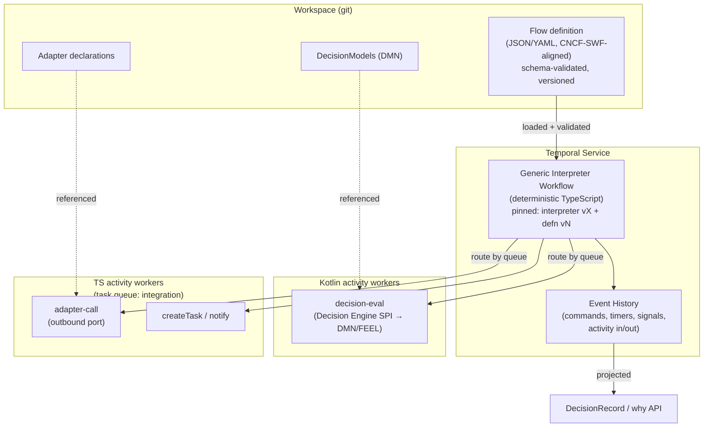
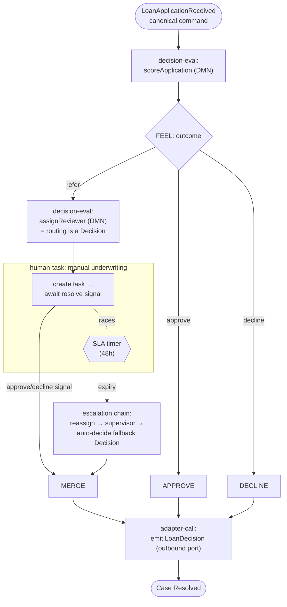

# 04 — Flow & Case Layer

> Architecture doc. Consistent with [BRIEF.md](./BRIEF.md) (locked decision §2). Research input:
> [../research/02-workflow-orchestration.md](../research/02-workflow-orchestration.md).

## What this covers

How ichiflow runs long-running business processes and human work: **Flows** (declarative,
long-running process definitions) and the first-party **Case & Task** module (manual review,
assignment, SLA, escalation). It covers the durable-execution substrate (Temporal), the ichiflow
**Flow DSL** and its generic interpreter, the step-type catalogue (including the first-class
**`compute`** code-activity step), the **three authoring surfaces** (typed code | YAML | AI chat) that
compile to one canonical Flow, the multi-language worker
topology, the Case/Task contract that Portals consume, how event history feeds the
**DecisionRecord**, and the testing / evolution / failure semantics for processes that live for
months.

## Position in the system

The Flow layer is the spine that ties the other modules together. A **Case** carries the global
`case_id`; its **Flow** decides what happens next by calling **Decisions** (the rule layer, DMN via
the Decision Engine SPI — see [../research/01-rule-engines.md](../research/01-rule-engines.md)),
invoking **Adapters** (ports in/out — see [05-adapters.md](./05-adapters.md)), and raising
**Tasks** for humans through **Portals** (audience-scoped UIs). Everything that happens is recorded
into the per-case **DecisionRecord** and queryable through the *why* API
([BRIEF.md](./BRIEF.md) §9; audit substrate in
[../research/05-audit-observability-deployment.md](../research/05-audit-observability-deployment.md)).

```
Decisions (DMN)   Adapters (ports)   Portals (task inbox)   DecisionRecord (why API)
      ▲                 ▲                    ▲                        ▲
      └───────────┬─────┴──────────┬─────────┴───────────┬───────────┘
                  │      FLOW      │       CASE / TASK     │
                  └──────── Temporal durable execution ────┘
```

---

## 1. Substrate: Temporal (durable execution)

ichiflow does not build a durable-execution engine; it stands on **Temporal** as the substrate
(locked decision, [BRIEF.md](./BRIEF.md) §2). The rationale is in
[../research/02-workflow-orchestration.md](../research/02-workflow-orchestration.md) §1–§4 and is
not re-litigated here. The load-bearing facts:

- **MIT-licensed** server and SDKs. Self-host with zero license fees, air-gap capable, no rug-pull
  risk of the kind that removed Camunda 8 from consideration. This is what makes Temporal
  acceptable as an *embedded* substrate a customer must self-host
  ([../research/02-workflow-orchestration.md](../research/02-workflow-orchestration.md) §7).
- **Event history + replay is the durability mechanism** — every command, timer, signal, and
  activity input/output is persisted and re-derivable. This is also, for free, the raw material of
  ichiflow's audit story (§8 below).
- **Determinism is the price.** Workflow code (here: the interpreter, §2) must be deterministic —
  no wall-clock, RNG, or uncontrolled I/O. All non-deterministic work happens in **activities**.
- **Multi-language via task-queue routing.** Workers poll named task queues; Kotlin rule-eval
  activities and TS integration activities live on separate queues and scale independently (§4).
  TypeScript is a first-class SDK; Kotlin is served through the Java SDK's `temporal-kotlin`
  extension and is therefore confined to *activity* workers, which have no determinism constraint.

Temporal runs in every tier ([BRIEF.md](./BRIEF.md) core vocabulary): a single dev binary at the
Dev tier, a small cluster at Team, and a zoned HA cluster (Postgres/Cassandra backing store) at
Enterprise. Same app code across tiers; config only.

---

## 2. The ichiflow Flow DSL

A **Flow** is a declarative document (JSON/YAML), **aligned with the CNCF Serverless Workflow**
specification, **schema-validated**, and **versioned in the Workspace** git repo. Flows are *not*
Temporal workflow code. Instead, a single generic **interpreter workflow** — a normal, deterministic
Temporal workflow — loads a Flow definition, walks its graph, and drives activities. This is the
"declarative DSL over a durable engine" pattern, which is established prior art, not speculation
(Temporal's own Serverless-Workflow DSL sample, Zigflow; see
[../research/02-workflow-orchestration.md](../research/02-workflow-orchestration.md) §5).

### 2.1 Why this design

| Property | How the interpreter-over-Temporal design delivers it |
|---|---|
| **Business-comprehensible** | The Flow document *is* the shared artifact between analysts, engineers, and auditors. A domain user reads and diffs a YAML flow far more easily than TS/Kotlin workflow code — this recovers BPMN's comprehension benefit without adopting a BPMN engine. |
| **Migratable** | Authoring in CNCF Serverless Workflow makes the definition a portable, vendor-neutral artifact. It is the migration-out hedge against "proprietary Temporal code" — flows export cleanly ([BRIEF.md](./BRIEF.md) §13). |
| **Safe for LLM authoring** | An AI agent authors a *constrained, schema-validated JSON/YAML document* rather than free-form workflow code. The schema bounds what can be expressed; a validator rejects malformed flows pre-deploy. This is dramatically safer than letting an LLM emit code that must itself be deterministic. |
| **Replay-audit for free** | Because the interpreter is an ordinary Temporal workflow, every flow instance gets event history + replay + versioning/patching automatically. The "why did this case take this path" answer is re-derivable from the history (§8). |

### 2.2 Constraints

- **Determinism.** The interpreter is deterministic Temporal workflow code. All non-determinism —
  rule evaluation, integration I/O, time, randomness — is pushed into activities. Flow authors
  cannot introduce non-determinism because the DSL has no primitive for uncontrolled I/O; every
  side-effecting step is an activity call.
- **Two version axes.** A running flow instance is pinned by *both* (a) the **interpreter version**
  (the Temporal workflow code, evolved with Temporal `patched()`/Worker Versioning) and (b) the
  **Flow definition version** (the schema version + the specific flow document version it started
  on). A months-long case keeps replaying against the definition and interpreter it began with; new
  cases start on the new versions (§10).
- **Schema-pinned.** The DSL schema itself is versioned. The interpreter validates a flow against
  the schema version it declares; an instance never silently migrates to a newer DSL schema.

### 2.3 Step types (the DSL catalogue)

The v1 Flow DSL supports a **closed, schema-defined canonical set** of step types — closed *by design*
so the deterministic interpreter understands every step it must replay (ADR-0004). Every step maps to a
deterministic interpreter operation and/or an activity invocation. The set is closed but **not a dead
end**: genuinely new step *kinds* are additive at a declared seam (§2.7 extension step types), not a
fork to the raw Temporal SDK.

| Step type | Meaning | Maps to |
|---|---|---|
| **decision-eval** | Evaluate a DMN **DecisionModel** and branch/annotate on the result | Activity on the Kotlin rule-eval queue (Decision Engine SPI) |
| **adapter-call** | Send/request through a declared **Adapter** (outbound port) | Activity on the TS integration queue → canonical bus ([05-adapters.md](./05-adapters.md)) |
| **compute** | Run a typed **code activity** for computation that is neither a Decision nor an Adapter — inter-step data reshaping, loop accumulation, derived state (§2.6) | Activity on a generic code-activity queue; versioned `ref` + schema'd I/O + trace emission |
| **human-task** | Raise a **Task**, block until resolved | `createTask` activity + **await-signal** with an **SLA timer** (§5) |
| **timer / SLA** | Durable wait (wall-clock or business-calendar) | Temporal timer; deterministic in the interpreter |
| **parallel / branch** | Fan-out concurrent branches; join on all/any/quorum. When branches are per-authority Decisions, the join emits a **`CompositeOutcome`** under a declared composition policy (§5.7), not an ad-hoc FEEL merge | Interpreter child scopes over multiple activities |
| **loop** | Iterate over a collection or until a condition | Bounded interpreter loop (guardrailed iteration cap) |
| **sub-flow** | Invoke another Flow definition as a child | Temporal child workflow (its own interpreter instance) |
| **signal / event-wait** | Block until an external signal or a canonical event arrives (with optional timeout) | Temporal signal / inbound canonical event correlated by `case_id` |
| **condition-gate** | Block a downstream Flow segment until a named **blocking Condition** reaches `fulfilled` (or is waived) — analogous to `signal/event-wait` but keyed to a Condition (§5.5) | Temporal await on the Condition's fulfilment signal / canonical event; the transition is recorded |
| **external-task** | **Delegate** a unit of work to an **external system**: submit a schema'd request through an outbound Adapter, durably **await a correlated response** through an inbound Adapter, validate it, and resume (or take timeout/escalation/compensation paths) — the machine analog of `human-task` (§2.8, §5.8) | Outbound **adapter-call** to submit + **await-signal** on the correlated inbound response, raced by a pausable **SLA timer** with an escalation chain, keyed by a declared correlation contract ([05-adapters.md](./05-adapters.md) §11) |
| **issue-document** | **Issue** an immutable, versioned **Document** — a permit/certificate/licence/offer — from a data snapshot + the Case **Outcome** via a governed **doctemplate**: allocate a reference number, render deterministically, record lifecycle, and deliver to a Portal and/or an outbound notification Adapter (§2.9) | Interpreter-owned **number allocation + Document-lifecycle mutation** (idempotent on replay) + a pure **render** dispatched through the rendering SPI ([07-ui-and-portals.md](./07-ui-and-portals.md) §15); an optional **acceptance** facet reuses the `human-task`/signal await machinery (§5.2) |
| **quota-op** | Perform an atomic **`reserve` / `commit` / `release`** against a **`QuotaLedger`** — cross-Case shared resource state with declared invariants (block quotas, budget pools) (§5.9) | Interpreter-owned **ledger mutation, exactly-once-memoized on replay** keyed by `(case_id, step.id)` — the same durable-side-effect discipline as `issue-document` allocation (§2.9.1); the invariant check is enforced atomically at the ledger (ADR-0030) |

FEEL expressions (the DMN expression language) are the DSL's expression sublanguage for guards,
routing predicates, and data mapping, so business users use one expression syntax across Decisions
and Flows.

**The boundary rule — where YAML wins, where it degenerates.** A Flow step's YAML expresses **WHICH
steps run and in WHAT ORDER/CONDITION** — the control-flow graph and its guards — never **HOW data is
computed or reshaped** between steps beyond trivial field references. FEEL/JSONata are the
guard/routing/field-mapping sublanguage; they are *not* a place to encode computation. The DSL
degenerates exactly where YAML stops describing the graph and starts encoding logic — the failure
modes are consistent across every workflow DSL that has tried it:

1. **Complex data shuffling between steps** — a projection/merge/reshape of the outputs of several
   prior steps expressed as inline FEEL/JSONata. The single worst failure mode.
2. **Loops with computed state** — accumulating a running total, deduping into a set, maintaining a
   cursor.
3. **Conditional fan-out where the branch *set* is itself computed** (dynamic parallelism over a
   computed list), not a fixed set of declared branches.
4. **Error-handling that derives new state** (beyond saga-compensation-as-declared-steps, §10).

Above that line, computation runs in a first-class **`compute` step** (§2.6) — a typed Kotlin/TS
**code activity** (the same kind of typed activity as `decision-eval` and `adapter-call`, §2.3 table)
that is *more* legible and diffable than sprawling inline expression, and stays on the audit spine
because the activity is schema'd at its boundary and emits a trace like any other step. Below the line
(a graph of named steps, a fixed set of guarded branches) YAML's comprehension/audit/portability
advantage dominates and the flow stays declarative. The `compute` step is the **step-level** hatch —
it keeps the declarative graph intact and drops *only the computation* into typed code — so the coarse
"drop the whole flow to raw Temporal SDK" hatch (ADR-0004) recedes to a last resort for genuinely
code-shaped *orchestration* only.

### 2.4 Scheduled and batch triggers

Flows do not only start from an inbound canonical command. A Flow definition can declare a
**scheduled trigger** — a cron/interval or business-calendar schedule that **maps directly to
Temporal Schedules** — for recurring work: nightly re-scoring campaigns, obligation-deadline sweeps
(§5.5), periodic reconciliation, and batch imports. A **batch trigger** fans a scheduled run out
**over a set of Cases** (a `find_cases`-style selector → a child sub-flow per Case, or a bounded
`loop` over the selection), so "re-score every open Case in region EU tonight" is a **declared Flow,
not a bespoke cron job**. Because the trigger resolves to a Temporal Schedule and the work runs as
ordinary interpreter steps, scheduled/batch Flows inherit the same durability, replay-audit, and
DecisionRecord wiring as command-triggered Flows, and respect the same idempotency and per-Case
version pinning (§2.2) as any other Flow instance.

### 2.5 Flow authoring surfaces (typed code | YAML | AI chat)

A Flow has **three authoring surfaces**, but exactly **one canonical artifact**. The **canonical Flow
JSON is the single executed, audited, and exported artifact** ([BRIEF.md](./BRIEF.md) §2; ADR-0004);
the surfaces are ways to *produce* it, not competing representations of it.

- **Typed TS/Kotlin flow builder.** Steps, guards, and event listeners authored as **pure typed code**
  — IDE autocomplete, refactoring, compile-time step-wiring checks, and host-language loops/conditionals
  to *generate* the graph. It compiles **one-way** to the canonical Flow JSON, exactly the
  **TypeSpec→OpenAPI two-layer pattern** ([02-schema-foundation.md](./02-schema-foundation.md) §1): the
  emitted JSON is checked in and human-primary. **No round-trip is promised** — you do not regenerate
  the builder from hand-edited JSON — and a single flow is never a persistent mix of hand-YAML and
  builder output.
- **YAML.** Simple flows are authored as canonical YAML/JSON directly — the business-user-readable,
  diffable, portable surface that remains primary for straightforward graphs.
- **AI chat.** Under the authoring doctrine (ADR-0019; doc 00 "Chat to author, preview to judge"), the
  AI writes the canonical flow from conversation; the human judges it via the **read-only flow diagram
  projection** (§6) and scenario **simulation** (§8), and approves the **diff + preview** pair.

Every Flow records **`authored-in: code | yaml | ai-chat`** provenance ([BRIEF.md](./BRIEF.md)
vocabulary "authored-in"), so a reviewer knows which surface produced the canonical artifact — while
governance, simulation, versioning, and the interpreter all key off the canonical JSON regardless.

**A visual/drag-and-drop flow builder is a non-goal** (doc 00 non-goals; ADR-0019). The Mermaid flow
diagram (§6) is a **read-only projection** rendered *from* the canonical Flow, the surface a human
*judges* a change on — never a second editable canvas that could drift from the artifact.

### 2.6 The `compute` step — first-class typed code activity

The `compute` step (§2.3 catalogue) is the first-class primitive for computation a Decision or Adapter
does not own. It keeps the flow graph declarative while moving genuine computation off inline
FEEL/JSONata into typed Kotlin/TS:

```yaml
# a compute step — keeps the graph declarative, moves computation to typed code
- id: prepare-underwriting-context
  type: compute                                   # alongside decision-eval / adapter-call
  ref: kt://underwriting/PrepareContext@2.1.0     # registered, versioned code activity (Kotlin or TS)
  input:  { schema: schema://underwriting/PrepareContextInput/1 }    # schema'd at the boundary
  output: { schema: schema://underwriting/PrepareContextOutput/1 }
  # runs as an ACTIVITY (determinism-safe); emits a typed trace exactly like decision-eval
```

Four properties keep it on the audit spine:

- **Schema'd at the boundary** — input/output JSON Schema, validated by the same runtime validators as
  every adapter/decision ("one schema, no drift").
- **Declared in the flow** — referenced by versioned `ref`, so the graph stays complete and a reviewer
  sees "compute step X runs here between the decision and the emit."
- **Unit-testable** in its native language **and stub-able** at the flow boundary — a scenario test
  (§8) stubs its output exactly like a decision outcome.
- **Trace-emitting** — writes a typed trace entry (input snapshot, output, `ref` version, timing) into
  the DecisionRecord, so it appears in the *why* API alongside `decision-eval`.

Because it is an **activity**, it never threatens the interpreter's determinism (§2.2). This is the
**same unified code-activity contract** as a Decision **feature-function**
([03-decision-layer.md](./03-decision-layer.md) §2.4) and an Adapter **code-transform**
([05-adapters.md](./05-adapters.md) §1) — one primitive
(`ref: <lang>://<module>/<Name>@<version>` + boundary JSON Schema + trace), not three weaker,
layer-specific hatches (BRIEF vocabulary "compute step / code activity", ADR-0004). It carries the same
non-portability discipline as the DRL/feature-function hatch — schema'd I/O + golden datasets so
behaviour is *specified* even though the code does not port, denting the workspace portability score
(G6).

**The code-activity worker is a declared SPI (new languages are additive).** The `ref` scheme is
**language-parameterised** (`<lang>://…`) and the contract is language-neutral — a schema'd input/output
boundary plus an emitted trace, never the worker's language, is the audit boundary. New worker languages
are therefore **additive behind that same schema'd-boundary + trace contract** (BRIEF §4, §21), not a
core change: a language registers a worker that honours the boundary + trace, and its `compute`
activities are contract-tested identically ([13-agent-harness-loops.md](./13-agent-harness-loops.md)
§2.c). **Kotlin and TS are the only v1 implementations** (`kt://`, `ts://`); **Python is the expected
first post-v1 addition** (`py://`), specifically for ML feature-prep in scoring/underwriting
feature-functions, which today would otherwise force reimplementation. The worker SPI is what keeps
"move computation to typed code" from silently meaning "kt/ts only forever."

### 2.7 Extension step types — custom step kinds at a declared seam

The canonical step-type set (§2.3) is closed for interpretability, and `compute` is the sanctioned
computation hatch — so *most* new needs are already met without a new step kind. But a genuinely new
step kind (an org-specific orchestration primitive) has a **declared, schema'd extension seam** rather
than only "drop the whole flow to the raw Temporal SDK" (ADR-0004 last resort) or an un-owned fork:

- **Custom step types are declared compute-variants under an extension namespace.** A Workspace
  declares `x-<org>/<stepType>` (e.g. `x-acme/geo-fence-check`) as a **schema'd, interpreter-registered
  compute-variant**: it carries an input/output JSON Schema, is backed by the **unified code-activity
  contract** (§2.6, a versioned `ref` on the code-activity worker SPI), and is **validated + trace-
  emitting exactly like `compute`**. The interpreter dispatches it through the same generic
  code-activity path, so determinism (§2.2) and the audit spine are preserved by construction.
- **Additive and discoverable, not a fork.** Because the extension is a declared artifact with a schema,
  it shows up in the artifact-type catalog and DSL-schema validation
  ([02-schema-foundation.md](./02-schema-foundation.md) §10, `list_artifact_types`), a reviewer sees the
  step in the graph like any built-in, and `ichiflow verify` runs its vectors
  ([13-agent-harness-loops.md](./13-agent-harness-loops.md) §2.c) — so a new step kind is enumerable and
  governed, never a silent core change (BRIEF §21).
- **The line stays where §2.3 draws it.** An extension step type is for a genuinely new *named*
  step-kind an app wants first-class in its graph; ordinary inter-step computation still uses plain
  `compute`. Both ride the same worker + trace contract; the extension namespace just gives a recurring
  computation a stable, declared step identity.

This is the same "closed core, declared extension points" doctrine as the Decision-Engine SPI and the
renderer registry (BRIEF §21; [00-vision-and-principles.md](./00-vision-and-principles.md) "Closed core,
declared extension points") applied to the Flow step vocabulary. The CNCF-SWF conformance question — how
these `x-` extensions degrade on export to other SWF runtimes — is the same extension-namespace concern
tracked in the open questions.

### 2.8 The `external-task` (delegation) step — offload work to an external system

A Flow can **delegate** a unit of work to a system ichiflow does not run: submit a schema'd request, then
durably **await a correlated response** that arrives later — on the external system's own schedule,
possibly seconds or weeks after submission — validate it against a response schema, and resume. This is
the **machine analog of `human-task`** (§5.2): where a human Task creates a work item and blocks on an
await-signal raced by an SLA timer, an `external-task` submits a request and blocks on a **correlated
inbound response** raced by the *same* pausable-clock SLA + escalation machinery. The symmetry is
deliberate and is made explicit in §5.8. The round-trip is the **Request-Reply** Enterprise Integration
Pattern; the Adapter layer supplies the correlation contract and transport profiles under it
([05-adapters.md](./05-adapters.md) §11).

**Why `external-task` is a *canonical* step type, not an *extension* step type (§2.7).** A step is
canonical when the **interpreter itself must understand its control-flow semantics to replay them
deterministically**; an extension step type (§2.7) is admissible only when the new kind reduces to a
**compute-variant** dispatched through the generic code-activity path. `external-task` fails that
reduction and meets the canonical bar on every count:

- **It is durable-await machinery, not a computation.** Its semantics are *submit → suspend for a
  correlated signal that arrives through a **different** adapter later → race a pausable clock → escalate
  / compensate* — exactly the interpreter-level operations `human-task` (§5.2) and `signal/event-wait`
  (§2.3) already are. A compute-variant runs one activity to completion; it cannot express a durable
  cross-adapter await under a clock. So `external-task` is *not* reducible to §2.7.
- **It is core semantics, not org-specific.** "Submit to an external system and await its correlated
  reply" is a universal shape — the request-reply EIP ([05-adapters.md](./05-adapters.md) §11) — like
  human review, not an `x-<org>` primitive.
- **Transport is what's pluggable, and its seam already exists underneath.** The five transport profiles
  (HTTP sync / callback / polling, message-queue request-reply, SFTP file round-trip —
  [05-adapters.md](./05-adapters.md) §11) are **Adapter bindings** under the existing **Adapter-binding
  SPI** ([05-adapters.md](./05-adapters.md) §2), *not* new step kinds. One canonical step, transport-
  pluggable beneath it through a seam that already exists — the same shape as `adapter-call` being one
  canonical step over many bindings. Forking a step kind per transport would fragment exactly the
  correlation/timeout/audit semantics this step exists to unify (ADR-0028).

So `external-task` joins `human-task` as a canonical await-with-SLA step whose *variability* lives in a
declared SPI beneath it, never in the step vocabulary.

```yaml
# an external-task step — the machine analog of human-task (§5.2); transport-pluggable underneath (§05 §11)
- id: verify-applicant-credentials
  type: external-task
  request:
    schema: schema://vetting/CredentialCheckRequest/1      # canonical request schema ($ref'd)
    adapter: adapter://vetting/credential-check-submit      # OUTBOUND adapter (submit)
  response:
    schema: schema://vetting/CredentialCheckResult/1        # canonical response schema ($ref'd)
    inbound: adapter://vetting/credential-check-reply        # INBOUND adapter (await the correlated reply)
  correlation:                                              # declarative per-transport (§05 §11.1)
    inject:  { as: header, name: x-correlation-id, from: "case_id & '/' & step.id" }
    extract: "response.correlationId"                        # JSONata over the inbound response
  mode: single                                              # single | streamed | batch (see "Response modes")
  reliability:
    delivery: at-least-once                                 # idempotent receiver; dedup on the response
    idempotencyKey: "case_id & '/' & step.id"
    dedupOnResponse: "response.correlationId & '/' & response.messageId"
  sla:                                                      # reuses the pausable-clock machinery (§5.7)
    budget: P5D
    onTimeout: chain/vetting-esc-1                           # escalation path — ordinary authored steps
  onNegativeAck: compensate                                 # negative-ack → declared compensation (§10 saga)
  onMalformed: dlq                                          # schema-invalid response → DLQ + Case surfacing
```

**Step declaration.** An `external-task` declares, all as schema-validated data:

- **request** — the canonical **request schema** (`$ref`'d, [02-schema-foundation.md](./02-schema-foundation.md) §3) and the **outbound Adapter** the
  request is submitted through.
- **response** — the canonical **response schema** (`$ref`'d) and the **inbound Adapter** the correlated
  reply arrives on. The reply is validated against this schema before the flow resumes; a schema-invalid
  reply is a `malformed` failure (below), never silent state.
- **correlation** — the **correlation contract**: how the correlation id is *injected* onto the outbound
  request and *extracted* from the inbound reply, **per transport**, as a **declarative rule** (a JSONata/
  FEEL expression over the response, e.g. `response.correlationId`), never code. The extracted id is
  matched to the waiting `external-task` instance (keyed to `case_id` + step). Injection/extraction rules
  per transport profile live in [05-adapters.md](./05-adapters.md) §11.1.
- **reliability** — **at-least-once submission + idempotent receiver** ([05-adapters.md](./05-adapters.md)
  §5): the external system is expected to be an idempotent receiver keyed on `idempotencyKey`, and
  inbound responses are **deduped** on `(correlation-id, response messageId)`, so a re-submitted request
  or a duplicated reply applies once (mirrors §10's idempotency stance).
- **sla / escalation** — a **timeout/SLA** that **reuses the pausable-clock machinery** (§5.7); on expiry
  the flow follows an **escalation chain** (retry-submit, reroute to an alternate provider, an auto-decide
  fallback Decision, or compensate), each an ordinary authored DSL step exactly as for `human-task` (§5.2).

**Response modes.** A delegation is not always a single reply:

- **`single`** — one correlated response completes the step (the common case).
- **`streamed`** — a sequence of correlated chunks/partial responses arrives; the step accumulates them
  (accumulation in a `compute` step, §2.6, never inline) until a declared completion marker, then resumes.
- **`batch`** — the request submits a set of records and the reply is a **batch of per-record results**;
  **record-level correlation** ([05-adapters.md](./05-adapters.md) §11.1) matches each result to its
  request record, and partial batches are surfaced per record rather than all-or-nothing.

**Failure taxonomy.** Four distinct, first-class outcomes — a delegation never simply "hangs":

| Failure | Trigger | Handling |
|---|---|---|
| **no-response timeout** | SLA expires with no correlated reply | escalation chain (`sla.onTimeout`) — reuses §5.7 pausable clock |
| **negative-ack** | the external system replies with a typed *reject/error* outcome | `onNegativeAck` — a branch or **declared compensation** (§10 saga); it is an *outcome*, not a retryable error |
| **malformed response** | a reply fails response-schema validation | `onMalformed: dlq` — lands in the Adapter **DLQ** with triage/replay ([05-adapters.md](./05-adapters.md) §5) **and surfaces on the Case** (a diagnostic Task/flag), never a stuck flow |
| **transport/transient** | submission or delivery I/O failure | the Adapter's at-least-once retry/backoff (§10, [05-adapters.md](./05-adapters.md) §5); exhausted → DLQ |

**Routing — *which* external system is itself a Decision.** Just as assignment routing for a human Task
is a `decision-eval` (§5.3), *which* external system (or which of several accredited providers) a
delegation targets is a **Decision** over a classification/routing DecisionModel, whose output selects the
outbound Adapter/endpoint. Provider selection is therefore governed, simulated, and explained like any
other Decision, and lands in the DecisionRecord (§5.8).

**Audit.** Every delegation emits trace events into the DecisionRecord (§7): **submitted / ack'd /
responded / timed-out**, each with the request/response payloads **snapshotted per audit policy**, the
outbound and inbound Adapter I/O snapshots ([08-audit-and-observability.md](./08-audit-and-observability.md)
§1.1), the resolved correlation id, and the provider-selection Decision — so "we delegated X to system Y,
correlated by Z, and it replied W at time T" is answerable through the *why* API.

**Zones.** Delegation to a system in another zone rides the **one-way relay** patterns
([05-adapters.md](./05-adapters.md) §8): the request egresses through a controlled outbound Adapter and
the reply re-enters through an inbound DMZ Adapter that relays one-way to the core, correlated to the
waiting `external-task` — no synchronous callback from intranet into DMZ.

### 2.9 The `issue-document` step — issue a governed Document

An approval does not merely *resolve* a Case; it commonly **produces the governed instrument the approval
entitles** — a Customs Clearance Permit, an operating licence, a grant **Letter of Offer**, a decision
certificate, a ballot-result notice. A Flow **issues** that instrument with an `issue-document` step: it
generates an **immutable, versioned `Document`** from a **data snapshot + the Case `Outcome`** (its reason
codes and conditions rendered per-audience via the referenced CodeSet display metadata, §5.5, doc 02 §9.2),
rendered through a governed **`doctemplate`** ([07-ui-and-portals.md](./07-ui-and-portals.md) §15), stamped
with an allocated **reference number**, given a **verification hash**, and delivered to a Portal and/or an
outbound notification Adapter ([05-adapters.md](./05-adapters.md) §4.2). Where `human-task` and
`external-task` are the two *await* steps (§5.8), `issue-document` is the **issuance** step.

The `Document` an `issue-document` produces **is** the **versioned governed output artifact** a Case emits
(§5.1): a reissue or variation supersedes the prior version, version-linked, with the **DecisionRecord
spanning all versions** (§7). Post-submission Case operations (§5.6) act on it — a `cancel`/clawback
**revokes** it, an `amend`/`correct` **reissues** a new version.

**Why `issue-document` is a *canonical* step type, not a *compute*-variant (§2.6/§2.7).** The canonical bar
(§2.8) is that the **interpreter must understand the step's control-flow semantics to replay them
deterministically**; an extension type is admissible only when the new kind reduces to a **compute-variant**
on the generic code-activity path. `issue-document` fails that reduction on two independent counts — and the
part of it that *is* pure is dispatched beneath it exactly as transport is dispatched beneath `external-task`:

- **Reference-number allocation is a side effect, not a computation.** Allocating "the next Customs Clearance
  Permit number" **consumes a monotonic counter** — it is not pure (`compute` steps are pure and re-runnable,
  §2.6: same input → same output). On replay the interpreter must **not** mint a *second* number nor emit a
  second `issued` event; it **memoizes** the allocation and the lifecycle mutation keyed by `(case_id,
  step.id)`, exactly-once-ish under at-least-once execution. That durable side-effect memoization is
  interpreter machinery, not something a pure activity can host.
- **Lifecycle mutation and the acceptance facet are interpreter control-flow.** Issuing transitions a
  `Document` `issued`, and an **offer-type** Document (grant Letter of Offer, §2.9.2) then makes the flow
  **await** the holder's `accept`/`decline` — the same durable await-with-signal shape as `human-task`
  (§5.2) that only the interpreter can replay deterministically. A compute-variant runs to completion; it
  cannot suspend for acceptance under a clock.
- **What *is* pure — the render — is dispatched through the rendering SPI beneath the one step.** *Data
  snapshot + template version → PDF/UA bytes* is a **deterministic, re-runnable render**
  ([07-ui-and-portals.md](./07-ui-and-portals.md) §15); the canonical step **owns** allocation + lifecycle +
  delivery + audit and **dispatches** the render as an ordinary activity — the same shape as `external-task`
  owning correlation/SLA/audit while transport is a pluggable Adapter binding beneath it (ADR-0029).

```yaml
# an issue-document step — issue a permit (no acceptance) and, elsewhere, an offer (with acceptance)
- id: issue-permit
  type: issue-document
  template: customs-clearance-permit@2.1.0          # doctemplate ref (doc 07 §15)
  binding:                                           # schema'd fields → template; the DATA SNAPSHOT source
    holder:         "${case.applicant}"
    outcome:        "${case.outcome}"                # conditions render per-audience via CodeSet display (§5.5)
    decisionRecord: "${case.decisionRecord}"
  numberAllocation: allocation://customs/clearance-permit   # governed number-allocation contract (§2.9.1)
  lifecycle: { acceptance: none }                    # none | offer
  verification: { endpoint: public, hash: sha256 }   # verification hash + optional QR/public endpoint (§2.9.4)
  delivery:
    - portal: customer                               # portal link — PDP-scoped fetch (doc 07 §15)
    - notify: adapter://notify/email-applicant       # outbound notification Adapter (doc 05 §4.2)

# an OFFER-type Document — issued → accepted/declined participates in the Flow (the grants case)
- id: issue-letter-of-offer
  type: issue-document
  template: grant-letter-of-offer@1.0.0
  binding: { offer: "${case.outcome}", applicant: "${case.applicant}" }
  numberAllocation: allocation://grants/offer-ref
  lifecycle:
    acceptance: offer                                # issued → await accept/decline (reuses §5.2 await + §5.7 clock)
    onAccepted:  chain/grant-activate                # authored steps, like a human-task resolution
    onDeclined:  chain/grant-withdraw
    sla: { budget: P30D, onTimeout: chain/offer-lapsed }
  delivery: [ { portal: applicant }, { notify: adapter://notify/grant-email } ]
```

**Step declaration.** An `issue-document` declares, all as schema-validated data:

- **template** — the governed **`doctemplate`** (`id@version`, [07-ui-and-portals.md](./07-ui-and-portals.md)
  §15) that binds schema'd fields → layout; the version is **pinned into the Document** so the binary is
  re-derivable.
- **binding** — the **field binding** that assembles the **data snapshot** (Case data + `Outcome` +
  DecisionRecord references) the template renders. The snapshot — *not* the rendered bytes — is the canonical
  truth (§2.9.3).
- **numberAllocation** — the **number-allocation contract** (§2.9.1) the reference number is drawn from.
- **lifecycle** — `acceptance: none` (a plain issued Document) or `acceptance: offer` (issued → accepted /
  declined participates in the Flow, §2.9.2).
- **verification** — the **verification hash** algorithm and whether a **public verification endpoint**
  (QR-linkable) is exposed (§2.9.4).
- **delivery** — one or more sinks: a **Portal link** (fetched PDP-scoped, doc 07 §15) and/or an **outbound
  notification Adapter** (email/SMS, doc 05 §4.2). Delivery **composes with** the notification layer; it does
  not reinvent it.

**2.9.1 Number allocation — gap-free vs gapped semantics.** A reference number is drawn from a **governed
number-allocation contract** — a declared, versioned config artifact (owned by a Team like any governed
artifact, doc 06 Part 4) whose two semantics are legally material:

- **`gapped`** (default) — numbers may **skip** on abort/rollback (a monotonic sequence; cheap,
  high-concurrency). Correct when the number is a handle, not a count.
- **`gap-free`** — a **contiguous** sequence with **no** holes (statutory receipt/permit registers, invoice
  numbers): every allocated number is either **consumed** or **explicitly voided with an audited
  void-reason**, never silently lost. This costs serialized allocation + a void ledger, so it is declared
  only where the register's continuity is a compliance requirement.

The contract also declares scope/format (per-year reset, prefix, check-digit). Allocation is the
side-effecting, exactly-once-memoized operation the step owns (above); the void ledger and every allocation
land in the DecisionRecord.

**2.9.2 Document lifecycle.** A `Document` is **immutable** once issued; change is expressed as **new
versions and lifecycle transitions**, each an audited DecisionRecord event (§7,
[08-audit-and-observability.md](./08-audit-and-observability.md) §1.6):

- `issued → superseded` — a **reissue** or **variation** (§5.6 amend/correct) mints a **new version** that
  **supersedes** its predecessor; the reference number either carries with a version suffix or a new number
  is allocated, per the contract.
- `issued → revoked` — a **cancellation/clawback** (§5.6 cancel) terminates the Document with a
  `cancellation-reasons` codeRef.
- **Acceptance facet (offer-type, optional):** `issued → accepted | declined`. The flow **awaits** the
  holder's decision (portal action or inbound canonical event, correlated by `case_id`), raced by a
  **pausable SLA** (§5.7) whose expiry follows an authored `onTimeout` chain (`offer-lapsed`). This is the
  facet the **grants** Letter-of-Offer needs, and it is why the step is canonical rather than a compute-variant.
  The acceptance facet also covers **multi-party countersignature** — a small extension where `issued →
  accepted` requires **N correlated counter-signatures** (co-applicants acceding, e.g. the grants case's
  co-applicants) before the award activates: each accede is an idempotent, correlated signal on the same
  await, and activation gates on all N (ADR-0029).

**2.9.3 The binary is derived — determinism, storage, redaction.** The **canonical truth is the data
snapshot + the pinned template version**, from which the binary **deterministically re-renders**; the PDF
is a **derived** artifact, not the source of record. This yields three properties:

- **Determinism.** *Same snapshot + same template version → normalized-identical output* — the property the
  render-determinism harness checks ([13-agent-harness-loops.md](./13-agent-harness-loops.md) §2.k), bought
  by a deterministic rendering engine (fixed creation timestamp, embedded fonts; doc 07 §15).
- **Storage.** The `Document` (metadata: reference number, version, lifecycle, hash, snapshot ref, template
  pin) is a schema-defined **entity** in the entity store (doc 02 §11); the **binary** rides an
  **object-storage SPI** (doc 02 §11) as a cache of a re-derivable artifact, not the truth.
- **Redaction (immutability vs GDPR).** Because the binary is derived, GDPR erasure reconciles with
  immutability via **crypto-shredding** ([08-audit-and-observability.md](./08-audit-and-observability.md)
  §1.6): PII in the data snapshot is encrypted per-subject; erasure destroys the key, so the snapshot's PII —
  and any re-render — is unrecoverable, while the Document's **structural** record (reference number, status,
  hash, lifecycle events) survives for audit-chain integrity. The cached binary is purged from object
  storage; it can no longer be re-derived.

**2.9.4 Verification.** A Document carries a **verification hash** over its canonical snapshot + template
pin, and may expose an optional **public verification endpoint** (QR-linkable on the rendered artifact). A
presenter (a border officer, a landlord, a bank) scans the code and the endpoint confirms **authenticity +
current status** — `issued | superseded | revoked | accepted` and the issue date — **without exposing Case
data** ([08-audit-and-observability.md](./08-audit-and-observability.md) §1.6). It is deliberately
**data-minimal**: the response proves the instrument is genuine and current, not what is inside the Case.

**Audit.** Every `issue-document` emits DecisionRecord events (§7) — **allocated / issued / delivered**, and
later **superseded / revoked / accepted / declined** — each with the snapshot reference, the template pin,
the resolved reference number, the verification hash, and the delivery outcome, so "what instrument did we
issue, from which data, under which template, and what is its status now" is answerable through the *why* API.

**Placement — core semantics vs delegable generation.** Only the part the audit spine depends on is
hard-shipped: **number allocation, Document lifecycle, the acceptance await, the audit events, and the
verification contract are core** (the DecisionRecord references the Document by number + hash + version, so
its registry, lifecycle, and verification cannot leave ichiflow). **Rendering the bytes is a swappable
component** behind the rendering SPI, and an enterprise document platform can be delegated to at two depths —
**delegated rendering** (ichiflow keeps numbering + lifecycle, ships the snapshot out and stores the returned
binary) or **delegated full issuance** (the external system owns numbering/format; ichiflow records the
Document metadata + hash as the audit anchor). Both are spelled out in
[07-ui-and-portals.md](./07-ui-and-portals.md) §15.7; the non-delegable core stays in ichiflow in every case.

---

## 3. Flow interpretation architecture (diagram)



The interpreter reads the versioned definition, walks the graph, and dispatches each step to the
correct **task queue**. It never imports a broker client or a rules engine directly — those live
behind activities. The event history it accumulates is projected into the DecisionRecord (§8).

---

## 4. Worker topology (independently scalable)

Two worker fleets poll two task queues, decoupled from the interpreter and from each other:

- **Kotlin activity workers — task queue `rules`.** Host **decision-eval** activities: the Decision
  Engine SPI evaluating DMN/FEEL on Apache KIE / Drools (default engine, [BRIEF.md](./BRIEF.md) §1).
  Kotlin's confinement to activities sidesteps the "Kotlin is not a first-class Temporal SDK" risk
  ([../research/02-workflow-orchestration.md](../research/02-workflow-orchestration.md) §1, §3) —
  activities carry no determinism constraint.
- **TypeScript activity workers — task queue `integration`.** Host **adapter-call** activities
  (outbound ports to the canonical bus), **createTask/notify**, and other I/O. The interpreter
  workflow itself is also TypeScript (first-class, GA SDK).

Because each queue's workers are stateless and scale on their own, a spike in rule evaluation does
not starve integration throughput, and vice versa. This is the independent-scalability property
Temporal provides natively via task-queue routing. Later, cross-team/cross-namespace fan-out uses
Temporal **Nexus** without changing the Flow DSL.

---

## 5. First-party Case & Task module

Temporal gives ichiflow durable execution but **no** task store, assignment engine, or reviewer UI
([../research/02-workflow-orchestration.md](../research/02-workflow-orchestration.md) §6). Building
these is deliberate — it is ichiflow's product moat and is the same work any code-first engine
would require. The Case & Task module is a first-party ichiflow module layered on the substrate.

### 5.1 Case lifecycle

A **Case** is the unit of business work. It is created when a Flow starts (typically from an inbound
canonical command), carries the global `case_id`, and aggregates the flow instance(s), the Tasks,
the fired-Decision traces, its Outcome and its Conditions (§5.5), and the DecisionRecord. Its lifecycle —
`Open → InProgress → (Suspended) → Resolved → (ObligationsOpen) → Closed` — is driven by the Flow, not
hand-managed; the Case row is a projection of flow state plus case-level metadata (owner, tenant,
priority, SLA envelope).

- **`ObligationsOpen`** is the lightweight state a Case sits in when it has **resolved** but still
  carries live **post-approval obligations** (§5.5) — deadline-bearing conditions and retention windows
  that must be tracked *after* the substantive work is done. A Case reaches `Closed` only when its
  obligations are all fulfilled/waived/expired. (Equivalently, an obligation may spawn a durable child
  timer/Task that outlives the parent Case; §5.5.)
- **Case ↔ artifact versioning.** The governed output artifact a Case produces (its "permit/decision"
  record) is **versioned**. That artifact is a **`Document`** issued by an `issue-document` step (§2.9):
  amendment and correction (§5.6) produce a **new version** that supersedes its predecessors, version-linked,
  with the **DecisionRecord spanning all versions** — so the audit chain survives amendments
  ([08-audit-and-observability.md](./08-audit-and-observability.md) §1).

### 5.2 Manual review = await-signal + SLA timer + escalation

A **human-task** step implements the documented, battle-tested Temporal human-in-the-loop pattern:

1. **Create task.** An activity writes a **Task** = `{ case_id, workflow_id, type, payload, queue,
   assignee?, sla, state }` to the task store and emits a `task.created` event.
2. **Block on a signal.** The interpreter waits for a resolve **signal** (`approve` / `reject` /
   structured outcome). Signal handlers are **idempotent** so double-clicks and retried deliveries
   resolve once.
3. **SLA timer runs concurrently.** A Temporal timer races the signal. On expiry the flow follows
   its **escalation chain** — reassign, notify, escalate to a supervisor queue, or auto-decide via a
   fallback Decision — each step itself an ordinary DSL step, so escalation is authored, not
   hard-coded.

The SLA timer is **pausable** (clock-stop): when a Task enters an `awaiting-external` /
`awaiting-applicant` sub-state — because the ball has moved to the applicant or another party for
more information — the SLA clock pauses and the paused interval is excluded from SLA accounting.
This is a common, legally-material pattern (SLA is measured excluding the party's own wait); the
mechanics are in §5.7.

Because this is all durable Temporal state, a Task can wait days or months across worker crashes and
restarts without losing position.

### 5.3 Assignment routing is itself a Decision

Who a Task goes to — round-robin, skill/role-based, load-based, tenant-scoped — is **not** bespoke
code. It is a **decision-eval** step against an assignment **DecisionModel** ([BRIEF.md](./BRIEF.md)
§2: "assignment routing is itself a decision"). The rule layer the platform already runs decides the
assignee/queue; routing rules are governed, simulated, and explained like any other DMN Decision,
and their output lands in the DecisionRecord.

The same "routing is a Decision" pattern governs **design-time** approvals too: a **reference-data
(CodeSet) change** opens an approval Case (approval is itself a Flow) whose reviewers are routed **by role
within the artifact's owning Team**, again as a Decision — see
[03-decision-layer.md](./03-decision-layer.md) §5.8 and [06-identity-and-access.md](./06-identity-and-access.md)
Part 4.

### 5.4 Task inbox contract (consumed by Portals)

The module exposes a schema'd **task inbox contract** (TypeSpec-authored → OpenAPI/JSON Schema,
[BRIEF.md](./BRIEF.md) §5) that back-office and other **Portals** consume. The contract is
UI-agnostic: list/claim/reassign/resolve operations plus a filter/search surface over the task
store. Row/field visibility on the inbox is enforced by the central PDP (ReBAC filter + ABAC field
masks, [BRIEF.md](./BRIEF.md) §8), so the same authorization drives the generated inbox UI and its
API. Resolving a Task through the contract sends the Temporal signal back into the waiting flow.

```yaml
# Task (canonical, schema'd — the shape Portals render and resolve)
Task:
  case_id: c-2026-000431
  task_id: t-9f2a
  type: loan.manual_review.v1
  queue: underwriting-tier2
  assignee: null                 # set by the assignment Decision
  sla:                           # pausable clock-stop SLA (§5.7)
    budget: P3D
    elapsed: P1D4H
    clock: running               # running | paused
    escalation: chain/underwriting-esc-1
  state: open                    # open | claimed | awaiting-external | resolved | escalated | expired
  payload_ref: schema://loan/ManualReviewContext/1
  correlation: { signal: resolve, idempotency_key: t-9f2a }
```

### 5.5 Conditions: typed, stateful outcome obligations

A Case's Outcome (doc 02 §9.3) can carry **Conditions** — a first-class entity the Case module tracks as
part of its projected state. Each Condition is individually typed and individually stateful:

- **`kind`** — `blocking` (gates a downstream event/step) or `post-approval-obligation` (an obligation
  tracked after the substantive decision).
- **`state`** — `pending → fulfilled | waived | breached`.

The two kinds behave differently in the Flow:

- **Blocking conditions gate later steps.** A blocking Condition (e.g. "present the item for
  inspection," "prior approval obtained," "duty paid") holds a downstream Flow segment via a
  **`condition-gate`** step (§2.3) until it reaches `fulfilled` or is `waived`. Fulfilment arrives as a
  signal or canonical event (correlated by `case_id`) and the transition is recorded to the
  DecisionRecord.
- **Post-approval obligations can outlive Case closure.** Obligations carry **deadlines** and
  **retention windows** ("return supporting documents within 48 hours," "retain records five years,"
  "re-export within the window"). They must be trackable *after* the Case reaches `Resolved`: the Case
  either sits in the lightweight `ObligationsOpen` state (§5.1) or the obligation spawns a **durable
  child timer/Task**. A **missed deadline** flips the Condition to `breached`, raises a canonical
  `condition.breached` event, and may open a **remediation Case** — the breach is a distinct,
  audit-first-class event ([08-audit-and-observability.md](./08-audit-and-observability.md) §4.6).

```yaml
# Conditions on a Case Outcome (canonical shapes from doc 02 §9.3)
conditions:
  - code: PRESENT_FOR_INSPECTION
    codeSet: obligations@4.3.0
    kind: blocking
    gates: [cargo-release]          # a condition-gate step keyed here holds the release segment
    state: pending
  - code: RETURN_SUPPORTING_DOCS
    codeSet: obligations@4.3.0
    kind: post-approval-obligation
    deadline: { fromResolution: P0D, dueIn: PT48H }   # tracked after the Case resolves
    state: pending
```

### 5.6 Post-submission Case operations

A submitted Case is not frozen at "decided." ichiflow models **amend, cancel, withdraw, appeal, and
correct** as first-class Case operations. Each operation is:

1. **State-gated** by the Case lifecycle — e.g. *amend* only while the artifact is not yet consumed or
   expired; *cancel* only within a validity window and not while under compliance hold.
2. **Reason-coded** from a governed CodeSet where applicable — cancellation captures a reason code
   (a `cancellation-reasons` CodeSet, doc 02 §9.1).
3. **Field-scoped for amendment** via a governed **field-amendability CodeSet**: some fields are
   amendable in place, others are **non-amendable** — attempting to change a non-amendable field forces
   a **cancel-and-resubmit** path rather than a mutation.
4. **Artifact-versioning** (§5.1): the operation produces a **new version** of the governed output
   artifact while preserving DecisionRecord continuity across versions.
5. **Alternative-remediation aware**: when a hard state gate blocks the operation (e.g. the artifact is
   already consumed, or the case is expired past a threshold, or under audit), the operation branches to
   an **alternative-remediation Flow** (e.g. voluntary disclosure / manual redress) rather than failing
   silently.

**Correlated child Cases.** *Correction*, *appeal*, and *withdraw* open **correlated child Cases** that
reference the parent's DecisionRecord — a correction re-enters as a *new* correlated submission (the
original Case closed as rejected/superseded), an appeal spawns a review sub-case, a withdrawal records a
terminal disposition. This formalises the Case↔Flow cardinality question (Open questions): a Case is not
strictly 1:1 with a root Flow — post-decision operations spawn sibling/child flows under one correlation
lineage.

| Operation | Typical state gate | Reason-coded | Produces |
|---|---|---|---|
| **amend** | not consumed / not expired; field is amendable | (field-amendability CodeSet) | new artifact version |
| **cancel** | within validity; not under hold | cancellation-reason CodeSet | terminal cancel + version |
| **withdraw** | pre-resolution | optional | terminal disposition |
| **appeal** | post-decision, within appeal window | appeal-reason CodeSet | correlated child review Case |
| **correct** | on non-amendable field / post-rejection | correction-reason CodeSet | new correlated child Case |

### 5.7 Clock-stop (pausable) SLA timers and composite per-authority clocks

SLA timers support **pause/resume** so that time spent waiting on an external party does not count
against the processing budget:

- Entering an `awaiting-external` / `awaiting-applicant` Task sub-state (§5.2, §5.4) **pauses** the SLA
  clock; resuming (the party responds) **resumes** it. The paused interval is **excluded** from SLA
  accounting and **recorded distinctly** as a clock-stop event
  ([08-audit-and-observability.md](./08-audit-and-observability.md) §4.6), because it carries SLA-reporting
  weight.
- A **composite Case** (§2.3 in [03-decision-layer.md](./03-decision-layer.md)) runs **independent
  per-authority clocks**: each authority's Decision has its own SLA budget and its own pause/resume
  state, so one authority's request-for-information does not pause another's clock, and the Case-level
  view aggregates the per-authority clocks.
- The **composite fan-out/join** is a `parallel/branch` step (§2.3) whose join applies the declared
  **composition policy** and emits a `CompositeOutcome`; authority-selection is a `decision-eval` routing
  step over a classification CodeSet (§5.3, "routing is a Decision").

```yaml
# Pausable SLA on a Task (clock-stop), with an awaiting-applicant sub-state
Task:
  sla: { budget: P3D, elapsed: P1D4H, clock: paused }   # paused excludes applicant wait
  subState: awaiting-applicant                           # open | claimed | awaiting-applicant | resolved | ...
  clock: { pausedAt: 2026-07-10T09:00:00Z, reason: request-for-information }
```

### 5.8 `external-task` — the machine analog of the human Task

`human-task` (§5.2) and `external-task` (§2.8) are the two **await-with-SLA** steps — one for a human
work item, one for an external system — and the Case module treats them **symmetrically**. Both create a
work item, block on an idempotent correlated resolution, race a **pausable SLA timer** (§5.7), and follow
an authored **escalation chain** on expiry; both record their resolution into the DecisionRecord (§7).

| Aspect | `human-task` (§5.2) | `external-task` (§2.8) |
|---|---|---|
| Work item | a **Task** in the task store | a **request submitted** through an outbound Adapter |
| Blocks on | resolve **signal** (idempotent) | **correlated inbound response** (idempotent; dedup on response) |
| Raced by | SLA timer (pausable, §5.7) | the **same** pausable SLA timer + escalation |
| On expiry | escalation: reassign → supervisor → auto-decide fallback | escalation: retry-submit → reroute provider → fallback Decision → compensate |
| Routing = a Decision | *who* the assignee/queue is (§5.3) | *which* external system/provider is (§2.8) |
| Recorded | reviewer identity, outcome, timing | submitted/ack'd/responded/timed-out + payload snapshots (§2.8 audit) |

The **routing symmetry** is exact: §5.3's "assignment routing is itself a Decision" for humans is
"provider selection is itself a Decision" for external systems. The **clock-stop nuance**: an
`external-task`'s SLA by default measures the *external system's own turnaround* — which is precisely what
you want to escalate on — so it does not pause while awaiting that system; §5.7's pause/resume is reused
only where a delegation must additionally exclude a *further* downstream wait (e.g. the delegation is
itself blocked pending applicant input), recorded distinctly like any clock-stop
([08-audit-and-observability.md](./08-audit-and-observability.md) §4.6).

### 5.9 The `QuotaLedger` — cross-Case shared resource state

Some Cases consume a resource **another Case needs**. The permit reference product's fee pool is a
scalar counter, but two harder shapes break that: a **public-housing ballot** consumes
`(project, block, ethnicGroup)` × `(project, block, SPR)` × `(project, scheme)` headroom under a hard
fairness invariant — *no dimension may go below zero, ever, under concurrent selection appointments* —
with **TTL'd reservations** (a selection appointment holds a block for 120 minutes); and a
**competitive grant round** consumes a **monetary** budget pool drawn down by a ranked funding line.
Both are **cross-Case shared mutable state** the per-`case_id` model does not carry, and modelling either
as an ad-hoc `compute` over a Postgres table puts the fairness invariant in **hand-written SQL the *why*
API and the harness cannot see**. ichiflow makes it first-class: the **`QuotaLedger`** (ADR-0030) — a
governed, **Team-owned**, effective-dated resource ledger, a **`CodeSet` sibling**
([02-schema-foundation.md](./02-schema-foundation.md) §9) — consumed atomically from Flows through a
canonical **`quota-op`** step. *(Target design; v1.)*

**The artifact.** A `QuotaLedger` declares, all as governed data:

- **Dimensions** — composite keys (e.g. `[project, block, ethnicGroup]`) naming the resource axes a
  movement is keyed on. A dimension carries a **`kind`**: a plain **count** dimension reserves one unit at
  a time; a **`monetary`** dimension reserves a **variable-size amount** (below).
- **Capacity rows** — per-dimension capacity that is **CodeSet-like**: effective-dated, Team-owned with
  named stewards, semver-versioned and governed, so a scheduled capacity change (a block's quota, a
  round's budget ceiling) is an **effective-dated row change, not a redeploy**. The **capacity version is
  pinned into the DecisionRecord** at every commit.
- **Invariants** — per-dimension declared invariants (`headroom >= 0`, `committed <= capacity`,
  `consumed <= reserved`) enforced **at the ledger, atomically on every movement**. This is the
  load-bearing change: the fairness invariant moves out of application SQL into the **audited artifact
  layer**, becoming the governed contract the *why* API and the concurrency harness
  ([13-agent-harness-loops.md](./13-agent-harness-loops.md) §2.l) understand.

**Operations — atomic `reserve` / `commit` / `release`.** The three movements are invoked from a Flow
through the canonical **`quota-op`** step (`op: reserve | commit | release`), never hand-written:

- **`reserve`** — atomically claims headroom (or a monetary amount) under the invariant and holds it with
  a **TTL** (a held reservation that auto-expires — the ballot's 120-minute selection appointment, the
  grant's provisional-award hold).
- **`commit`** — converts a live reservation to consumption (the ballot's Option-to-Purchase issuance,
  the grant's Letter-of-Offer acceptance), pinning the capacity/rate version.
- **`release`** — returns a reservation to the pool on expiry, decline, or clawback.

**Why `quota-op` is a *canonical* step type, not a `compute`-variant (§2.6/§2.7).** The canonical bar
(§2.8, §2.9) is that the **interpreter must own the step's durable semantics to replay them
deterministically**; an extension type (§2.7) is admissible only when the kind reduces to a pure
**compute-variant** on the generic code-activity path. `quota-op` fails that reduction for exactly the
reason `issue-document` number allocation does:

- **A reservation is a memoized side effect, not a computation.** Claiming headroom **mutates shared
  state under an invariant** — it is not pure (`compute` steps are pure and re-runnable, §2.6). On replay
  or continue-as-new the interpreter must **not** reserve or commit a *second* time; it **memoizes the
  mutation keyed by `(case_id, step.id)`**, exactly-once under at-least-once execution — the **same
  discipline as §2.9.1 issue-document number allocation** (a monotonic counter consumed once). A pure
  activity cannot host a memoized shared-state mutation under an atomic invariant.
- **The invariant is core semantics, not org-specific.** "Reserve/commit/release against a governed pool
  without breaching an invariant" is a universal shape — like human review or issuance — not an
  `x-<org>` primitive.

So `quota-op` joins `issue-document` as a canonical **side-effecting, replay-memoized** step. It
**replaces** the case studies' interim modeling — the `compute`-refs `kt://…/QuotaReserve@1.0.0` /
`QuotaCommit@1.0.0` were a stopgap; the canonical surface is `quota-op`.

```yaml
# a QuotaLedger artifact — multi-dimensional, invariant-guarded, Team-owned, effective-dated
kind: QuotaLedger
metadata: { id: bto-2026-jun-quota, owner: { team: policy-allocation } }
dimensions:
  - key: [project, block, ethnicGroup]  kind: count     invariant: headroom >= 0           basis: ethnic-allocation@2026.1.0
  - key: [project, block, SPR]          kind: count     invariant: headroom >= 0           basis: ethnic-allocation@2026.1.0
  - key: [roundId]                       kind: monetary  invariant: committed <= capacity   basis: round-budget@2026.2.0
reservations: { ttl: PT120M }             # a held reservation auto-expires (selection appointment)
reflow: next-in-ranked-order              # release-back policy (vocabulary + cross-round governance = Open question)

# a quota-op step — atomic reserve; exactly-once-memoized on replay by (case_id, step.id) like §2.9.1
- id: reserve-unit
  type: quota-op
  op: reserve                             # reserve | commit | release
  ledger: quota://policy-allocation/bto-2026-jun-quota
  key:    { project: "${sel.project}", block: "${sel.block}", ethnicGroup: "${case.applicant.ethnicGroup}" }
  amount: 1                               # a count dimension; a monetary dimension passes the money amount
  ttl:    PT120M
  onBreach: { emit: unit-unavailable, code: EIP_BLOCK_QUOTA_FULL }   # invariant would break → coded outcome, not an error

- id: commit-on-option
  type: quota-op
  op: commit                              # convert the held reservation → consumption (pins capacity/rate version)
  ledger: quota://policy-allocation/bto-2026-jun-quota
  from: reserve-unit                      # the reservation this commit consumes
```

**Monetary amounts are a dimension kind.** A `monetary` dimension reserves a **variable-size amount**, so
the fit test is **`capacity − committed − reserved ≥ amount`** rather than `headroom ≥ 1`. This is what
makes a **grants budget pool the same primitive** as a count-based block quota; the ledger pins the
**rate version per commit** (a grant amount is `requested × fundingRate@version`).

**Ranked reserve-list draw + release-back reflow.** For an oversubscribed pool a **ranked draw** is a
**set-level** operation: candidates are ranked and the pool is drawn down **in rank order** until
exhausted; those below the line fall onto a **reserve list** — a first-class, coded end state
(`BELOW_BUDGET_LINE`), distinct from a quality failure. The ranked draw is the set-level step of a
**cohort gather-barrier (§5.10)** — the round ranking *is* the draw. Returned capacity (a clawback, an
under-claim, a declined offer) reflows per a **declared release-back reflow policy**
(`next-in-ranked-order` / `next-round` / `treasury`) so the reflow choice is *modeled*, not buried in
code. The exact **reflow-policy vocabulary** and the governance of **cross-round** reflow — returning
released money to a *closed* round — is flagged as an **Open question** (below; ADR-0030), not invented.

**Audit.** Every movement — `reserve` / `commit` / `release` / `draw` / `void` — emits a DecisionRecord
event (§7) with the ledger key, the delta, the resulting headroom, the **pinned capacity version**, and
the acting principal, so "why couldn't I book / where did this money go" is answerable through the *why*
API ([08-audit-and-observability.md](./08-audit-and-observability.md) §4.6). A **concurrency harness**
([13-agent-harness-loops.md](./13-agent-harness-loops.md) §2.l) red-teams the invariant under simulated
parallel `reserve`/`commit`/`release`, plus the monetary, ranked-draw, and release-back reflow vectors.

### 5.10 Set-level Cases — `cohort` and `bundle`

The Case and DecisionRecord model is **per-`case_id`**: one unit of work, one causal chain. Two delivered
shapes need work that is inherently **set-level**, in two *different* ways — a **ballot** that must see
the whole roster at once and emit one global ordering, and a **multi-licence application** that spawns a
computed set of independent sub-Cases joined only for the applicant's dashboard. ichiflow adds **two
declared set-level Case shapes** (ADR-0031), both ordinary Flow shapes that inherit durability,
replay-audit, and version pinning like any Flow. *(Target design; v1.)*

**(a) `cohort` — a gather-barrier over a case selector.** A cohort Flow gathers all member Cases in a
cohort *C* (a `find_cases`-style selector, e.g. `exercise:${exerciseId}`), runs **one set-level step** — a
set-level `decision-eval` or `compute` over the whole set (the ballot ordering, the grant round ranking) —
then **scatters** the result back to member Cases. Three properties:

- **Fan-in to one set-level decision.** Unlike the **§2.4 batch trigger**, which fans a schedule out into
  *independent* per-Case sub-flows, the cohort adds a **gather-barrier**: the set-level step sees *all*
  members at once. It composes with the **QuotaLedger ranked draw (§5.9)** — the round ranking is the
  set-level step that draws down the pool.
- **A cohort-scoped DecisionRecord.** The set-level step emits **one** DecisionRecord keyed by the
  **`cohortId`** (`exerciseId` / `roundId`) that member Cases **reference**
  ([08-audit-and-observability.md](./08-audit-and-observability.md) §1.7). "Prove my queue number / my
  rank" resolves to **one** cohort record every member points at — killing the "smear one shared fact
  across 50,000 per-Case records" anti-pattern.
- **A bounded fan-in guardrail.** The set-level step must not silently load tens of thousands of Cases; a
  declared cap (and chunking) bounds the fan-in. The concrete cap + chunking policy is an **Open
  question** (below).

**(b) `bundle` — a computed heterogeneous sub-Case fan-out.** A bundle Flow is a long-lived **parent
Case** whose children are a **computed, heterogeneous** set: a **`forEach` over a computed selection**
spawns **one sub-Case per element, each of a different `caseType`**, resolved through the **CaseType
catalog** ([02-schema-foundation.md](./02-schema-foundation.md) §10 — the governed manifest binding a case
type's artifact bundle, which doc 02 owns). Each child is a **full independent Case** — its own agency
Flow, its own SLA, its own lifecycle, renewing years apart. Two properties:

- **Joined by a partial-tolerant status roll-up view — explicitly NOT a `CompositeOutcome`.** The children
  are joined by a **status aggregation**, not an outcome composition. A `CompositeOutcome`
  ([03-decision-layer.md](./03-decision-layer.md) §2.3) composes **N Outcomes into ONE gated decision on
  ONE Case** (customs' `all-must-approve`); a bundle is **N independent Cases presented together**, where
  **partial approval is a valid end state** (three licences approve, one is rejected, the applicant
  proceeds with the three). A `partial` bundle is a first-class, non-gated status, not a blocked
  composition.
- **Parent record references, never merges, child records.** The parent **bundle-Case** DecisionRecord
  **references** its child records ([08-audit-and-observability.md](./08-audit-and-observability.md) §1.7)
  — one dashboard over N heterogeneous children without faking a composition.

**Cohort vs bundle — the line.** They are adjacent but different families:

| | `cohort` (§5.10a) | `bundle` (§5.10b) |
|---|---|---|
| Direction | **fan-in** to one set-level decision | **fan-out** to N independent decisions |
| Shared computation | yes — one ordering/ranking over the set | none — each child decides on its own |
| Set-level record | **cohort record** (one shared computation) | **bundle parent record** (references children) |
| Join | gather-barrier + scatter | partial-tolerant status aggregation |
| Not to be confused with | the §2.4 **batch trigger** (independent per-Case fan-out) | a **`CompositeOutcome`** (§2.3; N Outcomes → one gated decision) |

```yaml
# a cohort gather-barrier step — gather cohort C, run ONE set-level step, scatter (fan-in)
- id: rank-round
  type: cohort
  select: "exercise:${exerciseId}"          # the case selector defining cohort C
  barrier: { maxFanIn: 50000, chunk: 5000 } # bounded fan-in guardrail (cap + chunking — Open question)
  setStep:                                    # ONE set-level step over the whole frozen set
    compute: kt://frdg/RankAndFund@1.0.0      # or a set-level decision-eval; here rank + QuotaLedger ranked draw (§5.9)
  record: { scope: cohort, key: "${exerciseId}" }   # cohort-scoped DecisionRecord members reference (08 §1.7)
  scatter: "member.queuePosition"            # scatter the set-level result back to each member Case

# a bundle forEach fan-out — one heterogeneous sub-Case per computed element (fan-out)
- id: spawn-licences
  type: bundle
  forEach: "journey.licences"                # the set is COMPUTED (a guided-journey Decision), not statically listed
  spawn:
    type: sub-case
    caseType: "${item.id}"                    # per-element caseType resolved through the CaseType catalog (doc 02 §10)
    owner:    "${item.owningTeam}"            # each child owned by its agency Team, not the bundle
  join: status-rollup                         # partial-tolerant aggregation — NOT a CompositeOutcome; partial approval valid
  record: { scope: bundle-parent }           # parent record REFERENCES child records, never merges (08 §1.7)
```

### 5.11 Case associations — peer many-to-many links

ichiflow already relates Cases as a **hierarchy** (parent → child correlation, §5.6) and as a **parent's
owned children** (the §2.4 batch fan-out, the §5.10 bundle). Neither expresses a **peer, many-to-many**
relationship among Cases that are **otherwise independent** — one **SIU investigation** spanning multiple
independent claim Cases (a provider anomaly linking two claims from *different* policyholders), or one
applicant org's **portfolio** carrying invariants ("no more than N active awards," "the same cost cannot
be double-funded") **across** peer Cases. ichiflow makes this a first-class **`Case association`**
(ADR-0032) — a governed, typed, many-to-many peer link. *(Target design; v1.)*

- **Typed link kinds.** An association declares a **kind** from a governed vocabulary —
  `investigation-group`, `portfolio-of-applicant`, `duplicate-suspect` — so *why* two Cases are linked is
  itself typed and explainable, not an untyped edge.
- **PDP-scoped visibility, its own boundary.** An association is a first-class relation with its **own
  visibility scope** ([06-identity-and-access.md](./06-identity-and-access.md) Part 4): membership in an
  `investigation-group` grants an investigator read **across** the linked Cases **without merging their
  ownership** — each Case keeps its own owner/audit boundary, and a party on one Case gains no visibility
  into the other. Reading across a link **must not collapse the linked Cases' separate ownership/audit
  boundaries**.
- **Audited link / unlink.** Creating or removing a link is an **audited event** (who linked what, when,
  why-coded); the association carries **its own DecisionRecord**, distinct from the linked Cases' records
  ([08-audit-and-observability.md](./08-audit-and-observability.md) §1.6).
- **Cross-Case invariant checks.** "This org is over its active-award cap," "these two grants double-fund
  the same cost," "these two claims share a provider anomaly" are **invariant checks expressible over the
  association set + the entity store** ([02-schema-foundation.md](./02-schema-foundation.md) §11) — a
  governed check over the linked set, not a query buried in code. Whether the check runs at **link time**,
  as a **scheduled Flow** over the portfolio, or **both** is an **Open question** (below; ADR-0032).

**Distinct from its neighbours** — the docs draw the lines explicitly:

- **vs parent/child correlation (§5.6)** — an association is **peer**, not derived; neither linked Case is
  the other's parent, and neither inherits the other's visibility.
- **vs a `bundle` (§5.10)** — a bundle **owns** its computed children (one applicant's licence set); an
  association links **otherwise-independent** peer Cases with no owning parent (two claims from different
  policyholders that predate and outlive the link).

```yaml
# a Case association — a typed, many-to-many PEER link with its own visibility scope + audit
kind: CaseAssociation
metadata: { id: siu-2026-00471, owner: { team: siu } }
linkKind: investigation-group               # investigation-group | portfolio-of-applicant | duplicate-suspect
members: [ case://claims/c-2026-00218, case://claims/c-2026-00934 ]   # otherwise-independent peer Cases
visibility:                                 # PDP scope — read ACROSS members without collapsing boundaries (06 Part 4)
  grants: { relation: investigator-of, on: members }   # an investigator reads linked claims; parties on one see nothing of the other
invariantChecks:                            # over the association set + the entity store (doc 02 §11)
  - id: shared-provider-anomaly             # cadence (link-time | scheduled | both) is an Open question
record: { scope: association }              # link/unlink carries its own DecisionRecord (08 §1.6), distinct from members'
```

### 5.12 Standing Flow patterns

Beyond the command- and cohort-triggered Flows above, three recurring **standing** patterns are worth
naming as blessed designs — they add no new machinery; they compose existing steps.

**(1) Post-approval obligation-monitoring — a standing Flow, separate from issuance.** A permit or licence
commonly prints **post-approval obligations** (§5.5) — "retain records five years," "present for
inspection," "re-export within the window" — that must be **re-verified long after the issuing Case
closes**. This is a **standing Flow pattern**: a **scheduled/timer Flow** (§2.4 scheduled triggers —
timers running over *years*) that re-verifies each obligation against the **Condition state machine**
(§5.5) and, on breach, flips the Condition to `breached`, raises a canonical **`condition.breached`**
event ([08-audit-and-observability.md](./08-audit-and-observability.md) §4.6), and **opens a remediation
Case**. **Issuance and obligation-monitoring are two Flows, not one**: the `issue-document` Flow (§2.9)
ends when the instrument is issued and its obligations recorded; the monitoring Flow is a *separate*,
long-horizon standing instance keyed to the obligation, so a five-year retention clock never holds an
issuance Flow open for five years.

```yaml
# a STANDING obligation-monitoring Flow — separate from the issuance Flow (§2.9); timers run over years
id: obligation-monitor
trigger: { schedule: "daily", scope: "obligations:open" }        # scheduled sweep (§2.4)
steps:
  - id: due-obligations   type: loop                             # over each open post-approval obligation (§5.5)
    over: "find_conditions(kind: post-approval-obligation, state: pending, due: <= now)"
    body:
      - id: re-verify     type: decision-eval                    # is the obligation still met?
        model: obligation-check@1.0.0
        onDeny:                                                  # breach path
          - set:  { condition.state: breached }                 # Condition → breached (§5.5)
          - emit: condition.breached                            # canonical breach event (08 §4.6)
          - open: case://remediation/obligation-breach          # remediation Case
```

**(2) Reviewer- and workload-aware assignment (a note).** Assignment-routing Decisions (§5.3) may consume
**load / capacity / expertise features** via **feature-functions** — capacity-constrained matching
expressed as a `compute` over the cohort, whose typed features key an assignment DecisionModel. The
**honesty boundary**: conflict-of-interest and fairness correctness is **bounded by graph data quality** —
a resolver can only exclude the relationships it holds, so a missing recent co-authorship is a
data-completeness boundary, not a rule bug. The **deep treatment lives in
[03-decision-layer.md](./03-decision-layer.md) §2.4** (graph feature-prep + the assignment honesty note);
this is only the Flow-side pointer.

**(3) Auditable randomness — the `SeededAllocate` recipe.** A ballot / lottery / random-allocation Flow
uses the blessed **`SeededAllocate`** pattern — a commit-reveal (or public-beacon) seed via `external-task`,
a frozen-and-hashed roster, a **pure `allocate(roster, seed)` `compute` step**, and a published
`(seed, roster-hash)` for auditor reproduction — a **named pattern, not a new step type**, specified with
its harness in [13-agent-harness-loops.md](./13-agent-harness-loops.md) §2.n.

---

## 6. Manual-review Flow example (diagram)

A loan application that auto-decides when the score is clear and routes to manual underwriting when
it is not.



---

## 7. Event history → DecisionRecord integration

The per-case **DecisionRecord** is a first-class typed domain object ([BRIEF.md](./BRIEF.md) §9)
that stitches workflow event history + fired-rule traces + DMN results + human review + AI-agent
actions into one causal chain. The Flow layer is its primary feeder:

- Temporal **event history** provides the ordered spine — every step entry/exit, timer, signal, and
  activity input/output, keyed to `case_id` via a Temporal search attribute.
- **decision-eval** activities attach the DMN result and the fired-rule trace to the corresponding
  history event.
- **human-task** resolutions attach reviewer identity, outcome, and timing (delegation vs
  auto-decide on SLA expiry recorded distinctly).
- **adapter-call** steps attach the correlated message id / DLQ outcome ([05-adapters.md](./05-adapters.md)).
- **external-task** delegations (§2.8) attach a **submitted / ack'd / responded / timed-out** trace with
  request/response payloads snapshotted per audit policy, the resolved correlation id, both Adapter I/O
  snapshots, and the provider-selection Decision — the delegation's full round-trip on the causal chain.
- **issue-document** steps (§2.9) attach an **allocated / issued / delivered** trace — and later
  **superseded / revoked / accepted / declined** — with the data-snapshot reference, the `doctemplate` pin,
  the allocated reference number, and the verification hash, so the issued instrument's full lifecycle is on
  the causal chain ([08-audit-and-observability.md](./08-audit-and-observability.md) §1.6).

The DecisionRecord is a **projection** of this history (event-source the decision/flow core;
[BRIEF.md](./BRIEF.md) §9), so the *why* API can re-derive "this case took path X because Decision D
returned R and reviewer U approved at T" directly from durable, replayable state. No separate,
drift-prone audit log is authored by hand.

---

## 8. Testing Flows

The DSL-over-Temporal design makes flows testable at three levels, all leaning on Temporal's
first-class test framework ([../research/02-workflow-orchestration.md](../research/02-workflow-orchestration.md) §3):

- **Deterministic replay tests.** Old event histories are replayed against the current interpreter +
  definition to catch non-deterministic changes *before* deploy. This is the safety net for evolving
  the interpreter under long-running instances (§10).
- **Time-skipping tests.** The time-skipping test server fast-forwards through day/month SLA timers
  so a 48-hour escalation is verified in milliseconds.
- **Scenario tests business users can read.** Because the Flow definition and its Decisions are
  declarative, a scenario is expressed as `given inbound command + stubbed Decision outcomes +
  simulated signals/timer expiries → expected path and Tasks`. These read as business narratives,
  not code, and double as living documentation and regression fixtures. Decision parity testing
  (legacy vs migrated rules on golden datasets, [BRIEF.md](./BRIEF.md) §13) plugs in at the
  decision-eval boundary.

---

## 9. Flow evolution for months-long cases

Enterprise cases run for months, so a flow *will* change while instances are in flight. ichiflow
evolves flows on two axes (introduced in §2.2), using Temporal's versioning machinery:

- **Definition versioning.** A new Flow document version is a new artifact in the Workspace. New
  Cases start on it; in-flight Cases keep their pinned definition version. The interpreter selects
  the definition version recorded in the instance's history, never "latest."
- **Interpreter patching.** When the interpreter code itself must change (new step semantics, bug
  fixes), Temporal `patched()` / `GetVersion` markers branch new-vs-in-flight executions safely, and
  "deprecated patch" retires a marker once no old instances remain. **Worker Versioning** pins task
  queues to interpreter builds.
- **Patch strategy for structural flow changes.** Adding a step to a running long case uses the same
  patch discipline: gate the new segment behind a definition-version check so replay of an older
  instance follows the path it was authored with. Replay tests (§8) are mandatory in CI before any
  interpreter or definition change ships.

This is exactly the machinery a months-long enterprise flow needs to evolve without corrupting
in-flight state — a key reason Temporal is the substrate rather than a lighter engine.

---

## 10. Failure semantics

| Concern | Stance |
|---|---|
| **Activity retries** | Every activity has a Temporal retry policy: exponential backoff + jitter, capped attempts, per-activity timeouts. Transient integration/rule failures self-heal without touching flow state. |
| **Compensation / saga** | Multi-step outbound effects use the **saga** pattern: the interpreter records compensating steps as it progresses and runs them in reverse on unrecoverable failure. Compensation steps are ordinary **adapter-call** DSL steps, so rollback is authored and auditable. |
| **DLQ handoff to adapters** | Delivery reliability is the Adapter layer's responsibility, not the flow's. An outbound **adapter-call** hands off to the adapter's at-least-once + transactional-outbox + retry/backoff + **DLQ** machinery ([05-adapters.md](./05-adapters.md) §reliability). The flow observes success/failure via the activity result and correlated message id; poison messages land in the adapter DLQ with triage/replay tooling, not in a stuck workflow. |
| **Non-retryable failures** | Business-rule rejections and validation failures are *outcomes*, not errors — they flow through branches (e.g. `decline`), not the retry machinery. |
| **Idempotency** | Human-task signals and inbound canonical events carry idempotency keys; handlers dedupe so redeliveries and double-clicks apply once (mirrors the Idempotent Receiver at the adapter edge, [05-adapters.md](./05-adapters.md)). |

---

## Open questions

- **DSL coverage vs CNCF-SWF fidelity.** How strictly does the v1 DSL track CNCF Serverless Workflow
  1.0 vs. adding ichiflow-specific step types (human-task, decision-eval)? Strict fidelity maximizes
  portability; extensions maximize expressiveness. The shape is now decided — a conformant core + a
  clearly-marked ichiflow extension namespace, which is also the seam for **user-declared extension
  step types** (§2.7, `x-<org>/<stepType>`, decided per BRIEF §21). The residual open detail is the
  **export-degradation contract**: exactly how ichiflow-native step kinds (`human-task`, `decision-eval`,
  `external-task`, §2.8) and `x-`-extension step kinds degrade (documented-but-non-portable vs. lowered to
  a portable approximation) when a Flow is exported to another SWF runtime.
- **external-task multi-response completion.** For `streamed` and `batch` delegations (§2.8), the
  **completion predicate** — when a stream of correlated chunks or a batch of per-record replies counts a
  delegation as "done" — needs a declared, replay-safe shape (a declared completion marker vs. a per-record
  quorum), and how a partially-completed batch surfaces on the Case (some records resolved, some timed out)
  interacts with the failure taxonomy (§2.8) and the composite-clock model (§5.7).
- **Document reissue numbering + gap-free allocation under replay.** For `issue-document` (§2.9) the residual
  detail is the **reference-number policy on reissue/variation** — carry the original number with a version
  suffix vs. mint a fresh number — likely per number-allocation contract; and how **gap-free** allocation
  (§2.9.1) stays exactly-once under interpreter replay and continue-as-new checkpointing (the long-history
  open question below) so a contiguous statutory register never double-allocates nor holes. Tracked in ADR-0029.
- **Case aggregate vs Flow instance cardinality.** §5.6 establishes that post-decision operations
  (appeal / correct / withdraw) spawn **correlated child Cases**, so a Case is *not* strictly 1:1 with a
  root Flow. The residual question is the stitching model for a Case that spans multiple sibling flows
  *concurrently* (e.g. a submission with parallel per-authority sub-cases under §2.3 composition) — how
  the DecisionRecord and task-inbox grouping present one logical Case over N flows.
- **QuotaLedger release-back reflow policy (§5.9).** The ledger declares a reflow-policy *hook*, but the
  full **vocabulary** of reflow targets (`next-in-ranked-order` / `next-round` / `treasury`) and the
  governance of **cross-round** reflow — returning released money to a *closed* round — is undecided:
  whether cross-round reflow is even permitted, and under what approval, is a real fairness question the
  primitive flags rather than fixes (ADR-0030).
- **Cohort bounded-fan-in cap + chunking (§5.10).** A cohort gather-barrier over tens of thousands of
  Cases needs a concrete fan-in cap and a chunking policy for the set-level step. This **interacts with
  the long-history mitigation question** (below): a large set-level step inflates one interpreter's event
  history, so the cap/chunking and continue-as-new checkpointing must be settled together (ADR-0031).
- **Case-association cross-invariant-check cadence (§5.11).** Whether cross-Case invariant checks
  (double-funding, active-award caps) run at **link time**, as a **scheduled Flow** over the association
  set, or **both** is undecided; a portfolio-wide check is a set-level read whose cadence/cost needs
  measuring (ADR-0032).
- **Interpreter granularity.** One universal interpreter workflow vs. a small family (e.g. a
  separate interpreter for high-fan-out vs. long-human-wait shapes) to tune Temporal history size
  and sticky-cache behavior. Undecided pending load testing.
- **Business-calendar timers.** SLA timers need business-hours/holiday calendars per tenant. Whether
  the calendar resolves in the deterministic interpreter (calendar data pinned into history) or via
  an activity (re-fetched on replay) is a determinism trade-off to settle.
- **Long-history mitigation.** Months-long, signal-heavy cases can grow large event histories;
  continue-as-new checkpointing strategy and its interaction with DecisionRecord projection need a
  concrete policy.
- **First-class `compute` step — decided (ADR-0004, amended).** The `compute` step is now a
  first-class step type (§2.6): a schema'd, versioned, trace-emitting code activity alongside
  `decision-eval`/`adapter-call`, so inter-step computation is a *declared* graph node and the coarse
  "drop the whole flow to raw Temporal SDK" hatch recedes to a last resort. It shares one unified
  code-activity contract with decision feature-functions and adapter code-transforms. The **worker is a
  declared SPI** and the **language policy is decided** (§2.6; BRIEF §4, §21): new worker languages are
  additive behind the schema'd-boundary + trace contract, **Kotlin/TS are the v1 implementations**, and
  **Python is the expected first post-v1 addition** (ML feature-prep) — closed *by argued decision*, not
  by omission. New named step *kinds* are likewise additive via **extension step types** (§2.7). The
  residual detail is the generic code-activity worker's task-queue topology and its cold-start/versioning
  story under load — an implementation question, not a design one.
