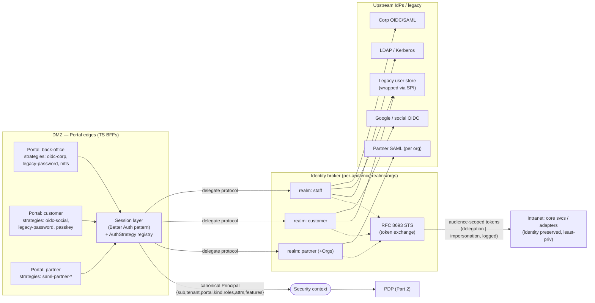
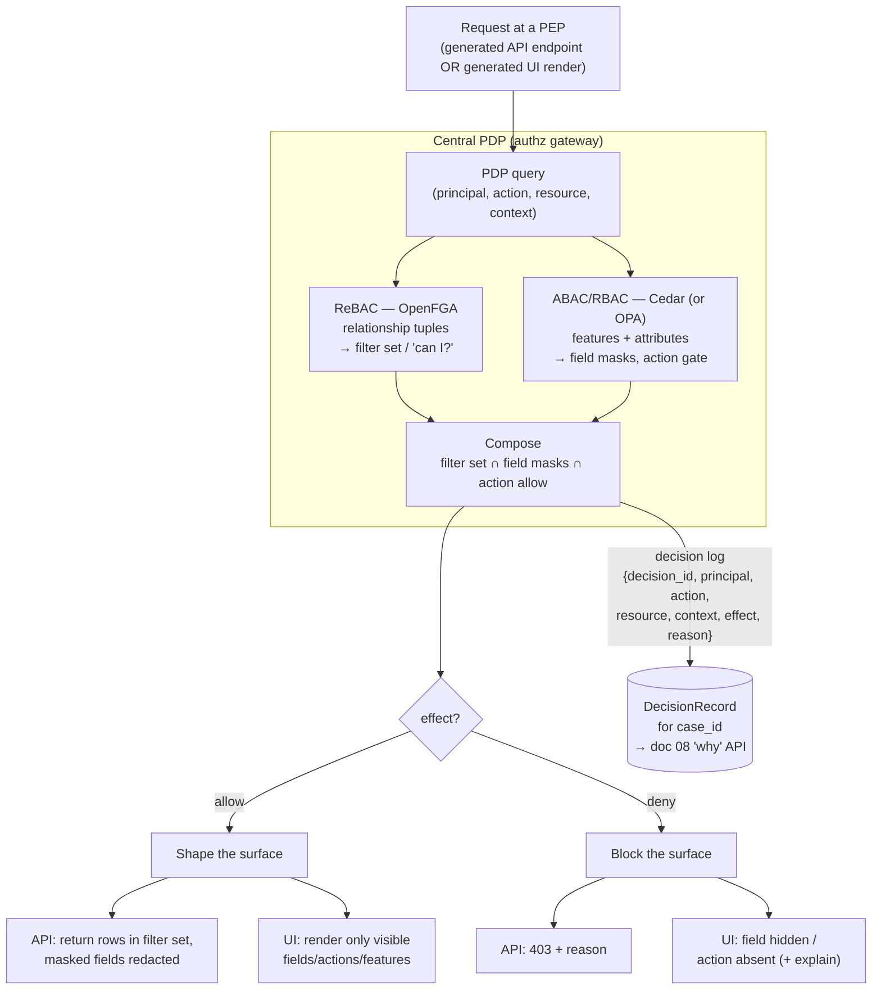

# 06 — Identity & Access

## What this covers

How ichiflow answers the two questions every request forces: **who is this principal** (authentication)
and **what may they do here, now, on this resource** (authorization). It specifies:

- **AuthN** — a *broker-per-audience* identity architecture (Keycloak primary; Zitadel for B2B2C
  multi-IdP-per-tenant), a thin TS-edge session layer, a pluggable strategy SPI, and OAuth2 Token
  Exchange (RFC 8693) for identity propagation to downstream services.
- **AuthZ** — a central Policy Decision Point (PDP) built from a hybrid of OpenFGA (relationship
  backbone) and Cedar/OPA (attribute/feature/field-level policy), an entitlements model ("features and
  attributes"), and the rule that *one* PDP decision shapes both generated APIs and generated UIs.
- **Governance** — policy authoring/testing in the Workspace, authz decision logs that feed the
  DecisionRecord, multi-tenancy, and **non-human identities** (AI agents as first-class principals).

## Position in the system

Identity sits at the **Portal edge** and as a **cross-cutting service** the core calls on every access.
It is deliberately *two separable concerns joined by a security context*: the broker establishes a
canonical **Principal**; the PDP decides on that Principal. The same PDP decision drives the generated
API layer (row filtering, field masks, 403s) and the generated UI (hidden fields/actions), and every
decision is logged into the per-`case_id` **DecisionRecord** (see `08-audit-and-observability.md`).

Grounded in research: `../research/04-adapters-and-auth.md` Part B (brokers, strategy layer, policy
engines, token exchange) and the non-human-identity material in `../research/05-audit-observability-deployment.md` §5.3
and `../research/07-ai-native-operations.md` §5. Locked decisions §7 and §8 of `./BRIEF.md` bind this doc.

> **The invariant:** *AuthN and AuthZ never conflate.* The broker answers "who / via which portal /
> through which IdP." The PDP answers "what may they do." Entitlements live in versioned policy-as-code,
> **never** in IdP roles alone. Every architecture decision below preserves that separation.

---

## Part 1 — Authentication

### 1.1 Broker per audience, not a custom IdP

ichiflow serves multiple **Portals** for distinct populations (back-office staff, customers, partners),
each potentially with its own SSO (OIDC/SAML), its own legacy username/password store, and its own
branding. ichiflow does **not** build an IdP. It fronts each Portal audience with an **identity broker**
that supports realms/organizations and per-connection upstream-IdP config.

| Audience | Realm / Org | Typical strategies | Isolation unit |
|---|---|---|---|
| back-office | `realm: staff` | `oidc-corp`, `legacy-password`, `mtls` | Keycloak realm |
| customer | `realm: customer` | `oidc-social`, `legacy-password`, `passkey` | Keycloak realm |
| partner | `realm: partner` | `saml-partner-*` (one per partner org) | Keycloak realm + Organization |

**Keycloak is the primary broker** (locked, `BRIEF.md` §7): CNCF-incubating, Quarkus-based, speaks OIDC
*and* SAML 2.0, brokers to upstream IdPs, federates LDAP/Kerberos, supports legacy password stores, and
implements the RFC 8693 token-exchange grant. Its **realm = Portal isolation** and **Organizations =
B2B** map directly onto ichiflow's audience model. Isolation is *by construction*, not by convention.

**Zitadel is the documented alternate/co-primary** for deployments where B2B2C tenant isolation and
event-sourced audit are the top priorities, and specifically where a *single tenant needs multiple
upstream IdPs* — native in Zitadel, per-connection in Keycloak (see §1.5, §4.2). The broker is selected
per deployment; nothing above the broker SPI (§1.3) depends on which one is chosen.

Commercial brokers (WorkOS/Stytch/Auth0) are the **"buy" escape hatch** when a deployment cannot
self-host or needs turnkey self-service SSO onboarding. They bind the same `AuthBroker` SPI. Note the
known WorkOS *one-IdP-per-organization* constraint — a reason to keep the tenant→IdP mapping in
ichiflow's own model rather than the broker's (§4.2).

### 1.2 TS-edge session layer (Better Auth pattern)

Each Portal is an audience-scoped **UI + BFF** on the TypeScript edge (`BRIEF.md` §4). The BFF runs a
thin **session layer** following the **Better Auth** pattern (the modern TS foundation; Passport is
maintenance-mode, Lucia deprecated, Auth.js folded under Better Auth — `../research/04` B.1.2). Its job
is narrow and deliberately *not* to be an IdP:

- Terminate the browser session (secure, `httpOnly`, SameSite cookies; short-lived access token +
  rotating refresh; CSRF defense) — the human-facing session, distinct from downstream service tokens.
- **Delegate all protocol heavy-lifting to the broker.** The BFF drives the OIDC/SAML dance against the
  Keycloak realm; it does not implement SAML.
- Hold the **strategy registry** for this Portal (§1.3) and expose the login methods the Portal declares.
- Mint the canonical **Principal** from broker claims and hand it to the PDP and to downstream calls via
  token exchange (§1.6).

On the JVM side, **Spring Security + pac4j** play the identical role for services that terminate auth
directly rather than behind a BFF. Both edges consume the *same* broker and produce the *same* canonical
Principal shape, so authz semantics never differ by language.

### 1.3 Pluggable strategy SPI

A Portal's enabled login methods are **strategies**, and a strategy is a **plugin, not a core change**
(`../research/04` B.1.2). ichiflow defines an **`AuthStrategy` SPI** so that adding an OIDC provider, a
SAML connection, a legacy username/password source, an API key, an mTLS client-cert method, or a passkey
flow is a declarative registration. Crucially, **a legacy auth source can be wrapped**: an existing
corporate password table, a bespoke ticket service, or an in-house SSO can be adapted behind the same
SPI and surfaced to a Portal as just another strategy — the "map first, migrate last" posture of
`BRIEF.md` §13 applied to identity.

The strategy contract (declared, not coded):

```yaml
# strategy.legacy-password.yaml — wraps an existing credential store behind the SPI
Strategy:
  id: legacy-password
  kind: username-password            # oidc | saml | username-password | api-key | mtls | passkey
  wraps:                             # adapter to a pre-existing source (no rewrite, no data move)
    source: jdbc
    ref: secret://legacy/creds-db
    verify: bcrypt                   # credential verification method exposed by the source
  brokerBinding:                     # how the broker consumes this strategy
    keycloak: { userStorageSpi: ichiflow-legacy-jdbc }
  emitsClaims: [sub, email, legacy_employee_id]
  migration: { shadowRead: true, provenance: true }   # decision-parity path if creds ever move
```

A Portal composes strategies; the broker realm executes them; the Better Auth / Spring Security layer is
the in-app plug point for anything *not* delegated to the broker (e.g. an API key checked at the BFF).

```yaml
# portal.customer.yaml — an audience's identity declaration (AI-generatable, schema-validated)
Portal:
  id: customer
  audience: customer
  strategies: [oidc-social, legacy-password, passkey]
  broker:
    kind: keycloak                   # keycloak | zitadel | workos (via AuthBroker SPI)
    realm: customer
    idps: [google-oidc, acme-saml]   # upstream IdPs brokered for this audience
  session: { pattern: better-auth, accessTtl: 10m, refresh: rotating }
  tokenExchange:
    sts: keycloak
    downstreamAudiences: [claims-svc, billing-svc]
```

### 1.4 The canonical Principal (the security context)

The broker's output is normalized into one canonical **Principal** — the security context every
downstream concern shares. It is the *identity* half of the AuthN/AuthZ seam; the PDP consumes it but
never re-authenticates.

```jsonc
// Canonical Principal — emitted by the session layer, carried in the exchanged token's claims
{
  "sub": "u:9f3c…",                 // stable subject id (broker-scoped)
  "portal": "customer",             // which audience/edge authenticated this principal
  "tenant": "acme",                 // resolved tenant (drives multi-tenancy §4)
  "idp": "acme-saml",               // which upstream IdP established the identity
  "kind": "human",                  // human | service | agent  (agents are first-class, §5)
  "roles": ["applicant"],           // coarse RBAC gating only
  "attributes": { "department": "retail", "region": "EU" },   // ABAC inputs
  "features": ["claims.view"],      // entitlement grants resolved at the edge (§3.2)
  "amr": ["pwd", "otp"],            // auth method refs (assurance level)
  "act": null                       // delegation actor, populated on token exchange (§1.6)
}
```

`kind` is load-bearing: it distinguishes humans, service accounts, and **AI agents** — the last being
non-human identities with extra obligations (§5). The PDP receives this object verbatim as its
`principal` input; there is exactly one Principal shape across all Portals, languages, and identity kinds.

### 1.5 Multi-IdP per tenant & B2B2C brokering

A B2B2C partner org brings its own upstream IdP; ichiflow brokers to it and scopes the resulting
identity to that tenant. The requirement that bites is **multiple-IdP-per-tenant**:

- **Zitadel** supports it natively and is the recommended broker when a single tenant routinely federates
  several upstream IdPs (`../research/04` B.4). This is the **Zitadel path for B2B2C**.
- **Keycloak** does it *per connection* within a realm/Organization — workable, with ichiflow holding the
  tenant→IdP routing table so home-realm discovery picks the right connection from the login hint / email
  domain.
- **WorkOS** caps one IdP per org — design *around* it by keeping the tenant↔IdP mapping in ichiflow's
  model, never in the broker, so the broker stays swappable (`../research/04` B.5).

**Self-service SSO onboarding** — the "customer IT configures their own SSO/SCIM" admin surface that
WorkOS/Stytch productize — is *real work to build* when self-hosting (`../research/04` B.5). It is a
**post-v1** Workspace feature: an embeddable admin flow that writes broker connection config as a
versioned, reviewed artifact rather than a console click.

### 1.6 Identity propagation — OAuth2 Token Exchange (RFC 8693)

A user logs in **once** at the Portal edge. When Service A must call Service B on that user's behalf, it
does **not** forward the original token. It exchanges the subject token at the broker's Security Token
Service (STS) for a new token with a **different audience, scope, and lifetime but the same identity**
(the `urn:ietf:params:oauth:grant-type:token-exchange` grant; Keycloak and Zitadel both implement it —
`../research/04` B.4). This is the standard for least-privilege propagation and for clean B2B2C /
cross-trust-domain chaining (M&A, two identity stacks interoperating).

Two modes, and **which one occurred is logged**:

- **Delegation** — the user's identity is preserved and the acting service is recorded in the `act`
  claim (`{ "sub": "user", "act": { "sub": "claims-svc" } }`). "claims-svc acting *for* the user."
- **Impersonation** — the service *becomes* the user; no `act` chain. Higher-risk; permitted only for
  narrowly scoped, explicitly configured flows.

```yaml
# token-exchange.yaml — audience-scoped downstream tokens for a portal login
TokenExchange:
  sts: keycloak                      # broker STS issuing exchanged tokens
  from: { portal: customer }         # the edge subject token
  grants:
    - to: claims-svc
      mode: delegation               # delegation | impersonation  (logged either way)
      audience: claims-svc
      scope: [claim.read, claim.submit]
      ttl: 5m
    - to: billing-svc
      mode: delegation
      audience: billing-svc
      scope: [invoice.read]
      ttl: 5m
  audit: { logExchange: true, recordActChain: true }   # feeds DecisionRecord (doc 08)
```

**Every exchange is logged** with the delegation-vs-impersonation flag and the resulting `act` chain, so
"who did what on whose behalf" is always reconstructable — the mitigation for token-exchange sprawl
(`../research/04` B.5). These exchange records join the case's DecisionRecord (doc 08).

### 1.7 AuthN topology (diagram)



The DMZ/intranet split (Portal edge in DMZ, core in intranet, one-way async relay — `BRIEF.md` §11,
`../research/05` §5) shapes this topology: the broker STS and core sit intranet-side; the Portal edges
sit DMZ-side and never hold sensitive core state.

---

## Part 2 — Authorization

### 2.1 One central PDP; hybrid model

Authorization is externalized into a **central Policy Decision Point (PDP)** — a thin ichiflow "authz
gateway" that both the generated API layer and the generated UI layer call with
`(principal, action, resource, context)` and receive `allow | deny + reason` (`BRIEF.md` §8,
`../research/04` B.2). No single authz model wins, so the PDP is a **hybrid** of two engines behind one
facade:

| Concern | Engine | Why |
|---|---|---|
| **Relationships / ReBAC** — "who is related to this record/tenant", "list every resource I can see" | **OpenFGA** (Zanzibar-style, Apache-2.0, CNCF) | Reverse-index "list objects" queries — exactly what a generated list view/API needs; multi-tenant member-of hierarchies |
| **Attributes / features / field-level — ABAC** | **Cedar** (Apache-2.0, formally analyzable) primary; **OPA/Rego** as the single-engine alternative | Feature/attribute entitlements, row/field masks; deterministic, explainable-by-design decisions with diagnostics |
| **Coarse gating — RBAC** | expressed *within* Cedar/OPA over `principal.roles` | Portal/job-function gating without a third engine |

**OpenFGA supplies the *filter set*** ("which rows/objects"); **Cedar/OPA supplies the *field masks and
feature gates*** ("which columns/actions/features"). The PDP composes them into one answer. OPA/Rego is
an acceptable *single-engine substitute* where a team prefers one policy language and values its
best-in-class decision-log maturity; the engine choice is a `PolicyEngine` SPI binding, not an
architectural fork. Casbin is reserved for isolated in-process enforcement only.

The PDP is the **Policy Decision Point**; the generated API and UI are **Policy Enforcement Points
(PEPs)**. OpenFGA's relationship tuples are a stateful graph that must stay in sync with business data —
a stale tuple is a wrong decision — so tuple writes are **write-through / CDC-driven** from the same
transactions that mutate business state (`../research/04` B.5; Debezium per `BRIEF.md` §10), with a
latency budget on list queries.

### 2.2 The entitlements model — "features and attributes"

ichiflow's entitlement vocabulary is deliberately **"features and attributes"** — the language business
users and Portal config already speak — mapped onto concrete engine constructs so authors never touch
raw tuples or policy AST:

| Entitlement concept | Meaning | Maps to |
|---|---|---|
| **Feature** | A named capability a principal may exercise (`claims.edit`, `payment.refund`) | Cedar/OPA permission over `principal.features` + context; can gate an action or a whole UI region |
| **Attribute** | A fact about subject/resource/action/context (`department`, `region`, `owningDept`, `amount`) | ABAC condition in Cedar/OPA (`principal.attributes`, `resource.*`) |
| **Relationship** | A graph edge (`member`, `owner`, `assignee`, `parent-tenant`) | OpenFGA tuple; source of row-filter sets and "list what I can see" |
| **Role** | Coarse job-function bundle | RBAC shorthand resolved into features; kept minimal to avoid role explosion |

```yaml
# entitlement.claims.yaml — policy-as-code, versioned & governed in the Workspace
Entitlement:
  id: claims
  version: 7                          # governed like a DecisionModel
  model: rebac+abac
  relationships: openfga://ichiflow/model/3     # tenant, org, case, assignment graph
  policies: cedar://ichiflow/features/7          # feature + attribute + field rules
  fieldLevel:
    - resource: Claim
      field: ssn
      visibleWhen: "principal.features contains \"claims.viewPII\""
      maskAs: "***-**-####"           # UI mask + API redaction share this rule
  rowLevel:
    - resource: Claim
      filter: relation("can_view", principal, resource)   # OpenFGA reverse-index
  audit: { decisionLog: true, fields: [principal, action, resource, context, effect, reason] }
```

### 2.3 One decision, two surfaces (API + UI, consistent semantics)

Because ichiflow **auto-generates both APIs and UIs** from schema (`BRIEF.md` §5, §6), authorization must
be enforced centrally and *reflected in generation* — the **same PDP decision shapes both**, with no
drift:

- **Generated API (PEP):** every generated endpoint calls the PDP. ReBAC supplies the **row filter**
  (the list query returns only visible objects — never "load then hide"); ABAC supplies **field masks**
  (redact/omit columns in the response); a denied action returns a **403 with the decision `reason`**.
- **Generated UI (PEP):** the *same* PDP answers "may this principal see/edit field X / invoke action Y /
  see feature Z." Generated screens render **hidden fields and disabled/absent actions** consistently
  with what the API will enforce. The JSON Forms uischema (`BRIEF.md` §6) consults PDP results so a field
  the API will redact is never rendered as editable.

The guarantee is **one decision source, identical semantics**: a field hidden in the UI is redacted by
the API; an action absent from the UI is 403'd by the API. Divergence is impossible because both PEPs ask
the same PDP the same question. This *also* closes the classic bug where the UI hides a field but the API
still returns it.

**Field-level and row-level security fall out of the model:** row-level = the ReBAC filter set;
field-level = the ABAC mask. Both are declared once in the Entitlement (§2.2) and consumed by both PEPs.

### 2.4 Explainable access — decision logs → DecisionRecord

Every PDP evaluation emits a **decision log** — `decision_id, principal, action, resource, context,
effect, reason/rule` — natively supported by Cedar (diagnostics) and OPA (best-in-class decision logs)
(`../research/04` B.2). This is non-negotiable (`BRIEF.md` §8): it is the substrate for compliance audit
*and* for the generated UI's explanation surface ("this field is hidden because policy P denied on
attribute A").

Authz decision logs are a **contributing stream to the per-`case_id` DecisionRecord** (doc 08): an access
decision made while processing a Case is stitched into that Case's causal chain, so an auditor asking
"why was this applicant's SSN hidden from this reviewer" gets a typed, sourced answer from the same "why"
API that explains rule firings and DMN outputs. See `08-audit-and-observability.md` §2.

### 2.5 PDP decision path (diagram)



### 2.6 Policy authoring, testing & governance in the Workspace

Policies are first-class **Workspace** artifacts (`BRIEF.md` vocabulary), governed *exactly like a
DecisionModel* — because an entitlement is itself a decision about access:

- **Versioned** — every Entitlement / OpenFGA model / Cedar policy set is git-tracked and carries a
  version; the PDP resolves a pinned version per deployment, and a decision log records *which* version
  decided (as-of reconstruction, doc 08).
- **Simulated** — "would principal X be allowed action Y on resource Z?" runs offline against a candidate
  policy version before deploy, over seeded relationship graphs and attribute fixtures.
- **Golden tests** — like Decisions, entitlements ship **golden test suites** (fixtures → expected
  allow/deny + reason). CI runs them; a policy change that flips a golden case fails the build. Cedar's
  formal analyzability is used to prove properties (e.g. "no principal outside tenant T can ever read
  T's records"); OpenFGA assertions test relationship queries.
- **AI-authored, deterministically checked** — a Copilot can generate a new Entitlement from a
  feature/attribute description; the validator + golden tests + formal analysis dispose (the
  "AI proposes, deterministic tools + humans dispose" posture, `BRIEF.md` §13, applied to policy).

Rego footguns (non-determinism, runtime errors) and ReBAC tuple staleness are the known risks
(`../research/04` B.5); the mitigations are precisely this test/analysis discipline plus the
write-through tuple sync of §2.1.

---

## Part 3 — Multi-tenancy

Tenancy is resolved at the **broker edge** (the realm/Organization and login hint yield `tenant` on the
Principal, §1.4) and enforced at the **PDP** (OpenFGA tuples root every resource under a tenant; Cedar
conditions gate cross-tenant attributes). The two layers reinforce:

- **Isolation by construction at AuthN** — realm/Org per audience; multiple upstream IdPs per tenant for
  B2B2C (§1.5). A tenant boundary crossed at login is impossible because the realm scopes it.
- **Isolation by policy at AuthZ** — every resource carries a `tenant` relationship; the ReBAC filter set
  is inherently tenant-scoped, so "list what I can see" can never leak another tenant's rows. Cedar formal
  analysis proves the cross-tenant no-read property (§2.6).
- **Correlation** — the global `case_id` (`BRIEF.md` §10) and `tenant` travel together through token
  exchange and into the DecisionRecord, so audit is per-tenant queryable.

Token exchange (§1.6) carries `tenant` into every downstream audience, so least-privilege *and* tenant
scope propagate together — a service B invoked for tenant `acme` receives a token scoped to `acme` only.

---

## Part 4 — Non-human identities: AI agents as first-class principals

AI agents (Claude Code at build time and run time) are **principals**, not a side channel. `kind: agent`
on the canonical Principal (§1.4) is the hinge. This section is the identity/access half of the AI-native
story; the tool surface, guardrail tiers, and self-healing loop live in
`10-ai-native-experience.md` (built on `../research/07`). The two docs share one model: **an agent is a
non-human identity (NHI) governed by the same broker + PDP + audit machinery as a human, plus extra
obligations.** (`../research/05` §5.3; `../research/07` §5.)

An ichiflow agent identity is, by construction:

- **JIT-provisioned** — the agent identity is minted on demand for a scoped task, not a standing account.
  No shared static keys, ever (the mitigation for the 81%-YoY AI-credential-leak trend, `../research/05`
  §5.3).
- **Short-lived** — no credential valid beyond ~1h; duration is **tied to a risk score** (privilege ×
  data-sensitivity × blast radius): longer windows for low-risk reads, deliberately short for
  prod/customer-data writes. Issued via the broker STS / workload-identity OIDC (§1.6), never a static
  secret.
- **Human-owned** — every agent NHI has a named human owner accountable for it. Ownership is a required
  field; an ownerless agent identity cannot be minted.
- **Kill-switch-equipped** — an owner or platform operator can instantly revoke an agent's identity and
  in-flight credentials. Honored at the transport, not just advised.
- **Per-action audited** — every agent action (tool call, mutation, decision query) is logged into the
  *same* append-only audit ledger as human and decision actions (doc 08), attributed to the agent NHI,
  with the approval record and tool inputs/outputs. Agent authz decisions flow through the *same PDP*
  (§2), so an agent is subject to the same features/attributes/relationships as any principal — plus its
  own agent-scoped policies.

The guardrail **tiers** (read-only / sandbox-mutating / prod-mutating-with-JIT+approval) are enforced
server-side by `ichiflow-mcp` and detailed in `10-ai-native-experience.md`; the *identity and
entitlement* substrate for those tiers — the NHI, its JIT scoped credential, its PDP evaluation, its
audit attribution — is defined here. Mapping to external governance (OWASP Agentic Top-10 **ASI03
Identity & Privilege Abuse**, CSA Agentic AI Identity Management, the NIST agent profile expected Q4
2026) is designed to be clean because agents ride the standard identity/access rails rather than a
bespoke path (`../research/07` §5.2–5.3).

---

## Phasing (v1 vs later)

| Capability | v1 | Later |
|---|---|---|
| Broker per audience (Keycloak), realm-per-Portal | ✅ | Zitadel binding for heavy B2B2C multi-IdP |
| TS-edge session (Better Auth), `AuthStrategy` SPI, legacy-wrap | ✅ | Richer strategy catalog (passkey/mTLS breadth) |
| Central PDP: OpenFGA + Cedar; API+UI enforcement; decision logs | ✅ | OPA/Rego as alternate engine binding at parity |
| Token exchange (RFC 8693), delegation/impersonation logging | ✅ | Cross-trust-domain chaining tooling for M&A |
| Policy versioning + golden tests + simulation in Workspace | ✅ | Cedar formal-analysis property proofs in CI |
| Agent NHI: JIT, short-lived, owner, kill switch, per-action audit | ✅ | Risk-scored JIT duration automation; governance-profile mapping |
| Self-service SSO/SCIM onboarding admin | — | ✅ (embeddable admin surface — real build, `../research/04` B.5) |

---

## Open questions

1. **Cedar vs OPA as the default ABAC engine.** Cedar wins on formal analyzability and safety; OPA wins on
   decision-log maturity and one-language infra+app policy. Ship both behind the `PolicyEngine` SPI, but
   which is the *documented default* for the reference distribution? (Leaning Cedar for explainability;
   revisit with a policy-authoring UX study.)
2. **ReBAC tuple sync mechanism.** Write-through from the mutating transaction vs CDC (Debezium) tailing
   the WAL — the former is simpler to reason about, the latter decouples but adds lag. Confirm the default
   and the latency budget for "list what I can see" at target scale.
3. **Impersonation policy.** Under what audited conditions is RFC 8693 *impersonation* (vs delegation)
   ever permitted? Default posture is delegation-only; enumerate the narrow exceptions.
4. **Broker STS in the DMZ/intranet split.** Where does token exchange execute when the Portal edge is in
   the DMZ and the STS is intranet-side, given the one-way async relay (`../research/05` §5.2)? May need a
   DMZ-side token-request relay with intranet-side minting.
5. **Agent JIT risk-score inputs.** Nail the exact function (privilege × data-sensitivity × blast radius)
   that sets an agent credential's TTL, and who can override it. Cross-check with
   `10-ai-native-experience.md` guardrail tiers.
6. **Keycloak CNCF graduation.** Still incubating as of mid-2026 (`../research/04` B.5); re-verify
   graduation status and governance maturity at adoption time. Low practical risk, tracked as an ADR note.
