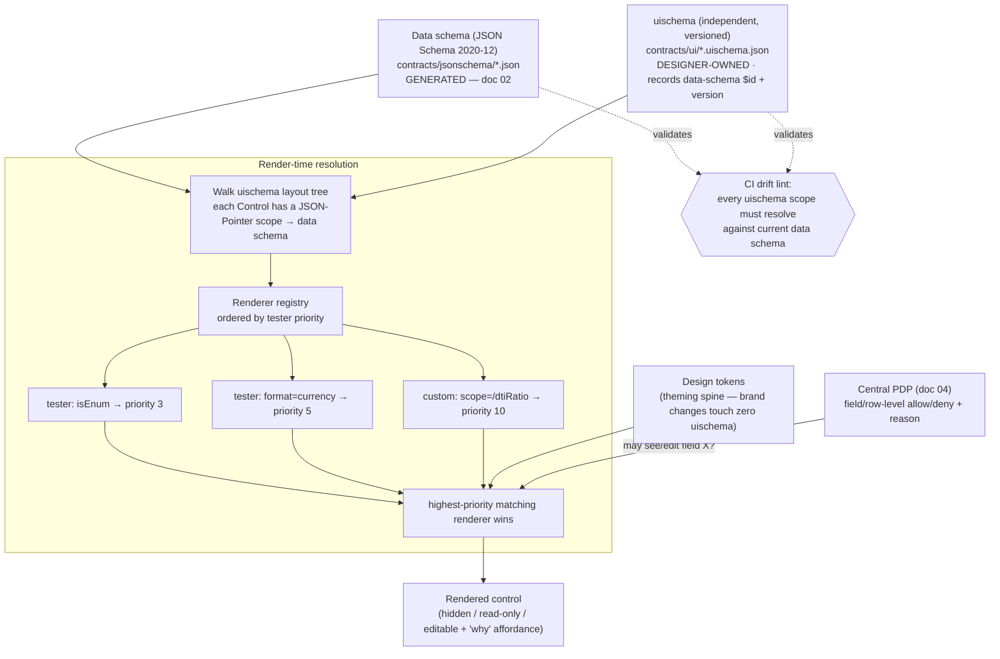

# 07 — UI and Portals

## What this covers

ichiflow's UI layer is **optional but deeply integrated**: the contracts are complete and useful
with no UI at all (API-first), yet a full back-office / customer / partner experience can be
**auto-generated from the same schemas** and safely customized by UX designers. This document
covers —

- the **JSON Forms override model**: an independently versioned UI schema keyed to the data
  schema, a tester/priority **renderer registry**, and **design tokens** — the architecture that
  lets designers customize without forking and survive regeneration;
- **CI lint** that validates every `uischema` scope against the current data schema;
- the **component registry and theming** spine;
- **auto-generated CRUD/case screens** (list, detail, form, task inbox) from schemas + entitlements;
- **Portals** as audience-scoped deployables (back-office, customer, partner), each with its own
  IdP config, entitlements, and BFF;
- how **field/row-level authz** from the central PDP shapes what the generated UI renders, and the
  user-facing **"why is this hidden"** explanation;
- the **designer workflow** step by step (scaffold → override → schema evolves → nothing breaks);
- **manual-review Task UIs**, the **customer status model**, and the **human support/ops console**;
- **app-level i18n** alongside per-audience code rendering;
- the **Design Kit** — the first-party designer toolchain (DTCG token pipeline, component
  workbench, live playground) and the **designer safety contract**;
- first-class **governed designer artifacts** beyond uischema (**pageschema**, **copyset**, and the
  **`doctemplate`** document-rendering artifact, §15) and the **mock-first** (schema-driven MSW)
  design-time workflow;
- **document rendering** — the **`doctemplate`** artifact class, the pluggable **rendering-engine SPI**
  (Typst default), and how issued **`Document`**s (doc 04 §2.9) are authored, previewed, and fetched
  PDP-scoped (§15);
- where **fully custom frontends** plug in (headless APIs, BFF contract) so the UI layer stays
  optional.

## Position in the system

The UI layer is a *consumer* of the schema foundation, never a source. It reads the canonical
JSON Schema and OpenAPI artifacts from [02-schema-foundation.md](02-schema-foundation.md); it
renders what the central PDP ([research 04 Part B](../research/04-adapters-and-auth.md)) permits;
it surfaces Tasks from the Case/manual-review module (BRIEF §"Task", §2); and it exposes the why
API's explanations ([research 05](../research/05-audit-observability-deployment.md)). Locked
decisions: BRIEF §6 (JSON Forms; data schema and UI schema are two independent versioned
documents; overrides via tester/priority registry + design tokens; scaffold never clobbers
designer work; CI lint), §7 (identity broker per portal), §8 (same PDP drives generated API *and*
generated UI). Research basis: [03-schema-and-types.md §5](../research/03-schema-and-types.md),
[04-adapters-and-auth.md](../research/04-adapters-and-auth.md).

---

## 1. The core requirement, and why it dictates the architecture

The requirement (BRIEF §6; [research 03 §5.1](../research/03-schema-and-types.md)): *the data
schema is regenerated often; designer customizations must survive every regeneration.*

That is only achievable when UI customization lives in a **separate, versioned document keyed to
the data schema by reference** — never inline in generated artifacts, never in forked copies of
generated components. This single constraint eliminates most of the schema-driven-UI landscape:

| Approach | Override lives… | Survives regeneration? |
|---|---|---|
| **JSON Forms** (adopted) | in an independent `uischema` document + a renderer registry | **Yes — architecturally guaranteed** |
| react-jsonschema-form | separate `uiSchema`, but path-keyed with **no tester fallback** | Mostly (renames go silently stale) |
| AutoForm (shadcn) | `fieldConfig` **inline with the schema** | **No** (anti-pattern here) |
| refine / react-admin | **scaffold-then-eject**: generated code is owned and edited | **No** (regeneration replaces) |
| Retool / Budibase / ToolJet | platform-managed app JSON, no dataSchema/uiSchema separation | **No** (re-scaffolds) |

ichiflow adopts the **JSON Forms model** (`@jsonforms/core` 3.8.x), hardened with a CI drift lint.

---

## 2. The resolution model: data schema · uischema · renderer registry



The five hardening rules layered on stock JSON Forms
([research 03 §5.3](../research/03-schema-and-types.md)):

1. **Generated-once baseline uischema.** For every schema-defined entity / Flow step, the
   generator emits a *default* uischema (vertical layout, all fields, sensible controls) **once**
   (`--if-absent`) — a starting point, never overwritten.
2. **Designer overrides as versioned uischema documents.** Layouts, groupings, labels, show/hide
   rules, control options — stored in `contracts/ui/`, *beside* (not inside) generated types.
   Each uischema records the `$id` + version of the data schema it targets.
3. **Component/renderer registry with tester priorities.** A renderer is `(uischema, dataSchema)
   → priority`; higher priority wins. Customization = *add a registration*, never fork generated
   code. This registry is also where the design system plugs in.
4. **Design tokens** are the theming spine; brand-level changes touch zero uischema documents.
5. **Drift lint in CI** (below) closes the one hole in the JSON Forms model.

---

## 3. CI lint: uischema scopes validated against the schema

The single residual weakness of the JSON Forms model is that a **renamed or removed field orphans
its `uischema` scope** (a JSON Pointer that no longer resolves). ichiflow closes this with a
mandatory CI gate:

- For every `uischema` in `contracts/ui/`, every Control's `scope` (a JSON Pointer) is resolved
  against the current data schema. An unresolvable scope **fails the build** with a fix-it hint
  naming the offending pointer and the uischema file.
- Because data-schema field renames are expressed in TypeSpec via `@renamedFrom`
  ([02-schema-foundation.md](02-schema-foundation.md) §6.3), that rename metadata can **drive
  auto-migration** of the affected scopes — the lint proposes the pointer rewrite rather than
  merely rejecting.
- The lint runs in the same CI stage as the schema regenerate-and-diff gate, so a contract change
  and its UI impact are reviewed together in one PR.

This is what makes "regenerate contracts freely" safe: **the designer layer is data, not code, and
it cannot be silently clobbered or silently orphaned.**

---

## 4. Component registry and theming

- **Renderer sets** are implemented headless (TanStack Form/Table + RHF internals) with
  token-driven styling, so the same registry serves multiple design systems.
- **Registration, not forking.** An app team or designer registers a higher-priority renderer for
  a scope, a `format`, or a schema shape; the baseline renderers remain untouched. Removing a
  customization = removing a registration.
- **Tables and detail views** follow the identical pattern via a **viewschema** document (column
  sets, ordering, cell renderers by tester) referencing the data schema. JSON Forms does not ship
  this; ichiflow builds it on TanStack Table with the same registry/tester architecture, so forms
  and tables share one override model.
- **Design tokens** (color, spacing, typography, radius, elevation) are the theming spine. A
  Portal selects a token set; brand changes never touch uischema or viewschema documents.

### 4.1 Per-audience code rendering from CodeSet display metadata

Reason codes, condition codes, and status codes are governed reference data
([02-schema-foundation.md](02-schema-foundation.md) §9.1), and every code row carries **per-audience
display metadata** — a technical token, a short professional label, and a plain-language explanation with
i18n (doc 02 §9.2). The UI renders codes through that metadata, with the **Portal audience selecting the
layer**:

- **Professional / back-office audiences** see the raw **technical code + professional label** (a
  domain expert recognises the token instantly).
- **Lay / customer audiences** see the **plain-language explanation + i18n**, never the bare token.

This is **not a new UI primitive**: it reuses the renderer-registry / tester mechanism (§2–§4). A
`format: code` tester resolves a coded value against its referenced `CodeSet@version` and renders the
audience-appropriate layer selected from the Portal's audience config (§8). Because the display text
lives in the governed CodeSet, a code's meaning is authored once and stays consistent across every
Portal, the why API, and printed correspondence.

Where a value is a **`codeRef` into another CodeSet** (interdependent reference data, doc 02 §9.4),
resolution follows the **CodeSet dependency graph** to fetch the referenced CodeSet's display metadata —
so a code that points at, say, a `countries` CodeSet renders that country's audience-appropriate label
without the referencing screen duplicating it.

### 4.2 App-level internationalization (i18n / l10n)

CodeSet display metadata carries per-locale `plainLanguage` for coded values (§4.1, doc 02 §9.2) —
the *code/label* layer. Application-level i18n is the complementary layer and has an explicit
strategy:

- **Locale on the Principal.** The active locale is an attribute of the authenticated Principal (with
  a per-tenant default and a Portal fallback), negotiated at login and overridable per session, so
  every rendered screen, notification, and formatted value resolves against one locale source.
- **ICU message catalogs for UI chrome.** Static UI strings (labels, buttons, empty/error states) are
  **ICU MessageFormat** catalog entries keyed by message id, per locale — handling plurals, gender,
  and interpolation — rather than English strings inlined in renderers.
- **Locale-aware formatting.** Dates, numbers, and **money** format via the platform's locale/ICU
  facilities; currency amounts render from a **typed money value** (minor units + currency code, as in
  the canonical schemas) so formatting is presentation-only and never mutates the stored amount.
- **RTL and script.** The token-driven renderer set is direction-aware, so right-to-left locales are a
  layout concern resolved by the renderer, not per-screen bespoke work.

This keeps localization consistent across Portals, notifications ([05-adapters.md](05-adapters.md)
§4.2), and the why API — all resolving text and formatting from the same locale on the Principal.

---

## 5. Auto-generated CRUD / case screens

From `(data schema + viewschema/uischema + entitlements)` the generator produces the standard
enterprise screen set, each fully overridable via the registry:

| Screen | Generated from | Authz shaping |
|---|---|---|
| **List** | viewschema + data schema | ReBAC supplies the **row filter set** ("which records this user can see"); ABAC supplies **column/field masks**. |
| **Detail** | viewschema + data schema | field-level masks hide/redact fields; the "why" affordance explains omissions. |
| **Form** (create/edit) | uischema + data schema | field-level edit permission drives editable / read-only / hidden. |
| **Task inbox** | Task schema + Case model | assignment/SLA/escalation from the manual-review module (§7); rows filtered by the PDP. |

Because the **same PDP** answers both the API and the UI (BRIEF §8), the generated screen can
never show more than the API would return — one decision source, no drift between layers.

**Reporting is embedded, not generated here.** Aggregate business intelligence (counts, cycle times,
breach rates, decision stats) is *not* a generated ichiflow screen and *not* a custom report engine:
ichiflow **embeds proven OSS BI** (Metabase/Superset-class) over **governed read models**, authenticated
through the same broker and scoped by the **same PDP** as every other surface, so an embedded dashboard
can never show a row or field the API would deny. The back-office Portal hosts the embed; the read
models and the security contract are specified in
[`08-audit-and-observability.md`](08-audit-and-observability.md) Part 7 (locked decision §17; ADR-0021).

---

## 6. Field/row-level authz shapes what renders — and explains itself

The central PDP is a hybrid: **OpenFGA** (ReBAC backbone, list-filtering) + **Cedar** (ABAC /
feature / field-level policies), fronted by a thin authz gateway both the API and UI call
([research 04 §B.2](../research/04-adapters-and-auth.md)).

- **Row level:** ReBAC returns the reverse-indexed filter set — the UI list only requests and
  renders rows the user may see.
- **Field level:** ABAC (Cedar) returns per-field allow/deny + **reason**; the renderer maps this
  to editable / read-only / hidden.
- **"Why is this hidden?"** Every PDP decision produces a **decision log** (`principal, action,
  resource, context, effect, reason`). The generated UI surfaces this as a user-facing affordance:
  *"This field is hidden because policy `P` denied on attribute `A`."* The explanation is not a
  bespoke UI feature — it is the same decision log that feeds compliance audit
  ([research 05](../research/05-audit-observability-deployment.md)), rendered inline. This is why
  the PDP must return **reasons**, not just booleans (Cedar and OPA both do natively).

```mermaid
sequenceDiagram
    participant UI as Generated UI (renderer)
    participant BFF as Portal BFF
    participant PDP as authz gateway (PDP)
    participant FGA as OpenFGA (ReBAC)
    participant CED as Cedar (ABAC/field)
    UI->>BFF: render Detail(case_id) for principal
    BFF->>PDP: decide(principal, view, case, context)
    PDP->>FGA: may principal see this row?
    PDP->>CED: which fields? (+ reason per field)
    CED-->>PDP: {income: allow, ssn: deny "policy P / attr A"}
    PDP-->>BFF: allow row; field masks + reasons (decision log)
    BFF-->>UI: data + field verdicts + reasons
    UI-->>UI: render; ssn hidden with "why?" affordance → reason
```

---

## 7. Manual-review Task UIs

Human tasks / manual review is a first-party ichiflow module (BRIEF §2: await-signal + SLA timers
+ escalation; assignment routing is itself a Decision). The Task UI is generated the same way as
any screen:

- The **task inbox** is a generated list over the Task schema, filtered by the PDP and ordered by
  SLA urgency; assignment is the output of an assignment Decision, so "who sees this task" is
  itself explainable via the why API.
- The **task detail / action form** is generated from the Task's input schema + the Case's
  DecisionRecord: the reviewer sees the case context, the fired-rule trace and DMN results
  ([research 05](../research/05-audit-observability-deployment.md)), and an action form whose
  submit **signals the Flow** (BRIEF §2). Field-level authz applies exactly as in §6.
- Escalation and SLA state render from the Case model; no bespoke task-UI code is required for the
  common path, and unusual review UIs are just higher-priority renderer registrations.

### 7.1 Case-operation and obligation surfaces

The generated **Case detail** screen exposes the permitted **post-submission Case operations**
([04-flow-and-case-layer.md](./04-flow-and-case-layer.md) §5.6) — **amend** (only within amendable
fields, driven by the field-amendability CodeSet), **cancel** (with a reason picker over the
cancellation-reason CodeSet), **withdraw**, and **appeal**. Availability is gated jointly by **Case
state** and the **PDP** (§6), so an operation the lifecycle or policy forbids is not offered, and when a
hard gate blocks an operation the UI surfaces the alternative-remediation path rather than a dead button.

The same screen renders the Case's **condition / obligation checklist**
([04-flow-and-case-layer.md](./04-flow-and-case-layer.md) §5.5), distinguishing **blocking conditions**
from **post-approval obligations**, each with its **state** (pending / fulfilled / waived / breached) and
**deadline**. The two audiences see it differently, via the per-audience code metadata (§4.1):

- **Customer audience** — a plain-language *"what you must still do"* view (outstanding obligations,
  deadlines, and what each condition means).
- **Back-office audience** — the technical codes plus **fulfilment actions** (mark returned, record
  duty paid, record inspection passed, waive), which emit the fulfilment signal/event that satisfies a
  `condition-gate` (§2.3 in doc 04).

### 7.2 Customer status model and the human support/ops console

Two error-UX gaps for a *stuck* Case (adapter down, engine error) close onto existing primitives:

- **Customer-safe status model.** The customer Portal renders an explicit Case-status projection that
  includes **delayed / needs-attention / error** states with next-step messaging — not only
  "submitted / decided." These are **display projections** (§8; the DMZ back-channel carries display
  projections only, [09-deployment-and-topology.md](09-deployment-and-topology.md) §6.1), so a
  customer sees a truthful "we're on it / we need X from you" state at 2am rather than an opaque
  spinner. Which states and wording are customer-facing is governed by the same per-audience code
  metadata (§4.1) and disclosure policy (Open questions §5).
- **A human support/ops console.** The MCP Tier-2 actuators (signal / retry / cancel / re-drive /
  reassign — [10-ai-native-experience.md](10-ai-native-experience.md) §3.2) are exposed to *agents*;
  the same operations need a **human twin**: a back-office support console that is the human PEP over
  the *same* machinery, gated by the PDP (§6) and audited into the DecisionRecord, so a support
  operator has the same re-drive/retry/reassign actuators an agent does. The console is a generated
  back-office surface over the Case-status + Tier-2 primitives, not a bespoke tool — otherwise the
  agent out-tools the human.

  **v1 phasing (ADR-0024).** In v1 this human ops console is **not built as a UI**; the operator's v1
  surface is **Claude Code + `ichiflow-mcp`** — the *same* Tier-2 actuators (signal / retry / cancel /
  re-drive / reassign / patch, [10-ai-native-experience.md](10-ai-native-experience.md) §3.2) with the
  why API as the read path, gated by JIT NHI + approval + audit. The console is a **post-v1 builder
  surface** (doc 12 class D3), and the seam that keeps it a later, additive build is precisely that it
  is the *human PEP over the same Tier-2 API* — a UI is just another client of the actuators the agent
  already uses. The honest v1 cost (a non-agent operator works through chat) and its revisit trigger
  are recorded in [12-system-map-and-v1-surfaces.md](12-system-map-and-v1-surfaces.md) §3.

---

## 8. Portals — audience-scoped deployables

A **Portal** is an audience-scoped UI + BFF with its own IdP config and entitlements (BRIEF
§"Portal"). ichiflow ships three archetypes; more are declared, not coded.

| Portal | Audience | IdP (broker realm/org) | Zone |
|---|---|---|---|
| **back-office** | staff | corporate OIDC + legacy password | intranet |
| **customer** | end customers | social OIDC / customer realm | DMZ |
| **partner** | B2B partners | partner SAML / brought-own IdP | DMZ |

Each Portal is a **declared artifact** (the same "declare, don't code" principle as Adapters and
entitlements, [research 04](../research/04-adapters-and-auth.md)):

```yaml
Portal:
  id: customer
  audience: customer
  zone: dmz                          # DMZ deploy; core stays intranet (BRIEF §11)
  strategies: [oidc-social, legacy-password]
  broker: { realm: customer, idps: [google-oidc, acme-saml] }   # Keycloak realm-per-portal
  tokenExchange: { sts: keycloak, downstreamAudiences: [loan-svc, billing-svc] }  # RFC 8693
  entitlements: { model: rebac+abac, relationships: openfga://ichiflow/1, policies: cedar://ichiflow/1 }
  tokens: brand-customer             # design-token set (look)
  copyset: voice-customer            # per-audience microcopy / voice (governed artifact — see §13)
  screens: [loan-application-form, my-cases-list, case-detail]
```

- **Per-audience IdP.** Each Portal maps to a **Keycloak realm** (or Zitadel org for B2B2C),
  isolating populations by construction — its own IdP set, branding, and strategy list (BRIEF §7).
- **BFF per Portal.** Each Portal has its own **backend-for-frontend** on the TS edge (Better Auth
  pattern), which calls core services with **audience-scoped tokens via OAuth2 Token Exchange
  (RFC 8693)** — one login at the edge, least-privilege identity propagation downstream.
- **Zone-aware.** Customer/partner Portals deploy to the **DMZ**; the core stays intranet; a
  one-way async relay bridges zones (BRIEF §11). The Portal declaration carries its `zone`.
- **Own entitlements.** Each Portal binds its own OpenFGA relationships + Cedar policies, so the
  same schema-generated screen renders differently per audience because the PDP answers differently.
- **Brand = look + voice + composition.** A Portal binds its **design-token set** (look), a
  **`copyset`** (per-audience voice/microcopy), and optionally a **`pageschema`** set (screen
  composition) — all first-class governed artifacts (§13) — so the audience-selecting-the-layer pattern
  (§4.1) extends from CodeSet display to the whole designer surface, not just theming.

---

## 9. The designer workflow, step by step

This is the property the whole architecture exists to guarantee — a designer customizes, the
schema evolves underneath, and nothing breaks:

1. **Scaffold.** A schema is authored/changed ([02](02-schema-foundation.md)); the generator emits
   a baseline `uischema` (and `viewschema`) **once** into `contracts/ui/`. The screen already
   works with default controls.
2. **Override.** The designer edits the versioned `uischema`/`viewschema` (regroup, relabel, add
   show/hide rules) and/or registers higher-priority renderers, styled by design tokens. No
   generated code is touched or forked.
3. **Schema evolves.** A developer/agent adds a field (`@added`) or renames one (`@renamedFrom`)
   and regenerates. Generated types and the *baseline* uischema regenerate; the **designer's
   overrides are untouched** because they are separate documents.
4. **Nothing breaks — and drift is caught.** The CI scope lint (§3) validates every uischema
   pointer against the new schema. New fields simply aren't shown until the designer chooses to
   add them; renamed fields are auto-migrated from `@renamedFrom` (or flagged with a fix-it). A
   removed field whose scope is still referenced fails the build loudly rather than silently
   rendering blank.

**Result:** contracts regenerate freely; the designer layer is *data keyed to the schema*, so it
can neither be clobbered by regeneration nor silently orphaned by evolution.

---

## 10. Where fully custom frontends plug in (the UI stays optional)

The generated UI is a convenience layer over a complete API-first system, not a dependency
(BRIEF: "UI optional but deeply integrated"; requirement R2). Custom frontends plug in at
well-defined seams:

- **Headless APIs.** The OpenAPI 3.1 contracts and generated TS/Kotlin clients
  ([02](02-schema-foundation.md)) are the whole surface — any SPA, native app, or third-party
  system builds directly on them, entitlements enforced server-side by the same PDP.
- **BFF contract.** A custom frontend can either talk to core services directly or stand up its
  own BFF against the same contract the generated Portal BFF uses (auth via Better Auth /
  token-exchange, §8). The BFF boundary is itself schema'd.
- **Renderer registry as a partial escape hatch.** A team can keep the generated shell but replace
  arbitrary regions with custom React by registering high-priority renderers — a gradient from
  fully-generated to fully-custom without an all-or-nothing fork.
- **Reused primitives.** Even a fully custom frontend can consume the field/row authz verdicts +
  "why" reasons (§6) and the Task/why APIs, so it inherits explainability without reimplementing it.

---

## 11. The designer's toolchain — the Design Kit

The override *model* (§1–§4) makes a customization survive regeneration; the **Design Kit** is the
first-party surface a designer actually operates, so the persona is defined by the human's tools, not
only by the override mechanism. It is the design-side parallel to the AI-native agent kit (doc 10),
and its core properties ride rails that already exist — one schema source, deterministic generation,
the regenerate-and-diff CI gate, a reason-returning PDP.

> **v1 phasing (ADR-0024) — the Design Kit is *artifacts + previews* in v1, not built apps.** The
> Design Kit's **contracts and pipelines are all v1**: the DTCG token pipeline (§11.1), the
> uischema/viewschema/pageschema/copyset artifact classes (§13), the drift/a11y/contrast CI checks
> (§12), and the schema-driven mock substrate (§14). What v1 does **not** build as an interactive app
> is the **component workbench** (§11.2) and the **live playground** (§11.3): the designer's v1 surface
> is **chat + a read-only `ichiflow preview` URL** that *renders* the real stories and screens from the
> canonical artifacts. The interactive workbench/playground apps are a **post-v1 builder surface**
> (doc 12 class D1); the seam that keeps them additive is that they are just another renderer of the
> `contracts/ui`/`tokens` artifacts + the mock/preview build. Read §11.2–§11.3 below as describing the
> *rendered-preview* content in v1 and the *interactive app* post-v1. See
> [12-system-map-and-v1-surfaces.md](12-system-map-and-v1-surfaces.md) §2.B (B5–B7) and §3.

### 11.1 Design-token pipeline (DTCG → theme)

Design tokens (§4) are the theming spine; the Design Kit makes their **source** a standard,
checked-in format rather than a hand-written file:

- **DTCG is the checked-in token format.** Tokens live as `contracts/ui/tokens/*.tokens.json` in the
  W3C **Design Tokens (DTCG)** shape (`$value`/`$type`), beside uischema. A Portal's `tokens:
  brand-customer` (§8) resolves to a DTCG file set. The format is tool-neutral — Figma Variables,
  Tokens Studio, Penpot, or a hand-authored file can all produce it — so the **token format, not any
  one design tool, is the contract**.
- **A deterministic Style-Dictionary-class transform** compiles DTCG → the renderer set's runtime
  theme (CSS custom properties / TS theme object) as a build step. Because it is deterministic it
  slots straight into the existing regenerate-and-diff CI gate (§3): a token change is a reviewable
  diff exactly like a schema change.
- **Three-layer token structure** (primitive → semantic → component), separate files with alias
  chains intact, so one primitive rebrand propagates everywhere.

A brand change that touches zero uischema is already the architecture's promise (§4); the token
pipeline just makes the token *source* a standard design artifact.

**Figma's role is deliberately bounded — prompt-first, Figma optional (ADR-0019 amendment).** The
**chat + live-preview playground (§11.3) is *the* designer surface**, where low-fi exploration happens
against real schemas and mock data. Figma is an **optional adjunct at two well-defined seams, not a
design authority**: (a) **in** — importing brand **tokens/variables** through this DTCG pipeline
(Figma Variables is one of several producers); and (b) **out** — exporting **rendered screens / specs**
from the playground for stakeholder review and sign-off. There is **no two-way hi-fi round-trip and no
Code-Connect-class bridge** that would make a Figma frame a second editable representation of a
uischema — that is exactly the round-trip-sync drift the authoring doctrine rejects (ADR-0019). The
canonical artifact stays the uischema/pageschema, authored via chat and judged in the playground.

### 11.2 Component workbench (all states, incl. PDP states)

The Design Kit ships the reference **renderer set as a component workbench** (Storybook-class): one
story per renderer × every state — empty, loading, populated, read-only, error, validation-failed,
and the ichiflow-unique **PDP-shaped states**. Stories are driven by the **real generated renderers +
sample data** (§14), so the workbench shows the actual component a Portal ships, not a hand-built
mock. Accessibility checks (axe-core / WCAG 2.2 AA) run *in* the workbench so violations surface at
component-design time.

**PDP-shaped states are first-class designable states.** The PDP can render a field **hidden by
policy**, **read-only by policy**, or present with a **"why" affordance** (§6). These are not runtime
surprises — they are **states a designer must be able to see and design**, so every renderer carries
mandated workbench stories for `PDP-hidden` (with the "why" affordance) and `PDP-read-only` alongside
its ordinary states.

### 11.3 Live playground (chat to author, preview to judge)

The Design Kit ships a **live playground** (in the dev server) that loads a chosen Schema + its
baseline uischema + a **mocked BFF** (§14) seeded with sample Case data and renders the **real
screen**, with a **token/theme switch** and an **audience toggle** (customer / back-office / partner)
so per-audience code rendering (§4.1) and PDP-shaped visibility are visible live.

The interaction model is the framework-wide doctrine (ADR-0019; doc 00 "Chat to author, preview to
judge"): the designer **describes intent in chat**, the AI (UI/Design Copilot, §13 / doc 10 §7 —
post-v1) **authors the uischema / pageschema / tokens**, and the **rendered screen is the read-only
live preview the designer judges**, approving the **diff + preview** pair. There is **no drag-and-drop
visual inspector**: an editable visual canvas would be a *second representation* of an artifact whose
canonical form is the JSON, and is an explicit **non-goal** (doc 00 non-goals; ADR-0019).

The design principle this settles: **the uischema JSON is a compile target — neither a hand-edited
surface for designers nor a visual canvas.** Just as TypeSpec is the authoring surface and JSON Schema
is the canonical artifact (doc 02 §1), here **AI chat is the designer's authoring surface and
uischema/viewschema is the canonical artifact**, rendered as a live screen the designer judges. Direct
uischema editing remains available to developers (it is text under version control).

---

## 12. The designer safety contract

The framework already checks plenty (drift lint §3, regenerate-and-diff, oasdiff) — but it checks
*for the build*, and tells the designer only via a red CI run *after* they commit. The Design Kit
reframes the same checks as a **designer-facing, pre-commit safety contract**, surfaced in the
playground before a PR is opened. **The designer's safety net is the same CI that guards the contract
— but rendered as a screen, a contrast report, and an a11y verdict, not a build log.**

| Check | Status | Designer-facing form |
|---|---|---|
| uischema scope resolves against schema (drift lint, §3) | exists | runs live in the playground; a dangling scope shows inline, not as a build failure |
| `@renamedFrom` scope auto-migration (§3) | exists | shown as a review card: "field X renamed → Y, we updated your layout" |
| Token contract (WCAG 2.2 contrast, semantic-role coverage) | **new** | ≥ 4.5:1 text / 3:1 UI contrast, every semantic role bound, no raw hex outside primitives — the token-side analogue of the scope lint |
| a11y — WCAG 2.2 AA (axe-core) | **new** | axe on every workbench story and playground screen; AA violations block |
| i18n coverage | **new** | a customer-facing screen has no missing plain-language / locale strings (§4.2) |
| PDP-state coverage | partial | every placed field renders acceptably in hidden / read-only / error states (workbench, §11.2) |

**Reuse the Workspace PR flow — do not invent a parallel governance path.** Designer output is
`contracts/ui/**` + `tokens/**` — Workspace edits that go through the same git PR / CI / review flow
(doc 10 §2). What the Design Kit adds is the friendly surface on top:

- **Preview-environment-per-change.** Every uischema/token PR spins up an ephemeral preview (the
  playground pinned to that branch, MSW-mocked, no backend needed — §14). The PR carries a live link +
  before/after visual diff + the a11y/contrast/drift report — a *screen*, not a JSON diff, is the
  review artifact.
- **A low-risk `contracts/ui` + `tokens` change class.** A pure UI/token change (no schema, no policy,
  no renderer-code touch) is a distinct low-risk change class the framework can *prove* cannot break
  the contract (scopes lint, tokens satisfy roles, no code path touched). *Whether* a design lead may
  approve that class without engineering sign-off is an org/governance decision flagged for the
  founder (Open questions §7), not asserted here.

---

## 13. Beyond uischema — the designer's governed artifact classes

uischema is a **form-layout** language; a lot of what a designer owns is not a form. The fallback of
"register a higher-priority renderer" — a developer writes code — is exactly the dependency the persona
should escape. The artifact classes below reuse the existing register / reference / version DNA and are
**adopted as first-class governed artifact classes** (BRIEF vocabulary; design review 2026-07), each
versioned and CI-gated like any other contract (schema, CI gates, registry entry, generator, agent
skill):

- **`pageschema` (screen composition).** A case-detail or dashboard screen is *N* regions (summary
  header, timeline, obligation checklist, task actions, related cases) — a composition, not a single
  uischema. A **`pageschema`** (same tester/registry DNA) composes multiple uischema/viewschema regions
  + static blocks into a screen keyed to a Schema/Case. It is the natural sibling to `viewschema`; the
  two should be **pinned together** as one vocabulary work item (Open questions §1).
- **`copyset` (translator-friendly microcopy).** Labels, help text, **error messages**, empty-state
  copy, and button text are currently scattered inline in uischema. A **`copyset`** is an i18n-keyed
  message catalog (one key per string, per locale) that uischema/pageschema reference *by key* —
  exactly the CodeSet pattern (doc 02 §9). It yields a translator-friendly surface, governed
  validation-error copy, and consistency with CodeSet `plainLanguage`; **`copyset` is a distinct
  governed artifact class that shares the CodeSet `plainLanguage` i18n substrate and tooling** (§4.2),
  rather than a separate parallel i18n stack.
- **`doctemplate` (document rendering).** A screen is not the only thing a designer owns: an approval
  **issues a Document** — a permit, certificate, licence, grant Letter of Offer (doc 04 §2.9) — whose layout
  is a designer artifact too. A **`doctemplate`** (same versioned/CI-gated/register DNA) binds schema'd
  fields → a print/PDF layout, is authored via AI chat and judged in a read-only preview like every other
  designer artifact, and renders through a pluggable engine. It is the print/PDF sibling of the screen
  artifacts above; its full treatment — the rendering-engine SPI, i18n, accessibility, and PDP-scoped
  fetch — is **§15**.
- **Presentation mode.** Single-page / wizard / stepper / accordion is a top designer control and must
  not require code. Make **presentation mode a declared uischema-level option** the playground can flip.
- **Declared empty / loading / error / partial states.** Make these **declared** per screen/region
  (empty-state copy + illustration token + CTA; skeleton vs spinner; error affordance) so they are
  designed, versioned, and previewable — closing the loop with the workbench stories (§11.2) that
  already need them.

---

## 14. Mock-first: designing before (and alongside) the backend

ichiflow's schema-first spine makes the org reality — designers iterate *before the backend exists*
and hand off cleanly — nearly free, and the Design Kit leans on it explicitly:

- **Schema-driven mocks, no running backend.** The OpenAPI / JSON Schema artifacts (doc 02) are
  exactly what the mock toolchain consumes: **orval** (already the named TS codegen fallback, doc 02
  §4.2) generates a typed client **plus Faker mock factories plus MSW handlers** from one OpenAPI spec.
  The mock capability is one config flag away, not a new dependency. **A designer renders a real,
  correct, fully-populated screen the moment the schema exists — before a line of backend runs.**
- **Ahead-of-dev.** The schema *is* the contract, so a designer working the playground (§11.3) against
  MSW-mocked schema data is working against the real contract. When the backend lands, nothing in the
  uischema/tokens changes — the regeneration-survival guarantee, extended to "backend not built yet."
- **Clean handoff.** Because the designer's output is `contracts/ui/**` + `tokens/**` (data, not code)
  through the same PR/CI/preview flow (§12), handoff is just a merged PR with a green preview — no
  redlines-to-tickets translation, no "the dev built it slightly wrong."
- **Sample-Case fixture generator.** Mock *Case* data is richer than mock request/response data — a
  back-office screen needs a plausible DecisionRecord, obligation checklist, task state, and per-field
  PDP verdicts. The Design Kit includes a **sample-Case fixture generator** that seeds realistic Cases
  from the Schema + CodeSets + a Flow (incl. per-field PDP verdicts), reusing the seeded-data /
  `reproduce_case` machinery in [10-ai-native-experience.md](10-ai-native-experience.md) §3.2, so the
  playground shows believable screens rather than lorem-ipsum.

---

## 15. Document rendering — `doctemplate` and the rendering-engine SPI

A screen is not the only thing generated from the schema. An approval **issues a Document** — a Customs
Clearance Permit, an operating licence, a grant **Letter of Offer**, a decision certificate, a ballot-result
notice (doc 04 §2.9). The **layout of that instrument is a designer artifact** exactly as a screen is, and
ichiflow gives it a first-class governed class — **`doctemplate`** — that rides the same
register/reference/version DNA as `uischema`/`pageschema`/`copyset` (§13). The runtime issuance semantics
(number allocation, lifecycle, verification, storage) live in doc 04 §2.9 and
[08-audit-and-observability.md](08-audit-and-observability.md) §1.6; **this section owns the *authoring and
rendering* half** — the template artifact, the pluggable engine, i18n, accessibility, and PDP-scoped fetch.

### 15.1 `doctemplate` — a governed designer artifact class

A **`doctemplate`** is a **versioned template** binding **schema'd fields → a print/PDF layout**, checked
into the Workspace (`contracts/ui/doctemplates/*.doctemplate.*`), registered in Apicurio, and gated by the
same regenerate-and-diff / oasdiff CI machinery as any other contract (doc 02 §4.3, §6.2). Its shape mirrors
the other designer artifacts:

```yaml
kind: doctemplate
metadata:
  id: customs-clearance-permit
  version: 2.1.0                          # semver; breaking layout/binding changes gated like any contract
  governanceState: released
  owner: { team: trade-policy-team, stewards: [ "u:steward-ap" ] }   # owned + PDP-guarded (doc 06 Part 4)
binds:                                    # schema'd fields → template slots (the render's data snapshot)
  holder:      "${case.applicant.fullName}"
  outcome:     "${case.outcome}"          # conditions render per-audience via CodeSet display (§4.1, doc 02 §9.2)
  permitNo:    "${issue.referenceNumber}" # the allocated number (doc 04 §2.9.1)
  qr:          "${issue.verificationUrl}" # public verification endpoint (doc 04 §2.9.4)
copyset: trade-correspondence@3.0.0       # translator-friendly microcopy + i18n (§13)
engine: typst                             # rendering-SPI binding (§15.3); default is typst
accessibility: { pdfua: true, pdfa: "PDF/A-2b" }   # §15.4
```

- **Designer-ownable via the Design Kit.** A `doctemplate` is authored the framework way (ADR-0019; doc 00
  "Chat to author, preview to judge"): the designer **describes the letter/permit in chat**, the AI (UI/
  Design Copilot, post-v1) authors the `doctemplate`, and the **rendered document is the read-only preview**
  the designer judges — no WYSIWYG document canvas, the same non-goal as the uischema visual builder (§11.3).
  The preview renders against **sample-Case fixtures** (§14) so a designer sees a believable permit before
  any Case exists.
- **Composition reuse.** Coded content (`Outcome` reasons/conditions) renders through the **same per-audience
  CodeSet display metadata** as screens (§4.1) — a permit and the Portal that shows its status say the same
  thing in the same words — and microcopy comes from a **`copyset`** by key (§13), not inline strings, so the
  document is translator-friendly on the shared i18n substrate (§4.2, doc 02 §9.2).

### 15.2 Authoring vs runtime — one snapshot, a derived binary

The load-bearing contract (doc 04 §2.9.3): the **canonical truth is the data snapshot + the pinned
`doctemplate` version**, from which the binary **deterministically re-renders**. The designer owns the
*template* (data → layout); the runtime `issue-document` step owns the *snapshot + allocation + lifecycle*.
Because the binary is derived, a `doctemplate` change **never mutates already-issued Documents** — they stay
pinned to the version they were issued under and re-render byte-stable — while new issuances pick up the new
template version, exactly the version-pinning discipline the rest of the framework uses (doc 02 §6.3).

### 15.3 The rendering-engine SPI (pluggable; Typst default)

Rendering is a **declared SPI** (BRIEF §21, "closed core, declared extension points"): the `doctemplate`
declares `engine:`, and the engine is swappable without touching the step, the artifact class, or any Flow.
The v1 default and the alternatives, chosen under the licensing-hygiene lens (BRIEF §14/§15 — prefer
Apache-2.0/MIT, avoid source-available/paid substrates):

| Engine | License | Role | Why |
|---|---|---|---|
| **Typst** (default) | **Apache-2.0** | v1 default binding | Deterministic compiler with a **fixed-creation-timestamp reproducible-output** mode and embedded fonts → *same snapshot + template version → normalized-identical bytes* (the §15.5 harness property) essentially for free; **native PDF/UA-1 + PDF/A** (all four parts) as of Typst 0.14 (2025); small, self-contained Rust binary (air-gap-friendly, doc 09). Cleanest licensing + strongest determinism/a11y story. |
| **WeasyPrint** | **BSD-3-Clause** | alternative binding (v1-capable) | For teams whose designers author documents in **HTML/CSS**; mature, deterministic enough, PDF/UA + PDF/A support (v57+/69.0, 2026). The HTML-native option behind the same SPI. |
| **Playwright / Chromium print-to-PDF** | Apache-2.0 (drives Chromium) | available, **non-default** | Only where a document genuinely needs a full browser engine. Explicitly not default: a **bundled headless Chromium** is heavy (footprint, air-gap cost), its output is **harder to make byte-deterministic** (timestamps/font hinting), and its **PDF/UA** story is weakest — three strikes against the determinism + licensing-hygiene + accessibility bar. |

**Recommended default: Typst**, because it satisfies three ichiflow requirements at once that the others
satisfy only partially — **determinism** (reproducible fixed-timestamp output is the render-determinism
harness, §15.5, not a bolt-on), **licensing hygiene** (Apache-2.0, no source-available caveat), and
**accessibility** (native PDF/UA-1). WeasyPrint is the sanctioned HTML/CSS-native alternative; Chromium is a
last-resort binding, never the default. Adding a fourth engine is a new SPI binding + its harness vectors,
not a framework change (§15.6).

### 15.4 Accessibility (PDF/UA) and i18n

- **PDF/UA.** Issued Documents are correspondence to the public, so **PDF/UA** (tagged, accessible PDF) is a
  first-class target, declared per `doctemplate` (`accessibility.pdfua`) and **verified in the harness**
  (§15.5) — the document analogue of the screen-side WCAG 2.2 AA gate (§12). The default engine (Typst)
  emits PDF/UA-1 natively; a binding that cannot meet the declared level fails the check rather than shipping
  an inaccessible instrument.
- **i18n.** Locale resolves from the recipient Principal / Case (§4.2); coded content renders per-audience
  from CodeSet display metadata (§4.1) and microcopy from the `doctemplate`'s `copyset` (§13) — so a permit
  issued to a customer renders in their locale with plain-language condition text, while the same instrument
  to a back-office audience can render professional labels, from **one** governed source.

### 15.5 Design-Kit safety contract for documents (harness-backed)

`doctemplate` extends the designer safety contract (§12) with document-specific checks, all surfaced as
Design-Kit preview verdicts and enforced in CI ([13-agent-harness-loops.md](13-agent-harness-loops.md)
§2.k):

- **Binding-scope lint** — every `${…}` binding resolves against the current data schema + `Outcome` shape
  (the doc analogue of the uischema scope lint, §3); a dangling binding fails the build.
- **Render determinism** — *same snapshot + template version → normalized-identical output* across two runs
  (fonts embedded, timestamp fixed); non-determinism is a harness defect, not a retry (doc 13 §3.6).
- **PDF/UA + contrast** — tagged-PDF/accessibility and token-contrast checks on the rendered artifact.
- **Preview-per-change** — a `doctemplate` PR renders a before/after document preview against sample-Case
  fixtures, the review artifact being the rendered permit, not a template diff (§12, §14).

### 15.6 Fetching Documents — API-first and PDP-scoped

Issued Documents are **API-first**: a Case exposes its Documents through the generated API (list/fetch by
`case_id`), the binary streams from the object-storage SPI (doc 02 §11), and both are guarded by the **same
central PDP** as every other surface (§6, BRIEF §8). The consequence that matters for multi-party casework:

- **PDP-scoped fetch.** An external org (a partner Portal, a workshop, an applicant) sees **only its own
  Documents** — the ReBAC row filter (§6) returns exactly the Documents the Principal may see, so a partner
  never enumerates another party's instruments. This is the same row-filter mechanism as the case list, not
  a bespoke document ACL.
- **Portal delivery** is a Document fetch behind that filter; **notification delivery** (doc 05 §4.2) sends a
  link resolved through the same PDP, never the binary in the clear to the wrong audience.
- **Public verification** (doc 04 §2.9.4) is the deliberate exception: a **data-minimal, unauthenticated**
  status endpoint (authenticity + `issued|superseded|revoked|accepted`) that exposes **no Case data**, so a
  presenter checks a permit is genuine without any entitlement to the Case behind it.
- **`ichiflow-mcp`** exposes `get_case_documents` (Tier-0, read-only) and `reissue_document` /
  `revoke_document` (Tier-2, JIT + approval + audit) over the same API
  ([10-ai-native-experience.md](10-ai-native-experience.md) §3.2).

**v1 phasing (ADR-0024, ADR-0029).** The `doctemplate` **artifact class, the rendering-engine SPI (Typst
default), the deterministic render, and the CI/a11y/determinism checks are all v1** — issuing governed
Documents is core casework. What is **post-v1** is the *interactive* Design-Kit document authoring app; the
v1 designer surface for a `doctemplate` is **chat + a read-only rendered preview** (§11), the same posture as
every other designer artifact.

---

## Open questions

1. **viewschema + pageschema vocabulary.** `pageschema` and `copyset` are **committed** as governed
   artifact classes (§13; design review 2026-07); the residual work is pinning their *exact*
   vocabularies — viewschema column sets / cell-renderer testers and pageschema region composition —
   **together**, sharing tester semantics with uischema. A vocabulary work item, not an adoption
   question.
2. **uischema auto-migration coverage.** How much of a `@renamedFrom`-driven scope migration can
   be applied automatically vs. must be flagged for the designer (§3) is unvalidated — reshapes
   (a field splitting into two) have no clean automatic answer.
3. **Cross-framework renderer sets.** JSON Forms supports React/Angular/Vue; ichiflow's reference
   set is React. Whether the token-driven headless approach cleanly serves a second framework, or
   whether Portals are React-only in v1, is undecided.
4. **PDP latency on list views.** ReBAC "list what I can see" queries (OpenFGA) plus per-field
   Cedar checks on large lists have a latency budget; how field-verdict results are cached at the
   BFF without staling on relationship changes (OpenFGA tuple churn) needs design — see
   [research 04 §B.5](../research/04-adapters-and-auth.md).
5. **"Why hidden" disclosure limits.** Surfacing the denial *reason* to end users can itself leak
   policy structure. Which reasons are user-facing vs. audit-only (and per-audience) is a policy
   question the PDP + Portal config must jointly answer.
6. **Designer authoring surface — resolved (ADR-0019, amended).** Designers do **not** hand-edit
   uischema JSON, and there is **no visual inspector / drag-and-drop canvas** — an editable canvas is a
   non-goal. The authoring surface is **AI chat** and the **playground is *the* designer surface**
   (prompt-first, low-fi exploration against real schemas/mock data); uischema/viewschema is the compile
   target; the playground renders a **read-only live preview** the designer judges (diff + preview).
   **Figma is optional and bounded** — brand tokens/variables *in* (§11.1), rendered screens/specs *out*
   for stakeholder review — with **no two-way hi-fi round-trip / Code-Connect-class bridge** (ADR-0019
   amendment). The UI/Design Copilot (doc 10 §7, post-v1) drives the chat under the propose/approve
   guardrails; direct uischema editing remains a developer path.
7. **Scoped designer approval authority.** §12 defines a low-risk `contracts/ui` + `tokens` change
   class the framework can prove cannot break the contract. Whether a design lead may approve that
   class **without** engineering sign-off is an org/governance (trust/liability) decision for the
   founder, not an architecture one.
8. **Visual-regression gating.** Whether Chromatic-class pixel-diff snapshots become a **required** CI
   gate on token/renderer changes (vs opt-in/local) has real cost (snapshot infra, flaky-diff triage,
   the BRIEF §14 licensing lens) and is deferred.
9. **`doctemplate` primary authoring language (§15.3).** Typst is the default engine for its determinism +
   licensing + PDF/UA story, but whether the **designer-facing** template language is Typst markup, an
   HTML/CSS subset (WeasyPrint-aligned), or an engine-neutral layout DSL the SPI lowers per engine — so a
   `doctemplate` is not silently coupled to one engine's syntax — needs settling. The render-determinism and
   binding-scope contracts (§15.5) hold regardless of the surface chosen.
