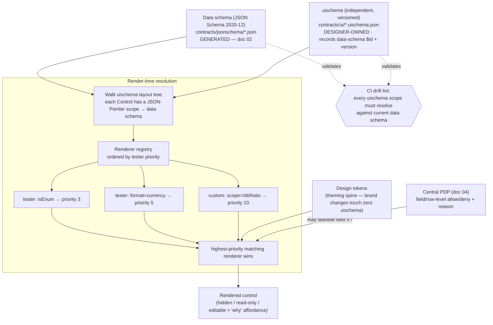

# 07 — UI and Portals

## What this covers

ichiflow's UI layer is **optional but deeply integrated**: the contracts are complete and useful
with no UI at all (API-first), yet a full back-office / customer / partner experience can be
**auto-generated from the same schemas** and safely customized by UX designers. This document
covers —

- the **JSON Forms override model**: an independently versioned UI schema keyed to the data
  schema, a tester/priority **renderer registry**, and **design tokens** — the architecture that
  lets designers customize without forking and survive regeneration;
- **CI lint** that validates every `uischema` scope against the current data schema;
- the **component registry and theming** spine;
- **auto-generated CRUD/case screens** (list, detail, form, task inbox) from schemas + entitlements;
- **Portals** as audience-scoped deployables (back-office, customer, partner), each with its own
  IdP config, entitlements, and BFF;
- how **field/row-level authz** from the central PDP shapes what the generated UI renders, and the
  user-facing **"why is this hidden"** explanation;
- the **designer workflow** step by step (scaffold → override → schema evolves → nothing breaks);
- **manual-review Task UIs**;
- where **fully custom frontends** plug in (headless APIs, BFF contract) so the UI layer stays
  optional.

## Position in the system

The UI layer is a *consumer* of the schema foundation, never a source. It reads the canonical
JSON Schema and OpenAPI artifacts from [02-schema-foundation.md](02-schema-foundation.md); it
renders what the central PDP ([research 04 Part B](../research/04-adapters-and-auth.md)) permits;
it surfaces Tasks from the Case/manual-review module (BRIEF §"Task", §2); and it exposes the why
API's explanations ([research 05](../research/05-audit-observability-deployment.md)). Locked
decisions: BRIEF §6 (JSON Forms; data schema and UI schema are two independent versioned
documents; overrides via tester/priority registry + design tokens; scaffold never clobbers
designer work; CI lint), §7 (identity broker per portal), §8 (same PDP drives generated API *and*
generated UI). Research basis: [03-schema-and-types.md §5](../research/03-schema-and-types.md),
[04-adapters-and-auth.md](../research/04-adapters-and-auth.md).

---

## 1. The core requirement, and why it dictates the architecture

The requirement (BRIEF §6; [research 03 §5.1](../research/03-schema-and-types.md)): *the data
schema is regenerated often; designer customizations must survive every regeneration.*

That is only achievable when UI customization lives in a **separate, versioned document keyed to
the data schema by reference** — never inline in generated artifacts, never in forked copies of
generated components. This single constraint eliminates most of the schema-driven-UI landscape:

| Approach | Override lives… | Survives regeneration? |
|---|---|---|
| **JSON Forms** (adopted) | in an independent `uischema` document + a renderer registry | **Yes — architecturally guaranteed** |
| react-jsonschema-form | separate `uiSchema`, but path-keyed with **no tester fallback** | Mostly (renames go silently stale) |
| AutoForm (shadcn) | `fieldConfig` **inline with the schema** | **No** (anti-pattern here) |
| refine / react-admin | **scaffold-then-eject**: generated code is owned and edited | **No** (regeneration replaces) |
| Retool / Budibase / ToolJet | platform-managed app JSON, no dataSchema/uiSchema separation | **No** (re-scaffolds) |

ichiflow adopts the **JSON Forms model** (`@jsonforms/core` 3.8.x), hardened with a CI drift lint.

---

## 2. The resolution model: data schema · uischema · renderer registry



The five hardening rules layered on stock JSON Forms
([research 03 §5.3](../research/03-schema-and-types.md)):

1. **Generated-once baseline uischema.** For every schema-defined entity / Flow step, the
   generator emits a *default* uischema (vertical layout, all fields, sensible controls) **once**
   (`--if-absent`) — a starting point, never overwritten.
2. **Designer overrides as versioned uischema documents.** Layouts, groupings, labels, show/hide
   rules, control options — stored in `contracts/ui/`, *beside* (not inside) generated types.
   Each uischema records the `$id` + version of the data schema it targets.
3. **Component/renderer registry with tester priorities.** A renderer is `(uischema, dataSchema)
   → priority`; higher priority wins. Customization = *add a registration*, never fork generated
   code. This registry is also where the design system plugs in.
4. **Design tokens** are the theming spine; brand-level changes touch zero uischema documents.
5. **Drift lint in CI** (below) closes the one hole in the JSON Forms model.

---

## 3. CI lint: uischema scopes validated against the schema

The single residual weakness of the JSON Forms model is that a **renamed or removed field orphans
its `uischema` scope** (a JSON Pointer that no longer resolves). ichiflow closes this with a
mandatory CI gate:

- For every `uischema` in `contracts/ui/`, every Control's `scope` (a JSON Pointer) is resolved
  against the current data schema. An unresolvable scope **fails the build** with a fix-it hint
  naming the offending pointer and the uischema file.
- Because data-schema field renames are expressed in TypeSpec via `@renamedFrom`
  ([02-schema-foundation.md](02-schema-foundation.md) §6.3), that rename metadata can **drive
  auto-migration** of the affected scopes — the lint proposes the pointer rewrite rather than
  merely rejecting.
- The lint runs in the same CI stage as the schema regenerate-and-diff gate, so a contract change
  and its UI impact are reviewed together in one PR.

This is what makes "regenerate contracts freely" safe: **the designer layer is data, not code, and
it cannot be silently clobbered or silently orphaned.**

---

## 4. Component registry and theming

- **Renderer sets** are implemented headless (TanStack Form/Table + RHF internals) with
  token-driven styling, so the same registry serves multiple design systems.
- **Registration, not forking.** An app team or designer registers a higher-priority renderer for
  a scope, a `format`, or a schema shape; the baseline renderers remain untouched. Removing a
  customization = removing a registration.
- **Tables and detail views** follow the identical pattern via a **viewschema** document (column
  sets, ordering, cell renderers by tester) referencing the data schema. JSON Forms does not ship
  this; ichiflow builds it on TanStack Table with the same registry/tester architecture, so forms
  and tables share one override model.
- **Design tokens** (color, spacing, typography, radius, elevation) are the theming spine. A
  Portal selects a token set; brand changes never touch uischema or viewschema documents.

---

## 5. Auto-generated CRUD / case screens

From `(data schema + viewschema/uischema + entitlements)` the generator produces the standard
enterprise screen set, each fully overridable via the registry:

| Screen | Generated from | Authz shaping |
|---|---|---|
| **List** | viewschema + data schema | ReBAC supplies the **row filter set** ("which records this user can see"); ABAC supplies **column/field masks**. |
| **Detail** | viewschema + data schema | field-level masks hide/redact fields; the "why" affordance explains omissions. |
| **Form** (create/edit) | uischema + data schema | field-level edit permission drives editable / read-only / hidden. |
| **Task inbox** | Task schema + Case model | assignment/SLA/escalation from the manual-review module (§7); rows filtered by the PDP. |

Because the **same PDP** answers both the API and the UI (BRIEF §8), the generated screen can
never show more than the API would return — one decision source, no drift between layers.

---

## 6. Field/row-level authz shapes what renders — and explains itself

The central PDP is a hybrid: **OpenFGA** (ReBAC backbone, list-filtering) + **Cedar** (ABAC /
feature / field-level policies), fronted by a thin authz gateway both the API and UI call
([research 04 §B.2](../research/04-adapters-and-auth.md)).

- **Row level:** ReBAC returns the reverse-indexed filter set — the UI list only requests and
  renders rows the user may see.
- **Field level:** ABAC (Cedar) returns per-field allow/deny + **reason**; the renderer maps this
  to editable / read-only / hidden.
- **"Why is this hidden?"** Every PDP decision produces a **decision log** (`principal, action,
  resource, context, effect, reason`). The generated UI surfaces this as a user-facing affordance:
  *"This field is hidden because policy `P` denied on attribute `A`."* The explanation is not a
  bespoke UI feature — it is the same decision log that feeds compliance audit
  ([research 05](../research/05-audit-observability-deployment.md)), rendered inline. This is why
  the PDP must return **reasons**, not just booleans (Cedar and OPA both do natively).

```mermaid
sequenceDiagram
    participant UI as Generated UI (renderer)
    participant BFF as Portal BFF
    participant PDP as authz gateway (PDP)
    participant FGA as OpenFGA (ReBAC)
    participant CED as Cedar (ABAC/field)
    UI->>BFF: render Detail(case_id) for principal
    BFF->>PDP: decide(principal, view, case, context)
    PDP->>FGA: may principal see this row?
    PDP->>CED: which fields? (+ reason per field)
    CED-->>PDP: {income: allow, ssn: deny "policy P / attr A"}
    PDP-->>BFF: allow row; field masks + reasons (decision log)
    BFF-->>UI: data + field verdicts + reasons
    UI-->>UI: render; ssn hidden with "why?" affordance → reason
```

---

## 7. Manual-review Task UIs

Human tasks / manual review is a first-party ichiflow module (BRIEF §2: await-signal + SLA timers
+ escalation; assignment routing is itself a Decision). The Task UI is generated the same way as
any screen:

- The **task inbox** is a generated list over the Task schema, filtered by the PDP and ordered by
  SLA urgency; assignment is the output of an assignment Decision, so "who sees this task" is
  itself explainable via the why API.
- The **task detail / action form** is generated from the Task's input schema + the Case's
  DecisionRecord: the reviewer sees the case context, the fired-rule trace and DMN results
  ([research 05](../research/05-audit-observability-deployment.md)), and an action form whose
  submit **signals the Flow** (BRIEF §2). Field-level authz applies exactly as in §6.
- Escalation and SLA state render from the Case model; no bespoke task-UI code is required for the
  common path, and unusual review UIs are just higher-priority renderer registrations.

---

## 8. Portals — audience-scoped deployables

A **Portal** is an audience-scoped UI + BFF with its own IdP config and entitlements (BRIEF
§"Portal"). ichiflow ships three archetypes; more are declared, not coded.

| Portal | Audience | IdP (broker realm/org) | Zone |
|---|---|---|---|
| **back-office** | staff | corporate OIDC + legacy password | intranet |
| **customer** | end customers | social OIDC / customer realm | DMZ |
| **partner** | B2B partners | partner SAML / brought-own IdP | DMZ |

Each Portal is a **declared artifact** (the same "declare, don't code" principle as Adapters and
entitlements, [research 04](../research/04-adapters-and-auth.md)):

```yaml
Portal:
  id: customer
  audience: customer
  zone: dmz                          # DMZ deploy; core stays intranet (BRIEF §11)
  strategies: [oidc-social, legacy-password]
  broker: { realm: customer, idps: [google-oidc, acme-saml] }   # Keycloak realm-per-portal
  tokenExchange: { sts: keycloak, downstreamAudiences: [loan-svc, billing-svc] }  # RFC 8693
  entitlements: { model: rebac+abac, relationships: openfga://ichiflow/1, policies: cedar://ichiflow/1 }
  tokens: brand-customer             # design-token set
  screens: [loan-application-form, my-cases-list, case-detail]
```

- **Per-audience IdP.** Each Portal maps to a **Keycloak realm** (or Zitadel org for B2B2C),
  isolating populations by construction — its own IdP set, branding, and strategy list (BRIEF §7).
- **BFF per Portal.** Each Portal has its own **backend-for-frontend** on the TS edge (Better Auth
  pattern), which calls core services with **audience-scoped tokens via OAuth2 Token Exchange
  (RFC 8693)** — one login at the edge, least-privilege identity propagation downstream.
- **Zone-aware.** Customer/partner Portals deploy to the **DMZ**; the core stays intranet; a
  one-way async relay bridges zones (BRIEF §11). The Portal declaration carries its `zone`.
- **Own entitlements.** Each Portal binds its own OpenFGA relationships + Cedar policies, so the
  same schema-generated screen renders differently per audience because the PDP answers differently.

---

## 9. The designer workflow, step by step

This is the property the whole architecture exists to guarantee — a designer customizes, the
schema evolves underneath, and nothing breaks:

1. **Scaffold.** A schema is authored/changed ([02](02-schema-foundation.md)); the generator emits
   a baseline `uischema` (and `viewschema`) **once** into `contracts/ui/`. The screen already
   works with default controls.
2. **Override.** The designer edits the versioned `uischema`/`viewschema` (regroup, relabel, add
   show/hide rules) and/or registers higher-priority renderers, styled by design tokens. No
   generated code is touched or forked.
3. **Schema evolves.** A developer/agent adds a field (`@added`) or renames one (`@renamedFrom`)
   and regenerates. Generated types and the *baseline* uischema regenerate; the **designer's
   overrides are untouched** because they are separate documents.
4. **Nothing breaks — and drift is caught.** The CI scope lint (§3) validates every uischema
   pointer against the new schema. New fields simply aren't shown until the designer chooses to
   add them; renamed fields are auto-migrated from `@renamedFrom` (or flagged with a fix-it). A
   removed field whose scope is still referenced fails the build loudly rather than silently
   rendering blank.

**Result:** contracts regenerate freely; the designer layer is *data keyed to the schema*, so it
can neither be clobbered by regeneration nor silently orphaned by evolution.

---

## 10. Where fully custom frontends plug in (the UI stays optional)

The generated UI is a convenience layer over a complete API-first system, not a dependency
(BRIEF: "UI optional but deeply integrated"; requirement R2). Custom frontends plug in at
well-defined seams:

- **Headless APIs.** The OpenAPI 3.1 contracts and generated TS/Kotlin clients
  ([02](02-schema-foundation.md)) are the whole surface — any SPA, native app, or third-party
  system builds directly on them, entitlements enforced server-side by the same PDP.
- **BFF contract.** A custom frontend can either talk to core services directly or stand up its
  own BFF against the same contract the generated Portal BFF uses (auth via Better Auth /
  token-exchange, §8). The BFF boundary is itself schema'd.
- **Renderer registry as a partial escape hatch.** A team can keep the generated shell but replace
  arbitrary regions with custom React by registering high-priority renderers — a gradient from
  fully-generated to fully-custom without an all-or-nothing fork.
- **Reused primitives.** Even a fully custom frontend can consume the field/row authz verdicts +
  "why" reasons (§6) and the Task/why APIs, so it inherits explainability without reimplementing it.

---

## Open questions

1. **viewschema standardization.** JSON Forms has no table/detail schema; ichiflow defines
   viewschema on TanStack Table. Its exact vocabulary (column sets, cell-renderer testers,
   grouping) needs to be pinned down and, ideally, share tester semantics with uischema.
2. **uischema auto-migration coverage.** How much of a `@renamedFrom`-driven scope migration can
   be applied automatically vs. must be flagged for the designer (§3) is unvalidated — reshapes
   (a field splitting into two) have no clean automatic answer.
3. **Cross-framework renderer sets.** JSON Forms supports React/Angular/Vue; ichiflow's reference
   set is React. Whether the token-driven headless approach cleanly serves a second framework, or
   whether Portals are React-only in v1, is undecided.
4. **PDP latency on list views.** ReBAC "list what I can see" queries (OpenFGA) plus per-field
   Cedar checks on large lists have a latency budget; how field-verdict results are cached at the
   BFF without staling on relationship changes (OpenFGA tuple churn) needs design — see
   [research 04 §B.5](../research/04-adapters-and-auth.md).
5. **"Why hidden" disclosure limits.** Surfacing the denial *reason* to end users can itself leak
   policy structure. Which reasons are user-facing vs. audit-only (and per-audience) is a policy
   question the PDP + Portal config must jointly answer.
6. **Designer tooling.** Whether designers hand-edit uischema JSON, use a visual editor, or an
   AI-assisted authoring skill (parallel to the schema/rule Copilots) is an open product decision.
