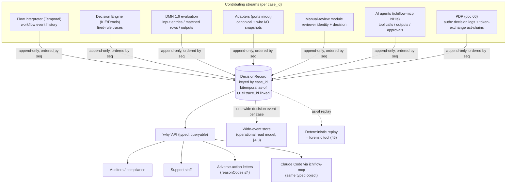

# 08 — Audit, Explainability & Observability

## What this covers

The machinery that lets ichiflow answer, for any Case, **"why did we decide what we decided, and what did
we know when we decided it?"** — with a full, reconstructable causal chain that satisfies auditors,
support staff, adverse-action letters, and AI agents from *one* source. It specifies:

- The **DecisionRecord** as a first-class typed domain object per `case_id`, and the typed, queryable
  **"why" API** over it.
- **Storage strategy** — event-source only the decision/flow core; append-only audit tables +
  transactional outbox elsewhere; optional tamper-evident ledger SPI; bitemporal "as-of" with a
  PostgreSQL-first pragmatism and XTDB as an optional audit store.
- **Retention/redaction** and the GDPR-vs-immutability tension (crypto-shredding).
- **Observability** — OpenTelemetry for all signals; `trace_id ↔ case_id` correlation; one wide decision
  event per Case; OpenLineage for data lineage; separate read models for dashboards vs audit queries.
- **Regulatory grounding** (EU AI Act, FCRA/ECOA adverse action, SOX, BCBS 239) and how **deterministic
  replay doubles as a forensic tool**.

## Position in the system

Audit/explainability is a **cross-cutting pillar** that every other module feeds and that two audiences
consume. The DecisionRecord is the *product artifact* named in `BRIEF.md` §9; the "why" API is its query
surface (`BRIEF.md` vocabulary). It receives streams from Flows (workflow events), the Decision Engine
(fired-rule traces, DMN results), Adapters (I/O snapshots), the manual-review module (human actions),
the identity/access layer (authz decisions and token exchanges — `06-identity-and-access.md`), and AI
agents (`10-ai-native-experience.md`). It is the debugging substrate the `ichiflow-mcp` runtime server
queries — the "why" API *is* the agent-debugging API (`../research/07` §0.2), not a parallel layer.

Grounded in `../research/05-audit-observability-deployment.md` (§1 audit, §2 observability, §4 multi-DB,
§6 status table) and bound by `BRIEF.md` §9 and §10.

> **The core stance:** *decision provenance is a first-class domain object, not a log side-effect.* You do
> not "log the changes" — you **reconstruct the decision**: which inputs were known, at what version of
> which policy, which rules fired, what the DMN tables returned, what an AI agent reasoned, who reviewed,
> and the final outcome — as one causal chain, queryable **as of the decision instant.**

---

## Part 1 — The DecisionRecord

### 1.1 What it is

The **DecisionRecord** (a.k.a. decision trace) is a per-Case typed domain artifact, keyed by the global
`case_id` (`BRIEF.md` §10), that stitches every step and service into **one causal chain** and is stored
**append-only**. It is not derived from logs after the fact; it is written *as the Case executes*, with a
content schema rich enough for post-hoc reconstruction (`../research/05` §1.3).

It composes these contributing streams:

| Stream | Contributed by | What it captures |
|---|---|---|
| **Workflow event history** | Flow interpreter on Temporal (`BRIEF.md` §2) | Every state transition, signal, timer, task assignment/escalation for the Case |
| **Fired-rule traces** | Decision Engine SPI / KIE-Drools (`BRIEF.md` §1) | Which rules evaluated, which conditions met, actual variable values, which rule won |
| **DMN results** | DMN 1.6 evaluation (`BRIEF.md` §1) | Input entries, matched rows, output entries per decision table |
| **Adapter I/O snapshots** | Inbound/outbound Adapters (`../research/04` Part A) | Canonical command/event in, wire payload out, at the port boundary (schema'd) |
| **Human-review actions** | Manual-review / case module (`BRIEF.md` §2) | Reviewer identity, decision, rationale, timestamp |
| **AI-agent actions** | `ichiflow-mcp` / agent NHIs (`10-ai-native-experience.md`) | Tool calls, args, model outputs, confidence, approvals — attributed to the agent identity |
| **Authz decisions** | PDP decision logs (`06-identity-and-access.md` §2.4) | `decision_id, principal, action, resource, context, effect, reason`; token-exchange act-chains |

The single record is what the **"why" API** reads and what generates **adverse-action reason codes** for
a denial letter (`../research/05` §1.3). DMN is the right rule substrate precisely because it *records
rule-evaluation paths* — "traceable and explainable… suitable for compliance-sensitive environments."

### 1.2 A typed object, not prose

The "why" surface is **structured and machine-queryable**, never free text (`../research/05` §2.4). The
same typed object a human UI renders is what an AI support/audit agent receives from `ichiflow-mcp`. Its
shape (authored in TypeSpec, emitted to JSON Schema per `BRIEF.md` §5):

```jsonc
// DecisionRecord — one per case_id, append-only, bitemporal
{
  "case_id": "case:loan:8f21…",
  "tenant": "acme",
  "outcome": { "decision": "denied", "at": "2026-07-11T14:03:22Z", "policyVersion": "credit-policy@37" },
  "asOf": { "validTime": "2026-07-11", "systemTime": "2026-07-11T14:03:22Z" },  // bitemporal (§3)
  "chain": [
    { "seq": 1, "kind": "workflow.event", "step": "intake", "event": "CaseOpened", "ts": "…" },
    { "seq": 2, "kind": "adapter.io", "port": "bureau-inbound",
      "canonicalIn": "creditReport.v2#…", "snapshotRef": "audit://…" },
    { "seq": 3, "kind": "authz.decision", "decision_id": "d:…", "principal": "u:reviewer-3",
      "action": "case.view", "effect": "allow", "reason": "assignee(u:reviewer-3, case)" },
    { "seq": 4, "kind": "rule.trace", "decisionModel": "eligibility@12",
      "fired": ["min-income", "dti-cap"], "won": "dti-cap",
      "inputs": { "dti": 0.47, "cap": 0.43 } },
    { "seq": 5, "kind": "dmn.result", "decision": "riskGrade",
      "matchedRows": [3], "inputs": { "score": 612 }, "output": { "grade": "D" } },
    { "seq": 6, "kind": "agent.action", "agent": "nhi:incident-investigator",
      "tool": "explain_decision", "approved_by": null, "readOnly": true },
    { "seq": 7, "kind": "human.review", "reviewer": "u:reviewer-3",
      "decision": "uphold-denial", "rationale": "DTI over cap; no comp. factors" }
  ],
  "reasonCodes": ["DTI_TOO_HIGH", "RISK_GRADE_D"],   // → adverse-action letter (≤4, FCRA/ECOA §5)
  "trace_id": "otel:1a2b…"                            // ↔ technical trace (§4.2)
}
```

### 1.3 The "why" API — one source, four audiences

The "why" API is a **typed, queryable** surface over the DecisionRecord serving four consumers from one
object (`BRIEF.md` §9, `../research/05` §2.4, §7.4):

- **Auditors / compliance** — full causal chain, as-of the decision instant, with policy/rule versions.
- **Support staff** — "why was this application denied?" in human-renderable structured form.
- **Adverse-action letters** — the `reasonCodes` path: specific, accurate denial reasons (≤4), generated
  from the record, not hand-written (§5, FCRA/ECOA).
- **Claude Code via `ichiflow-mcp`** — the *same* typed object through tools like `get_case_trace` and
  `explain_decision` (`../research/07` §4.2). The why API *is* the debugging API — no parallel layer.

Because all four read the same record, an explanation shown to a customer, cited in a letter, and queried
by an agent are guaranteed consistent.

### 1.4 DecisionRecord composition / causal chain (diagram)



### 1.5 Code, condition, authority, and reference-data attribution

Regulated outcomes are legally load-bearing at the granularity of a **single code**: penalties, appeals,
and remediation turn on *which* code fired, from *which* authority, under *which* rule and reference-data
version. The DecisionRecord and "why" API therefore answer, for any Case:

- **Which codes were emitted** — every reason and condition code on the Case's `Outcome` /
  `CompositeOutcome` (canonical typed shapes, [02-schema-foundation.md](./02-schema-foundation.md) §9.3).
- **By which authority / Decision** — for a composite decision
  ([03-decision-layer.md](./03-decision-layer.md) §2.3), each member Outcome and its codes stay attributed
  to their originating **authority / rule-owner**.
- **Under which versions** — the **DecisionModel version** that emitted the code *and* the
  **CodeSet / rate-table version** it read (the `codeSet@version` pin carried in the typed trace,
  [03-decision-layer.md](./03-decision-layer.md) §7). A computed fee records the **rate-table version**
  used alongside the amount.
- **The lifecycle history of each condition** — every transition (`raised → fulfilled | waived |
  breached`) with its **timestamp and actor** ([04-flow-and-case-layer.md](./04-flow-and-case-layer.md)
  §5.5).

Post-submission operations — **amendment, cancellation, appeal, withdrawal, correction**
([04-flow-and-case-layer.md](./04-flow-and-case-layer.md) §5.6) — appear as **attributed events spanning
the artifact's versions** (§1.1, the versioned governed output artifact), so the causal chain survives
amendments and every version is **bitemporally as-of reconstructable** (§3). A correction's child Case
references the parent DecisionRecord, keeping the lineage queryable end to end.

---

## Part 2 — Storage strategy

The three storage strategies (event sourcing, audit-log tables, CDC-based audit) are **not mutually
exclusive**; the right answer is a **hybrid** (`../research/05` §1.2). The governing insight: *event
sourcing earns its keep only in greenfield bounded contexts where replay and temporal queries are genuine
requirements* — exactly the decision core — while *CDC + outbox beats full event sourcing for the rest.*
"A well-done CRUD is much better than a poorly done Event Sourcing."

### 2.1 Event-source only the decision/flow core

Reserve **event sourcing** for the **workflow/decision aggregate** (`BRIEF.md` §9): the Flow execution
and the Decision evaluations, where **intent** matters and **deterministic replay** is a genuine
requirement (Temporal's event-history model already gives this for the Flow layer — `BRIEF.md` §2). This
is the aggregate boundary where an immutable event stream *is* the source of truth and current state is a
fold. It is what makes §6 (forensic replay) possible.

**Licensing note (`BRIEF.md` §14):** avoid **KurrentDB** (KLv1 source-available — needs legal review
before embedding). Prefer PostgreSQL-native event storage; **Marten**-style ES-on-Postgres is the
philosophical model (though .NET-centric), and Temporal already persists Flow history. Axon is a JVM
option if a dedicated event store is warranted later. The default is *event storage on Postgres*, not a
separate event-store product.

### 2.2 Append-only audit tables + transactional outbox everywhere else

For **every non-core domain**, do **not** event-source. Use **append-only audit tables** written by the
app alongside business writes, made atomic with the **transactional outbox** so the DB write and the
emitted audit/domain event commit together — preventing "state changed but event lost" and its reverse
(`../research/05` §1.2, §4.3; `BRIEF.md` §9). CDC (Debezium tailing the PG WAL — `BRIEF.md` §10) is the
**optional** complement for tamper-evident change feeds and read-model projections, but it captures
*change, not intent*, so it is never the primary "why" source.

This keeps the complexity/"explanation tax" of event sourcing confined to the one aggregate that repays
it, and everything else stays queryable SQL that a new engineer learns in a day (`../research/05` §4.2).

### 2.3 Tamper-evident ledger SPI (optional)

For high-assurance customers (SOX-relevant financial controls, regulators who demand provable
immutability — "physically cannot be altered"), ichiflow exposes an **optional append-only ledger SPI**
(`../research/05` §1.2, §4.4). Default binding: none (the append-only Postgres audit tables suffice).
Optional binding: **immudb** (cryptographically verifiable, PG-wire verification functions,
Apache-friendly). **Do not build on Amazon QLDB** — EOL July 31 2025 (`../research/05` §1.5). The ledger
is a *verification* store layered under the audit stream, not a general query engine.

### 2.4 Persistence SPI alignment

All of the above sit behind the persistence SPIs of `BRIEF.md` §10 / `../research/05` §4.4: **case
store, audit/ledger store, read-model/projection store, search store** — every default targets **a
single PostgreSQL** (case + audit + read models + queue + search via FTS/`pg_trgm`), and enterprise
adopters bind audit→immudb/XTDB, search→OpenSearch, analytics→warehouse without forking. "PostgreSQL-first
for everything, pluggable-later" (`../research/05` §4.1). The `case_id` is the correlation key stamped on
every record in every store so a decision reassembles across them (§4, BCBS 239 lineage key).

---

## Part 3 — Bitemporal "as-of"

Regulated decisions must be reconstructable **as of the decision instant, not as-of-now** — "what did we
know when we decided" (`../research/05` §1.4). ichiflow models **bitemporal** data:

- **Valid time** — when a fact was true in the world.
- **Transaction/system time** — when ichiflow recorded it.

The DecisionRecord's `asOf` (§1.2) pins both, so replaying or re-explaining a Case reconstructs the exact
knowledge state at decision time, even if data was later corrected.

**PostgreSQL-first pragmatism (`../research/05` §1.4):** PG 18 adds SQL:2011 *application-time*
(valid-time) constraints but **does not auto-track system time**; full bitemporality needs the
`temporal_tables`/`periods` extension or trigger-based history tables. Critically, **managed PG
(RDS/Azure/Cloud SQL) often forbids these extensions** — so the portable default is **trigger-based
history tables**, which work everywhere. This is an explicit design constraint, not an afterthought.

**XTDB 2.x as optional audit store (`../research/05` §1.4, §1.5):** bitemporal-native immutable SQL
(v2.1 GA Dec 2025, in production; v2.2 beta adds OTel + Prometheus), positioned for data-compliance
time-travel. It binds the **audit-store SPI** as an *optional as-of/bitemporal store* for customers who
want native bitemporality rather than trigger-based history — **not** the primary transactional DB
(maturity/operational-familiarity reasons).

**Phasing.** v1 core "as-of" leans on **Temporal replay + append-only records + effective-dating**,
which covers the decision/flow core. **Trigger-based bitemporal history on *every* audited table** is
heavy and is an **Enterprise-tier** capability, not v1-core; XTDB is the optional native-bitemporal
binding for customers who want it. The lighter v1 stance is sufficient for the core's reconstructable
"what did we know when."

---

## Part 4 — Observability

### 4.1 OpenTelemetry for all signals

**OpenTelemetry is the unambiguous default** (CNCF-graduated 21 May 2026; traces, metrics, logs stable
across JVM/Kotlin and Node/TS — `../research/05` §2.1, §6). ichiflow emits all three signals via OTel.
The framework-specific work is *not* "adopt OTel" (settled) — it is **correlating business decision
traces with technical traces** and exposing a queryable "why" surface both humans and agents use.

**OTel-native, BYO backend (locked decision §9; ADR-0011 amendment note).** *Every* signal —
traces, metrics, logs, **and the decision events** (§4.3) — exports via **standard OTLP**, so a
deployment points ichiflow at **whatever backend it already runs**: AWS CloudWatch / X-Ray, Google
Cloud Operations, Grafana (Tempo/Loki/Mimir), Datadog, and any other OTLP-compatible stack. ichiflow
**builds no proprietary observability store** and **does not ship or bundle a Grafana-class stack as a
commitment** — what it provides for backends is **integration guidance**, not a shipped/owned monitoring
product. The **Dev tier bundles only a minimal local OTel viewer** so a laptop shows spans without
standing up a backend ([`09-deployment-and-topology.md`](09-deployment-and-topology.md) §3.1). The
differentiator ichiflow *does* own is the business↔technical correlation and the *why* API over it
(§1, §4.2) — not the telemetry store underneath.

### 4.2 `trace_id ↔ case_id` correlation

- Set the business correlation ID (`case_id`) at the entry point, propagate it via **OTel baggage**, and
  attach it as a **span attribute** (`ichiflow.case_id`, plus domain aliases like `loan.application_id`)
  on **every** span. Inject `trace_id`/`span_id` into every structured log (MDC on JVM). This makes
  technical traces queryable by business key and vice-versa (`../research/05` §2.2).
- The DecisionRecord carries the `trace_id` (§1.2), so a business "why" query can hand a human or agent a
  deeplink to the exact technical trace, and a technical trace links back to the Case's causal chain.

### 4.3 One wide decision event per Case

Adopt the **wide-event / canonical-log-line pattern** ("Observability 2.0", Stripe-style): emit **one
structured, high-cardinality decision event per Case** carrying identity fields, policy/rule versions,
decision inputs, outcome, reviewer, timing, and model/agent metadata (`../research/05` §2.2). This is the
**observability twin** of the DecisionRecord — the same facts, shaped for aggregate querying ("every case
where confidence < 0.8", "every denial under policy v37") rather than per-case reconstruction.

**Phasing.** The v1 default backend for this operational read model is **just Postgres** (open-q7); a
dedicated wide-event store (ClickHouse/Honeycomb-style) is a later, scale-driven SPI binding, not a
v1 requirement.

### 4.4 Operational dashboards vs audit queries — separate read models

Dashboards and audit answer different questions and get **different read models** (CQRS projections,
`../research/05` §4.3), both rebuildable from the event/audit log:

| Surface | Read model | Query shape | Consumer |
|---|---|---|---|
| **Operational dashboards** | Wide-event store (ClickHouse/Honeycomb-style), metrics | Aggregate, high-cardinality, time-series | Ops/platform engineers |
| **Audit queries** | DecisionRecord store (append-only PG / XTDB) | Per-`case_id` causal chain, as-of | Auditors, support, agents |

Keeping them separate means an expensive forensic as-of query never contends with a live dashboard, and
each read model is tuned for its access pattern. Both derive from the same source of truth, so they never
disagree.

### 4.5 Data lineage — OpenLineage

For **BCBS 239 end-to-end data lineage** at the dataset/pipeline layer, ichiflow emits **OpenLineage**
(LF AI & Data graduated; Marquez reference impl; Airflow/Spark/dbt/Kafka integrations — `../research/05`
§2.3, §6). This complements the per-Case causal chain: OpenLineage covers *data/pipeline* lineage (how a
dataset was produced), the DecisionRecord covers *decision* lineage (why a Case resolved as it did).
Together they satisfy the lineage principle regulators find hardest.

**Phasing.** OpenLineage / BCBS 239 lineage is an **Enterprise compliance-pack** capability, not
v1-core — it targets bank risk-data aggregation specifically. v1 ships the per-Case DecisionRecord
causal chain (§1); the dataset/pipeline lineage layer switches on with the compliance pack.

### 4.6 Obligation-breach and SLA-pause events are audit-first-class

Two Case-lifecycle transitions carry legal / penalty and SLA-reporting weight and are therefore recorded
as **distinct, queryable audit events**, not merely inferred from state:

- **Obligation breach.** When a post-approval obligation misses its deadline
  ([04-flow-and-case-layer.md](./04-flow-and-case-layer.md) §5.5), a `condition.breached` event is
  written — attributed to its condition code, CodeSet version, deadline, and the Case artifact version —
  because a breach may trigger a penalty or open a remediation Case, and an auditor must be able to query
  "every Case that breached obligation X."
- **SLA clock-stop (pause/resume).** Each pause and resume of a pausable SLA timer
  ([04-flow-and-case-layer.md](./04-flow-and-case-layer.md) §5.7) is recorded distinctly, with the
  reason (e.g. request-for-information) and the paused interval, so SLA reporting can prove *net*
  processing time excluded the party's own wait — and, on a composite Case, per authority clock.

Both event kinds land in the same append-only stream as the rest of the DecisionRecord (§1, §2.2) and are
`case_id`-correlated, so they surface through the "why" API alongside decisions and human actions.

---

## Part 5 — Regulatory grounding

The DecisionRecord and its as-of queryability exist to satisfy concrete obligations (`../research/05`
§1.6). Design targets:

- **EU AI Act** — credit scoring is **Annex III high-risk**. The *Digital Omnibus* (political agreement
  7 May 2026) postpones stand-alone Annex III (incl. credit scoring) to **2 Dec 2027**, but the delay
  binds only once published in the OJ, and **Art. 50 transparency obligations still hit 2 Aug 2026**.
  **Plan to the earlier date (Aug 2, 2026).** Design for: risk management (Art. 9), data governance
  (Art. 10), technical documentation (Art. 11), transparency (Art. 13), human oversight (Art. 14),
  accuracy/robustness (Art. 15), EU DB registration (Art. 49). The DecisionRecord + human-review stream
  is the Art. 14 human-oversight and Art. 11 documentation evidence.
- **FCRA / ECOA (Reg B) adverse action** — creditors must give **specific, accurate reasons** for denial
  (**≤4** practical guidance); CFPB Circular 2022-03: *you may not use models so complex you cannot
  produce specific reasons* — explainability is legally mandatory. This is the direct driver of the
  DecisionRecord → `reasonCodes` → adverse-action-letter path (§1).
- **GDPR Art. 22 (+ right to explanation)** — no solely-automated decision with legal/significant effect
  without safeguards; the subject can obtain **human intervention, express a view, contest**, and receive
  **"meaningful information about the logic involved."** Requires per-decision audit incl. human-reviewer
  identity, policy state, and decision substance — all in the DecisionRecord. (Tension with immutability:
  §7.)
- **SOX** — immutable, tamper-evident audit trails over financial-reporting controls: the append-only
  audit tables (§2.2) + optional ledger SPI (§2.3).
- **BCBS 239** — end-to-end data lineage for risk-data aggregation/reporting: OpenLineage (§4.5) +
  `case_id` global correlation (§2.4).

---

## Part 6 — Deterministic replay as a forensic tool

The event-sourced decision core (§2.1) makes **replay deterministic** (Temporal-style — `BRIEF.md` §2,
`../research/05` §1.2, `../research/07` §6.2). This is not only a debugging convenience; it is a
**forensic instrument**:

- **Reconstruct a decision exactly** — replay the Case's event history against the *pinned* policy/rule/DMN
  versions and the bitemporal as-of snapshot (§3) to reproduce the precise decision, byte-for-byte, for
  an auditor or a dispute.
- **Detect non-determinism** — replay against current code surfaces divergence (a Temporal replay
  report), which is itself an audit finding ("this decision would not reproduce under current code").
- **Test hypotheses safely** — an AI agent's proposed fix is validated by replaying the *actual failing
  Case*, not a toy (`../research/07` §6.2) — repro-before-fix. The same `reproduce_case` / `replay_workflow`
  primitives serve support forensics and agent self-healing.

Replay's forensic power is *why* event sourcing is scoped to the decision core: determinism is a
build-time discipline the port model (`../research/04` Part A) must preserve — non-deterministic
activities stay behind adapters (`../research/07` §8).

---

## Part 7 — Reporting & analytics read models (embed proven OSS BI)

Operational dashboards (§4.4) answer *"is the system healthy"*; the **why** API (§1) answers *"why did
this one Case resolve so."* Neither is the third question every casework org asks: **business
intelligence** — *"how many permits did we issue this quarter, at what median cycle time, with what
obligation-breach rate, broken down by unit."* ichiflow answers this by **embedding proven open-source
BI over governed read models**, not by building a report engine (locked decisions §17; ADR-0021).

### 7.1 Governed read-model projections are the reporting contract

ichiflow ships **schema-derived, governed read-model projections** — CQRS projections (§4.4),
rebuildable from the audit/event log — shaped for analytical querying and versioned like any other
contract:

| Read model | Grain | Sourced from |
|---|---|---|
| **Cases** | one row per Case | Case lifecycle + `case_id` (`04-flow-and-case-layer.md`) |
| **Outcomes** | one row per `Outcome` / member of a `CompositeOutcome` | Decision evaluation (§1.5) |
| **Conditions / obligations** | one row per Condition, with state + deadline | Case obligation ledger (§4.6) |
| **SLAs** | per-task / per-authority SLA clocks, net of pauses | SLA clock-stop events (§4.6) |
| **Decision stats** | fired-rule / DMN-row / reason-code aggregates | DecisionRecord chain (§1.2) |

These projections are the **reporting contract**: derived from the canonical Schema and CodeSets, so a
report field means exactly what the same field means in a Case, the *why* API, and correspondence — one
governed source of meaning, no separate "reporting definition of a permit" to drift.

### 7.2 First-class integration with OSS BI — not a custom report engine

ichiflow provides **first-class integration** with **Metabase / Superset-class open-source BI tools**
over those read models, rather than a bespoke report builder:

- **Embedding** — BI dashboards embed in the back-office Portal (`07-ui-and-portals.md`) as a governed
  surface, so an analyst never leaves ichiflow to see their numbers.
- **SSO via the broker** — the BI tool authenticates through the same identity broker
  (`06-identity-and-access.md` §1), so reporting access is the same Principal as everything else, not a
  second login/user directory.
- **Row/field-level security from the *same* PDP** — the BI tool's row and field visibility is driven
  by the **same central PDP** (`06-identity-and-access.md` §2) that guards the API and UI, so an analyst
  can never see a row or a masked field in a report that the API would deny. There is no second,
  divergent authorization model for analytics.

**No custom report engine.** BI is a **non-differentiating concern with mature OSS** (Metabase,
Superset), so ichiflow integrates rather than builds ("prefer proven open source," doc 00 §4;
ADR-0021). What ichiflow owns is the **governed read models and the PDP-consistent security around the
embed** — the parts that are actually ichiflow's value — not the charting.

**Phasing.** Reporting via embedded OSS BI is a **post-v1 / compliance-profile-adjacent** capability
(the v1 kernel ships the read models' substrate — projections are already how §4.4 works — but the
packaged BI embed + SSO + PDP-scoped embedding lands after v1). A cross-pointer lives in
`07-ui-and-portals.md` §5 (generated screens) since the embed surfaces in the back-office Portal.

---

## Phasing (v1 vs later)

| Capability | v1 | Later |
|---|---|---|
| DecisionRecord typed object + "why" API (all 4 audiences) | ✅ | Richer reason-code taxonomies per jurisdiction |
| Event-sourced decision/flow core (Postgres + Temporal history) | ✅ | Dedicated event store (Axon) if scale warrants |
| Append-only audit tables + transactional outbox | ✅ | CDC projections (Debezium) as default in Team+ tiers |
| Tamper-evident ledger SPI (immudb) | Optional | Managed ledger offering |
| Bitemporal "as-of" for the decision/flow core (Temporal replay + append-only records + effective-dating) | ✅ | **Trigger-based bitemporal history on every audited table → Enterprise tier**; XTDB binding for native bitemporality |
| OTel all signals; `case_id↔trace_id`; wide decision event | ✅ | GenAI semantic conventions for agent spans |
| Wide-event store for the operational read model | **v1 = just Postgres** (§4.3–4.4, open-q7) | ClickHouse/Honeycomb-style store when high-cardinality aggregate scale warrants |
| OpenLineage / BCBS 239 data lineage | **compliance profile** (OSS, optional install; not v1-core) | Deeper warehouse/pipeline coverage |
| Reporting: governed read models (cases/outcomes/conditions/SLAs/decision stats) | ✅ (projections are the §4.4 substrate) | **Embedded OSS BI** (Metabase/Superset) + SSO-via-broker + PDP-scoped embedding (Part 7, ADR-0021) — post-v1 |
| Deterministic replay as forensic tool | ✅ | One-command repro env parity across tiers |
| Crypto-shredding redaction (§7) | ✅ (design) | Automated retention-policy engine |

---

## Open questions

1. **Event-sourcing aggregate boundary.** Confirm the exact line where ES is worth the complexity vs
   audit-log + outbox (`../research/05` §7.1). Current stance: Flow execution + Decision evaluation only.
2. **Bitemporal on managed PG.** Validate whether target customers run managed PG (no temporal
   extensions) and therefore need trigger-based history vs XTDB (`../research/05` §7.3). Default:
   trigger-based history for portability.
3. **DecisionRecord "why" API contract.** Nail the *exact* typed schema so it serves humans,
   adverse-action letters, and agents from one source (`../research/05` §7.4). §1.2 is the working shape;
   needs TypeSpec authoring + golden examples per regulation.
4. **GDPR erasure vs immutability — crypto-shredding.** How does the right-to-erasure reconcile with an
   append-only, tamper-evident record? Working design: **crypto-shredding** — PII stored encrypted with a
   per-subject key; erasure destroys the key, rendering the ciphertext unrecoverable while the audit
   chain's structure/hashes stay intact. Confirm this satisfies both GDPR Art. 17 and SOX/immutability,
   and how it interacts with the ledger SPI's verification.
5. **KurrentDB / ledger licensing.** Legal sign-off on any source-available store before embedding
   (`../research/05` §7.2); default remains Postgres-native audit + optional immudb.
6. **AI-Act timing.** Track OJ publication of the Digital Omnibus; **build to Aug 2, 2026** even though
   credit-scoring compliance may formally shift to Dec 2, 2027 (`../research/05` §7.5).
7. **Wide-event backend default.** Resolved for v1: the operational read model is **just Postgres**
   (§4.3–4.4); a dedicated ClickHouse/Honeycomb-style wide-event store is a later, scale-driven SPI
   binding. The residual question is the concrete high-cardinality-aggregate signal that triggers
   that binding (`../research/05` §4.2).
