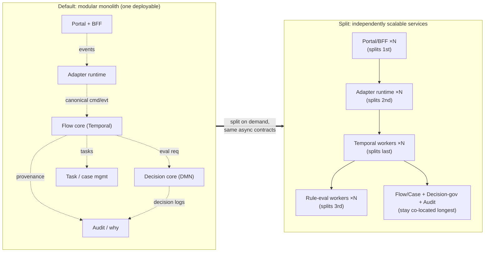
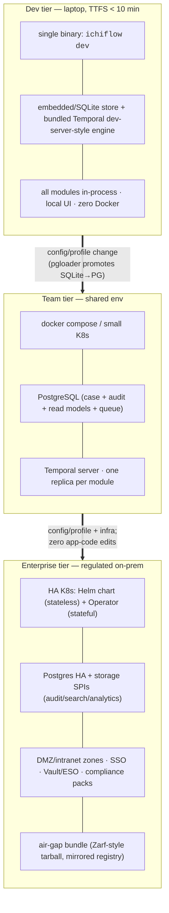
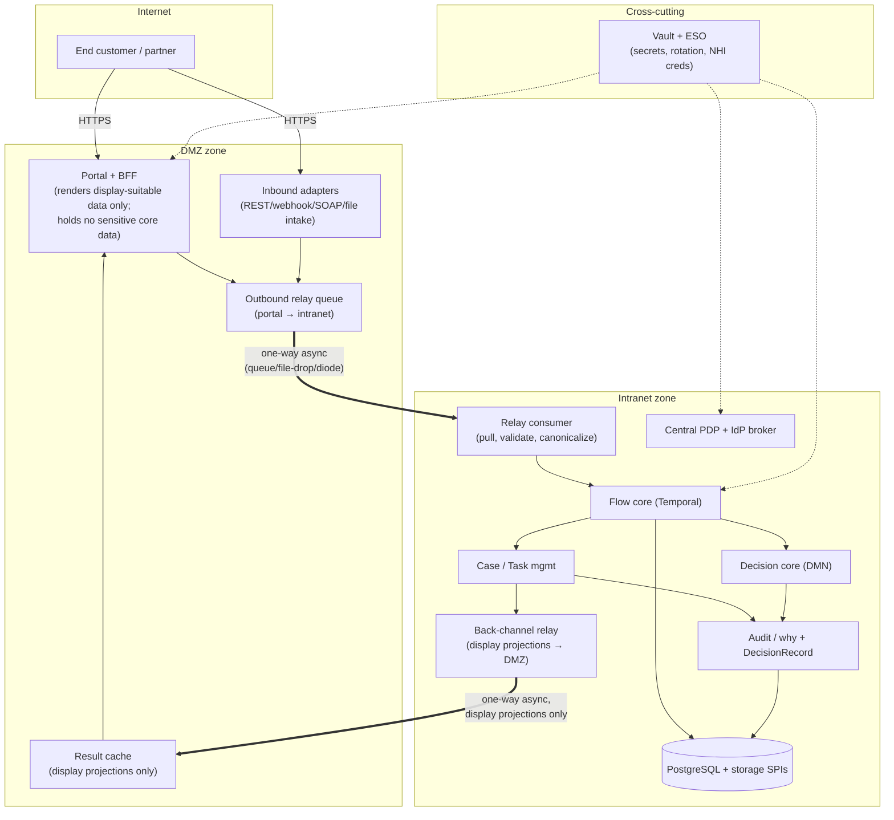

# 09 — Deployment & Topology

> **What this covers.** How ichiflow is packaged, deployed, and scaled — from a single dev
> binary on a laptop to a zoned, HA, air-gapped enterprise cluster — without changing
> application code. The default shape (modular monolith with async-first module boundaries),
> the documented split path to independently scalable services, the Dev/Team/Enterprise tier
> ladder, PostgreSQL-first persistence with storage SPIs, DMZ/intranet zone architecture,
> the independent-scalability map, HA/DR posture, and the upgrade strategy for long-running
> Flows across framework upgrades.
>
> **Position in the system.** This is the *packaging and runtime-topology* companion to the
> logical architecture. It realizes locked decisions §3 (deployment target), §10 (persistence),
> and §11 (topology) of [`BRIEF.md`](./BRIEF.md), and is grounded in research
> [`05-audit-observability-deployment.md`](../research/05-audit-observability-deployment.md) §§3–5
> and [`06-migration-and-onboarding.md`](../research/06-migration-and-onboarding.md) Part B.
> Cross-refs: `08-audit-and-observability.md` (DecisionRecord, `case_id` correlation, OTel),
> `06-identity-and-access.md` (IdP brokering, PDP, non-human identities), `04-adapters.md`
> (Adapter port model), `10-ai-native-experience.md` (runtime agent surface that rides this topology).

---

## 1. Position: one app, many shapes

ichiflow is a **framework product**, not a SaaS. The same application code must run on a
developer's laptop in under ten minutes *and* in a regulated bank's air-gapped, zone-segmented
data center. The design stance that makes this possible:

> **Modular monolith by default; async-first module boundaries; split into independently
> scalable services only when scale or zone separation demands it — and when it does, the seam
> is already a message boundary, so the split is a deployment change, not a rewrite.**

Everything in this document follows from that stance plus one hard requirement (§4):
**time-to-first-success < 10 minutes**.

The tiers — **Dev**, **Team**, **Enterprise** — are the *same binary and the same app code*
selected by **configuration/profile only** (locked decision §3; research 06 §B.2). What changes
across tiers is the substrate (embedded store → Postgres → SPIs), the deployment topology
(single process → compose/small K8s → HA/zoned K8s), and which enterprise layers (SSO, audit
retention, zones, compliance packs) are switched on. None of it changes the programming model.

---

## 2. Modular monolith with async-first boundaries

### 2.1 Why modular monolith is the default

The 2026 industry consensus is a **modular monolith adopters can split later**, not
microservices-by-default (research 05 §3; ~42% of microservice adopters have consolidated back).
For a framework this is doubly true: one deployable means one CI/CD picture, one availability
story, one thing to install air-gapped, and a new engineer who can learn the whole system in a day.

ichiflow ships as a set of **enforced modules** inside one deployable. Module boundaries are
enforced at build time (Spring Modulith 2.0 + ArchUnit fitness functions on the Kotlin core;
package/lint boundaries on the TS edges): a module cannot reach into another module's internals,
and a boundary violation **fails the build**. Each module owns its own tables (per-module
migrations), so a module carries its schema when it later leaves.

### 2.2 The modules

| Module | Language | Responsibility | Owns |
|---|---|---|---|
| **Portal + BFF** (per audience) | TS edge | Audience-scoped UI + backend-for-frontend; renders "display-suitable" data | session/view state |
| **Adapter runtime** | Kotlin (JVM) + TS | Inbound/outbound declared ports (REST, MQ/JMS/Kafka/AMQP, file/SFTP, SOAP, webhook, CDC); canonicalization + boundary validation | adapter cursors, dedup keys |
| **Decision core** | Kotlin | DMN evaluation via the Decision Engine SPI; DecisionModel governance/simulation | decision logs, DecisionModel versions |
| **Flow core** | Kotlin | Declarative Flow interpretation on Temporal; Case lifecycle | Case state, `case_id` registry |
| **Task/case-management** | Kotlin | Human tasks, SLA timers, escalation, assignment routing (itself a Decision) | Task queues, SLA state |
| **Audit/why** | Kotlin | DecisionRecord assembly, "why" API, append-only ledger | DecisionRecord (append-only) |
| **Identity/PDP** | Kotlin/TS | IdP brokering, token exchange, central PDP (see `06-identity-and-access.md`) | authz decision logs |

### 2.3 Async-first internal communication is the split enabler

Modules **do not call each other synchronously across the boundaries that will one day become
network hops.** They communicate through **domain events and commands** carried on an in-process
event bus backed by the **transactional outbox** (research 05 §4.3; 06 §A.2.2). Contracts between
modules are **AsyncAPI 3.1** message schemas (locked decision §5), not internal method signatures.

The payoff: **the seam is already a message boundary.** When a module is carved out into its own
service, the in-process event becomes a network message (Kafka/AMQP/NATS) with minimal code change
— the Spring Modulith externalization story. This is the *same* seam that enables zone separation
(§6): a module that talks only in async events can be relocated to a different network zone with a
relay in between, no synchronous return path assumed.

Synchronous in-process calls are permitted *within* a module and for genuinely-interactive query
paths (a BFF reading the "why" API), but **any cross-module write path is an event**, and any path
that may cross a zone boundary is async by construction.

### 2.4 The documented split path — which seams split first

Splitting is demand-driven, and the order is deliberate. Research 05 §3.2 recommends breaking a
monolith into **self-contained systems (SCS) first, then microservices only where scale demands** —
going straight to microservices is the anti-pattern. ichiflow's split order:

1. **Portals/BFFs split first.** They already live at the edge, are stateless, scale on
   web-request load, and are the natural DMZ tenant (§6). A Portal is an SCS: its own UI + BFF +
   IdP config. This split is usually forced by **zone separation**, not raw throughput.
2. **Adapter runtimes split second.** Inbound adapters have wildly different load profiles (a
   nightly SFTP batch vs. a steady webhook stream) and different blast radius. Splitting adapter
   runtimes lets a noisy Kafka consumer scale independently of a quiet SOAP endpoint, and lets
   inbound adapters sit in the DMZ while the core stays in the intranet.
3. **Rule-eval workers split third.** DMN evaluation is CPU-bound and bursty (a re-scoring
   campaign, a batch re-drive). The Decision core's *evaluation* path splits from its
   *governance* path so evaluation can scale horizontally and stateless behind a queue.
4. **Temporal workers split last.** Flow workers are already horizontally scalable as Temporal
   worker pools; they split out when a specific Flow class (e.g. long-running loan origination)
   needs isolated task queues, its own deploy cadence, or per-tenant capacity.

The Decision-core *governance*, Flow-core *Case registry*, and Audit/why modules are the **last to
split** — they are the transactional heart and benefit most from co-location.

---

## 3. The tier ladder: Dev → Team → Enterprise

Same app code across all three; **config only** (locked decision §3; brief vocabulary "Tiers").

### 3.1 Dev tier — single binary, embedded store

`ichiflow dev` is a **single self-contained binary/process** that boots the engine + an
embedded/SQLite store + a Temporal **dev-server-style** durable-execution engine + the local UI in
seconds, **no Docker required** (research 06 §B.1; the Temporal `server start-dev` and Supabase-CLI
DX bar). It runs *every module in-process* — this is the modular monolith at its most collapsed.
Convenient (insecure) dev defaults are explicit and separate from prod mode (Keycloak precedent).

This tier is the single biggest adoption lever and is what the < 10-minute requirement (§4) is
measured against.

### 3.2 Team tier — docker compose / small K8s + Postgres

A `docker compose` full stack (or a minimal K8s install) brings up the same binary against a real
**PostgreSQL** instance serving case data + audit + read models + queue "in one house" (research
05 §4; the PG-first default). Temporal runs as a real server. This is the default *production*
rung for a single team. Promotion from Dev is a profile change; a one-time `pgloader`
SQLite→Postgres move handles any carried data.

### 3.3 Enterprise tier — HA K8s, Helm + Operator, air-gap

- **Helm chart** for the stateless/app tier; a **Kubernetes Operator** for stateful/shared
  services (Postgres, messaging, Temporal) lifecycle — the OpenShift-endorsed split (research 05 §3.5).
- **Air-gap bundles are table stakes for banks.** Everything — operator images, Helm charts,
  container images, transitive dependencies — resolves inside the boundary. ichiflow ships a
  **Zarf-style single-tarball** package and supports **private-registry mirroring** (Harbor as the
  de-facto target), with a connected → sign → transfer → load pipeline and scan gates.
- **Reduce mandatory operational surface.** Following the Camunda 8.8 precedent (research 05 §3.5),
  ichiflow avoids *mandatory* external Keycloak/Postgres where an embedded default suffices, and
  moves optional stores behind SPIs (§5) — "fewer mandatory stores, more optional SPIs."

The success test (research 06 §B.3.3): *the loan-origination app a solo developer built on the
SQLite dev binary deploys to a zoned, SSO'd, HA enterprise cluster with only config and infra
changes — zero application-code edits.*

---

## 4. Time-to-first-success < 10 minutes (hard requirement)

TTFS < 10 min is a **non-negotiable design constraint** (research 06 §B.0–B.1), not an aspiration.
It is defined as: from `install` to *seeing a Decision execute inside a scaffolded Flow, locally*.
The anti-pattern is Backstage (6–18 months to usable, ~10% adoption). What the requirement dictates:

1. **Single binary + embedded store is the *default* dev mode** — Docker is optional, never
   required for hello-world (research 06 §B.4 risk 2: "Docker-as-friction").
2. **Convention over configuration** — one obvious way, opinionated defaults; the newcomer writes
   only domain logic.
3. **Scaffolding generates a *runnable* app, not an empty project** — `create-ichiflow` +
   domain templates (`loan-origination`, `insurance-claims`, `kyc-review`), each a runnable bundle
   of canonical Schema + DMN DecisionModel + Flow + human-task queues + audit config.
4. **Instant feedback** — the local UI shows the Decision/Flow execute immediately.
5. **Explicit dev-vs-prod modes** so dev defaults are convenient without being production-unsafe.

Consequences enforced elsewhere: enterprise capability must stay **strictly additive** (config/
flags), or newcomers pay the complexity tax up front (research 06 §B.4 risk 5, the Backstage trap).
This is *why* tiers are config-only and enterprise features are layers, not a forked SDK.

---

## 5. Persistence: PostgreSQL-first with storage SPIs

Locked decision §10; research 05 §4. **PostgreSQL-first for everything by default**; specialized
stores are opt-in behind SPIs, adopted only when a real Postgres limit is hit — "add specialized
tools when you actually hit Postgres limits, not when you think you will."

### 5.1 The default: just Postgres

One PG instance serves relational case data, JSONB documents, the queue, search (FTS +
`pg_trgm`/`pgvector`), and read models — "different rooms in one house." The operational math wins:
one store at 99.9% beats three chained (= 99.7%), and one data model is learnable in a day.

### 5.2 The storage SPIs (swappable)

Following the Keycloak/Camunda storage-SPI precedent, ichiflow defines SPIs whose **default
implementations all target PostgreSQL**, so enterprise adopters bind specialized stores without
forking:

| SPI | Default | Optional bindings | Driven by |
|---|---|---|---|
| **Case store** | PostgreSQL | (rarely swapped) | transactional integrity |
| **Audit/ledger store** | PG append-only tables | immudb (tamper-evident), XTDB 2.x (bitemporal as-of) | SOX/high-assurance, "what did we know when" |
| **Read-model/projection store** | PG | (any) | rebuildable from event/audit log |
| **Search store** | PG FTS | OpenSearch | inverted-index scale |
| **Analytics store** | PG | Snowflake/BigQuery | columnar/warehouse scale |

Event sourcing is **scoped to the decision/flow core only** (locked decision §9); everything else
uses audit-log tables + transactional outbox. Reserve KurrentDB pending legal review (KLv1); avoid
QLDB (EOL). See `08-audit-and-observability.md` for the DecisionRecord and event-sourcing scope.

### 5.3 Multi-store correlation via `case_id`

When an adopter goes polyglot, **every record in every store is stamped with the global `case_id`**
(locked decision §10; research 05 §4.3), so a Decision can be reassembled across case DB + audit
ledger + search + warehouse. This is also the BCBS 239 lineage key. Cross-store sync uses:

- **CQRS projections** — the same outbox events that update the write store build read models in
  the store best-suited to each query; projections are **rebuildable** from the audit log (drop &
  rebuild a corrupted read model).
- **CDC (Debezium tailing the PG WAL) → consumers** for near-real-time sync to OpenSearch/warehouse
  when app-level dual writes are undesirable.
- **Sagas + transactional outbox** for cross-store consistency of multi-step operations.

**Flag the replication-lag tradeoff explicitly in the query APIs** (read-your-writes: read leader,
wait for projection, or tolerate staleness) — research 05 §4.3.

---

## 6. Zoned enterprise topology (DMZ / intranet)

Locked decision §11; research 05 §5. Banks and insurers segment **internet → DMZ → intranet →
core**. The canonical ichiflow deployment: **Portal + inbound adapters in the DMZ; Decision/Flow/
Case core in the intranet; one-way, asynchronous relay/replication between zones; no direct
DMZ→core synchronous path.** This is the *same async seam* as the split path (§2.4) — zone
separation and independent deployability reinforce each other.

### 6.1 What data crosses zones, and how

- **DMZ holds no sensitive core data and does no core computation** (research 05 §5.2). The Portal
  renders only "display-suitable" projections, so a DMZ breach exposes minimal PII.
- **Inbound (DMZ → intranet):** the Portal/inbound adapter drops a *validated canonical command/
  event* onto a **one-way relay** (queue, file-drop/store-and-forward, or — for the most sensitive
  zones — a hardware **data diode / cross-domain solution** that is *physically* incapable of
  reverse flow). The intranet **pulls**; the DMZ never connects into the core.
- **Outbound (intranet → DMZ):** the core publishes **display projections only** (Case status,
  next action, redacted summaries) back through a separate one-way channel into a DMZ result cache
  the Portal reads. Authoritative data and full DecisionRecords never leave the intranet.
- **Sync pattern strength ladder** (lightest → strongest, research 05 §5.2): async message relay →
  file-drop/store-and-forward → data diode/CDS (Common Criteria EAL7+, paired with content
  validation + mTLS/signatures). ichiflow's async-first contracts make the lightest form the
  default and the strongest form a config/topology swap, not a code change.

### 6.2 Secret management

Zero-trust is the 2026 default (research 05 §5.3). **HashiCorp Vault** is the reference secrets
backend; **External Secrets Operator (ESO)** syncs Vault → Kubernetes with rotation, decoupling app
teams from the backend. Each zone gets its own Vault namespace/policy; DMZ workloads receive only
the scoped, short-lived credentials they need (never core-DB creds). **AI agents are non-human
identities** under this same regime — scoped, short-lived, auditable, never a static shared key
(research 05 §5.3; cross-ref `06-identity-and-access.md` and `10-ai-native-experience.md` §3).

---

## 7. Independent scalability map

Each component scales on a distinct signal (locked decision §11; the split path §2.4). The framework
exposes these as separate horizontal-scaling units once split; co-located in the monolith they share
the deployable but the signals still inform capacity planning.

| Component | Stateful? | Scale signal | Scaling unit |
|---|---|---|---|
| **Portal + BFF** | No | Web request rate / concurrent sessions | Stateless replicas behind LB |
| **Inbound adapter runtime** | Cursor state (externalized) | Inbound message/file backlog per adapter | Per-adapter consumer replicas |
| **Rule-eval workers** | No | DMN eval queue depth / CPU (bursty campaigns) | Stateless eval workers behind queue |
| **Temporal Flow workers** | No (durable state in Temporal) | Task-queue backlog per Flow class | Worker-pool replicas per task queue |
| **Task/case-management** | Read-heavy | Human-task query load, SLA-timer volume | Read replicas + timer shards |
| **Audit/why API** | Append-only + read | "why"/trace query rate | Read replicas over projections |
| **PostgreSQL** | Yes | Connection/IO; storage growth | Vertical + read replicas; SPIs offload search/analytics |

**Key insight:** the mutating transactional heart (Flow/Case registry, Decision governance, Audit
ledger) scales *vertically and via read replicas*; the *stateless evaluation and edge* paths (BFFs,
adapter consumers, rule-eval, Temporal workers) scale *horizontally*. The async-first boundaries let
you add horizontal capacity to exactly the hot path without touching the rest.

---

## 8. HA / DR posture

- **HA (Enterprise tier):** every stateless component runs ≥2 replicas across availability zones
  behind a load balancer. **The `ichiflow-mcp` runtime server is stateless** (research 07 §2.2, MCP
  `2026-07-28` removes protocol sessions) so it scales the same way and needs no sticky sessions.
  PostgreSQL runs HA (primary + synchronous standby via the Operator); Temporal runs multi-node.
- **Durable execution is the DR backbone.** Because Flows run on Temporal, in-flight Case state is
  durably persisted as event history — a worker crash resumes from the last recorded event, not from
  scratch. This is the same property that makes deterministic replay (and agent debugging, doc 10) work.
- **Backup/restore:** PG PITR + audit-ledger append-only semantics (audit is never mutated, so it is
  trivially restorable and tamper-evident). Read models and search/analytics stores are
  **rebuildable from the audit/event log** (§5.3) — they need not be part of the critical restore path.
- **RPO/RPO by tier:** Team tier = single-instance PG with scheduled PITR; Enterprise = synchronous
  standby (near-zero RPO) + cross-region async replica for regional DR. Zone-relay queues are durable
  so a DMZ/intranet link outage backs pressure up rather than dropping work.

---

## 9. Upgrade strategy for long-running Flows

A loan-origination Flow can run for weeks or months, spanning **framework upgrades**. Deploying a new
ichiflow version must not corrupt in-flight Cases. The strategy combines Temporal's guarantees with
ichiflow's declarative-artifact model:

1. **Declarative Flow definitions are versioned artifacts.** A Flow is CNCF-Serverless-Workflow-
   aligned JSON/YAML (locked decision §2), not imperative code. In-flight Cases are **pinned to the
   Flow-definition version they started on**; new Cases start on the new version. Both interpret on
   the same Temporal substrate.
2. **Deterministic replay across code upgrades.** Temporal worker code changes are guarded by
   **versioned execution / patching**: the worker replays event history deterministically against the
   pinned definition, and non-determinism is *detected* (a replay-divergence report), never silently
   applied. `replay_workflow` (doc 10 §runtime tools) surfaces this to agents and CI.
3. **Expand/contract for Schema and DecisionModel changes.** Schema changes underlying a running Flow
   follow parallel-change (research 06 §A.3): additive-only, backfill, migrate readers, contract only
   when no in-flight Case depends on the old shape. DecisionModels are versioned + governed (brief
   vocabulary); an in-flight Case records *which DecisionModel version* it evaluated against, so
   re-evaluation and audit remain reconstructable **as-of decision time** (bitemporal, doc 08).
4. **Rolling worker deploys with drain.** New Temporal worker pools are brought up alongside old;
   task queues drain in-flight Cases on the old workers while new Cases route to new ones — no
   big-bang cutover. Air-gapped upgrades follow the same connected→sign→transfer→load bundle pipeline
   (§3.3) with a staging replay-gate before promotion.
5. **Migration-in/out symmetry.** Everything is exportable (Flow DSL, DMN, Schemas, data — locked
   decision §13); a framework upgrade never traps a customer, and a downgrade path exists because the
   artifacts, not the runtime, are canonical.

---

## Open questions

1. **Split trigger thresholds.** At what concrete load/latency signals should the framework
   *recommend* (or auto-scaffold) each split in §2.4? A prescriptive playbook vs. leaving it to the
   platform engineer is undecided.
2. **Data-diode ergonomics.** File-drop and queue relays are straightforward; a hardware CDS imposes
   content-validation and no-return-channel constraints that may need a dedicated relay adapter
   profile. Which customers actually require EAL7+ diodes vs. an audited one-way queue is unresolved.
3. **Bitemporal on managed PG.** Some enterprise targets run managed Postgres without temporal
   extensions (research 05 §1.4/§7): do we require trigger-based history tables, or bind the audit SPI
   to XTDB for those customers? Affects the "as-of" upgrade story in §9.
4. **Cross-region DR for the audit ledger.** Append-only + cryptographic verifiability (immudb SPI)
   vs. cross-region async replication of PG audit tables — the high-assurance DR posture needs a
   decision, and it interacts with the KLv1/legal question on event stores.
5. **Temporal as a hard dependency in air-gap.** Bundling Temporal into the Zarf tarball and Operator
   lifecycle is assumed; confirm the operational surface is acceptable to air-gapped banks vs. a
   lighter Postgres-backed durable-execution fallback (DBOS-style) for the Team tier.
