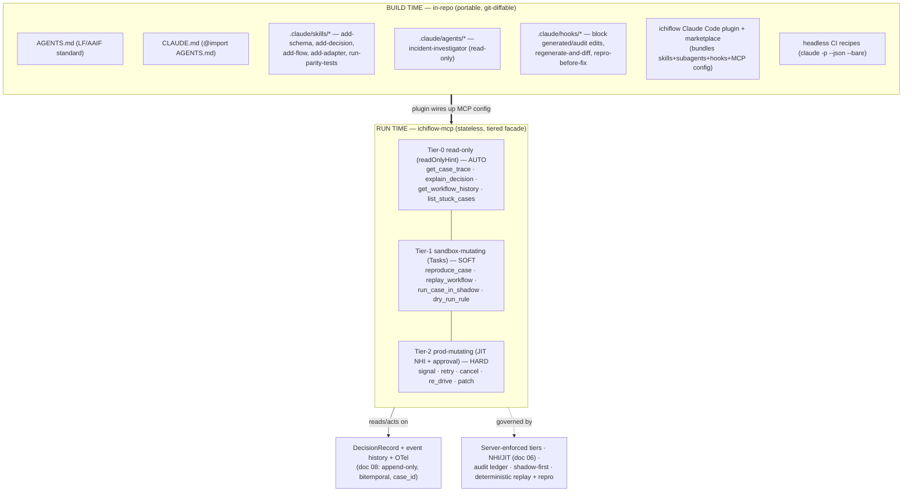
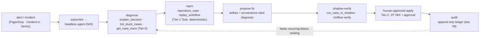

# 10 — The AI-Native Experience: Build Time to Run Time

> **What this covers.** How ichiflow makes AI coding agents (Claude Code first) first-class
> citizens across the whole lifecycle. **Build time:** the Workspace as an agent-operable repo,
> the in-repo agent kit ichiflow scaffolds (AGENTS.md + CLAUDE.md, skills, hooks, subagents, a
> plugin), and headless CI recipes. **Run time:** the first-party `ichiflow-mcp` server as a thin
> typed facade over the why API / case queries / flow histories, its tool catalog, the three
> server-enforced guardrail tiers, agents as non-human identities, deterministic replay + seeded
> repro, shadow-mode-first writes, the self-heal loop, and the governed Copilots (the three core
> Copilots plus a design-facing UI/Design Copilot on the same contract).
>
> **Position in the system.** This is the *AI-native surface* realizing locked decision §12 of
> [`BRIEF.md`](./BRIEF.md), grounded in research
> [`07-ai-native-operations.md`](../research/07-ai-native-operations.md) and
> [`06-migration-and-onboarding.md`](../research/06-migration-and-onboarding.md) (Copilots).
> Cross-refs: `08-audit-and-observability.md` (DecisionRecord, "why" API, `case_id`, deterministic
> replay — the substrate this doc exposes), `06-identity-and-access.md` (non-human identity, JIT,
> PDP), `03-decision-layer.md` (DMN authoring / business-user rule assistance),
> `09-deployment-and-topology.md` (the stateless MCP server, tiers, zones this rides on),
> `05-adapters.md` (declared ports as agent targets).

---

## 1. Position: legible is not enough — ichiflow is *operable by agents*

The rest of the architecture makes ichiflow **legible**: typed Schemas, declarative Decisions and
Flows, a per-`case_id` DecisionRecord, OTel correlation. Legible means a human or agent *could*
reconstruct what happened *if they knew where to look*. This document makes ichiflow **operable by
agents**: the framework hands the agent **typed tools, discovery, and safe actuators** so it can run
the loop *step in → inspect → hypothesize → reproduce → fix → verify* without bespoke glue and
without a human babysitting every step (research 07 §1).

Two surfaces, not one (research 07 §0.1):

- **Build time — an in-repo kit** (`AGENTS.md` + `.claude/`) so any agent that opens an ichiflow
  Workspace is productive in the first minute.
- **Run time — the `ichiflow-mcp` server**, a versioned *product feature* (like Temporal's,
  Grafana's, Sentry's MCP servers) that turns the running system's own audit/observability
  primitives into typed, queryable, tiered agent tools.

One principle governs everything below: **"AI proposes; deterministic tools + humans dispose,"**
with **provenance on every proposal** (locked decisions §12, §13; brief vocabulary "Copilots").

---

## 2. Build time — the Workspace as an agent-operable repo

### 2.1 The Workspace is declarative artifacts + checked-in generated types

The **Workspace** (brief vocabulary) is the design-time git repo: Schemas, DecisionModels, Flows,
uischemas, Adapters, policies. Its structure is deliberately optimized for agents (research 07 §3.3,
"declare, don't code" synergy):

- **Declarative artifacts are the source of truth, not code.** A Schema is TypeSpec →
  OpenAPI/JSON Schema; a Decision is DMN; a Flow is CNCF-Serverless-Workflow-aligned **canonical
  JSON** — which an agent authors as **typed TS/Kotlin flow-builder code (compiled one-way to the
  canonical JSON), YAML, or via AI chat** (doc 04 §2.5, ADR-0004), with `authored-in` provenance on the
  result; an Adapter is an AsyncAPI/OpenAPI-described port (locked decisions §2, §5). These are **data
  an agent can propose and a human can diff** — the same rationale as contract-first APIs.
- **Generated types are checked in.** Fabrikt (Kotlin) and hey-api/orval (TS) outputs are committed
  to the repo (locked decision §5), so an agent sees the full typed surface without a build step and
  a reviewer diffs generated changes alongside the artifact that produced them.
- **Deterministic codegen with regenerate-and-diff CI.** Codegen is pinned and deterministic; a CI
  job **regenerates from the canonical artifacts and fails if the committed output differs.** This
  guarantees the checked-in types always match the artifacts — an agent can trust them, and a
  hand-edit to generated code is caught. (This is the runtime-independence property doc 09 §9 relies
  on: artifacts are canonical, generators are swappable.)

The result: an agent's build-time loop is *edit a declarative artifact → regenerate → validate
against schema → `ichiflow verify`* — a tight, verifiable, deterministic loop, not free-form coding.
The regenerate step is kept sub-second by the **`ichiflow watch` / incremental-regen affordance**
(only the artifacts affected by the change are recompiled — [02-schema-foundation.md](02-schema-foundation.md)
§4.3), so many micro-edits do not each pay a full-tree regen cost.

**`ichiflow verify` is the single umbrella, and every gate emits structured JSON.** `ichiflow verify`
runs **all** artifact-class validators in one shot — schema round-trip/drift/oasdiff, DecisionModel
scenarios + coverage + the decision-source projection-coverage check, Flow interpreter vectors,
CodeSet referential integrity, policy golden tests, uischema drift + a11y/contrast — and emits one
**machine-readable JSON verdict** ([13-agent-harness-loops.md](13-agent-harness-loops.md) §3.1–§3.2 is
the full catalog + verdict schema; not duplicated here). The invariant an agent can rely on:
**every CI gate emits structured JSON diagnostics** (expected/actual/artifact), never human-log prose
— so a failure is always parseable, never a sentence to interpret.

### 2.2 The in-repo agent kit ichiflow scaffolds

`create-ichiflow` scaffolds the full kit (research 07 §3.1). The mental model: **AGENTS.md/CLAUDE.md
= always-on context · Skills = on-demand workflows · Subagents = isolated context · Hooks =
guaranteed automation · MCP = external services · Plugin = the packaging unit.**

| Artifact | Layer | What ichiflow ships | Why |
|---|---|---|---|
| **`AGENTS.md`** (repo root) | Cross-tool context | ichiflow overview, build/test/lint commands, conventions (canonical events, DecisionRecord, port/adapter model), "how to run the dev server", "how to reproduce a case" | LF/AAIF-stewarded de-facto standard read by 30+ agents; portable, not Claude-only |
| **`CLAUDE.md`** | Claude context | Claude-specific pointers; `@import`s AGENTS.md to avoid duplication | Claude Code's native persistent context |
| **`.claude/skills/*`** | Skills | `add-schema`, `add-decision`, `add-flow`, `add-adapter`, `run-parity-tests` (+ `debug-stuck-case`, `explain-decision`, `reproduce-incident`) — each a `SKILL.md` + helper scripts encoding *the ichiflow way* | Load on-demand, keep context lean, encode expert workflows so agents don't reinvent them |
| **`.claude/agents/*`** | Subagents | a read-only `incident-investigator` (trace-querying) and an `adapter-author` | Isolate verbose investigation; only the summary returns to the main thread |
| **`.claude/hooks/*`** | Hooks | **guaranteed guardrails**: block edits to generated/audit code, run **regenerate-and-diff** + schema-validation + `ichiflow verify` on stop, enforce **repro-before-fix** | Hooks are the *only* layer with guaranteed execution — the place for "must/never/always" |
| **ichiflow plugin** (+ marketplace) | Plugin | bundles skills + subagents + hooks + the `ichiflow-mcp` server config into one namespaced installable (`/ichiflow:debug-case`) | One install wires up the whole agent surface incl. the runtime MCP server |
| **SessionStart hook + `ichiflow verify` skill** | Hooks/Skills | ensure a fresh session can build, run tests, launch the dev server | Productive in minute one (esp. Claude Code on the web / CI) |
| **`resources` manifest** (`resources/`) | Pinned reference pointers | a schema'd, versioned topic→authoritative-reference map (§2.5), **pinned to the dependency version in use** (Drools/Apache KIE, Temporal, OpenFGA, adapters); skills consult it before non-trivial authoring; air-gapped installs resolve to vendored copies | Give agents version-matched authoritative refs instead of stale training data on fast-moving deps |

The five **core build-time skills** map one-to-one onto the declarative artifacts: `add-schema`
(TypeSpec + regenerate), `add-decision` (**decision source** authoring — full-DMN projection, or a
first-class AI-authorable DRL/rule-unit/CEP escape hatch — + simulate, doc 03 §2.6, §4.3; the skill
**tells the agent to consult `resources: decision-layer` (§2.5) before authoring non-trivial FEEL or
any engine-native artifact**, so it reasons from the pinned DMN/FEEL/Drools references, not training
recall),
`add-flow` (typed flow-builder code or Serverless-Workflow YAML → canonical JSON, with a `compute`
step or a declared `x-<org>/<stepType>` extension step for typed computation, doc 04 §2.5–§2.7),
`add-adapter` (AsyncAPI/OpenAPI port + boundary validation), `run-parity-tests` (decision parity
harness, research 06 §A.6.3 — legacy-vs-migrated DMN over a golden dataset).

**Artifact-type discovery is one call.** An agent onboarding to a Workspace enumerates every governed
artifact class — Schema, DecisionModel, CodeSet, Flow, compute-step, uischema/viewschema/pageschema/
copyset, Entitlement, Portal, Adapter, tokens, Harness, resources manifest — with each class's canonical JSON Schema,
authoring surfaces, and declared extension seams via **`ichiflow artifacts list --json`** (CLI) or the
Tier-0 MCP **`list_artifact_types`** tool ([02-schema-foundation.md](02-schema-foundation.md) §10). This
is the *global* artifact-type index that complements the per-CodeSet dependency graph (doc 02 §9.4), so
an agent discovers what it can author without reading the docs first.

**The guaranteed-execution hooks are dev/env-scoped, not blanket blockers.** The scaffolded hooks
(block-generated-edits, regenerate-and-diff, `repro-before-fix`) are guardrails, but two are explicitly
**scoped so they never block greenfield dev iteration**: **`repro-before-fix`** applies to
**fixes-against-existing-cases** (a bug fix must show the reproducing case going red→green, §4) and is a
**no-op / advisory in greenfield authoring**, where there is no captured Case to reproduce; and the
**block-generated-edits** hook **logs-not-blocks under `governance: off`** (Dev, doc 03 §5.6) while
still hard-blocking at `full`. A runtime-incident discipline is thus never applied unconditionally to a
dev-tier agent authoring something brand-new.

### 2.3 Headless CI recipes

Claude Code runs non-interactively (`claude -p --output-format json --bare`; Agent SDK); ichiflow
ships reference recipes (research 07 §3.2):

- **PR authoring:** an agent generates/validates an Adapter or DecisionModel from a spec, runs the
  regenerate-and-diff gate + `ichiflow verify`, and comments on the PR.
- **Nightly triage:** a headless agent scans `list_stuck_cases`, opens issues with a diagnosis + a
  one-command repro handle.
- **On-incident:** a webhook triggers the diagnosis pipeline (§6) and posts a proposed fix as an
  artifact for human approval.

Recipes track `total_cost_usd` (per-model breakdown in the JSON output) and carry budget guards —
cost is a first-class CI concern (research 07 §3.2, §8.7).

### 2.4 Schema-driven mocks and test data (build-time DX)

Because the canonical OpenAPI/JSON Schema artifacts (doc 02) fully describe every boundary, the
Workspace supports a **mock-first** workflow with no running backend: **orval** (the named TS
generator, doc 02 §4.2) emits a typed client **+ Faker mock factories + MSW handlers** from one spec,
so a screen, a client, or a test renders against real, schema-correct data the moment the schema
exists. This is the substrate for the designer's live playground
([07-ui-and-portals.md](07-ui-and-portals.md) §14) and for front-end work that runs ahead of the
backend.

Two test-data capabilities round out the DX story:

- **A sample-Case fixture generator** seeds realistic Cases from a Schema + CodeSets + a Flow —
  including a plausible DecisionRecord, obligation checklist, task state, and per-field PDP verdicts —
  reusing the seeded-data / `reproduce_case` machinery (§3.2), so mocks and previews show believable
  Cases rather than lorem-ipsum.
- **Factories + anonymized-prod-subset tooling** let a developer generate fixtures for *their own*
  domain (not only the scaffolded sample) and derive a safe, anonymized subset of production data for
  local testing — closing the gap between the scaffold's demo data and a real domain.

### 2.5 The `resources` manifest — pinned, authoritative reference pointers

An agent authoring against a fast-moving dependency reasons from **training recall**, which goes stale
— nowhere more sharply than the decision layer, whose engine is **Apache KIE / Drools, an
Apache-incubation project mid-consolidation** (research [01](../research/01-rule-engines.md) §1.1, §9:
Kogito → Apache KIE, SonataFlow renames, DMN 1.6, KIE 10.2.0). A model trained a year earlier "knows"
a Kogito/`org.kie.kogito` world that no longer matches the pinned artifacts. The fix is a first-class
agent-kit artifact: a **`resources` manifest** — a **schema'd, versioned** map of **topics →
authoritative references**, scaffolded into the Workspace (`resources/`) beside `AGENTS.md` and
`.claude/`, and governed like any other contract.

For the decision layer, `resources: decision-layer` points at, among others:

- **Apache KIE / Drools docs** and the **version-matched release notes** for the pinned KIE version
  (10.2.0);
- the **OMG DMN 1.6 specification** and the **DMN-TCK repository** (the conformance source the
  engine-conformance harness pins, [13](13-agent-harness-loops.md) §2.b);
- a **FEEL reference** (and ichiflow's own **published FEEL-ambiguity resolutions**, doc 03 open-q4 —
  the semantics the FEEL-vectors harness freezes);
- **DRL / rule-units / CEP** authoring guides (the engine-native escape-hatch surface, doc 03 §4.3);
- **ichiflow's own decision-source spec** (doc 03 §2.6) and the **decision-layer harness fixtures**
  (the TCK subset, projection-coverage construct set, golden datasets) — so first-party references sit
  next to upstream ones.

The **doctrine**:

- **Pointers are PINNED to the dependency version in use.** The manifest carries the same pin as the
  engine (KIE 10.2.0), and **the manifest updates when the KIE pin updates** — the resource bump is
  part of the same gated change as the engine bump (the engine-upgrade harness,
  [13](13-agent-harness-loops.md) §2.b). A pointer never floats to "latest"; a v10.2 Workspace links
  v10.2 docs, not whatever the doc site serves today.
- **Skills reference manifest topics, not URLs.** A skill says *consult `resources: decision-layer`*
  (e.g. `add-decision` before non-trivial FEEL or any DRL/rule-unit/CEP artifact, §2.2), so the
  authoritative reference is resolved through the pinned manifest rather than baked into the skill or
  recalled from training.
- **Air-gapped installs resolve to vendored offline copies.** In a disconnected/self-hosted
  deployment (BRIEF §3) the manifest resolves each topic to a **vendored offline snapshot** shipped
  with the release, so the agent has the same references with no outbound network — the pin makes the
  offline copy unambiguous.

**This mechanism is generic — every subsystem gets a manifest.** Temporal, OpenFGA, and the Adapter
substrates each carry their own pinned `resources` topic on the identical schema; **the decision layer
(Drools/Apache KIE) is the exemplar and the one v1-mandatory manifest**, because its dependency churns
fastest and its authoring surface is the highest-value LLM path (ADR-0027). Other subsystems' manifests
follow the same doctrine as they harden.

At run time the same pointers are one call away: **`ichiflow-mcp` exposes a Tier-0 `get_resources(topic)`
tool** (§3.2) returning the pinned reference set for a topic, so a runtime agent debugging a decision
gets the *same* version-matched references a build-time agent authored against — one source of truth
for "where is the authoritative doc," build time and run time.

---

## 3. Run time — the `ichiflow-mcp` server

### 3.1 Principle: expose the domain's own observability, not a generic log tool

`ichiflow-mcp` is a **thin, typed, tiered facade** over primitives that already exist in doc 08: the
per-`case_id` DecisionRecord (workflow events + fired-rules trace + DMN results + agent reasoning +
human review + outcome), append-only and bitemporal, plus the Flow engine's query API (research 07
§4.1). **The "why" API is the debugging API** — there is no parallel agent-debugging layer (research
07 §0.2, the single highest-leverage decision). Agents debug by *querying structured decision
lineage*, never by grepping raw logs.

Design properties (research 07 §4.3): **stateless** (MCP `2026-07-28`, so it scales horizontally per
doc 09 §8, no sticky sessions); **long ops modeled as MCP Tasks** (`reproduce_case`,
`replay_workflow`); **full JSON Schema 2020-12 tool contracts** reusing ichiflow's own Schemas
(locked decision §5); **pagination/filtering defaults on every list/history tool**; **structured
classified errors** with retry guidance; and **self-observability** — the server emits its own OTel
spans and audit entries, so agent actions are themselves traceable.

### 3.2 Tool catalog (small sharp default set; advanced opt-in)

Following the Temporal-MCP pattern (small default set, opt-in for power; research 07 §4.2):

**Tier-0 — read-only (`readOnlyHint: true`, auto-approvable)**
- `get_case_trace(case_id, as_of?)` → the full DecisionRecord as structured JSON (paginated).
- `explain_decision(case_id)` → the "why" answer: which rules fired, DMN rows matched, inputs
  known, outcome — the *same* object a human/auditor UI renders (doc 08).
- `get_workflow_history(workflow_id, limit=200, page?)` → Temporal-style event history, paginated.
- `list_stuck_cases(since, stage?, error_class?)` → structured, filtered triage feed.
- `get_case_documents(case_id)` → the issued **`Document`**s for a Case (doc 04 §2.9) — reference number,
  version, lifecycle status, `doctemplate` pin, verification hash — **PDP-scoped** so a caller sees only
  Documents it may see (doc 07 §15.6). Read-only.
- `get_resources(topic)` → the **pinned, authoritative reference set** for a topic (§2.5) — e.g.
  `decision-layer` returns the version-matched Drools/DMN/DMN-TCK/FEEL/decision-source pointers (or
  their vendored offline copies in an air-gapped install), so a runtime agent reasons from the same
  references a build-time agent authored against.
- **Visual projections** ([15-visualization.md](15-visualization.md) §4.3; ADR-0034) → each returns
  the **same** JSON-graph + Mermaid text a human sees rendered in `ichiflow preview`, PDP-scoped:
  `get_flow_graph(flow_ref, as_of?)` (the flow graph), `get_decision_drd(decision_ref)` (the DRD +
  boxed-expression/table view), `get_workspace_map(focus?, team?, case_type?, hops?)` (the
  **connection map** — how artifacts depend on each other, §3), `get_case_journey(case_id, as_of?)`
  (the per-Case **journey view** — path walked, current position, waiting-on state, from the
  DecisionRecord + event history), and `get_set_journey(cohort_id | bundle_case_id)` (cohort/bundle
  roll-up). Pure reads over artifacts + the DecisionRecord, so Tier-0 by construction.
- (+ `query_workflow_state`, `find_cases(filter)`, deeplink generators, `get_otel_trace` — the
  `case_id`↔`trace_id` join is ichiflow's value-add over a generic OTel MCP.)

**Tier-1 — sandbox-mutating (non-prod; MCP Tasks; `destructiveHint: false`)**
- `reproduce_case(case_id)` → **Task**: seed a local/branch replica from captured event history +
  seeded data → one-command repro handle (Neon-branch / seeded-data pattern).
- `replay_workflow(workflow_id, code_ref)` → **Task**: deterministic replay of event history against
  a candidate code version → divergence / non-determinism report.
- `run_case_in_shadow(case_id, candidate)` → run a proposed change beside prod behavior, log
  disagreements (GitHub-Scientist-style, research 06 §A.6.2).
- `dry_run_rule(rule, inputs)` / `simulate_decision(...)` → evaluate a candidate DMN without side
  effects.

**Tier-2 — production-mutating (JIT non-human identity + human approval + audit; `destructiveHint: true`)**
- `signal_workflow` · `retry_activity` · `cancel_workflow` · `re_drive_case` · `patch_case_data` ·
  `reissue_document` · `revoke_document` (the last two mutate an issued Document's lifecycle — reissue a new
  version / revoke on clawback, doc 04 §2.9.2 — as audited DecisionRecord events, doc 08 §1.6).
  Every call: a scoped short-lived credential, an approval gate, and an entry in the audit ledger
  (doc 08) attributing the action to the agent's non-human identity. **Prefer re-drive/repro over
  in-place mutation** wherever possible (research 07 §8.3).

### 3.3 Three server-enforced guardrail tiers

Tool annotations *hint* to the client, but **ichiflow enforces server-side, because "an untrusted
server can lie"** and a `readOnlyHint` bug that mutates is catastrophic (research 07 §5.1, §8.1):

| Tier | Hint | Client behavior | **Server enforcement** |
|---|---|---|---|
| **0 read-only** | `readOnlyHint: true` | may auto-approve | verify the tool has no write path; scope identity to read roles |
| **1 sandbox-mutating** | `destructiveHint: false`, non-prod | usually soft-approve | **force target = staging/branch replica; block prod endpoints at the transport** |
| **2 prod-mutating** | `destructiveHint: true` | **must** confirm | **JIT short-lived scoped credential + human approval + audit entry; kill-switch honored** |

These tiers are **one of the mediation layers an org's production-access posture dials** — the *agent*
path. A deployment's posture (`zero-direct-access` / `agents-mediated-humans-conventional` / `custom`)
selects how strictly the mediated paths are mandatory versus how much conventional access remains; the
tiers themselves are always enforced server-side. See
[`09-deployment-and-topology.md`](09-deployment-and-topology.md) §6.3 and ADR-0020 for the dial, its
levels, and the sibling mediation layers (why API, human ops console, env promotion, loud/logged
break-glass). **v1 phasing (ADR-0024):** the sibling **human ops console is not built as a UI in v1** —
in v1 the human operator's path *is* these `ichiflow-mcp` Tier-2 actuators in Claude Code (the console
is the same human PEP over the same actuators, a post-v1 builder surface; see
[`07-ui-and-portals.md`](07-ui-and-portals.md) §7.2 and doc 12 class D3). The env-promotion,
break-glass, and why-API mediation layers are all v1.

### 3.4 Agents as non-human identities

Every agent is a **first-class non-human identity (NHI)**, not a shared service account
(research 07 §5.2; cross-ref `06-identity-and-access.md`): a **human owner**, **JIT provisioning**,
**no credential valid > 1h**, automatic expiry, **instant kill switch**. **JIT duration is tied to a
risk score** (privilege × data-sensitivity × blast radius) — long windows for low-risk reads,
deliberately short for prod/customer-data writes. This maps to OWASP Agentic Top-10 ASI03
(Identity & Privilege Abuse); the framework makes the *secure* path the default. Every agent action
is audited into the **same append-only ledger** as human and decision actions (doc 08), attributed
to the NHI, with the approval record and tool inputs/outputs.

### 3.5 The MCP tool-extension SPI — apps register their own domain tools

`ichiflow-mcp`'s default catalog (§3.2) is a small, sharp set over the why/case/flow primitives — but
for an LLM-native framework the catalog cannot be **closed to the domain**. An application built on
ichiflow (a permit app, a claims app) registers its **own schema'd domain tools** into the *same*
server through a declared **MCP tool-extension SPI** (BRIEF §21; the "closed core, declared extension
points" doctrine, [00-vision-and-principles.md](00-vision-and-principles.md)):

- **Schema'd, reusing the app's own contracts.** A domain tool (e.g. `simulate_permit_fee`,
  `check_zoning_eligibility`) declares its I/O as **JSON Schema 2020-12 reusing the app's canonical
  Schemas** ([02-schema-foundation.md](02-schema-foundation.md) §10) — no adapter, the same document
  that validates the API boundary constrains the tool call.
- **Each tool declares its guardrail tier, enforced server-side identically to first-party tools.** A
  registered tool declares Tier-0 / Tier-1 / Tier-2, and the server enforces it **exactly as for the
  built-in catalog** (§3.3): a registered Tier-0 tool is proven to have no write path; a registered
  Tier-2 tool gets JIT-NHI + human approval + an audit-ledger entry. An app **cannot** self-grant a
  weaker guardrail than its declared risk — tiering is server-side, because "an untrusted registration
  can lie" the same way an untrusted server can.
- **Discoverable via the artifact catalog.** Registered tools are governed Workspace artifacts and
  surface in `list_artifact_types` / `ichiflow artifacts list` (§2.2) and in MCP tool discovery, so an
  agent enumerates first-party and app-domain tools uniformly.
- **Additive, not a fork.** Adding a domain tool is a declared artifact + a PR — never patching the
  server — so the MCP surface grows with the app while the guardrail enforcement stays first-party.

This makes `ichiflow-mcp` a **facade an app extends**, not a fixed shim: the same three-tier safety
model covers every tool an agent can call, whether ichiflow shipped it or the app declared it.

---

## 4. Determinism + one-command repro make agent debugging *verifiable*

Agent debugging is trustworthy only if the substrate is deterministic and reproducible — otherwise it
is vibes (research 07 §6.2, the real differentiator). ichiflow provides, **by construction**:

1. **Deterministic replay** — the event-sourced decision/flow core (doc 08) means replay
   reconstructs exact state; an agent's hypothesis is *verifiable* and non-determinism is *detectable*
   (`replay_workflow` divergence report).
2. **Seeded data + captured event history → one-command repro env** (`reproduce_case`) so every
   incident is reproducible locally or in a branch — the antidote to "works on my machine" and to
   hallucinated fixes.
3. **Bitemporal "as-of" queries** (doc 08) so the agent debugs against *what was known at decision
   time*, not today's data.
4. **Structured provenance as the query target** — diagnoses cite specific fired rules / DMN rows /
   inputs, not prose guesses.
5. **`ichiflow verify` gate + repro-before-fix hook** — the agent must reproduce the failure and show
   the fix passing against the captured case before a human approves (enforced by a §2.2 hook).
   `ichiflow verify` is the single entry point to the per-subsystem **deterministic harness loops** —
   machine-readable pass/fail verdicts and enumerable "how much is done" — specified in
   [`13-agent-harness-loops.md`](13-agent-harness-loops.md) (scoped verify on write via hooks, full
   verify in CI; `get_verify_status` is the Tier-0 read tool over the progress ledger).

The determinism discipline has a cost worth stating loudly (research 07 §8.8): replay only works if
the decision core stays deterministic (scoped event sourcing, doc 08) and **non-deterministic
activities are isolated behind the port/adapter model** (`05-adapters.md`). This constrains how Flows
and Adapters are written — deliberately.

---

## 5. Shadow mode as the default write posture

Before an agent may mutate production it operates in **shadow / read-only + propose** mode
(research 07 §0.6, §5.4): it produces a diagnosis, a repro, and a proposed patch/signal *as an
artifact for human approval*, comparing against production behavior without altering it. Promotion
from shadow to Tier-2 is an explicit, audited step. Sandboxed staging replicas / branch-per-
investigation ensure an agent's mutations never touch prod data during diagnosis. *"Shadow mode is
the safest way to make an agent face reality before reality has to face the agent."*

---

## 6. The self-heal loop

ichiflow supports the end-to-end loop, integrating (not replacing) Sentry/PagerDuty-class tooling
(research 07 §6):

The **Sentry Seer** split is the reference architecture (research 07 §2.3, §6.1): *diagnose here,
hand the fix to a coding agent*. ichiflow's differentiator is the **deterministic, provenance-rich
substrate underneath** — the diagnosis cites fired rules and DMN rows, the repro is exact, and the
verification is against the real failing Case. ichiflow **integrates** with on-call/incident tooling
(which owns paging/escalation), it does not reinvent it.

---

## 7. The governed Copilots — framework features (post-v1)

The Copilots are **framework features with hard guardrails**, not a chat bolt-on (locked decision
§12, §13; research 06). **All Copilots are post-v1** (ADR-0017): the packaged Copilot UX ships after
v1, but — crucially — the artifacts they assist with are **plain declarative data** authorable by a
human or agent *without* the Copilot (Ring-0 migration mapping is data, DMN and uischema/pageschema are
authored directly), so greenfield, brownfield, and design on-ramps all survive the deferral. In v1,
assistance is the **AI-chat-first authoring doctrine** (ADR-0019; "Chat to author, preview to judge"):
the AI authors the canonical artifact from conversation and the human judges via read-only preview /
simulation — the Copilots below are that same interaction pattern, packaged and specialized per persona.

All obey **"AI proposes; deterministic tools + humans dispose,"** with **provenance on every
proposal**. The three core Copilots (BRIEF vocabulary) target the business user and the migrator; a
fourth, **design-facing** Copilot rides the identical guardrail DNA to give the UX-designer persona an
AI on-ramp that is peer to the business user's (its omission would be a tell that designers are
second-party):

| Copilot | Direction | What it does | Deterministic backstop |
|---|---|---|---|
| **Domain Modeling Copilot** | greenfield front door | Interviews a business user ("what decisions does this process make? what data do you store? who reviews exceptions?") → draft Schema + DMN skeleton + Flow with human-task steps | schema validation; parity tests before any rule is authoritative (research 06 §B.3.2) |
| **Migration Copilot** | brownfield back door | Introspects legacy DB → proposes canonical mappings (ranked, with confidence + rationale) → expand/contract plan → reconciliation + **decision-parity** tests | Atlas lint (50+ analyzers) + pgroll execute; dry-run; never touches prod (research 06 §A.5.3) |
| **Rule Authoring assistance** | business-user, in-context | Guides a business user authoring + testing DMN rules; suggests conditions, generates test cases | DMN simulation + decision-parity harness (cross-ref `03-decision-layer.md`) |
| **UI / Design Copilot** | designer, in-context | Proposes a uischema/pageschema variant from a target Schema (optionally *seeded by* imported brand tokens or an exported Figma frame as **reference only** — not a two-way hi-fi round-trip / Code-Connect-class bridge; ADR-0019); suggests a11y fixes; applies a brand across screens; drafts microcopy / `copyset` | drift lint + axe-core/contrast + token-contract lint; renders live in the playground (`07-ui-and-portals.md` §11) for approval; lands as a `contracts/ui`/`tokens` PR |

**Shared guardrail DNA** (research 06 §A.5.2, §A.5.3): a workspace where AI proposes and a human
reviews/edits **every** object; explainability for each proposal; learning from human corrections; a
functional-equivalence/parity assessment step; and **conversion never applied straight to
production** — it lands in a reviewable, parity-tested target first. Every mapping decision, migration
approval, and parity result is logged to the append-only **DecisionRecord** (doc 08), so an auditor
can answer "why was this column mapped this way / this migration approved."

**The Copilot set is not a closed core — it is additive instances of one pattern.** Each Copilot is
"the existing Copilot pattern pointed at different artifacts + checks" (§7.1): a **persona + an
artifact API it proposes against + a deterministic backstop**. A fifth Copilot is therefore a new
*instance* of the same guardrail DNA, not a core change — consistent with the "closed core, declared
extension points" doctrine (BRIEF §21; [00-vision-and-principles.md](00-vision-and-principles.md)). The
four named here are the v1-scoped set (all post-v1 as packaged UX); new personas ride the identical
propose/dispose/provenance rails.

### 7.1 Business-user AI assistance

The Domain Modeling and Rule Authoring Copilots are the **business user's** on-ramp (persona in the
brief). The Domain Modeling Copilot runs a **domain-mapping interview** that emits a *draft* the user
refines — and wires to the Migration Copilot when a legacy DB already exists (both converge on the
same canonical model; research 06 cross-cutting synthesis). Rule Authoring assistance gives
**rule-authoring + testing guidance** in-context: it proposes DMN conditions and generates parity/
test cases, but a rule is not authoritative until confirmed and parity-tested. Detailed authoring UX,
DMN governance, and simulation live in `03-decision-layer.md`; this doc governs the *AI-assistance
contract* over them.

The **UI / Design Copilot** is the **designer's** peer on-ramp: it proposes uischema/pageschema
variants, a11y fixes, brand applications, and microcopy/`copyset` drafts, but — like every Copilot —
it only *proposes*. The playground (`07-ui-and-portals.md` §11) is its review surface (as the
DecisionRecord is for the rule Copilots), the designer safety-contract checks (`07` §12) are its
deterministic *dispose*, and the Workspace PR is its landing. So it is not new infrastructure — it is
the existing Copilot pattern pointed at the designer artifacts and checks.

---

## Open questions

1. **MCP spec targeting.** Build to `2026-07-28` (stateless, Tasks, full JSON Schema) with a
   `2025-11-25` fallback; the RC is the biggest revision since launch (research 07 §8.2). How long to
   carry the fallback, and whether to model ichiflow capabilities as Extensions to isolate from
   core-spec churn, is open.
2. **Tier-1 → Tier-2 promotion policy.** What concrete signal (shadow-parity streak, approver role,
   risk score) unlocks an agent's promotion from propose-only to prod-mutating? Needs a governed,
   auditable policy, not an ad-hoc toggle.
3. **Code-execution MCP mode.** For very large event histories/traces, the Anthropic
   code-execution-with-MCP pattern (150k→2k tokens) filters in the execution env before returning to
   the model. Whether this ships in v1 or later is undecided (research 07 §2.4, §8.5).
4. **Governance mapping.** NIST AI Agent/Interoperability Profile (Q4 2026), EU AI Act high-risk
   deadlines, OWASP Agentic Top-10 are all moving. Structure audit/approval to map onto whichever
   lands — but the concrete mapping is a follow-up (research 07 §8.6).
5. **Copilot model/cost governance.** Headless CI agents and the Agent SDK billing change
   (research 07 §8.7) make cost a governance concern; per-Workspace budget policy and `total_cost_usd`
   enforcement need a home.
6. **"Why" API contract stability.** The DecisionRecord typed schema serves humans, adverse-action
   letters, *and* agents from one source (doc 08 open question). Its versioning cadence directly gates
   the MCP tool contract — the two must not drift.
