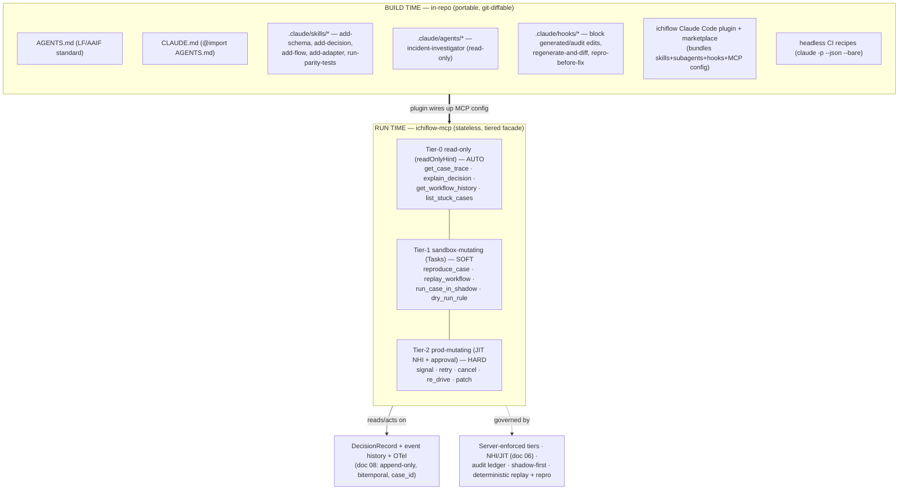
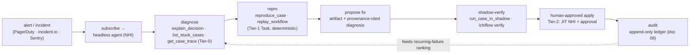

# 10 — The AI-Native Experience: Build Time to Run Time

> **What this covers.** How ichiflow makes AI coding agents (Claude Code first) first-class
> citizens across the whole lifecycle. **Build time:** the Workspace as an agent-operable repo,
> the in-repo agent kit ichiflow scaffolds (AGENTS.md + CLAUDE.md, skills, hooks, subagents, a
> plugin), and headless CI recipes. **Run time:** the first-party `ichiflow-mcp` server as a thin
> typed facade over the why API / case queries / flow histories, its tool catalog, the three
> server-enforced guardrail tiers, agents as non-human identities, deterministic replay + seeded
> repro, shadow-mode-first writes, the self-heal loop, and the three governed Copilots.
>
> **Position in the system.** This is the *AI-native surface* realizing locked decision §12 of
> [`BRIEF.md`](./BRIEF.md), grounded in research
> [`07-ai-native-operations.md`](../research/07-ai-native-operations.md) and
> [`06-migration-and-onboarding.md`](../research/06-migration-and-onboarding.md) (Copilots).
> Cross-refs: `08-audit-and-observability.md` (DecisionRecord, "why" API, `case_id`, deterministic
> replay — the substrate this doc exposes), `06-identity-and-access.md` (non-human identity, JIT,
> PDP), `03-decision-layer.md` (DMN authoring / business-user rule assistance),
> `09-deployment-and-topology.md` (the stateless MCP server, tiers, zones this rides on),
> `05-adapters.md` (declared ports as agent targets).

---

## 1. Position: legible is not enough — ichiflow is *operable by agents*

The rest of the architecture makes ichiflow **legible**: typed Schemas, declarative Decisions and
Flows, a per-`case_id` DecisionRecord, OTel correlation. Legible means a human or agent *could*
reconstruct what happened *if they knew where to look*. This document makes ichiflow **operable by
agents**: the framework hands the agent **typed tools, discovery, and safe actuators** so it can run
the loop *step in → inspect → hypothesize → reproduce → fix → verify* without bespoke glue and
without a human babysitting every step (research 07 §1).

Two surfaces, not one (research 07 §0.1):

- **Build time — an in-repo kit** (`AGENTS.md` + `.claude/`) so any agent that opens an ichiflow
  Workspace is productive in the first minute.
- **Run time — the `ichiflow-mcp` server**, a versioned *product feature* (like Temporal's,
  Grafana's, Sentry's MCP servers) that turns the running system's own audit/observability
  primitives into typed, queryable, tiered agent tools.

One principle governs everything below: **"AI proposes; deterministic tools + humans dispose,"**
with **provenance on every proposal** (locked decisions §12, §13; brief vocabulary "Copilots").

---

## 2. Build time — the Workspace as an agent-operable repo

### 2.1 The Workspace is declarative artifacts + checked-in generated types

The **Workspace** (brief vocabulary) is the design-time git repo: Schemas, DecisionModels, Flows,
uischemas, Adapters, policies. Its structure is deliberately optimized for agents (research 07 §3.3,
"declare, don't code" synergy):

- **Declarative artifacts are the source of truth, not code.** A Schema is TypeSpec →
  OpenAPI/JSON Schema; a Decision is DMN; a Flow is CNCF-Serverless-Workflow-aligned YAML; an
  Adapter is an AsyncAPI/OpenAPI-described port (locked decisions §2, §5). These are **data an agent
  can propose and a human can diff** — the same rationale as contract-first APIs.
- **Generated types are checked in.** Fabrikt (Kotlin) and hey-api/orval (TS) outputs are committed
  to the repo (locked decision §5), so an agent sees the full typed surface without a build step and
  a reviewer diffs generated changes alongside the artifact that produced them.
- **Deterministic codegen with regenerate-and-diff CI.** Codegen is pinned and deterministic; a CI
  job **regenerates from the canonical artifacts and fails if the committed output differs.** This
  guarantees the checked-in types always match the artifacts — an agent can trust them, and a
  hand-edit to generated code is caught. (This is the runtime-independence property doc 09 §9 relies
  on: artifacts are canonical, generators are swappable.)

The result: an agent's build-time loop is *edit a declarative artifact → regenerate → validate
against schema → `ichiflow verify`* — a tight, verifiable, deterministic loop, not free-form coding.

### 2.2 The in-repo agent kit ichiflow scaffolds

`create-ichiflow` scaffolds the full kit (research 07 §3.1). The mental model: **AGENTS.md/CLAUDE.md
= always-on context · Skills = on-demand workflows · Subagents = isolated context · Hooks =
guaranteed automation · MCP = external services · Plugin = the packaging unit.**

| Artifact | Layer | What ichiflow ships | Why |
|---|---|---|---|
| **`AGENTS.md`** (repo root) | Cross-tool context | ichiflow overview, build/test/lint commands, conventions (canonical events, DecisionRecord, port/adapter model), "how to run the dev server", "how to reproduce a case" | LF/AAIF-stewarded de-facto standard read by 30+ agents; portable, not Claude-only |
| **`CLAUDE.md`** | Claude context | Claude-specific pointers; `@import`s AGENTS.md to avoid duplication | Claude Code's native persistent context |
| **`.claude/skills/*`** | Skills | `add-schema`, `add-decision`, `add-flow`, `add-adapter`, `run-parity-tests` (+ `debug-stuck-case`, `explain-decision`, `reproduce-incident`) — each a `SKILL.md` + helper scripts encoding *the ichiflow way* | Load on-demand, keep context lean, encode expert workflows so agents don't reinvent them |
| **`.claude/agents/*`** | Subagents | a read-only `incident-investigator` (trace-querying) and an `adapter-author` | Isolate verbose investigation; only the summary returns to the main thread |
| **`.claude/hooks/*`** | Hooks | **guaranteed guardrails**: block edits to generated/audit code, run **regenerate-and-diff** + schema-validation + `ichiflow verify` on stop, enforce **repro-before-fix** | Hooks are the *only* layer with guaranteed execution — the place for "must/never/always" |
| **ichiflow plugin** (+ marketplace) | Plugin | bundles skills + subagents + hooks + the `ichiflow-mcp` server config into one namespaced installable (`/ichiflow:debug-case`) | One install wires up the whole agent surface incl. the runtime MCP server |
| **SessionStart hook + `ichiflow verify` skill** | Hooks/Skills | ensure a fresh session can build, run tests, launch the dev server | Productive in minute one (esp. Claude Code on the web / CI) |

The five **core build-time skills** map one-to-one onto the declarative artifacts: `add-schema`
(TypeSpec + regenerate), `add-decision` (DMN authoring + simulate), `add-flow` (Serverless-Workflow
YAML), `add-adapter` (AsyncAPI/OpenAPI port + boundary validation), `run-parity-tests` (decision
parity harness, research 06 §A.6.3 — legacy-vs-migrated DMN over a golden dataset).

### 2.3 Headless CI recipes

Claude Code runs non-interactively (`claude -p --output-format json --bare`; Agent SDK); ichiflow
ships reference recipes (research 07 §3.2):

- **PR authoring:** an agent generates/validates an Adapter or DecisionModel from a spec, runs the
  regenerate-and-diff gate + `ichiflow verify`, and comments on the PR.
- **Nightly triage:** a headless agent scans `list_stuck_cases`, opens issues with a diagnosis + a
  one-command repro handle.
- **On-incident:** a webhook triggers the diagnosis pipeline (§6) and posts a proposed fix as an
  artifact for human approval.

Recipes track `total_cost_usd` (per-model breakdown in the JSON output) and carry budget guards —
cost is a first-class CI concern (research 07 §3.2, §8.7).

---

## 3. Run time — the `ichiflow-mcp` server

### 3.1 Principle: expose the domain's own observability, not a generic log tool

`ichiflow-mcp` is a **thin, typed, tiered facade** over primitives that already exist in doc 08: the
per-`case_id` DecisionRecord (workflow events + fired-rules trace + DMN results + agent reasoning +
human review + outcome), append-only and bitemporal, plus the Flow engine's query API (research 07
§4.1). **The "why" API is the debugging API** — there is no parallel agent-debugging layer (research
07 §0.2, the single highest-leverage decision). Agents debug by *querying structured decision
lineage*, never by grepping raw logs.

Design properties (research 07 §4.3): **stateless** (MCP `2026-07-28`, so it scales horizontally per
doc 09 §8, no sticky sessions); **long ops modeled as MCP Tasks** (`reproduce_case`,
`replay_workflow`); **full JSON Schema 2020-12 tool contracts** reusing ichiflow's own Schemas
(locked decision §5); **pagination/filtering defaults on every list/history tool**; **structured
classified errors** with retry guidance; and **self-observability** — the server emits its own OTel
spans and audit entries, so agent actions are themselves traceable.

### 3.2 Tool catalog (small sharp default set; advanced opt-in)

Following the Temporal-MCP pattern (small default set, opt-in for power; research 07 §4.2):

**Tier-0 — read-only (`readOnlyHint: true`, auto-approvable)**
- `get_case_trace(case_id, as_of?)` → the full DecisionRecord as structured JSON (paginated).
- `explain_decision(case_id)` → the "why" answer: which rules fired, DMN rows matched, inputs
  known, outcome — the *same* object a human/auditor UI renders (doc 08).
- `get_workflow_history(workflow_id, limit=200, page?)` → Temporal-style event history, paginated.
- `list_stuck_cases(since, stage?, error_class?)` → structured, filtered triage feed.
- (+ `query_workflow_state`, `find_cases(filter)`, deeplink generators, `get_otel_trace` — the
  `case_id`↔`trace_id` join is ichiflow's value-add over a generic OTel MCP.)

**Tier-1 — sandbox-mutating (non-prod; MCP Tasks; `destructiveHint: false`)**
- `reproduce_case(case_id)` → **Task**: seed a local/branch replica from captured event history +
  seeded data → one-command repro handle (Neon-branch / seeded-data pattern).
- `replay_workflow(workflow_id, code_ref)` → **Task**: deterministic replay of event history against
  a candidate code version → divergence / non-determinism report.
- `run_case_in_shadow(case_id, candidate)` → run a proposed change beside prod behavior, log
  disagreements (GitHub-Scientist-style, research 06 §A.6.2).
- `dry_run_rule(rule, inputs)` / `simulate_decision(...)` → evaluate a candidate DMN without side
  effects.

**Tier-2 — production-mutating (JIT non-human identity + human approval + audit; `destructiveHint: true`)**
- `signal_workflow` · `retry_activity` · `cancel_workflow` · `re_drive_case` · `patch_case_data`.
  Every call: a scoped short-lived credential, an approval gate, and an entry in the audit ledger
  (doc 08) attributing the action to the agent's non-human identity. **Prefer re-drive/repro over
  in-place mutation** wherever possible (research 07 §8.3).

### 3.3 Three server-enforced guardrail tiers

Tool annotations *hint* to the client, but **ichiflow enforces server-side, because "an untrusted
server can lie"** and a `readOnlyHint` bug that mutates is catastrophic (research 07 §5.1, §8.1):

| Tier | Hint | Client behavior | **Server enforcement** |
|---|---|---|---|
| **0 read-only** | `readOnlyHint: true` | may auto-approve | verify the tool has no write path; scope identity to read roles |
| **1 sandbox-mutating** | `destructiveHint: false`, non-prod | usually soft-approve | **force target = staging/branch replica; block prod endpoints at the transport** |
| **2 prod-mutating** | `destructiveHint: true` | **must** confirm | **JIT short-lived scoped credential + human approval + audit entry; kill-switch honored** |

### 3.4 Agents as non-human identities

Every agent is a **first-class non-human identity (NHI)**, not a shared service account
(research 07 §5.2; cross-ref `06-identity-and-access.md`): a **human owner**, **JIT provisioning**,
**no credential valid > 1h**, automatic expiry, **instant kill switch**. **JIT duration is tied to a
risk score** (privilege × data-sensitivity × blast radius) — long windows for low-risk reads,
deliberately short for prod/customer-data writes. This maps to OWASP Agentic Top-10 ASI03
(Identity & Privilege Abuse); the framework makes the *secure* path the default. Every agent action
is audited into the **same append-only ledger** as human and decision actions (doc 08), attributed
to the NHI, with the approval record and tool inputs/outputs.

---

## 4. Determinism + one-command repro make agent debugging *verifiable*

Agent debugging is trustworthy only if the substrate is deterministic and reproducible — otherwise it
is vibes (research 07 §6.2, the real differentiator). ichiflow provides, **by construction**:

1. **Deterministic replay** — the event-sourced decision/flow core (doc 08) means replay
   reconstructs exact state; an agent's hypothesis is *verifiable* and non-determinism is *detectable*
   (`replay_workflow` divergence report).
2. **Seeded data + captured event history → one-command repro env** (`reproduce_case`) so every
   incident is reproducible locally or in a branch — the antidote to "works on my machine" and to
   hallucinated fixes.
3. **Bitemporal "as-of" queries** (doc 08) so the agent debugs against *what was known at decision
   time*, not today's data.
4. **Structured provenance as the query target** — diagnoses cite specific fired rules / DMN rows /
   inputs, not prose guesses.
5. **`ichiflow verify` gate + repro-before-fix hook** — the agent must reproduce the failure and show
   the fix passing against the captured case before a human approves (enforced by a §2.2 hook).

The determinism discipline has a cost worth stating loudly (research 07 §8.8): replay only works if
the decision core stays deterministic (scoped event sourcing, doc 08) and **non-deterministic
activities are isolated behind the port/adapter model** (`05-adapters.md`). This constrains how Flows
and Adapters are written — deliberately.

---

## 5. Shadow mode as the default write posture

Before an agent may mutate production it operates in **shadow / read-only + propose** mode
(research 07 §0.6, §5.4): it produces a diagnosis, a repro, and a proposed patch/signal *as an
artifact for human approval*, comparing against production behavior without altering it. Promotion
from shadow to Tier-2 is an explicit, audited step. Sandboxed staging replicas / branch-per-
investigation ensure an agent's mutations never touch prod data during diagnosis. *"Shadow mode is
the safest way to make an agent face reality before reality has to face the agent."*

---

## 6. The self-heal loop

ichiflow supports the end-to-end loop, integrating (not replacing) Sentry/PagerDuty-class tooling
(research 07 §6):

The **Sentry Seer** split is the reference architecture (research 07 §2.3, §6.1): *diagnose here,
hand the fix to a coding agent*. ichiflow's differentiator is the **deterministic, provenance-rich
substrate underneath** — the diagnosis cites fired rules and DMN rows, the repro is exact, and the
verification is against the real failing Case. ichiflow **integrates** with on-call/incident tooling
(which owns paging/escalation), it does not reinvent it.

---

## 7. The three Copilots — governed framework features

The Copilots are **framework features with hard guardrails**, not a chat bolt-on (locked decision
§12, §13; research 06). All three obey **"AI proposes; deterministic tools + humans dispose,"** with
**provenance on every proposal**:

| Copilot | Direction | What it does | Deterministic backstop |
|---|---|---|---|
| **Domain Modeling Copilot** | greenfield front door | Interviews a business user ("what decisions does this process make? what data do you store? who reviews exceptions?") → draft Schema + DMN skeleton + Flow with human-task steps | schema validation; parity tests before any rule is authoritative (research 06 §B.3.2) |
| **Migration Copilot** | brownfield back door | Introspects legacy DB → proposes canonical mappings (ranked, with confidence + rationale) → expand/contract plan → reconciliation + **decision-parity** tests | Atlas lint (50+ analyzers) + pgroll execute; dry-run; never touches prod (research 06 §A.5.3) |
| **Rule Authoring assistance** | business-user, in-context | Guides a business user authoring + testing DMN rules; suggests conditions, generates test cases | DMN simulation + decision-parity harness (cross-ref `03-decision-layer.md`) |

**Shared guardrail DNA** (research 06 §A.5.2, §A.5.3): a workspace where AI proposes and a human
reviews/edits **every** object; explainability for each proposal; learning from human corrections; a
functional-equivalence/parity assessment step; and **conversion never applied straight to
production** — it lands in a reviewable, parity-tested target first. Every mapping decision, migration
approval, and parity result is logged to the append-only **DecisionRecord** (doc 08), so an auditor
can answer "why was this column mapped this way / this migration approved."

### 7.1 Business-user AI assistance

The Domain Modeling and Rule Authoring Copilots are the **business user's** on-ramp (persona in the
brief). The Domain Modeling Copilot runs a **domain-mapping interview** that emits a *draft* the user
refines — and wires to the Migration Copilot when a legacy DB already exists (both converge on the
same canonical model; research 06 cross-cutting synthesis). Rule Authoring assistance gives
**rule-authoring + testing guidance** in-context: it proposes DMN conditions and generates parity/
test cases, but a rule is not authoritative until confirmed and parity-tested. Detailed authoring UX,
DMN governance, and simulation live in `03-decision-layer.md`; this doc governs the *AI-assistance
contract* over them.

---

## Open questions

1. **MCP spec targeting.** Build to `2026-07-28` (stateless, Tasks, full JSON Schema) with a
   `2025-11-25` fallback; the RC is the biggest revision since launch (research 07 §8.2). How long to
   carry the fallback, and whether to model ichiflow capabilities as Extensions to isolate from
   core-spec churn, is open.
2. **Tier-1 → Tier-2 promotion policy.** What concrete signal (shadow-parity streak, approver role,
   risk score) unlocks an agent's promotion from propose-only to prod-mutating? Needs a governed,
   auditable policy, not an ad-hoc toggle.
3. **Code-execution MCP mode.** For very large event histories/traces, the Anthropic
   code-execution-with-MCP pattern (150k→2k tokens) filters in the execution env before returning to
   the model. Whether this ships in v1 or later is undecided (research 07 §2.4, §8.5).
4. **Governance mapping.** NIST AI Agent/Interoperability Profile (Q4 2026), EU AI Act high-risk
   deadlines, OWASP Agentic Top-10 are all moving. Structure audit/approval to map onto whichever
   lands — but the concrete mapping is a follow-up (research 07 §8.6).
5. **Copilot model/cost governance.** Headless CI agents and the Agent SDK billing change
   (research 07 §8.7) make cost a governance concern; per-Workspace budget policy and `total_cost_usd`
   enforcement need a home.
6. **"Why" API contract stability.** The DecisionRecord typed schema serves humans, adverse-action
   letters, *and* agents from one source (doc 08 open question). Its versioning cadence directly gates
   the MCP tool contract — the two must not drift.
