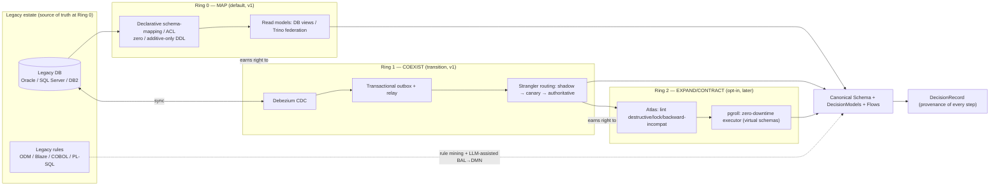

# 11 — Migration In and Out

> **What this covers.** Migration as a product pillar in **both directions**. Migration **IN**
> (brownfield adoption onto existing enterprise data and legacy rules): the three-ring model, rule
> migration from IBM ODM / FICO Blaze / legacy code, decision parity testing, and the Migration
> Copilot with its hard guardrails. Migration **OUT** (the anti-lock-in promise): everything
> exportable to open formats and named alternatives, with honest limits on DMN interchange fidelity.
>
> **Position in the system.** Migration is how a Case's data and a Decision's logic enter and leave
> ichiflow. IN feeds the canonical **Schema** (BRIEF §5), **DecisionModels** (DMN — see
> [`03-decision-layer.md`](./03-decision-layer.md)), and **Flows** (Temporal — research
> [`../research/02-workflow-orchestration.md`](../research/02-workflow-orchestration.md)); every
> migration proposal and approval lands in the **DecisionRecord** (research
> [`../research/05-audit-observability-deployment.md`](../research/05-audit-observability-deployment.md)).
> OUT is the reverse: the same canonical artifacts, exported. Grounded in research
> [`../research/06-migration-and-onboarding.md`](../research/06-migration-and-onboarding.md) (Part A)
> and [`../research/01-rule-engines.md`](../research/01-rule-engines.md) (§7–§8).
>
> Design docs for a system that does not exist yet: present tense = target; **v1** vs **later** marks
> phasing.

---

## 1. Position: migration is a two-way pillar, not a one-time import

Two locked stances (BRIEF §13) frame this document:

- **"Map first, migrate last."** Enterprises adopting ichiflow already run mission-critical systems
  on databases with years of data, foreign keys, triggers, and downstream consumers ichiflow will
  never see. The default posture is a **non-invasive overlay** with **zero or additive-only DDL** on
  day one; structural change is a later, opt-in, *assisted* step, never a precondition (research 06
  §A.0–A.1).
- **Migration OUT is as supported as migration IN.** Everything in ichiflow is exportable to open
  formats and documented exit paths. This is the anti-lock-in promise — a materially stronger exit
  story than ODM / Blaze / SMARTS / InRule / Nected can offer (research 01 §8.2), and it must be
  designed in, not bolted on.

The shared safety contract across every migration capability, both directions, is the framework-wide
rule: **AI proposes; deterministic tools + humans dispose** (BRIEF vocab; research 06 §A.5.3,
cross-cutting synthesis). Every AI step is a *recommender* behind human approval, dry-run, linting,
and verification.

---

# PART A — MIGRATION IN (brownfield adoption)

Adoption proceeds through **three concentric rings**, adopted in order. Each ring is opt-in and each
earns the right to the next; a customer can stop at any ring indefinitely.

## 2. The three-ring brownfield model

### 2.1 Ring 0 — Map, don't migrate (default; v1)

A **declarative schema-mapping layer** binds legacy tables/columns onto ichiflow's canonical domain
Schema. It is the DDD **Anti-Corruption Layer (ACL)** realized as *data, not translator code*
(research 06 §A.1.2). Backed at runtime by **read models** (DB views / federated queries via Trino
where data must not move), so the **legacy DB stays the source of truth**. DDL on day one is **zero
or additive-only**.

```yaml
# ichiflow canonical entity  <-  legacy binding (illustrative; research 06 §A.1.2)
entity: LoanApplication
source:
  table: LOAN_APPS            # legacy Oracle table, untouched
  primaryKey: APP_ID
fields:
  id:            { from: APP_ID }
  applicantName: { from: [FNAME, LNAME], transform: "concat($FNAME,' ',$LNAME)" }
  status:        { from: STAT_CD, valueMap: { A: APPROVED, D: DENIED, P: PENDING } }
  amount:        { from: LOAN_AMT, type: money(currency=CCY_CD) }
readModel: view              # materialize as a DB view / federated query
writePolicy: read-only       # default; writes require an approved Ring 1+ plan
```

Properties: the mapping is **introspectable and AI-authorable** (an agent proposes, a human diffs);
value transforms and **code-table normalization** (`STAT_CD` legacy codes → canonical enums) live in
one declarative place; and the **explicit `read-only` write policy** keeps Ring 0 non-invasive.
Upgrading to `read-write` is a governed decision, not a config flip.

### 2.2 Ring 1 — Coexist & sync (transition; v1)

When ichiflow must **own** some state, it coexists with the legacy store rather than replacing it:

- **CDC via Debezium** keeps legacy ↔ ichiflow stores consistent (Debezium is the healthy de-facto
  open CDC standard in 2026 — research 06 §A.2.1). For lighter adopters, native-DB change-streaming /
  a single-store outbox relay avoids a full Kafka Connect fleet.
- **Transactional outbox** writes the business change and an `outbox` row in **one transaction**; a
  relay (CDC tailing the outbox table) publishes canonical events — killing the **dual-write hazard**
  (research 06 §A.2.2). Dual-write in app code is an anti-pattern ichiflow never uses.
- **Strangler-fig routing** shifts slices of behavior over time behind a facade/gateway: a
  workflow/decision slice runs in ichiflow as a shadow, then canary, then authoritative — one slice
  at a time, never a big-bang rewrite (research 06 §A.1.3). Coexistence-phase consistency is the
  hardest problem here; expand/contract + outbox + idempotent consumers are the mitigations.

### 2.3 Ring 2 — Assisted expand/contract structural migration (opt-in; later)

Where new columns/tables are genuinely unavoidable, ichiflow performs **expand/contract (parallel
change)** — additive expand, dual-write transition, contract only once no reader depends on the old
shape (research 06 §A.3). The tooling (research 06 §A.4):

- **Atlas (ariga)** as the declarative schema-as-code engine — its 50+ safety analyzers lint for
  destructive / locking / backward-incompatible changes and drive the expand/contract plan;
- **pgroll** as the zero-downtime executor on PostgreSQL — virtual schemas expose old+new versions
  simultaneously, with automatic background backfill and reversibility;
- **Flyway Community** as the plain-SQL fallback adopters already trust.

Licensing hygiene (BRIEF §14): **Liquibase 5 (FSL) is avoided** as a core dependency; every migration
artifact is kept as portable plain data (SQL + declarative mapping) so the engine underneath is
swappable.

### 2.4 The three rings (diagram)



### 2.5 Migrating reference data and legacy outcome patterns

Two brownfield realities sit beside data and rules: existing **published code tables**, and legacy
**outcome/submission shapes** that the mapping layer must model without structural migration.

#### 2.5a Import existing code tables into governed CodeSets

Legacy systems carry published **code tables** — reason codes, condition codes, cancellation reasons,
field-eligibility (non-amendable-field) lists, and tariff/rate tables — often with legal meaning and a
dated revision history. Migration IN ingests these into governed **CodeSets**
([02-schema-foundation.md](./02-schema-foundation.md) §9.1), **preserving historical, effective-dated
versions** so that a past Case remains reconstructable against the **code meanings in force at its
decision time** (bitemporal as-of, [08-audit-and-observability.md](./08-audit-and-observability.md) §3).
Importing a code table is a Ring 0 mapping activity: an agent proposes the CodeSet rows + display
metadata, a human diffs and approves, and the result is a versioned artifact — not a free-string enum
buried in a rule.

#### 2.5b Map legacy immutable-message and composite-authority patterns onto the Case model

The Ring 0 mapping layer must model two common legacy shapes directly onto the Case /
`CompositeOutcome` model, with **zero structural migration**:

- **Immutable submission + new-correlation-id-on-correction.** A legacy channel where a submission is a
  legal artifact that is never mutated — a rejection is corrected by a *new* submission with a *new*
  correlation id — maps onto ichiflow's immutable-submission adapter pattern
  ([05-adapters.md](./05-adapters.md) §2.1) and correlated child-Case correction
  ([04-flow-and-case-layer.md](./04-flow-and-case-layer.md) §5.6). The original Case closes as
  rejected/superseded; the correction is a correlated child.
- **One record routed to many authorities.** A legacy pattern where one declaration/application is
  routed to N authorities, each applying its own rules, maps onto the composite-decision model — N
  independent Decisions composed into one `CompositeOutcome` under a declared policy
  ([03-decision-layer.md](./03-decision-layer.md) §2.3), each member's codes attributed to its
  authority. Authority-selection maps onto a routing Decision over an imported classification CodeSet.

---

## 3. Rule migration: from ODM / Blaze / legacy code into DMN

Migrating **decision logic** is distinct from migrating data and is where ichiflow's AI-native
positioning genuinely differentiates — provided the promise is honest.

### 3.1 The rule-mining reality (be honest)

There is **no lossless automated export** from IBM ODM or FICO Blaze. Their formats — ODM's BAL +
BOM/XOM object model + ruleflows + `.dsar` archives, Blaze's SRL + decision trees/graphs — are
vendor-specific with no neutral export target (research 01 §3.2, §3.5, §8.1). Enterprises migrate off
them via **rule mining**: extract rule *intent* from BAL/SRL + Decision Center metadata,
**re-express** it into DMN, and **differential-test** against production decision logs to prove
equivalence. Vendors advertise ODM migration *services* precisely because it is a semi-manual,
SME-heavy exercise.

**ichiflow's honest promise (research 01 §8.1, §10; research 06 §A.5.2):** *"AI-accelerated,
tool-assisted migration + a genuinely clean exit,"* **not** *"one-click import."* Fidelity by source:

| Source | Realistic import path | Fidelity |
|---|---|---|
| DMN 1.6 XML (Camunda / Trisotech / Drools / ADS) | Direct parse → canonical DMN; differential-test | High (semantic), medium (diagram) |
| Drools DRL / decision tables | Parse DRL → map table-shaped logic to DMN; keep inference-heavy DRL on the Drools engine as a quarantined escape hatch (doc 03 §4.3) | High for tables; engine-bound for RETE logic |
| GoRules JDM | Direct JSON transform (JDM → ichiflow graph) | High |
| Excel / OpenRules decision tables | Spreadsheet importer → DMN decision tables | High |
| **IBM ODM (BAL / BOM / XOM / `.dsar`)** | **Rule mining, not clean export**: LLM-assisted BAL→DMN draft; BOM/XOM + ruleflows need SME re-expression | **Low–medium; assisted, human-gated** |
| **FICO Blaze (SRL, trees/graphs)** | **Rule mining**: extract logic, re-express as DMN | **Low–medium; assisted, human-gated** |
| Legacy code (COBOL / PL-SQL decision logic) | LLM-assisted extraction of decision intent → draft DMN | **Low–medium; assisted, human-gated** |
| PMML models | Import as a scoring node (doc 03 §4.1) | High |

### 3.2 LLM-assisted BAL → DMN, with human gates

The differentiator is using ichiflow's AI-native surfaces to accelerate the re-expression step
(research 01 §8.1 — "LLM assistance (parse BAL → draft DMN) is a genuine differentiator"). The
pipeline is **assist, not autopilot**:

1. **Parse & mine** — deterministically extract what is extractable (BAL statements, decision-table
   structure, ruleflow ordering, Decision Center metadata) into a structured intermediate.
2. **LLM drafts DMN** — propose a DMN decision table / DRD + FEEL per mined rule, **with a rationale
   and a confidence score per element**, and low-confidence / ambiguous rules flagged for a human.
   FEEL's constrained surface makes this comparatively reliable (research 01 §3.1).
3. **Human review gate (blocking)** — an SME approves/edits/rejects each proposed rule in a
   side-by-side diff. Nothing becomes authoritative logic without sign-off; every decision is logged
   to the DecisionRecord.
4. **Parity test before promotion** — the migrated DMN must pass **decision parity testing** (§4)
   over a golden dataset before it can be released. A migrated rule is not "done" when it compiles;
   it is done when it matches legacy outcomes (or the mismatch is deliberately codified).

This mirrors the "common guardrail DNA" of mature AI migration tools — AWS DMS + Bedrock, Google DMS
+ Gemini (research 06 §A.5.2): AI proposes in a workspace, human reviews every object, explainability
per change, functional-equivalence assessment, never applied straight to production.

---

## 4. Decision parity testing (the differentiating feature)

When legacy decision logic (COBOL, PL/SQL, spreadsheets, ODM, Blaze) is migrated to ichiflow DMN,
correctness is **outcome parity, not schema parity** (research 06 §A.6.3). This decision-parity
harness is a **differentiating ichiflow feature** — the safety net that makes "migrate your rules to
ichiflow" a defensible enterprise proposition. It reuses the golden-dataset + scenario engine from the
Decision layer (doc 03 §6).

### 4.1 Golden-dataset replay

Build a **golden dataset** of historical cases with **known legacy outcomes**. Replay each case through
the migrated DMN and **compare the decision, not aggregates**. A mismatch is either a migration bug *or*
a discovered legacy quirk to codify deliberately — and it is fed back into rule authoring (doc 03 §5).
Parity results tie to the DecisionRecord provenance chain so they are auditable (research 06 §A.6.3).

**Parity is over outcome *shape*, not just a scalar value.** The comparison asserts the full typed
**`Outcome`** ([02-schema-foundation.md](./02-schema-foundation.md) §9.3) — its `type`, its `reasons`,
its attached **`conditions[]` (with their codes and `kind`)**, and, for a composite decision, the
**per-authority attribution** of each member — not merely a scalar approve/deny. A legacy "approved with
condition Z" must migrate to the *same typed outcome* (conditional-approve carrying that condition), or
**parity fails**. This is what makes parity meaningful for regulated systems whose outcomes are
condition-bearing, not binary.

### 4.2 Scientist-style shadow experiments

ichiflow ships a **Scientist-style "experiment" primitive** as a first-class feature (research 06
§A.6.2). In coexistence (Ring 1), it runs legacy and migrated logic **simultaneously on live
production traffic**, serves the trusted (legacy) result, and records every mismatch — a dark launch
for decisions. Combined cutover flow: legacy stays authoritative → shadow → compare → canary ramp →
full cutover **only after parity + SLO hold**.

### 4.3 Gherkin parity scenarios

Parity expectations are also expressed as **business-readable Gherkin parity scenarios** (research 06
§A.6.3) and run continuously as regression tests, so parity is not a one-time cutover check but a
standing guard.

```gherkin
# parity/loan-parity.feature  (business-readable; runs continuously)
Feature: Migrated loan-eligibility matches legacy outcomes — including outcome shape
  Scenario: High-DTI applicant with no co-signer
    Given a case from golden dataset "prod-2025-declines" with dti 0.45 and no co-signer
    When evaluated by the legacy engine and by ichiflow DecisionModel "loan-eligibility@3.2.0"
    Then both outcome types are "deny"
    And both reason codes include "DTI_OVER_LIMIT"
  Scenario: Approved-with-condition must migrate to the same typed outcome
    Given a case from golden dataset "prod-2025-approvals" that the legacy engine approved with condition "RETAIN_RECORDS"
    When evaluated by ichiflow DecisionModel "loan-eligibility@3.2.0"
    Then the outcome type is "conditional-approve"
    And the outcome carries condition "RETAIN_RECORDS" of kind "post-approval-obligation"
```

### 4.4 Data reconciliation (companion)

Alongside decision parity, ichiflow generates **data reconciliation** — row counts,
checksums/hash-totals, aggregate comparisons, and sampled row-level diffing — as a first-party harness
(research 06 §A.6.1). Note the OSS `data-diff` is EOL (research 06 §A.6.1), so ichiflow builds its own
checksum-tree + sampling reconciler rather than depending on an abandoned library.

---

## 5. The Migration Copilot and its seven hard guardrails

The **Migration Copilot** is a framework-native capability (a skill the ichiflow CLI/agent exposes)
that turns a legacy DB + legacy rules into a governed ichiflow adoption. **The LLM proposes;
deterministic tools plan and lint; a human approves; a harness verifies.** Pipeline (research 06
§A.5.3):

```
1. INTROSPECT   Deterministic reverse-engineering (Atlas inspect / jOOQ gen / Prisma pull)
                → legacy schema graph + profiling (row counts, distinct code values, null
                rates, FK graph).
2. PROPOSE      Multi-stage schema matcher: candidate gen (name/type/embedding similarity)
                → LLM ranks & explains → DRAFT mapping DSL + confidence + rationale per field.
3. REVIEW       BLOCKING human gate: side-by-side diff; approve/edit/reject each mapping.
                Recorded to the append-only DecisionRecord.
4. PLAN         If DDL needed: AI-drafted expand/contract plan → Atlas (lint) + pgroll
                (execute). Dry-run preview mandatory; plan reversible.
5. VERIFY       Auto-generate reconciliation + shadow-read comparisons + DECISION PARITY
                tests over a golden dataset.
6. CUTOVER      Strangler routing: shadow → compare → canary % → authoritative. Contract
                only after parity holds.
```

The Copilot is an **assistant over deterministic tools**, never a code generator writing to
production. Its **seven hard guardrails** (research 06 §A.5.3) are non-negotiable:

1. **Human approval gate** on every mapping and every DDL plan — AI output is a *proposal*, not an
   action.
2. **Dry-run / plan preview** before any write; plans are **reversible** (pgroll / Atlas).
3. **Migration linting** — Atlas's 50+ analyzers block destructive / locking / backward-incompatible
   changes by default.
4. **Read-only by default** — Ring 0 never writes legacy tables; write access is an explicit governed
   upgrade.
5. **Shadow-read + reconciliation** must pass before promotion (§4).
6. **Explainability + provenance** — every proposal carries a rationale and confidence; every human
   decision is logged to the append-only DecisionRecord so an auditor can answer "why was this column
   mapped this way / this migration approved."
7. **Never touch production directly** — Copilot outputs land in a reviewable workspace / non-prod
   target first (the AWS/Google pattern — research 06 §A.5.2).

The Migration Copilot is the brownfield **back door** to the canonical model; the **Domain Modeling
Copilot** (greenfield front door, research 06 §B.3.2) interviews the same model into existence. Both
converge on the same Schema + DecisionModels + Flows, and both obey the same guardrail DNA (BRIEF
vocab; research 06 cross-cutting synthesis). The Copilot's guardrail tiers align with the runtime MCP
guardrail tiers (read-only / sandbox-mutating / prod-mutating with JIT + approval + audit — BRIEF §12).

---

# PART B — MIGRATION OUT (the anti-lock-in promise)

## 6. Everything is exportable

ichiflow's exit story is a first-class promise, not a checkbox: **a leaving customer can take
everything out in open formats and run it elsewhere.** Because the canonical artifacts are already
open, "export" is largely "hand over what is already the source of truth."

| ichiflow artifact | Exported as | Runs on / consumed by |
|---|---|---|
| **DecisionModels** | **DMN 1.6 XML** (DRD + FEEL) | any DMN TCK-L3 engine — Drools, Camunda, Trisotech (research 01 §8.2) |
| Decision projections | **GoRules JDM (JSON)** | GoRules ZEN anywhere (TS / Rust / JVM) |
| Decision tables | **Excel / CSV** | OpenRules-style portability, spreadsheets |
| **Flows** | **flow DSL (JSON/YAML, CNCF-Serverless-Workflow-aligned)** | portable spec; other SW-aligned interpreters (research 02) |
| **Schemas** | **TypeSpec + OpenAPI 3.1 / JSON Schema 2020-12**; AsyncAPI 3.1 for events | any conformant tooling (BRIEF §5) |
| **CodeSets / reference data** | versioned, effective-dated **code + rate tables** (JSON/CSV over their JSON Schema), all historical versions | any store; re-usable as governed reference data (doc 02 §9.1) |
| **UI** | **JSON Forms data + UI schemas** (two versioned documents) | any JSON Forms renderer (BRIEF §6) |
| **Adapters** | declared **adapter configs** (schema'd, versioned) | re-bindable ports (BRIEF vocab) |
| **Case data** | **open data formats** (SQL / Parquet / JSON) over Postgres | any store; nothing proprietary |
| **DecisionRecords** | typed **audit export** (append-only records + traces) | external audit / warehouse (research 05) |
| Schema mappings (Ring 0) | declarative **mapping DSL** (portable data) | re-usable, engine-agnostic (research 06 §A.7) |

Everything above is **plain declarative data or an open standard** — the deliberate consequence of the
"declare, don't code; default, then swap" principle (research 06 cross-cutting synthesis). There is no
ichiflow-proprietary format a customer would be trapped in.

## 7. Documented exit paths to named alternatives

Anti-lock-in is only credible if the destinations are named. ichiflow publishes concrete exit paths:

- **Decisions → Camunda 8 / Trisotech / raw Drools** via DMN 1.6 XML (TCK-L3 targets).
- **Decisions → GoRules ZEN** via JDM projection, for a non-JVM landing.
- **Decisions → OpenRules / spreadsheets** via decision-table export.
- **Flows → any CNCF-Serverless-Workflow interpreter** (and Temporal directly, since that is the
  substrate) via the flow DSL.
- **Schemas/APIs → any OpenAPI/JSON-Schema toolchain**; **events → any AsyncAPI toolchain**.
- **Data → any Postgres-compatible store**, or bulk-exported (pgloader-style) to another engine.

Each path ships with a **differential-test suite** so the leaving customer can *prove behavioral
equivalence* on the target engine — the same harness ichiflow uses for import parity, pointed
outward. This is a materially stronger exit than any proprietary BRMS offers (research 01 §8.2).

## 8. DMN interchange honesty (not lossless)

The exit promise is real but **not turnkey-lossless**, and ichiflow says so plainly (research 01 §7).
DMN semantic interchange between TCK-L3 engines is genuinely usable — the strongest portability story
in the decision-engine world — but it has documented caveats:

- **FEEL ambiguities** — the spec under-specifies some behaviors (certain list/`sort` built-ins), so
  identical FEEL can yield different results across conformant engines.
- **"DMN-washing"** — many tools claim conformance while implementing an incompatible subset; verify
  against **TCK results**, not marketing.
- **Diagram Interchange (DMN DI)** — graphical round-trip is weaker than semantic round-trip;
  ichiflow **prioritizes semantic fidelity over pixel-perfect diagrams**.
- **Vendor extensions** — non-standard functions/annotations do not port; the **escape hatch**
  (engine-bound DRL/CEP — doc 03 §4.3) is exportable only via its Schema contract + golden datasets,
  not as a portable artifact.

ichiflow's mitigations (research 01 §7, §9):

1. **Pin to TCK-conformant engines** on both sides of any interchange.
2. **TCK pinning** — track the DMN TCK and pin ichiflow's chosen resolutions for known FEEL
   ambiguities, published as part of the canonical spec (doc 03 §12 open question 4).
3. **Differential-test harness** — on import *and* export, execute the model on the target engine and
   compare outputs against golden outputs; store a **provenance / extension map** for anything
   non-standard.
4. **Portability score** — a Workspace surfaces how much of its decision logic is portable DMN versus
   quarantined engine-bound, so a customer knows their exit exposure *before* they need to leave.

The honest headline: **ichiflow's exit is the best available in the decision space, and its limits are
documented rather than hidden.**

---

## 9. Open questions

1. **Ring 1 relay default.** Full Debezium/Kafka Connect vs native-DB change-streaming / single-store
   outbox relay as the *default* for mid-size adopters — where is the line (research 06 §A.2.1, §A.7)?
2. **Rule-mining automation ceiling.** How much of ODM BAL / Blaze SRL can be mined deterministically
   before the LLM step, and can we publish per-construct fidelity expectations so customers scope
   effort realistically (§3.1)?
3. **Legacy-code decision extraction.** COBOL / PL-SQL decision-intent extraction is the least
   proven path; what confidence bar gates it into the parity harness (§3.1)?
4. **Parity tolerance semantics.** For known/deliberate legacy quirks, how do we express "expected
   divergence" in parity specs without weakening the guard (§4.1)?
5. **Diagram round-trip investment.** How much effort into DMN DI fidelity on export, given semantic
   fidelity is prioritized — is "re-layout on import" acceptable to customers (§8)?
6. **Exit-suite packaging.** Should the differential-test exit suite be generated on demand at export
   time, or maintained continuously as a standing artifact per Workspace (§7)?
7. **Write-back governance.** The Ring 0 → Ring 1 `read-only → read-write` upgrade inherits legacy
   constraints and other consumers; what governance ceremony gates it (research 06 §A.7 risk 6)?
