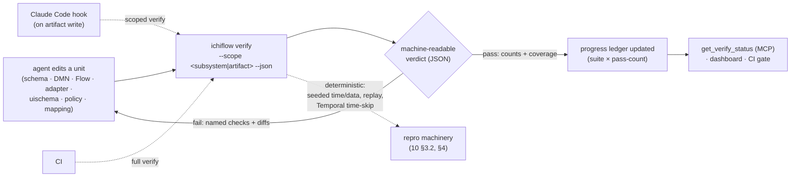
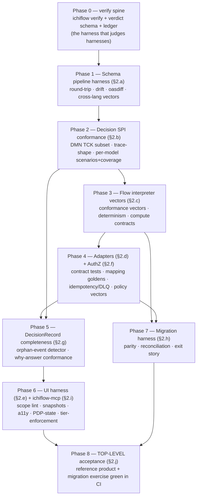

# 13 — Agent Harness Loops

> **What this covers.** How every part of ichiflow is built and later operated inside a
> **deterministic verification harness** — so that for any unit of work an AI coding agent (Claude
> Code first) can run **one command** and get a **machine-readable verdict** on *whether*, *what*, and
> *how much* has been done, and whether it is *correct*. It states the **harness-first doctrine** (a
> harness ships **before** the implementation it judges), catalogues the concrete harness per
> subsystem, specifies the **loop mechanics** (`ichiflow verify`, the verdict schema, the progress
> ledger, hooks, flake policy), and lays out the **build-order plan** for constructing ichiflow itself
> harness-first. It closes the founder's requirement that both ichiflow's *own* construction and later
> *app-building on ichiflow* run on determinism, not vibes.
>
> **Position in the system.** This document is orthogonal to the layer docs: it does not add a
> subsystem, it adds the **verification spine** every subsystem hangs on. It gathers the
> already-specified verification pieces scattered across the architecture — regenerate-and-diff CI
> ([`02-schema-foundation.md`](02-schema-foundation.md) §4.3), scenario specs + golden datasets +
> coverage ([`03-decision-layer.md`](03-decision-layer.md) §6), replay / time-skip / scenario tests
> ([`04-flow-and-case-layer.md`](04-flow-and-case-layer.md) §8), contract tests and mapping golden
> files ([`05-adapters.md`](05-adapters.md)), drift/a11y/contrast lint + preview snapshots
> ([`07-ui-and-portals.md`](07-ui-and-portals.md) §12), decision parity + reconciliation
> ([`11-migration-in-and-out.md`](11-migration-in-and-out.md) §4), and the deterministic-replay /
> seeded-repro machinery + `ichiflow verify` gate ([`10-ai-native-experience.md`](10-ai-native-experience.md)
> §3.2, §4) — and gives them **one contract, one entry point, and one progress model**. It realizes
> the AI-native promise of [`BRIEF.md`](BRIEF.md) §12 ("purpose-built so AI coding agents are
> productive at build time AND run time") by making *productive* mean *verifiable*. The two v1
> acceptance exercises ([`00-vision-and-principles.md`](00-vision-and-principles.md) §5.1; ADR-0017)
> are its **outermost loop**. Target design, present tense; **v1** vs **later** marked throughout.
> Recorded as **ADR-0026**.

---

## 1. The doctrine — harness-first construction

### 1.1 The rule

**Every subsystem ships with a harness *before* its implementation.** The harness is written and
committed first; it is red; the implementation makes it green. This is the agent-era analog of
test-driven development, generalized past unit tests: the thing written first is not a test method but
a **conformance/coverage suite plus a machine-readable verdict** that an agent can run unattended and
read without a human interpreting a build log.

The motivation is specific to agent-built software. An agent can *claim* a task is done in fluent
prose and be wrong; a human reviewer cannot cheaply refute the claim; "looks done" is the failure
mode that scales badly when the author is a machine producing volume. The harness replaces the claim
with a verdict. An agent does not report "I implemented the schema pipeline"; it runs
`ichiflow verify --scope schema-pipeline --json` and the verdict says `42/47 checks pass, 5 fail`,
naming the five. Done-ness is **enumerable**, not narrated.

### 1.2 What a harness *is* — four required parts

A harness for any unit of work is exactly four things. If a part is missing, it is not a harness.

| Part | What it is | Why it is required |
|---|---|---|
| **Fixtures / golden data** | Seeded, versioned inputs and known-correct outputs — conformance vectors, golden datasets, sample Cases, recorded event histories, snapshot baselines. Deterministic and checked in. | Correctness is measured against *something*; that something is data, not opinion. |
| **Executable checks** | A finite, enumerated set of checks that run from one command with no human in the loop — validators, round-trip diffs, conformance runs, parity comparisons, replay divergence checks, snapshot diffs. | "Run a command, get an answer" — the agent's actuator. |
| **Machine-readable verdict** | A **JSON** result: per-check `pass`/`fail`, counts, diffs, error classes, artifact references. **Never prose.** | The agent (and CI, and the dashboard) consume structure; prose is unparseable and lies by omission. |
| **Progress metric** | An enumerable "how much" — checks-passing / checks-total, rules covered / rules total, conformance vectors green / total, milestones reached. | "How much has been done" is a **count over a suite**, not a narrative estimate. |

Two invariants make this bite:

- **Verdicts are JSON, never prose.** Every harness emits the same envelope (§3.2): a list of check
  results with stable ids, pass/fail, counts, and structured diffs. A harness that prints "mostly
  working" is non-conformant. Prose may *accompany* a verdict for humans, but the verdict of record is
  the JSON.
- **"How much has been done" is a conformance/coverage count, not a claim.** The unit of progress is
  a check in an enumerated suite. If a subsystem's suite has 47 checks and 42 pass, the subsystem is
  *42/47 done against its declared harness* — a fact, queryable by an agent (§3.3), not an assertion
  to be trusted.

### 1.3 This is assembly, not invention

ichiflow already specifies most of these harnesses in the layer docs; this doctrine **names the
pattern, unifies the verdict shape, and adds one entry point**. The pieces it gathers:

- **Regenerate-and-diff** — CI recompiles TypeSpec, regenerates all outputs, and fails on any delta
  ([02](02-schema-foundation.md) §4.3). Already a machine-readable verdict (`git diff --exit-code`);
  the harness wraps it in the common envelope.
- **Scenario specs + golden datasets + coverage** — governed, business-readable given/expect specs
  with rule/row coverage gating ([03](03-decision-layer.md) §6). Already enumerable done-ness for
  Decisions.
- **Replay / time-skip / scenario tests** — deterministic replay catches non-determinism, the
  time-skipping server fast-forwards month-long SLA timers, and scenario tests assert expected
  paths/Tasks ([04](04-flow-and-case-layer.md) §8). Already deterministic by construction.
- **Decision parity + data reconciliation** — golden historical outcomes replayed legacy-vs-migrated,
  plus row-counts/checksums/sampling ([11](11-migration-in-and-out.md) §4). Already a pass/fail bar.
- **Preview snapshots + drift/a11y/contrast lint** — rendered stories/screens with axe-core and
  contrast verdicts, uischema-scope drift lint ([07](07-ui-and-portals.md) §3, §12). Already
  CI-gated.
- **Deterministic replay + seeded repro** — `reproduce_case` / `replay_workflow` and the
  repro-before-fix hook ([10](10-ai-native-experience.md) §3.2, §4). Already the runtime harness for
  agent debugging.

The doctrine's contribution is that these stop being seven unrelated CI jobs with seven output
formats and become **one verify surface** with **one verdict schema** and **one progress ledger**, so
an agent building or operating *any* part uses the same loop.

### 1.4 The verify loop (diagram)



The loop is identical whether the "unit" is a schema an agent just authored while **building
ichiflow**, or a DecisionModel an app-builder authored **on ichiflow**. Same command, same verdict,
same ledger — because the same verification machinery ships as a **product feature** (§4.3).

---

## 2. The harness catalog

Each subsystem below names its **fixtures**, its **executable checks**, and the **verdict/progress**
it enumerates. All are addressable as `ichiflow verify --scope <name>` (§3.1). Phasing is marked; the
**bold checks are v1**.

### 2.a Schema pipeline — round-trip, drift, breaking-change, cross-language conformance

The schema layer ([02](02-schema-foundation.md)) is the substrate, so its harness is built first
(§4).

- **Fixtures.** A corpus of TypeSpec sources with their expected emitted OpenAPI/JSON Schema/AsyncAPI;
  a set of **fixture instances** (valid and deliberately-invalid JSON documents) per canonical schema;
  a baseline of the previous released spec version for diffing.
- **Executable checks.**
  - **TypeSpec→emit→codegen→validate round-trip** — compile the sources, emit the canonical
    artifacts, run Fabrikt/hey-api codegen, and confirm the outputs match the committed artifacts.
  - **Drift check (regenerate-and-diff)** — `git diff --exit-code` over every generated path; any
    delta is a named failed check ([02](02-schema-foundation.md) §4.3).
  - **Breaking-change gate (oasdiff)** — diff the emitted OpenAPI against the prior version; a
    breaking change without a version bump fails ([02](02-schema-foundation.md) §6.2).
  - **Cross-language conformance vectors** — each fixture instance is validated in **both** languages
    against the **same JSON Schema**: Zod v4 (TS) and OptimumCode (Kotlin) must **agree** on every
    accept/reject. Disagreement is a failed vector. (v1 standardizes one validator per language;
    the Ajv↔networknt cross-*validator* equivalence suite is **later**, [02](02-schema-foundation.md)
    §5.)
- **Verdict / progress.** `vectors_green / vectors_total`, `drift: clean|dirty`,
  `breaking_changes: [...]`. Done-ness of a schema = all vectors green, drift clean, no ungated
  breaking change.

### 2.b Decision layer — an engine-conformance suite the SPI *ships*, plus per-model coverage

Because the Decision Engine SPI is pluggable ([03](03-decision-layer.md) §3; ADR-0002), the SPI's
correctness cannot rest on Drools' internal tests — **any** engine behind the SPI must be provably
conformant. So the SPI **ships with a conformance suite as part of its contract**.

- **Engine-conformance harness (the SPI's conformance suite).** A **DMN TCK subset** — curated
  Technology Compatibility Kit test cases (model + inputs + expected results) — packaged as an
  ichiflow harness that runs against **any** engine implementation of the SPI. **A third-party engine
  is not admitted behind the SPI until it passes this suite.** This makes "pluggable engine" a
  verifiable claim: Drools passes it (v1, reference); ZEN's JDM projection passes the projectable
  subset (later); a future engine passes it or is rejected. Fixtures: the TCK subset cases + ichiflow
  envelope round-trip cases. Verdict: `tck_cases_green / tck_total` per engine, plus
  capability-descriptor conformance (a declared `supports.inference` must actually infer). **Both the
  DMN-TCK version and the KIE/Drools version are pinned in the harness manifest** — the DMN-TCK repo
  at a pinned commit and Apache KIE 10.2.0 (research [01](../research/01-rule-engines.md) §3.1, §5) —
  and the pointers to both live in the decision-layer **resource manifest**
  ([10](10-ai-native-experience.md) §2.5), so "which TCK, which engine" is a diffable fact, not
  ambient knowledge. Results are enumerable counts against those exact pins; bumping either pin reruns
  the suite (the **engine-upgrade harness** below).
- **Decision-source projection-coverage harness (the "100% AI-authorability" proof).** Because the
  **decision source** projection ([03](03-decision-layer.md) §2.6; ADR-0027) must cover the **full DMN
  1.6 feature set** — not decision tables only — its completeness is a **verified metric, not a claim.**
  A conformance suite enumerates every DMN 1.6 construct against the DMN feature matrix / TCK construct
  set (DRDs, all boxed-expression kinds — decision tables, literal FEEL, contexts, invocations,
  functions/BKMs, lists, relations — item definitions/types, imports) and asserts, per construct: **(a)**
  a projection form exists, **(b)** it compiles to valid DMN 1.6 XML, and **(c)** the emitted XML
  executes identically on the default engine to a hand-authored reference. Verdict:
  `constructs_covered / constructs_total` — "100% AI coverage of the DMN surface" is this count green,
  never a sentence. The **engine-native escape hatches** (DRL / rule units / CEP,
  [03](03-decision-layer.md) §4.3) contribute a **compile-check** here too (a malformed DRL/rule-unit
  fails `validate`), so an AI-authored escape-hatch artifact is verified pre-deploy exactly like a DMN
  model — quarantine marks portability, not authorability.
- **Per-DecisionModel scenario suites + coverage.** Each DecisionModel's governed scenario specs
  ([03](03-decision-layer.md) §6.1) run as checks; **rule/row coverage** ([03](03-decision-layer.md)
  §6.2) reports which rules/branches were exercised. Fixtures: scenario specs + golden datasets.
  Verdict: `scenarios_pass / total`, `coverage: 0.86` against the model's declared threshold. This is
  the enumerable "how much of this Decision is tested." Escape-hatch (DRL/rule-unit/CEP) models run the
  **same** scenario/coverage/golden-dataset checks — AI-authorable *and* AI-testable on the same footing
  as DMN ([03](03-decision-layer.md) §4.3; ADR-0027).
- **Trace-shape conformance.** Every `evaluate` must emit a **valid `DecisionTrace`**
  ([03](03-decision-layer.md) §7) — schema-validated shape, required fields present (fired rules,
  input snapshot, CodeSet id+version, model identity). A run that produces a malformed or absent trace
  is a failed check, because the DecisionRecord/why API depends on it (§2.g). Fixtures: sample
  evaluations with expected trace schemas.
- **Differential-engine harness.** Imported/cross-engine models run the differential harness
  ([03](03-decision-layer.md) §6.4): the **same DecisionModel evaluated on Drools and on a second
  engine when one is present** (ZEN's JDM projection, later; or a source engine's golden outputs for
  an import), outputs must match golden — the machine-readable proof behind the migration-fidelity /
  anti-lock-in story ([11](11-migration-in-and-out.md) §OUT; ADR-0001). With only the default engine
  deployed the harness degenerates to golden-replay against recorded Drools outputs; it activates
  fully the moment a second engine sits behind the SPI. Verdict: `divergences: [...]`.

Because **Drools / Apache KIE is the default / reference engine** ([03](03-decision-layer.md) §4.1),
it carries a **default-engine harness set** beyond the SPI-generic suites above — the concrete
Drools-specific verification the founder asked ship *with* the engine. Each pins its KIE/TCK versions
via the decision-layer resource manifest ([10](10-ai-native-experience.md) §2.5) and emits enumerable
counts:

- **FEEL semantics vectors.** The known DMN/FEEL **interchange-ambiguity cases** — under-specified
  built-ins that conformant engines resolve differently (list/`sort` ordering, and the other spots the
  DMN-TCK exists to pin; research [01](../research/01-rule-engines.md) §7) — are frozen as
  **regression vectors** asserting the default engine's *chosen, published* semantics
  ([03](03-decision-layer.md) open-q4). Fixtures: the ambiguity-case FEEL snippets + expected results
  under ichiflow's pinned resolution. Verdict: `feel_vectors_green / total`. A KIE bump that silently
  shifts one of these results fails loudly here rather than in production traffic.
- **DRL compile-check + rule-unit scenario harness.** The engine-native escape hatches
  ([03](03-decision-layer.md) §4.3) are AI-authorable governed paths, so they verify like any
  artifact: a **DRL / rule-unit compile-check** (a malformed artifact fails `validate` pre-deploy —
  already contributed to the projection-coverage suite above) plus a **rule-unit scenario harness**
  running the model's scenario specs + coverage + golden datasets ([03](03-decision-layer.md) §6) on
  the same footing as a DMN model. Fixtures: DRL/rule-unit sources + their scenario specs. Verdict:
  `compile: pass|fail`, `scenarios_pass / total`, `coverage`. Quarantine marks *portability*, never
  authorability, so an escape-hatch model is enumerable-done exactly like a DMN one.
- **CEP temporal-rule vectors.** Complex-event / temporal models ([03](03-decision-layer.md) §8) —
  sliding windows, interval-vs-point events, "N events in a window" — are verified with **seeded event
  streams**: an ordered `{event, timestamp}` sequence fed into a stateful session under **seeded
  time** (the same determinism discipline as Temporal time-skip, §3.6), asserting the emitted
  signals/Outcomes. Fixtures: seeded event-stream vectors + expected activations. Verdict:
  `cep_vectors_green / total`. Wall-clock is never a harness input; the seed is recorded in the
  verdict.
- **Engine-upgrade harness.** A **KIE/Drools version bump is a gated change**: the harness reruns the
  *entire* decision-layer suite (TCK conformance, FEEL vectors, projection-coverage, per-model
  scenarios, CEP vectors, differential) against the candidate engine version and **diffs every verdict
  against the incumbent's**. Any changed verdict — a TCK case that flips, a FEEL result that shifts, a
  coverage regression — blocks the upgrade until reconciled. Fixtures: the pinned incumbent verdict
  set as the baseline. Verdict: `verdicts_unchanged / total`, `regressions: [...]`. **Upgrades are
  gated on green**, which is what lets ichiflow ride a fast-moving Apache-incubation project (research
  [01](../research/01-rule-engines.md) §9) without inheriting its churn as production risk; the manifest's
  KIE pin and this harness move together.

### 2.c Flow layer — interpreter conformance vectors, determinism, DSL validation, compute contracts

The Flow interpreter is a single generic workflow ([04](04-flow-and-case-layer.md) §2); its
correctness is the whole layer's correctness.

- **Interpreter conformance suite.** Canonical-flow-JSON **test vectors** → **expected event
  histories**, executed on Temporal's test framework with **time-skipping**
  ([04](04-flow-and-case-layer.md) §8) so month-long SLA/escalation timers verify in milliseconds.
  Each vector: `{ flow definition, inbound command, stubbed decision outcomes, simulated
  signals/timer expiries } → expected path + Tasks + event history`. Fixtures: the vector library.
  Verdict: `vectors_green / total`. Every step type (§2.3 catalogue) has vectors; a new step type
  ships its vectors first.
- **Determinism harness.** Replay the **same** recorded history **twice** against the current
  interpreter and assert identical outcomes; replay old histories against a candidate interpreter to
  catch non-determinism **before** deploy ([04](04-flow-and-case-layer.md) §8, §9). Any divergence is
  a hard failure — this is the safety net for evolving the interpreter under in-flight instances.
- **DSL-schema validation.** Every Flow definition validates against the versioned DSL schema; a
  malformed flow fails pre-deploy ([04](04-flow-and-case-layer.md) §2.1). Verdict: schema-valid
  yes/no + errors.
- **Compute-step contract tests.** Each `compute` code activity ([04](04-flow-and-case-layer.md)
  §2.6) is tested at its **schema'd boundary**: fuzz inputs against the input JSON Schema, assert
  outputs conform to the output schema, assert a trace is emitted, assert purity (same input → same
  output). Fixtures: boundary fuzz corpora + golden I/O pairs. The **same** contract-test shape covers
  the unified code-activity everywhere it appears (decision feature-function, adapter code-transform),
  since it is one primitive.

### 2.d Adapters — contract tests, mapping golden files, idempotency/DLQ vectors

Adapters ([05](05-adapters.md)) are the boundary between canonical and wire; their harness proves the
boundary holds without a live external system.

- **Contract tests from OpenAPI/AsyncAPI.** Each declared port is exercised against a **mock
  broker / WireMock-class** double generated from its contract — inbound wire messages and outbound
  encodings verified against the schema, no real MQ/Kafka needed. Fixtures: the port's
  OpenAPI/AsyncAPI + representative wire messages.
- **Mapping golden files.** Each versioned Message-Translator mapping ([05](05-adapters.md) §2) has
  **golden pairs**: `input wire message → expected canonical event`. A mapping change that alters an
  output is a visible golden diff; an AI-generated mapping regenerated from a bumped contract
  ([05](05-adapters.md) §9) must reproduce the goldens or explain the diff. Because mappings are
  **pure** ([05](05-adapters.md) §2 purity invariant), the goldens are stable.
- **Idempotency / DLQ behavior vectors.** Deterministic vectors assert the reliability contract:
  a duplicate `messageId` is deduped once (Idempotent Receiver), a poison message lands in the DLQ
  after bounded retries, a redelivery after crash applies once ([05](05-adapters.md) §reliability).
  Fixtures: duplicate/poison/redelivery message sequences. Verdict: `dedup: pass`, `dlq: pass`.

### 2.e UI — scope lint, preview snapshots, a11y, PDP-state story coverage

The UI harness ([07](07-ui-and-portals.md) §12) is entirely v1 (the *interactive* Design Kit apps are
post-v1, but the **checks** ship in v1).

- **uischema-scope lint.** Every uischema scope must resolve against the current data schema (drift
  lint, [07](07-ui-and-portals.md) §3). Dangling scope = failed check.
- **Preview snapshot diffs.** Rendered stories/screens produce snapshot baselines; a change yields a
  before/after visual diff attached to the PR preview ([07](07-ui-and-portals.md) §12). (Whether
  pixel-diff snapshots are a **required** gate vs. advisory is [07](07-ui-and-portals.md) open-q8;
  the harness *produces* the diff regardless.)
- **a11y checks.** axe-core / WCAG 2.2 AA on every workbench story and playground screen; AA
  violations block ([07](07-ui-and-portals.md) §12). Plus token-contract contrast (≥4.5:1 text /
  3:1 UI).
- **PDP-state story coverage.** Every placed field must render acceptably in **hidden /
  read-only / error / validation-failed** states — one story per renderer × state
  ([07](07-ui-and-portals.md) §11.2). Coverage is enumerable: `states_covered / states_required`.
  This is where UI "done-ness" becomes a count, not a screenshot someone eyeballed.

### 2.f AuthZ — policy test suites, the same vectors design-time and runtime

The central PDP drives the same entitlements across generated API and generated UI, and the same
ownership model at design time and run time ([06](06-identity-and-access.md); BRIEF §8). The harness
proves that single-PDP claim.

- **Policy test suites (allow/deny vectors).** Per relation model, a corpus of
  `{ subject, relation, object, context } → expect allow|deny` vectors run against OpenFGA (v1) — and
  against the same PDP interface when Cedar/OPA ABAC is added (later, [06](06-identity-and-access.md);
  ADR-0010). Fixtures: the vector corpus per Portal/Team/artifact.
- **Design-time = runtime, one vector set.** The load-bearing property: the **same** vectors run
  against the **design-time** artifact-access path (who may edit/approve a CodeSet/Schema/Decision/
  Flow — [06](06-identity-and-access.md) Part 4, ADR-0025) **and** the **runtime** data path (row/
  field visibility on Cases/Tasks/entities). If a vector passes design-time but fails runtime, the
  "same PDP" invariant is broken and the check fails. Verdict: `vectors_green / total`,
  `parity(design-time, runtime): pass|fail`.

### 2.g DecisionRecord / why API — completeness (orphan-event detector)

The DecisionRecord stitches event history + fired-rule traces + DMN results + human review + agent
actions into one causal chain per `case_id` ([08](08-audit-and-observability.md) §1; BRIEF §9). Its
correctness is **completeness**: no gap in the chain.

- **Completeness harness.** For every Case in the fixture set, assert a **stitchable causal chain**
  exists end-to-end — every recorded event resolves into the chain, every fired Decision has a trace
  (§2.b), every human-task resolution and agent Tier-2 action is attributed. An **orphan-event
  detector** flags any event that does not stitch (a decision-eval with no trace, a signal with no
  originating Task, an adapter-call with no correlated message id). Fixtures: sample Cases + their
  expected fully-stitched DecisionRecords. Verdict: `orphans: [...]`, `chains_complete / total`.
- **Why-answer conformance.** `explain_decision(case_id)` returns the same object the auditor/back-
  office view renders ([10](10-ai-native-experience.md) §3.2); the harness asserts required
  fields present and reason codes resolve to their pinned CodeSet versions.

### 2.h Migration — parity harness + reconciliation checks

The migration exercise ([11](11-migration-in-and-out.md)) is half the v1 acceptance bar, so its
harness is first-class.

- **Parity harness (golden historical outcomes).** Replay a **golden dataset** of historical cases
  with **known legacy outcomes** through the migrated DecisionModels; **outcome parity** (not schema
  parity) is the bar ([11](11-migration-in-and-out.md) §4.1). A migrated rule is "done" only when it
  passes parity, not when it compiles. Also expressed as **Gherkin parity scenarios** that run
  continuously ([11](11-migration-in-and-out.md) §4.3). Verdict: `parity_pass / total`, `mismatches:
  [...]` with per-case legacy-vs-migrated diffs.
- **Reconciliation checks.** Row counts, checksums/hash-totals, aggregate comparisons, and sampled
  row-level diffing between legacy and migrated data ([11](11-migration-in-and-out.md) §4.4).
  Fixtures: the legacy source snapshot + the migrated store. Verdict: `row_delta: 0`,
  `checksum_match: pass`, `sample_diffs: [...]`.
- **Exit-story check.** Export DMN / Flow JSON / schemas / data and assert the exports are
  well-formed and re-consumable outside ichiflow ([11](11-migration-in-and-out.md) §6) — the
  anti-lock-in half. A round-trip re-import (or third-party-engine validation of exported DMN) is the
  check.

### 2.i ichiflow-mcp — tool-contract tests + tier-enforcement tests

The runtime MCP server ([10](10-ai-native-experience.md) §3) is where an agent *acts*; its harness
proves the guardrails cannot be bypassed.

- **Tool-contract tests.** Every tool's I/O validates against its JSON Schema 2020-12 contract
  ([10](10-ai-native-experience.md) §3.1); `readOnlyHint` tools are proven to have **no write path**;
  list/history tools enforce pagination defaults. Fixtures: per-tool request/response corpora.
- **Tier-enforcement tests.** The critical safety harness: assert **server-side** enforcement, not
  client hints ([10](10-ai-native-experience.md) §3.3). Vectors: a **Tier-2 call without JIT
  approval MUST fail**; a Tier-1 tool MUST refuse a prod endpoint (target forced to staging/branch);
  a Tier-0 tool MUST be rejected if it touches a write path; the kill-switch MUST halt in-flight
  actions. "An untrusted server can lie," so these are negative tests that fail loudly if a guardrail
  regresses. Verdict: `tier_vectors_green / total` — a red here blocks release unconditionally.

### 2.j Top-level — the reference product and migration exercise as the outermost harnesses

The two v1 acceptance exercises ([00](00-vision-and-principles.md) §5.1; ADR-0017) are not a manual
checklist — they are the **outermost harnesses**, run in CI as the final loop that composes all the
inner ones, and **decomposed into milestone checkpoints an agent can pass incrementally**.

- **Reference-product harness.** The canonical outdoor-event-permit product
  ([`../examples/creating-a-permit-product.md`](../examples/creating-a-permit-product.md)) runs
  **every layer real** — schemas → decisions → flows → portal → audit → `ichiflow-mcp` debug — and a
  permit flows arrival-to-resolution with an agent debugging a stuck case through the why API.
  Decomposed checkpoints (each an inner harness green): *schema corpus green → permit DecisionModels
  pass scenarios+coverage → permit Flow interpreter vectors green → portal renders with a11y/PDP
  coverage → a seeded stuck-case reproduces and the why API stitches it*. Verdict: `checkpoints_pass /
  total`.
- **Migration-exercise harness.** A **generic** legacy database-and-spreadsheet casework source
  (**no real system named**, BRIEF §16) taken through Ring-0 mapping → rules re-expressed as
  DecisionModels → **decision parity** (§2.h) → reconciliation → verified **exit story**. Decomposed:
  *Ring-0 mapping validates → parity harness green on the golden dataset → reconciliation clean →
  exports re-consumable*.

**v1 is accepted only when both top-level harnesses are green in CI** — the definition of done for the
whole kernel, expressed as a verdict, not a judgement call.

---

## 3. The loop mechanics

### 3.1 One entry point — `ichiflow verify`

There is a **single** verification command; everything above is a scope under it.

```
ichiflow verify [--scope <subsystem|artifact>] [--json] [--since <ref>]
```

- `--scope schema-pipeline` · `--scope decision-layer` · `--scope flow-layer` · `--scope adapters` ·
  `--scope ui` · `--scope authz` · `--scope decisionrecord` · `--scope migration` · `--scope mcp` ·
  `--scope reference-product` · `--scope migration-exercise` — the catalog (§2).
- `--scope <artifact>` narrows to one artifact by id (`--scope decision:loan-eligibility@3.2.0`,
  `--scope flow:permit-intake`, `--scope adapter:mq-xml-to-canonical`), running only the checks that
  artifact participates in — the tight loop an agent uses while editing one thing.
- No `--scope` runs **everything** (CI's full loop).
- `--json` emits the machine-readable verdict (the default for agents/CI; humans may get a rendered
  summary, but the JSON is the verdict of record).
- `--since <ref>` scopes to artifacts changed since a git ref (the hook's incremental mode, §3.4).

`ichiflow verify` is the same gate the AI-native loop already names ([10](10-ai-native-experience.md)
§2.1, §4.5): *edit a declarative artifact → regenerate → validate → `ichiflow verify`*. This document
makes it the umbrella over every subsystem harness rather than an unspecified final step.

### 3.2 The verdict schema (sketch)

Every scope emits the **same envelope** — this is what "JSON, never prose" means concretely. Sketch
(itself a canonical schema, TypeSpec-authored per [02](02-schema-foundation.md)):

```json
{
  "verifyVersion": "1",
  "scope": "decision-layer",
  "ranAt": "2026-07-12T14:22:07Z",
  "seed": "sha256:9f2a…",                 // seeded time/data for determinism (§3.5)
  "verdict": "fail",                       // pass | fail
  "summary": { "checks": 47, "passed": 42, "failed": 5, "skipped": 0 },
  "progress": {                            // "how much is done" — enumerable, not narrated
    "conformance": { "green": 42, "total": 47 },
    "coverage": { "value": 0.86, "threshold": 0.90, "met": false }
  },
  "checks": [
    { "id": "dmn-tck.decisiontable.0012", "status": "pass" },
    { "id": "scenario.loan-eligibility.high-dti-conditional", "status": "fail",
      "expected": { "type": "conditional-approve" },
      "actual":   { "type": "deny" },
      "diff": "conditions[] empty; expected RETAIN_RECORDS@obligations:4.3.0",
      "artifact": "decision:loan-eligibility@3.2.0" },
    { "id": "trace-shape.loan-eligibility", "status": "pass" },
    { "id": "coverage.loan-eligibility", "status": "fail",
      "metric": "rule-coverage", "value": 0.86, "threshold": 0.90 }
  ],
  "flaky": false                           // must always be false (§3.6)
}
```

Rules: every check has a **stable id** (so a dashboard and an agent track the same check across runs);
failures carry a **structured diff** (expected/actual/artifact), never a sentence; `progress` is
always a count or ratio. Prose lives nowhere in the verdict of record.

### 3.3 The progress ledger — "how much is done," queryable

The verdicts roll up into a **progress ledger**: for every scope, `suite × pass-count` over time. The
ledger is:

- **Dashboardable** — a build-order burn-up (which subsystem harnesses are green, coverage trends).
- **Agent-queryable via MCP** — a Tier-0 read tool **`get_verify_status(scope?)`**
  ([10](10-ai-native-experience.md) §3.2 tool family) returns the latest verdict + ledger for a scope,
  so an agent asks "how much of the flow layer is done?" and gets `vectors 118/140, coverage 0.83`
  rather than reading a log. This is the runtime face of "how much has been done."

`get_verify_status` is read-only (Tier-0, auto-approvable); it reads the ledger, it does not run
verify (running is `ichiflow verify`, or the Tier-1 Task form for long full runs).

### 3.4 Harness definitions are schema'd Workspace artifacts (extensible)

Harnesses are not hard-coded into the CLI — they are **governed Workspace artifacts** like every other
ichiflow contract ([02](02-schema-foundation.md), [03](03-decision-layer.md) §6 "testing as a
first-class artifact"). A harness definition declares its scope, its fixtures, its checks, and its
thresholds, as schema-validated data:

```yaml
kind: Harness                              # a governed Workspace artifact class
metadata: { id: permit-eligibility-suite, owner: permits-team, version: 1.2.0 }
scope: decision:permit-eligibility
fixtures:
  scenarios: ./scenarios/
  goldenDatasets: [ permit-2025-outcomes ]
checks:
  - { kind: scenario-suite, from: scenarios }
  - { kind: coverage, metric: rule-coverage, threshold: 0.90 }
  - { kind: trace-shape }
```

Because harnesses are artifacts, **apps built on ichiflow add their own checks** — a permit app ships
`Harness` artifacts for its domain Decisions/Flows exactly as ichiflow ships them for the kernel, and
`ichiflow verify` runs them under the same envelope. The harness class is itself governed by the
dial ([03](03-decision-layer.md) §5.6): advisory at `light`, gating at `full`.

### 3.5 Hook integration — scoped on write, full in CI

Two enforcement points, both already in the agent kit ([10](10-ai-native-experience.md) §2.2):

- **Claude Code hooks run *scoped* verify on artifact writes.** A `PostToolUse`/stop hook runs
  `ichiflow verify --since HEAD --json` (or `--scope <artifact>` for the just-edited artifact), so an
  agent gets an immediate verdict on what it changed without waiting for CI. Hooks are the *only*
  layer with guaranteed execution ([10](10-ai-native-experience.md) §2.2), which is exactly where a
  "must verify before claiming done" rule belongs. The **repro-before-fix** hook
  ([10](10-ai-native-experience.md) §4) is a special case: for a bug fix, the scoped verify must
  include the reproducing case going red→green.
- **CI runs *full* verify.** The regenerate-and-diff + full `ichiflow verify` gate runs on every PR
  ([10](10-ai-native-experience.md) §2.3 headless recipes); the top-level acceptance harnesses (§2.j)
  run as the outermost CI job.

### 3.6 Flake policy — deterministic, retry-forbidden

A harness that is non-deterministic is not a harness — a flaky check that passes on retry teaches an
agent to retry until green, which is vibes with extra steps. Therefore:

- **Retries are forbidden.** A check either passes deterministically or it fails; there is no
  "re-run to clear." The verdict carries `flaky: false` as an invariant, and a check observed to be
  non-deterministic is quarantined as a **defect in the harness**, fixed, not retried around.
- **Determinism is bought, not hoped for.** Time and data are **seeded** via the repro machinery
  ([10](10-ai-native-experience.md) §3.2, §4): Temporal **time-skipping** makes SLA/timer behavior
  exact ([04](04-flow-and-case-layer.md) §8), event-history **replay** is deterministic by
  construction ([04](04-flow-and-case-layer.md) §8, [10](10-ai-native-experience.md) §4), golden
  datasets and fixtures are frozen, and the verdict records the `seed`. Non-deterministic work
  (clocks, RNG, network) is isolated behind activities/adapters ([04](04-flow-and-case-layer.md) §2.2,
  [10](10-ai-native-experience.md) §4), so the harness never depends on it.
- **The cost is stated** ([10](10-ai-native-experience.md) §4): this discipline constrains how Flows
  and Adapters are written (determinism, seeded I/O) — deliberately. The payoff is that every verdict
  is trustworthy without a "known-flaky" asterisk.

---

## 4. The build-order plan — constructing ichiflow itself, harness-first

ichiflow is built in dependency order, and **each phase's exit criterion is its harness green in CI**.
The harness for a phase is written first (red), the phase's implementation turns it green, and only
then does the next phase begin. This is the founder ask applied to ichiflow's own construction.

### 4.1 The build-order DAG



### 4.2 Phase exits (each = a harness green)

| Phase | Exit criterion (harness green in CI) | v1? |
|---|---|---|
| **0 — verify spine** | `ichiflow verify` runs, emits the verdict envelope (§3.2), writes the ledger; a trivial self-check scope is green. The spine that judges every later phase exists first. | **v1** |
| **1 — Schema pipeline** | §2.a green: round-trip clean, drift clean, oasdiff gating, cross-language vectors agree. Everything downstream generates from here, so it is first. | **v1** |
| **2 — Decision SPI conformance** | §2.b green: Drools passes the DMN TCK subset behind the SPI; trace-shape conformance holds; sample DecisionModels pass scenarios + meet coverage. | **v1** (ZEN conformance: later) |
| **3 — Flow interpreter vectors** | §2.c green: interpreter conformance vectors pass under time-skip; determinism harness clean; compute-step contracts hold. | **v1** |
| **4 — Adapters + AuthZ** | §2.d + §2.f green: contract tests against mock broker, mapping goldens stable, idempotency/DLQ vectors pass; policy vectors pass **and** design-time=runtime parity holds. | **v1** (Cedar/OPA vectors: later) |
| **5 — DecisionRecord completeness** | §2.g green: orphan-event detector clean on sample Cases; why-answer conformance holds. | **v1** |
| **6 — UI + ichiflow-mcp** | §2.e + §2.i green: scope lint clean, preview snapshots produced, a11y AA, PDP-state coverage complete; MCP tool-contracts pass and **tier-enforcement negative tests pass** (Tier-2-without-approval fails). | **v1** |
| **7 — Migration** | §2.h green: decision parity on the golden dataset, reconciliation clean, exit-story exports re-consumable. | **v1** |
| **8 — Top-level acceptance** | §2.j green: **both** the reference-product harness and the migration-exercise harness pass in CI — the v1 definition of done. | **v1** |

The ordering is not arbitrary: it is the schema→decision→flow→adapter dependency chain the whole
architecture already follows, with the verify spine (Phase 0) preceding all of it because it is the
thing that measures the rest. Post-v1 harnesses (ZEN conformance, Cedar/OPA policy vectors,
compliance-profile lineage checks, the interactive Design Kit's visual-regression gate) slot onto the
same spine without changing it.

### 4.3 The harnesses that become product features (the first dogfood)

The load-bearing consequence: **the verification machinery is not scaffolding thrown away after v1 —
most of it ships as a product feature to app-builders.** Building ichiflow with it is simply the
**first dogfood** of a capability every ichiflow app then uses:

- **The scenario/coverage engine** (§2.b) is the same one app-builders use to test their Decisions
  ([03](03-decision-layer.md) §6) — `run-parity-tests` and simulation are product skills
  ([10](10-ai-native-experience.md) §2.2).
- **The parity + reconciliation harness** (§2.h) is a first-class *migration* feature every adopter
  runs on their own legacy source ([11](11-migration-in-and-out.md) §4), not an ichiflow-internal
  test.
- **The flow scenario/replay/time-skip harness** (§2.c) is how app-builders test their own Flows
  ([04](04-flow-and-case-layer.md) §8).
- **`ichiflow verify` + `get_verify_status` + the `Harness` artifact class** (§3) ship to
  app-builders directly: an app declares its own `Harness` artifacts and runs the same loop
  ([03](03-decision-layer.md) §6 already frames tests as governed artifacts).
- **The preview-snapshot / a11y / drift harness** (§2.e) is the Design Kit's safety contract
  ([07](07-ui-and-portals.md) §12), shipped as v1 checks.

So the build-order plan and the product roadmap are the **same artifacts** viewed twice: ichiflow's
construction is the acceptance test of the verification product it hands to its users. That is the
tightest possible dogfood, and it is the point.

---

## Open questions

1. **Verdict schema versioning cadence.** The verdict envelope (§3.2) is consumed by CI, the
   dashboard, `get_verify_status`, and agents at once; like the DecisionRecord/why contract
   ([10](10-ai-native-experience.md) open-q6) its versioning must not drift from its consumers.
   Cadence and compat policy (oasdiff-gated like any contract?) need pinning.
2. **Coverage-threshold granularity.** Per-DecisionModel vs. per-vertical vs. global thresholds is
   already open for Decisions ([03](03-decision-layer.md) open-q5); the harness ledger makes the
   question sharper because it now aggregates coverage across *all* subsystems — is there a
   Workspace-level coverage floor, or only per-artifact?
3. **DMN TCK subset selection.** Exactly which TCK cases form the SPI conformance suite (§2.b) — the
   full L3 set is large and some cases exercise constructs ichiflow does not use — needs a curated,
   justified subset that a third-party engine can realistically target.
4. **Interpreter conformance-vector authorship.** Who writes the canonical-flow→expected-history
   vectors (§2.c), and how they stay in sync as step-type semantics evolve
   ([04](04-flow-and-case-layer.md) open questions), is a maintenance model to settle — likely
   vectors-as-governed-artifacts co-versioned with the DSL schema.
5. **Full-verify runtime budget.** The top-level acceptance harnesses (§2.j) compose every inner
   suite; a full `ichiflow verify` could be slow enough to erode the tight agent loop. Where the
   scoped/incremental (`--since`) boundary sits vs. the full CI run, and whether the Tier-1 Task form
   ([10](10-ai-native-experience.md) §3.2) is needed for long runs, needs load data.
6. **Non-determinism escape valve.** The retry-forbidden policy (§3.6) is strict; if a genuinely
   external, un-seedable dependency ever must be exercised (a real broker handshake, a wall-clock-tied
   protocol), the harness needs a declared, quarantined "non-deterministic" lane that never counts
   toward a green verdict — analogous to the engine-bound escape hatch
   ([03](03-decision-layer.md) §4.3). Whether v1 needs this lane at all is open.
