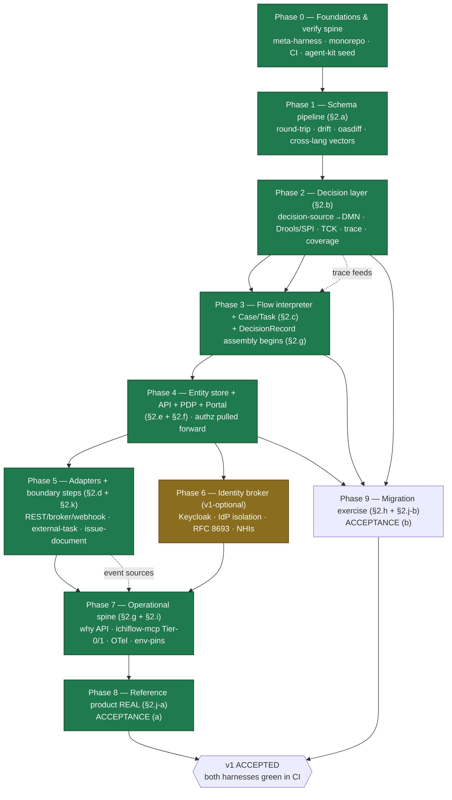

# 14 — The Build Plan

> **What this covers.** The concrete construction plan for building **ichiflow v1** — the ordered,
> chunked, harness-first sequence a builder (Claude Code first) executes to go from an empty repository
> to the two green v1 acceptance harnesses. It takes the build-order DAG sketched in
> [`13-agent-harness-loops.md`](13-agent-harness-loops.md) §4 and turns it into **explicit phases with
> explicit chunks**, each with a deliverable, a harness/exit criterion, dependencies, an agent-effort
> class, and risk notes. It states the **chunking doctrine** (what makes a unit of work a buildable
> chunk), the **critical path**, the **parallelizable work**, the **de-risking spikes**, the literal
> **first-week chunks with their `ichiflow verify` commands**, and — with equal weight — **what is
> deliberately NOT in v1**, each deferral carrying its promotion trigger.
>
> **Position in the system.** This document is the *executable elaboration* of doc 13 §4. Doc 13 owns
> the **verification spine** (what a harness is, the `ichiflow verify` contract, the verdict schema, the
> per-subsystem harness catalog); this doc owns the **construction sequence** that turns those
> harnesses green in dependency order. It sits under [`00-vision-and-principles.md`](00-vision-and-principles.md)
> §5.1 (the v1 kernel / v1-optional / post-v1 rings and the two-part acceptance test), realizes
> [`0017-v1-kernel-and-governance-dial.md`](../adr/0017-v1-kernel-and-governance-dial.md)'s kernel cut,
> and consumes the surface phasing of [`12-system-map-and-v1-surfaces.md`](12-system-map-and-v1-surfaces.md)
> and the placement doctrine of [`../adr/0033-packaging-and-placement.md`](../adr/0033-packaging-and-placement.md).
> It adds no new subsystem and re-litigates no [`BRIEF.md`](BRIEF.md) decision; it **schedules** them.
> Target design, present tense; every chunk marked **v1** unless noted. Governing doctrine: harness-first
> ([`0026-harness-first-construction.md`](../adr/0026-harness-first-construction.md)).

---

## 1. The chunking doctrine

ichiflow is built in **chunks**, not sprints. A chunk is the unit the plan schedules, and it is defined
by four properties — all four required, or it is not a chunk:

| Property | What it means | Why it is required |
|---|---|---|
| **Agent-buildable** | A Claude Code session, or a few sessions behind one harness, can complete it. It fits a working context: one subsystem slice, one harness scope, a bounded set of artifacts. | The builder is an LLM. A chunk that does not fit an agent's working context is not a plannable unit — it is a phase that still needs decomposing. |
| **Harness-first** | The chunk's harness lands **before or with** the chunk; the chunk's exit criterion **is** that harness green in CI. The harness is written red first, the implementation turns it green ([13](13-agent-harness-loops.md) §1.1; [`0026`](../adr/0026-harness-first-construction.md)). | "Looks done" is the failure mode that scales badly when the author is a machine ([13](13-agent-harness-loops.md) §1.1). The chunk's done-ness is a verdict (`ichiflow verify --scope … --json`), never a claim. |
| **Independently mergeable** | The chunk lands as a git commit/PR that passes CI on its own, behind the verify spine, without waiting on a sibling chunk. Version control is the write path ([`BRIEF`](BRIEF.md) §21a). | Chunks that can only merge together are one chunk mis-sized as two. Independent merge is what lets a small fleet run parallel chunks (§4). |
| **Demonstrable** | The chunk produces something observable — a green scope, a rendered preview, a passing vector set, a walking skeleton that runs. | A chunk with no demonstrable output cannot be judged and cannot be dogfooded; the framework's whole thesis is *productive = verifiable*. |

### 1.1 Chunk sizing — LLM-native, not sprint folklore

Chunks are sized to **context and session**, not to a two-week calendar. The effort classes used in the
tables below are:

- **S** — one focused session. A single harness scope, a bounded artifact set (a schema slice, one step
  type's vectors, one adapter binding). One agent, one sitting, one green verdict.
- **M** — a few sessions (typically 2–4), or one agent with review loops. A subsystem slice whose harness
  has several check families (a codegen round-trip + drift; a PDP model + its allow/deny vectors).
- **L** — many sessions or a small fleet working in parallel *behind one harness*, usually preceded by a
  **spike** (§6). The interpreter, the Decision SPI + Drools embedding, the projection compiler — the
  hard, load-bearing subsystems where the harness exists precisely to let volume proceed safely.

The effort class is a **planning hint, not a promise**; the verdict is the truth. An L chunk is "done"
when its scope is green, whether that took three sessions or thirty — the harness makes the count a fact,
not an estimate ([13](13-agent-harness-loops.md) §1.2). Chunks are deliberately kept **small enough that
the harness is the acceptance oracle**: an agent edits, runs the scoped verify, reads the JSON, iterates
— the tight loop of [13](13-agent-harness-loops.md) §3.5, not a human interpreting a build log.

---

## 2. The build order — phases

The phases refine [13](13-agent-harness-loops.md) §4's DAG. The spine is unchanged —
`schema → decision → flow → adapter`, with the **verify spine (Phase 0) first because it measures
everything after it** — but this plan makes three **deliberate refinements** to the founder's proposed
ordering, each argued in §2.1:

1. **The PDP (authorization) moves earlier** — it lands *with* the entity store / API / Portal (Phase 4),
   not after them, because the generated API and the Portal are PDP-gated *from birth* and the
   "same PDP design-time and runtime" invariant is only testable once both artifacts and runtime rows
   exist.
2. **The identity *broker* (authentication) moves later and off the acceptance critical path** (Phase 6),
   because Keycloak is **v1-optional** ([00](00-vision-and-principles.md) §5.1) and the reference-product
   acceptance runs at the **Dev tier** on a dev identity — authorization is kernel, brokered
   authentication is not.
3. **DecisionRecord assembly starts at Phase 3, not as a late monolith** — the `DecisionTrace` contract
   lands with the Decision layer (Phase 2), the per-case DecisionRecord begins stitching as soon as Flows
   emit event histories (Phase 3), and its *completeness* harness tightens phase by phase as new event
   sources (adapters, issuance) come online, reaching full green in the operational spine (Phase 7).

### 2.1 Resolved ordering disagreements (challenging the DAG where dependencies demand it)

**PDP earlier than the founder's Phase-6 identity block.** The founder grouped "Keycloak broker +
OpenFGA PDP + Team model" into one late identity phase woven through API/Portal/artifacts. Splitting
authentication from authorization resolves a real ordering smell. The Portal's core feature is a
**PDP-filtered** Task inbox and **field/row-level** entitlements ([07](07-ui-and-portals.md) §5, §11;
[`BRIEF`](BRIEF.md) §8), and its UI harness requires **PDP-state story coverage** (hidden / read-only /
error states — [13](13-agent-harness-loops.md) §2.e). Building the Portal with a stubbed PDP and bolting
authorization on afterward means the inbox's defining behaviour is a stub during its own acceptance. The
BRIEF backs pulling authz forward: **v1 authz = OpenFGA only** and is **kernel**, while the **Keycloak
broker is v1-optional** ([00](00-vision-and-principles.md) §5.1). So the **OpenFGA PDP + Team ownership
model** ([`0025`](../adr/0025-reference-data-ownership-and-teams.md)) lands in **Phase 4** with the API
and Portal; the same PDP governs **design-time artifact access** the moment artifacts exist, making the
one-vector-set parity of [13](13-agent-harness-loops.md) §2.f testable early.

**Identity broker later, and not on the acceptance critical path.** Because Keycloak is v1-optional and
the reference-product acceptance runs at the **Dev tier** (single binary, embedded services, governance
off — [permit walkthrough](../examples/creating-a-permit-product.md) Act 1), acceptance **(a)** needs a
Portal with real *entitlements* (the Phase-4 PDP), not real *brokered authentication*. A seeded dev
identity satisfies the loop. The full broker (per-audience realms, OIDC/SAML/LDAP strategies, RFC 8693
propagation, per-Portal IdP isolation) is therefore **Phase 6** — meaty, but **parallelizable with
adapters (Phase 5)** and **off the critical path to acceptance (a)**. This is a genuine refinement of the
founder's sequence, and it *shortens* the path to the first acceptance harness.

**DecisionRecord as a growing spine, not a late phase.** Doc 13 §4 placed DecisionRecord completeness at
its Phase 5. The founder's instinct — assemble it from Phase 2/3 — is right for the *data model and the
trace contract*: the `DecisionTrace` shape is a Phase-2 deliverable ([13](13-agent-harness-loops.md)
§2.b), and the per-case DecisionRecord ([`0011`](../adr/0011-decisionrecord-and-selective-event-sourcing.md))
stitches flow event history + traces + Task resolutions keyed by `case_id` the moment Flows run (Phase 3).
The *orphan-event detector* ([13](13-agent-harness-loops.md) §2.g) can only reach full green once every
event source exists, so the completeness harness is **cross-phase**: green-on-current-sources at each
phase, tightening as adapters (Phase 5) and issuance (Phase 5) add event kinds, and reaching
**why-answer conformance** in Phase 7. This honours both docs: the contract is early, the completeness
bar is enforced continuously rather than deferred.

### 2.2 The phases

| Phase | Name | Exit criterion (harness green in CI) | Doc-13 scope | Ring |
|---|---|---|---|---|
| **0** | Foundations & verify spine | `ichiflow verify` runs, emits the verdict envelope ([13](13-agent-harness-loops.md) §3.2), writes the ledger; a `self-check` scope is green; monorepo + CI + agent-kit seed in place. **The meta-harness — the harness that judges harnesses — exists first.** | — (spine) | v1 kernel |
| **1** | Schema pipeline | §2.a green: TypeSpec→emit→codegen round-trip clean, drift clean, oasdiff gating, cross-language validation vectors agree. Everything downstream generates from here. | §2.a | v1 kernel |
| **2** | Decision layer (walking skeleton) | §2.b green: `decision-source`→DMN compile, Drools passes the DMN-TCK subset behind the SPI, `DecisionTrace` shape holds, projection-coverage green, sample DecisionModels pass scenarios + coverage. | §2.b | v1 kernel |
| **3** | Flow interpreter + Case/Task + DecisionRecord assembly | §2.c green: interpreter conformance vectors pass under time-skip, determinism clean, compute-step contracts hold; Case/Task (assignment-as-Decision, pausable SLA, escalation); DecisionRecord stitches {flow, decision, task} sources, orphan detector clean on those. | §2.c + start §2.g | v1 kernel |
| **4** | Entity store + generated API + **PDP** + first Portal | §2.e + §2.f green + entity store: generated repositories (CRUD + outbox), generated API + boundary validation, **OpenFGA PDP + Team model** (design-time = runtime parity), back-office Task inbox + Case/review view, uischema generation (scope lint, a11y AA, PDP-state coverage). | §2.e + §2.f | v1 kernel |
| **5** | Adapters + canonical boundary steps | §2.d green + delegation/issuance vectors: REST in/out + one broker + webhook (contract tests, mapping goldens, idempotency/DLQ), `external-task` vectors, `issue-document` + Document/`doctemplate` + rendering SPI, notifications port; DecisionRecord completeness re-green with the new event sources. | §2.d + §2.k | v1 kernel |
| **6** | Identity federation (authn broker) | Brokered login end-to-end; per-Portal IdP isolation; RFC 8693 propagation; agents as NHIs; PDP vectors still green under brokered subjects. *(Parallelizable with Phase 5; off the acceptance-(a) critical path.)* | — | **v1-optional** |
| **7** | Operational spine completion | §2.i green (tool-contracts + **tier-enforcement negative tests**) + §2.g why-answer conformance: `ichiflow-mcp` Tier-0 read + Tier-1 sandbox tools, OTel/OTLP export + correlation, git-as-write-path env-pins/promotion + break-glass. | §2.g + §2.i | v1 kernel |
| **8** | Reference product made real — **acceptance (a)** | §2.j-a green: the outdoor-event-permit product runs every layer real (schemas→decisions→flows→portal→audit→`ichiflow-mcp` debug); a seeded stuck case reproduces and the why API stitches it. | §2.j-a | v1 acceptance |
| **9** | Migration exercise — **acceptance (b)** | §2.j-b green: Ring-0 mapping over a generic legacy source validates, rules re-expressed as DecisionModels pass decision parity on the golden dataset, reconciliation clean, exit-story exports re-consumable outside ichiflow. | §2.h + §2.j-b | v1 acceptance |

### 2.3 Phase DAG

**Critical path:** `P0 → P1 → P2 → P3 → P4 → P5 → P7 → P8`. This is the schema→decision→flow→adapter
dependency chain plus the operational spine the reference product's *why*-debug moment depends on. Every
box on it is v1-kernel; none can be skipped or reordered without breaking a hard dependency.

**Off the critical path (parallelizable):**
- **Phase 6 (identity broker)** depends only on Phase 4 and feeds Phase 7; it runs **alongside Phase 5**.
  It is v1-optional and not required for acceptance (a).
- **Phase 9 (migration)** depends on Phase 2 (DecisionModels + parity), Phase 3 (Flow JSON export), and
  Phase 4 (entity store + Ring-0 mapping target). It needs **neither the Portal build nor the identity
  broker**, so its harness can be scaffolded once Phase 4 lands and run **in parallel with Phases 5–7**,
  joining the acceptance gate alongside Phase 8.

Both acceptance harnesses (Phase 8, Phase 9) are the **outermost loop** ([13](13-agent-harness-loops.md)
§2.j); **v1 is accepted only when both are green in CI.**

---

## 3. Per-chunk plan

Chunk id = `phase.n`. **Depends-on** lists chunk ids (or "Phase N green"). **⇉** marks chunks
parallelizable with their siblings; **◆** marks a de-risking spike (§6). Effort ∈ {S, M, L} (§1.1).
Every exit criterion is a green `ichiflow verify` scope unless stated.

### Phase 0 — Foundations & the verify spine (v1 kernel)

| Chunk | Deliverable | Harness / exit | Depends-on | Effort | Risk notes |
|---|---|---|---|---|---|
| **0.1** | Monorepo scaffolding (Kotlin core + TS edges workspaces), CI skeleton, format/lint, **license-allowlist gate** ([`0016`](../adr/0016-license-hygiene-policy.md)) | CI green on empty repo; license gate passes; build boots | — | S | Get the polyglot toolchain (Gradle + pnpm) reproducible early; air-gap-friendly pinning from day one |
| **0.2** | `ichiflow verify` **walking skeleton** — CLI entry point, the **verdict-envelope schema** (TypeSpec-authored, [13](13-agent-harness-loops.md) §3.2), ledger writer, a trivial `self-check` scope | `ichiflow verify --scope self-check --json` emits a valid envelope with `flaky:false`; a golden verdict fixture validates | 0.1 | M | **The meta-harness.** Its verdict schema is a load-bearing contract consumed by CI, dashboard, `get_verify_status`, agents — freeze its shape carefully (Open-q on versioning, [13](13-agent-harness-loops.md) Open-q1) |
| **0.3** | Agent-kit seed — `AGENTS.md`, `CLAUDE.md`, first `.claude/skills` (`add-schema`, `run-verify`), `PostToolUse` scoped-verify hook, **resources manifest** seed + schema ([`BRIEF`](BRIEF.md) §12) | `ichiflow verify --scope agent-kit` green (resources manifest schema-validates; hook fires scoped verify on write) | 0.2 | S | The hook is the only guaranteed-execution layer ([10](10-ai-native-experience.md) §2.2) — "must verify before claiming done" lives here |

### Phase 1 — Schema pipeline (v1 kernel) — [`0006`](../adr/0006-typespec-authoring-openapi-jsonschema-canonical.md)

| Chunk | Deliverable | Harness / exit | Depends-on | Effort | Risk notes |
|---|---|---|---|---|---|
| **1.0 ◆** | **Cross-language fidelity spike** — a few *hard* constructs (nullability, `format`, discriminated unions, integer bounds, `oneOf`) round-tripped through emit + Zod v4 (TS) + OptimumCode (Kotlin) | `ichiflow verify --scope schema-fidelity-spike` — both validators agree on every accept/reject for the probe corpus | Phase 0 green | M | **Riskiest bet #5** (§6). If the two validators disagree on a core construct, the whole cross-language premise needs adjustment *before* the pipeline is built on it |
| **1.1** | TypeSpec→OpenAPI 3.1 / JSON Schema 2020-12 / AsyncAPI 3.1 emit + checked-in canonical artifacts + **regenerate-and-diff** drift check | `--scope schema-pipeline`: drift clean (`git diff --exit-code`) | 1.0 | M | Emitter pinning; deterministic emit ordering (drift depends on it) |
| **1.2** | Codegen — **Fabrikt** (Kotlin) + **hey-api/orval** (TS), pinned; full round-trip | `--scope schema-pipeline`: compile→emit→codegen→match committed | 1.1 | M | Pinned generators (avoid `openapi-fetch`, [`0016`](../adr/0016-license-hygiene-policy.md)); round-trip is the guard against generator drift |
| **1.3** | Cross-language validation vectors — fixture instances (valid + deliberately-invalid) validated in **both** languages against the same JSON Schema | `--scope schema-pipeline`: `vectors_green / total`, both validators agree | 1.0, 1.2 | M | Generalizes 1.0's spike to the full corpus; disagreement is a failed vector |
| **1.4** | oasdiff **breaking-change gate** + **CodeSet/ReferenceData** artifact class (versioned, effective-dated, `codeRef` referential integrity) ([`BRIEF`](BRIEF.md) vocab; [`0025`](../adr/0025-reference-data-ownership-and-teams.md)) | oasdiff gates a breaking change without a bump; `codeRef` integrity validates at publish | 1.1 ⇉ 1.3 | M | CodeSets are consumed by Decisions/Flows/UI — kernel, not optional; the dependency-graph query ("what depends on this code?") ships here |

### Phase 2 — Decision layer walking skeleton (v1 kernel) — [`0001`](../adr/0001-canonical-rule-representation-dmn.md)/[`0002`](../adr/0002-pluggable-decision-engine-spi-drools-default.md)/[`0027`](../adr/0027-dmn-authoring-projection.md)

| Chunk | Deliverable | Harness / exit | Depends-on | Effort | Risk notes |
|---|---|---|---|---|---|
| **2.0 ◆** | **decision-source→DMN full-coverage spike** — the *hardest* boxed-expression kinds (contexts, invocations, FEEL functions/BKMs) compiled to DMN 1.6 XML and executed on Drools | `--scope decision-projection-spike`: the hard constructs compile to valid DMN and execute identically to a hand-authored reference | Phase 1 green | L | **Riskiest bet #2** (§6). "100% AI coverage of the DMN surface" is only credible if the hard constructs work; probe them *before* building the full projection compiler |
| **2.1 ◆** | **Decision Engine SPI + Drools embedding** (JVM, **KIE 10.2.0 pinned**) + **DMN-TCK subset** conformance harness ([13](13-agent-harness-loops.md) §2.b) | `--scope decision-layer`: `tck_cases_green / total` on Drools behind the SPI; capability-descriptor conformance | 2.0 | L | **Riskiest bet #3** (§6): JVM embedding + version pinning. The TCK subset selection needs curation ([13](13-agent-harness-loops.md) Open-q3). Manifest pins KIE + TCK versions |
| **2.2** | `decision-source` projection + one-way compile to DMN 1.6 XML + **projection-coverage** harness across the DMN feature matrix | `--scope decision-layer`: `constructs_covered / total` green | 2.0, 2.1 | L | Generalizes 2.0; escape hatches (DRL/rule-unit/CEP) contribute compile-checks here ([`0027`](../adr/0027-dmn-authoring-projection.md)) |
| **2.3** | **Outcome / CompositeOutcome / Condition** typed model + **`DecisionTrace`** emission + trace-shape conformance | `--scope decision-layer`: trace-shape green; `DecisionTrace` schema frozen | 2.1, Phase 1 | M | **`DecisionTrace` is the contract DecisionRecord depends on** (§2.1) — freeze it here; `scoreBreakdown`/`feeBreakdown` are first-class Outcome facets |
| **2.4** | Per-DecisionModel **scenario suites + rule/row coverage** (`Harness` artifact class) + **FEEL semantics vectors** | `--scope decision-layer`: `scenarios_pass / total`, `coverage` met, `feel_vectors_green / total` | 2.1, 2.3 | M | The scenario/coverage engine ships as a **product feature** ([13](13-agent-harness-loops.md) §4.3) — first dogfood |

### Phase 3 — Flow interpreter + Case/Task + DecisionRecord assembly (v1 kernel) — [`0003`](../adr/0003-temporal-durable-execution-substrate.md)/[`0004`](../adr/0004-declarative-flow-dsl-on-temporal.md)/[`0005`](../adr/0005-first-party-case-and-human-task-module.md)

| Chunk | Deliverable | Harness / exit | Depends-on | Effort | Risk notes |
|---|---|---|---|---|---|
| **3.0 ◆** | **Temporal-TS interpreter determinism spike** — a minimal generic interpreter over a 3-step flow JSON on the Temporal test env; replay-twice determinism under time-skip | `--scope interpreter-determinism-spike`: identical replay; SLA timer fast-forwards | Phase 2 green | L | **Riskiest bet #1** (§6). Determinism at DSL generality is the hardest correctness property in the system; prove the pattern on a toy before the full step set |
| **3.1** | Canonical **flow-JSON DSL schema** + generic **TS interpreter workflow** on Temporal + DSL-schema validation | `--scope flow-layer`: DSL-valid; skeleton conformance vectors green | 3.0 | L | The interpreter is one generic workflow; its correctness is the whole layer's ([04](04-flow-and-case-layer.md) §2) |
| **3.2** | Core step types — **`decision-eval`**, **`compute`** (unified code-activity contract), **`human-task`** — + interpreter conformance vectors + **determinism harness** under time-skip + compute-contract tests | `--scope flow-layer`: `vectors_green / total`; determinism clean; compute purity/boundary tests | 3.1, 2.3 | L | Every step type ships its vectors first ([13](13-agent-harness-loops.md) §2.c); the code-activity contract is reused by decision feature-functions + adapter transforms |
| **3.3** | **Case + Task** module minimum — `case_id`, assignment (**assignment-as-Decision**), **pausable SLA** timers, escalation | `--scope flow-layer`: scenario tests assert path + Tasks + event history under time-skip | 3.2 | M | Time-skip makes month-long SLAs verify in ms; pausable-clock machinery is reused by `external-task` (Phase 5) |
| **3.4** | **DecisionRecord assembly begins** — stitch flow event history + decision traces + Task resolutions keyed by `case_id`; **orphan-event detector** on current sources | `--scope decisionrecord`: `chains_complete / total`, orphans clean on {flow, decision, task} | 3.2, 3.3, 2.3 | M | Completeness tightens in Phase 5 (adapter/issuance events) and Phase 7 (why-answer); not a late monolith (§2.1) |

### Phase 4 — Entity store + generated API + PDP + first Portal (v1 kernel) — [`0018`](../adr/0018-domain-entity-store.md)/[`0008`](../adr/0008-jsonforms-model-ui-overrides.md)/[`0010`](../adr/0010-hybrid-authorization-openfga-plus-policy.md)/[`0025`](../adr/0025-reference-data-ownership-and-teams.md)

| Chunk | Deliverable | Harness / exit | Depends-on | Effort | Risk notes |
|---|---|---|---|---|---|
| **4.1** | **Domain entity store** — schema-defined entities, generated Postgres repositories, **CRUD + transactional outbox** (not event-sourced) | generated-repo round-trip + outbox-delivery vectors green | Phase 3 green | M | Storage SPIs ([`0012`](../adr/0012-postgresql-first-storage-spis.md)); the outbox feeds adapters (Phase 5) and read models |
| **4.2** | **Generated API** (BFF surface) from schema + runtime JSON-Schema validation at every boundary | `--scope` contract tests: API conforms to emitted OpenAPI | 4.1 | M | Same JSON Schema validates at the boundary as generated the types — zero-drift ([02](02-schema-foundation.md) §5) |
| **4.3** | **PDP slice — OpenFGA + Team ownership model** (role-as-relation), authz decision logs, **design-time = runtime parity** | `--scope authz`: `vectors_green / total`, `parity(design-time, runtime): pass` ([13](13-agent-harness-loops.md) §2.f) | 4.2 | L | **Pulled forward from the founder's Phase 6 (§2.1).** One PDP contract, one vector set across API + UI + artifact access; Cedar/OPA is post-v1 behind the same interface |
| **4.4** | First **Portal** — back-office **Task inbox** (PDP-filtered, SLA-ordered) + **Case/review view** (decision-trace view, action form *signals* the Flow, obligation checklist, case operations) | Portal renders; action form signals the Flow; PDP-filtered rows | 4.2, 4.3, 3.3 | M | The **(A3/A4) v1-built surfaces** ([12](12-system-map-and-v1-surfaces.md) §2.A) — the only human UI v1 builds; acceptance-(a) critical |
| **4.5 ◆** | **uischema generation** (JSON Forms; independent data + ui schema) + **scope lint** + **PDP-state story coverage** + a11y AA | `--scope ui`: scope lint clean, `states_covered / required`, axe-core AA, preview snapshots produced | 4.4, 4.3 | M | **Riskiest bet #4** (§6): scope lint + PDP-state coverage at schema scale — spike the lint on a nontrivial schema first. Interactive Design Kit apps are post-v1 ([12](12-system-map-and-v1-surfaces.md) §2.D); the **checks** are v1 |

### Phase 5 — Adapters + canonical boundary steps (v1 kernel) — [`0028`](../adr/0028-delegation-step.md)/[`0029`](../adr/0029-document-issuance.md)

| Chunk | Deliverable | Harness / exit | Depends-on | Effort | Risk notes |
|---|---|---|---|---|---|
| **5.1 ⇉** | **Adapter runtime** — REST in/out + **one** message broker + webhook; Message-Translator mappings (pure) + contract tests + mapping goldens + idempotency/DLQ vectors | `--scope adapters`: contract tests green, goldens stable, `dedup: pass`, `dlq: pass` | Phase 4 green | L | Against a **mock broker** — no live external system ([13](13-agent-harness-loops.md) §2.d). SFTP profile is **designed, post-v1** ([`0028`](../adr/0028-delegation-step.md)) |
| **5.2 ⇉** | **`external-task`** (delegation) step — submit→await correlated→validate→resume; timeout/dup/malformed | `--scope flow-layer`: `delegation_vectors_green / total` against the mock | 5.1, 3.3 | M | Reuses the pausable-clock + escalation machinery (3.3). Not exercised by the permit (which uses `human-task`); proven by vectors, not acceptance-(a) |
| **5.3 ⇉** | **`issue-document`** step + **Document** / **`doctemplate`** + **rendering SPI (Typst default)** + number allocation (exactly-once-memoized) + lifecycle + verification endpoint | `--scope` §2.k: `render_deterministic`, `lifecycle_vectors_green`, `replay_idempotent`, verification vectors green | 5.1, 3.4 | L | Numbering/lifecycle/verification are **core** (audit-spine); render is an **SPI** ([`0033`](../adr/0033-packaging-and-placement.md)). A permit *is* a Document — exercised by acceptance (a). **Countersignature facet is post-v1** (§5) |
| **5.4** | **Notifications** port (delivery SPI) + **DecisionRecord completeness re-green** with adapter + issuance events stitched | `--scope decisionrecord`: orphan detector clean **including** adapter-call + issuance events | 5.1, 5.3, 3.4 | S | Completeness tightens here (§2.1) — new event kinds must stitch |

### Phase 6 — Identity federation (authn broker) — **v1-optional**, parallelizable with Phase 5 — [`0009`](../adr/0009-identity-broker-per-audience.md)

| Chunk | Deliverable | Harness / exit | Depends-on | Effort | Risk notes |
|---|---|---|---|---|---|
| **6.1 ⇉** | **Keycloak broker per audience** + OIDC/SAML/LDAP strategies + **per-Portal IdP isolation** | brokered login e2e; per-Portal realm-isolation vector; PDP vectors still green under brokered subjects | Phase 4 green | M | Keycloak is **v1-optional** (Team+ tier); Dev tier runs a seeded dev identity. **Off the acceptance-(a) critical path** (§2.1) |
| **6.2 ⇉** | **RFC 8693 token-exchange** propagation + Better Auth on TS edges + **agents as NHIs** under §7/§8 | propagation vectors; NHI identity resolves in authz vectors | 6.1, 4.3 | M | Multi-tenant seams (`tenant_id`, per-Portal IdP isolation) are **designed here, not activated** ([`0017`](../adr/0017-v1-kernel-and-governance-dial.md)) |

### Phase 7 — Operational spine completion (v1 kernel) — [`0011`](../adr/0011-decisionrecord-and-selective-event-sourcing.md)/[`0015`](../adr/0015-first-party-mcp-server-and-agent-kit.md)/[`0020`](../adr/0020-prod-access-posture-dial.md)

| Chunk | Deliverable | Harness / exit | Depends-on | Effort | Risk notes |
|---|---|---|---|---|---|
| **7.1** | **why API** completion + **why-answer conformance** (`explain_decision` returns the object the back-office view renders; reason codes resolve to pinned CodeSet versions) | `--scope decisionrecord`: why-answer green | Phase 5 green | M | Closes the DecisionRecord spine started in 3.4 |
| **7.2** | **`ichiflow-mcp`** — **Tier-0 read** tools (`get_case_trace`, `explain_decision`, `list_stuck_cases`, `get_verify_status`) + **Tier-1 sandbox** + tool-contract tests + **tier-enforcement negative tests** | `--scope mcp`: contract tests green **and** `tier_vectors_green / total` (Tier-2-without-approval MUST fail; Tier-0 no write path) | 7.1, 4.3 | L | **Tier-2 prod-mutating is post-v1** ([00](00-vision-and-principles.md) §5.1) — but the enforcement harness ships v1 to *prove the guardrail is denied*. A red here blocks release unconditionally ([13](13-agent-harness-loops.md) §2.i) |
| **7.3 ⇉** | **OTel/OTLP wiring** (traces/metrics/logs/decision events, `case_id` correlation) + Dev-tier minimal local viewer | signals export via OTLP; `case_id` correlation present | Phase 5 green | M | BYO backend, no proprietary store ([`0011`](../adr/0011-decisionrecord-and-selective-event-sourcing.md)) |
| **7.4 ⇉** | **Write-path / env-promotion** — git-as-write-path, env-pins (per-Team partitions), promotion = commit-the-pin, break-glass loud/logged | promotion-flow test; break-glass audited to DecisionRecord | Phase 4 green | M | Version control is the write path ([`BRIEF`](BRIEF.md) §21a; [`0020`](../adr/0020-prod-access-posture-dial.md)) |

### Phase 8 — Reference product made real — **acceptance (a)** (v1) — [permit walkthrough](../examples/creating-a-permit-product.md)

| Chunk | Deliverable | Harness / exit | Depends-on | Effort | Risk notes |
|---|---|---|---|---|---|
| **8.1** | The **outdoor-event-permit** Workspace, real: schemas (+ fee CodeSet), Decisions (eligibility, fee, **Safety + Zoning CompositeOutcome**, referral), Flow (intake → parallel review → issue permit Document), Portal (customer forms + status, back-office inbox + case view), audit | `--scope reference-product`: `checkpoints_pass / total` (schema→decisions→flow→portal→audit checkpoints all green) | Phase 7 green | L | Composes every inner harness ([13](13-agent-harness-loops.md) §2.j). Runs at **Dev tier** on dev identity — Phase 6 not required |
| **8.2** | **Stuck-case debug loop** — a seeded stuck permit reproduces; an agent debugs it through the why API / `ichiflow-mcp` | `--scope reference-product`: `reproduce_case` seeds the stuck state and the why API stitches the causal chain | 8.1, 7.2 | M | The **(a)-clause** literal requirement ([`0017`](../adr/0017-v1-kernel-and-governance-dial.md) amendment): "an agent debugs a stuck case through the why API" |

### Phase 9 — Migration exercise — **acceptance (b)** (v1) — [`0014`](../adr/0014-map-first-migrate-last.md)/[11](11-migration-in-and-out.md)

| Chunk | Deliverable | Harness / exit | Depends-on | Effort | Risk notes |
|---|---|---|---|---|---|
| **9.1 ⇉** | **Generic legacy source** fixture (DB + spreadsheet, **no real system named**) + **Ring-0 declarative mapping/ACL** (zero/additive DDL) + mapping validation | `--scope migration-exercise`: Ring-0 mapping validates | Phase 4 green | M | Ring-0 mapping is **plain declarative data** — Copilots are post-v1 ([`0017`](../adr/0017-v1-kernel-and-governance-dial.md)). Runnable in parallel with Phases 5–7 |
| **9.2 ⇉** | Legacy rules **re-expressed as DecisionModels** + **decision-parity** on a golden dataset + reconciliation | `--scope migration`: `parity_pass / total`, `row_delta: 0`, `checksum_match: pass` | 9.1, Phase 2 | L | Outcome parity (not schema parity) is the bar ([11](11-migration-in-and-out.md) §4.1); the parity harness ships as a **product feature** |
| **9.3 ⇉** | **Exit story** — export DMN / Flow JSON / schemas / data; re-consume outside ichiflow (third-party DMN engine validates exported DMN) | `--scope migration-exercise`: exit-story exports re-consumable | 9.2, 3.2 | M | Anti-lock-in is a core promise — **migration out is on the bar** ([`0017`](../adr/0017-v1-kernel-and-governance-dial.md)) |

---

## 4. First week — the literal first chunks, in order

What a Claude Code session does Monday morning, with the exact command that turns each chunk green. The
first three are Phase 0 (the spine has to exist before anything is judged); the rest begin Phase 1
behind it.

| # | Chunk | What the session does | Verify command (the exit) |
|---|---|---|---|
| 1 | **0.1** | Scaffold the monorepo (Kotlin + TS workspaces), wire CI, add the license-allowlist gate | `ci` green on the empty repo; `./gradlew build && pnpm -r build` boots; license gate passes |
| 2 | **0.2** | Build the `ichiflow verify` walking skeleton — CLI, verdict-envelope schema, ledger writer, `self-check` scope | `ichiflow verify --scope self-check --json` → valid envelope, `verdict: pass`, `flaky: false` |
| 3 | **0.3** | Seed the agent kit — `AGENTS.md`, `CLAUDE.md`, first skills, the `PostToolUse` scoped-verify hook, the resources-manifest schema | `ichiflow verify --scope agent-kit --json` → resources manifest validates, hook fires |
| 4 | **1.0 ◆** | Run the **cross-language fidelity spike** — probe the hard constructs through emit + Zod v4 + OptimumCode | `ichiflow verify --scope schema-fidelity-spike --json` → both validators agree on the probe corpus |
| 5 | **1.1** | Stand up TypeSpec→OpenAPI/JSON Schema/AsyncAPI emit + checked-in artifacts + regenerate-and-diff | `ichiflow verify --scope schema-pipeline --json` → `drift: clean` |
| 6 | **1.2** | Wire Fabrikt + hey-api/orval codegen; prove the full round-trip | `ichiflow verify --scope schema-pipeline --json` → round-trip check green |
| 7 | **1.3** | Add the cross-language validation vectors (valid + invalid fixtures, both languages) | `ichiflow verify --scope schema-pipeline --json` → `vectors_green == total` |

By end of week one the **verify spine judges itself**, the **schema pipeline is green**, and the
**riskiest cross-language bet is retired** — everything downstream now generates from a proven substrate.
The next session opens Phase 2 with the **2.0 decision-source→DMN spike** before any projection-compiler
code is written.

---

## 5. Deliberately NOT in v1 (post-v1 backlog, each with its promotion trigger)

The plan's discipline is as much about what it **excludes** as what it sequences. Each item below is
**designed-for but not built** in v1; its **trigger** is the concrete signal that promotes it. Nothing
here is gated commercially — every deferral is **phasing, never a paywall**
([`0022`](../adr/0022-fully-open-source.md)).

### 5.1 New primitives from the case-study battery (ADRs 0029–0033) — honest placement

**None of `QuotaLedger` (0030), set-level Cases (0031), or Case associations (0032) — nor the CaseType
catalog (0033) — are required by either v1 acceptance exercise.** The canonical permit is a **per-Case,
single-authority, single-issuance** shape, and the migration exercise is a generic per-Case casework
source; neither touches set-level, allocation, or peer-linking machinery. They are **additive declared
extensions** ([`BRIEF`](BRIEF.md) §21b), each triggered by a specific *non-permit* case-study domain:

| Post-v1 primitive | Why it is out of v1 | Trigger (the domain that promotes it) |
|---|---|---|
| **`QuotaLedger` / `quota-op`** ([`0030`](../adr/0030-quota-ledger.md)) | Permit has no shared capped resource; no acceptance exercise allocates | An **allocation / capped-budget** domain — the [public-housing ballot](../examples/case-studies/public-housing-ballot.md) (the originating trigger) or the [grant program](../examples/case-studies/grant-program.md) (monetary pools, ranked draw) |
| **Set-level `cohort`** (fan-in) ([`0031`](../adr/0031-set-level-cases.md)) | Permit decides one Case at a time; no gather-barrier | A **cohort / one-decision-over-a-roster** domain — the [public-housing ballot](../examples/case-studies/public-housing-ballot.md) |
| **Set-level `bundle`** (fan-out) ([`0031`](../adr/0031-set-level-cases.md)) | Permit issues one entitlement; no heterogeneous sub-Cases | A **multi-product hub** fanning to heterogeneous sub-Cases — [multi-agency licensing](../examples/case-studies/multi-agency-licensing.md) |
| **Case association** ([`0032`](../adr/0032-case-association.md)) | Permit Cases are independent; no peer many-to-many links | A **cross-Case investigation / portfolio** domain — [motor insurance](../examples/case-studies/motor-insurance-claim.md) (originating trigger, SIU group) or [grants](../examples/case-studies/grant-program.md) (portfolio caps) |
| **CaseType catalog** ([`0031`](../adr/0031-set-level-cases.md)/[`0033`](../adr/0033-packaging-and-placement.md)) | Single-product Workspaces need no catalog; it adds no runtime mechanism | A **multi-agency / multi-product** deployment quantifying over case types — [multi-agency licensing](../examples/case-studies/multi-agency-licensing.md) |
| **`issue-document` countersignature facet** ([`0029`](../adr/0029-document-issuance.md)) | *Base* issuance (Document / `doctemplate` / numbering / lifecycle) **is v1** (Phase 5.3 — a permit is a Document); only **multi-party accession** is deferred | A **multi-party / co-applicant offer** — the [grant program](../examples/case-studies/grant-program.md) Letter of Offer |
| **`SeededAllocate`** recipe ([13](13-agent-harness-loops.md) §2.n) | A harness-verified *pattern*, not a step type; assembles from `quota-op` + `cohort` + `compute`, none of which are in v1 | Ships with its constituent primitives — the [public-housing ballot](../examples/case-studies/public-housing-ballot.md) draw |

The rule these obey: **classify the semantic, keep the core minimal** ([`0033`](../adr/0033-packaging-and-placement.md)).
Each is a canonical step or artifact with a *declared, schema'd seam* — so promoting one post-v1 is an
additive chunk (its own harness first: contention vectors for the ledger, gather-barrier vectors for the
cohort, etc.), never a fork.

### 5.2 The rest of the post-v1 ring

| Deferred | Why | Trigger |
|---|---|---|
| **Second engine — GoRules ZEN** ([`0002`](../adr/0002-pluggable-decision-engine-spi-drools-default.md)) | Drools is the v1 reference engine behind the SPI; one engine proves the contract | Need for TS/edge/embedded eval, or a differential-engine fidelity proof for a migration import |
| **Cedar/OPA ABAC** ([`0010`](../adr/0010-hybrid-authorization-openfga-plus-policy.md)) | v1 authz = OpenFGA ReBAC only; the PDP contract is unchanged whether one or two engines sit behind it | Field-/attribute-level policy beyond ReBAC + list-filtering |
| **All Copilots** (Domain Modeling, Migration, Rule Authoring, UI/Design) ([`0017`](../adr/0017-v1-kernel-and-governance-dial.md)) | Their artifacts are **plain declarative data** authored by chat in v1; the packaged UX is multi-quarter | A persona must self-serve authoring at scale without an agent/developer in the loop ([12](12-system-map-and-v1-surfaces.md) §3, D4/D6) |
| **SFTP request-reply profile** ([`0028`](../adr/0028-delegation-step.md)) | HTTP + MQ request-reply cover v1; the profile is **designed now** | An adapter binding needs a file round-trip |
| **Python code-activity workers** ([`BRIEF`](BRIEF.md) §4) | Kotlin/TS are the only v1 worker languages behind the SPI | ML feature-prep — the expected first post-v1 language |
| **Interactive builder UIs / Design Kit apps** (D1–D6, [12](12-system-map-and-v1-surfaces.md) §2.D) | v1 internal surfaces are **LLM-only** (chat + `ichiflow-mcp` + CLI + read-only preview); the checks/artifacts/token-pipeline are v1 | Throughput / non-agent-operator population per the per-surface triggers in [12](12-system-map-and-v1-surfaces.md) §3 |
| **MCP Tier-2 prod-mutating actuators** ([00](00-vision-and-principles.md) §5.1) | v1 ships Tier-0 read + Tier-1 sandbox; the **tier-enforcement harness (7.2) ships v1** to prove Tier-2 is denied | Ops posture requires agent-mediated prod actuation under JIT + approval ([`0020`](../adr/0020-prod-access-posture-dial.md)) |
| **Compliance profile** (OpenLineage/BCBS-239 lineage, wide-event store, trigger-based bitemporal) ([`0017`](../adr/0017-v1-kernel-and-governance-dial.md)) | Niche; v1 "as-of" = Temporal replay + append-only + effective-dating | A regulated adopter with lineage/BCBS-239 requirements — an optional install |
| **Hosted multi-tenant** ([`0017`](../adr/0017-v1-kernel-and-governance-dial.md)) | v1 = single-org per deployment; **seams built now** (`tenant_id`, per-Portal IdP, entitlement scoping) | Many orgs on one deployment |
| **Team/Enterprise-tier substrates** (Apicurio, Debezium CDC, immudb, Camel-on-Quarkus heavy adapters) | v1-optional ring, behind SPIs, off by default | Tier promotion (docker-compose/K8s, HA, zones) |
| **Embedded OSS BI** (Metabase/Superset-class) ([`0021`](../adr/0021-reporting-via-oss-bi.md)) | Governed **read models are v1**; the embedded BI is adopted later | Reporting/dashboard need beyond the read-model projections (C1) |

---

## 6. Risks & de-risking spikes

Five bets carry most of the technical risk. Each has a **small early spike chunk placed at the head of
its phase**, so the risk is retired *before* volume is committed behind it — the harness-first idea
applied to uncertainty.

| # | Risk | Why it is dangerous | Spike chunk | Placement |
|---|---|---|---|---|
| **1** | **Temporal-TS interpreter determinism at DSL generality** | Determinism must hold for *every* flow the DSL can express, under in-flight-instance replay; a non-deterministic interpreter corrupts running Cases silently. The hardest correctness property in the system | **3.0** — minimal generic interpreter over a 3-step flow, replay-twice determinism + time-skip | Head of Phase 3 |
| **2** | **`decision-source`→DMN full-coverage compile** | "100% AI-authorability of the DMN surface" is a *verified metric* ([`0027`](../adr/0027-dmn-authoring-projection.md)); if the hard boxed-expression kinds don't project, the claim collapses | **2.0** — compile + execute the hardest constructs (contexts, invocations, FEEL functions/BKMs) | Head of Phase 2 |
| **3** | **Drools-on-JVM embedding + version pinning** | Riding a fast-moving Apache-incubation project (KIE) as an embedded engine; a silent semantics shift on upgrade is production risk | **2.1** — embed Drools (KIE 10.2.0 pinned) + DMN-TCK subset as the admission proof; the engine-upgrade harness gates bumps | Within Phase 2 (the SPI chunk) |
| **4** | **JSON Forms scope lint at scale** | Every uischema scope must resolve against an evolving data schema; drift at scale is where generated UI rots. PDP-state coverage compounds it | **4.5** — scope lint + PDP-state coverage over a *nontrivial* schema before the full generator | Within Phase 4 (the uischema chunk) |
| **5** | **Cross-language schema fidelity** | The whole zero-drift premise rests on Zod v4 (TS) and OptimumCode (Kotlin) agreeing on every construct; a disagreement on a core type undermines the contract-of-record | **1.0** — probe the hard constructs through both validators first | Head of Phase 1 |

Spikes are **throwaway-or-promote**: a spike that proves the pattern is folded into its phase's real
chunk; a spike that fails reshapes the phase *before* the plan spends L-effort on it. Either way the spike
is itself a green `ichiflow verify` scope — de-risking is measured, not asserted.

---

## Open questions

1. **Chunk-to-PR granularity under a fleet.** §1 sizes chunks to a session; when a small fleet runs
   parallel chunks (§4), the merge-ordering discipline (which independently-mergeable chunks can land
   concurrently without a rebase storm) needs a working rule — likely "one open PR per verify scope,"
   but this wants load data from the first parallel phase (5/6/9).
2. **Where the spike-to-production line sits for the L chunks.** For 2.1 (Drools) and 3.1 (interpreter),
   how much of the spike (2.0 / 3.0) is genuinely throwaway vs. the seed of the real chunk is a judgment
   the first two spikes will calibrate; over-investing in a spike is its own waste.
3. **Full-verify runtime budget vs. the tight loop.** Inherited from [13](13-agent-harness-loops.md)
   Open-q5: as Phase 8/9 compose every inner suite, a full `ichiflow verify` may be slow enough to erode
   the edit→verify loop. Where the `--since` incremental boundary sits, and whether long runs need the
   Tier-1 Task form, needs measurement once the suites are populous (Phase 5+).
4. **Migration fixture realism without a named system.** Phase 9's generic legacy source (9.1) must be
   realistic enough that decision parity is a meaningful proof, yet name **no real government system**
   ([`BRIEF`](BRIEF.md) §16). What makes a synthetic legacy DB+spreadsheet "hard enough" to be a credible
   acceptance bar is a fixture-design question owned jointly with [11](11-migration-in-and-out.md).
5. **Whether Phase 6 slips past v1 entirely.** If the reference-product acceptance (a) passes at Dev tier
   on a dev identity and no design partner forces brokered auth, the identity broker could formally move
   to v1-optional-adopted-later without blocking the v1 acceptance gate. The trigger that *forces* Phase 6
   into the v1 window (a Team-tier design partner, a partner-Portal with its own IdP) is not yet known.
