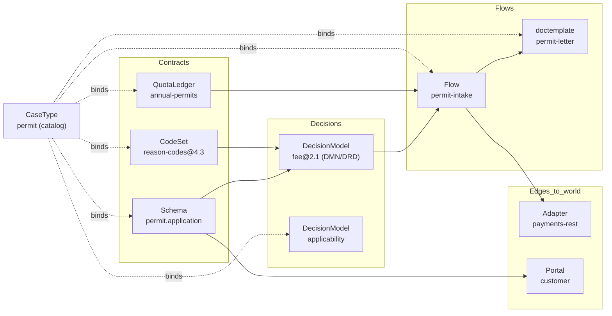
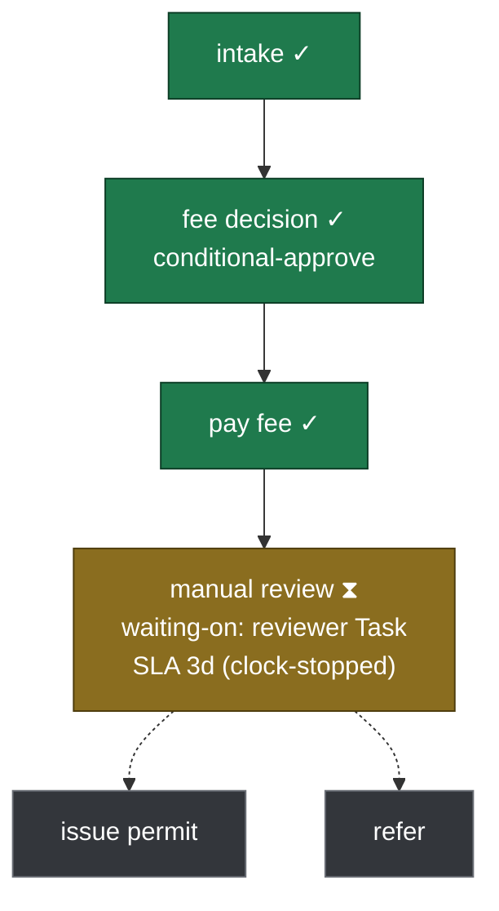

# 15 — Visualization & Visual Projections

## What this covers

How ichiflow lets a human **see** a Workspace — the flows, the decisions, and *how they all connect
together* — and how it makes the **same** views directly consumable by AI agents. Every canonical
artifact gets a **deterministic visual projection**: a text graph (the machine- and LLM-legible
form) that renders to an SVG/interactive picture (the human form), both derived one-way from the
canonical artifact, never a second editable representation. It covers the **connection map** (the
Workspace-wide dependency graph — the "how it all connects" ask), the per-artifact projections
(flow graph, DRD, decision-table view), the **runtime** projections (per-Case **journey view**,
cohort/bundle roll-ups), the **viewhints** overlay that gives humans freedom to arrange a view
*without forking truth*, the v1 surfaces (`ichiflow preview` + `ichiflow-mcp` text projections),
and the projection harness.

## Position in the system

This doc is the **visualization instance of the projection doctrine** that
[`00-vision-and-principles.md`](00-vision-and-principles.md) ("Chat to author, preview to judge")
and [ADR-0019](../adr/0019-ai-chat-first-authoring.md) establish, and the **read-only preview**
mechanism [ADR-0024](../adr/0024-llm-only-internal-surfaces-v1.md) / doc 12 scope to v1. It is
downstream of the artifacts it renders — the Flow JSON of
[`04-flow-and-case-layer.md`](04-flow-and-case-layer.md), the DMN/DRD of
[`03-decision-layer.md`](03-decision-layer.md), the Schemas/CodeSets/CaseType catalog of
[`02-schema-foundation.md`](02-schema-foundation.md) §10, and the DecisionRecord of
[`08-audit-and-observability.md`](08-audit-and-observability.md). It surfaces through
[`10-ai-native-experience.md`](10-ai-native-experience.md) §3.2 (`ichiflow-mcp`) and
[`07-ui-and-portals.md`](07-ui-and-portals.md) §11 (`ichiflow preview`); its harness lands in
[`13-agent-harness-loops.md`](13-agent-harness-loops.md) §2.o. Source of record:
[ADR-0034](../adr/0034-deterministic-visual-projections.md).

Governing decisions: [`BRIEF.md`](BRIEF.md) locked decisions §6 (independent data-schema/UI-schema
model — the analog for the semantic-graph/viewhints split), §12 (AI-native surfaces), §19 (LLM-only
internal surfaces + previews as read-only projections), §20 (harness-first), §21 (write paths;
closed core, declared extension points). Target design, present tense; v1 vs post-v1 marked.

---

## 1. The projection doctrine, extended to pictures

ichiflow's authoring doctrine already forbids a second editable representation of any artifact: the
human *judges* a change on a **read-only projection rendered from the canonical artifact**, never on
a manipulable canvas that could drift ([ADR-0019](../adr/0019-ai-chat-first-authoring.md)). This doc
takes that doctrine to its conclusion for **all** visualization:

> **Every canonical artifact has one or more deterministic visual projections. A projection is
> derived one-way from the artifact (and, at run time, from the DecisionRecord); it is truthful (it
> shows exactly what is in the artifact — no orphans, no omissions), reproducible (same artifact
> version → same picture), and never a place to edit.**

This is the *same* move ichiflow makes everywhere a human-friendly and an audited-canonical form
must coexist — TypeSpec → OpenAPI, decision source → DMN XML, flow builder → Flow JSON,
DecisionRecord as a projection of event history. The visual layer adds no new authoring surface; it
adds **read paths** over the artifacts that already exist.

### 1.1 The projection catalog

| Canonical artifact | Projection(s) | Derived from |
|---|---|---|
| **Flow JSON** (doc 04) | **flow graph** — steps as nodes, transitions/guards/event-listeners as edges; sub-flows, `external-task`/`issue-document`/`quota-op`/human-`Task`/`compute` step kinds visually distinct; set-level (`cohort` gather-barrier, `bundle` fan-out) shapes | the canonical Flow JSON |
| **DecisionModel / DMN** (doc 03) | **DRD diagram** (decision / input-data / BKM / knowledge-source nodes + dependencies) + per-decision **decision-table / boxed-expression view** | the DMN 1.6 model (rendered read-only, e.g. dmn-js for the table view — doc 03 §5.3) |
| **Workspace** (doc 01/02) | the **connection map** — the cross-artifact dependency graph (§3) | artifact refs across all governed artifacts + `list_artifact_types` (doc 02 §10) |
| **CodeSet / QuotaLedger** (doc 02, ADR-0025/0030) | **dependency sub-graph** ("what depends on this code / this ledger?") | `codeRef` links + publish-time dependency graph (doc 02; ADR-0025) |
| **Case (runtime)** (doc 04/08) | the **journey view** — the flow graph with the *actual path walked*, current position, and waiting-on state overlaid (§4) | the Case's DecisionRecord + Temporal event history |
| **cohort / bundle (runtime)** (ADR-0031) | **roll-up views** — a cohort's fan-in to one set-level record; a bundle parent → its heterogeneous children with partial-tolerant status | the cohort/parent DecisionRecord + member/child records |

Every row is a **projection**, not an editor. The authoring surface for each remains chat + the
canonical artifact; these are what a human (or agent) *looks at* to understand or judge.

---

## 2. One source, two audiences (the format choice)

The load-bearing design property: a projection is **one artifact serving two audiences** — a human
looking at a rendered picture, and an agent reading a text graph — with **no divergence** between
what they see. An agent that calls `ichiflow-mcp` for a flow graph gets the *same* text projection
that renders to the SVG a human opens in `ichiflow preview`.

To make that literal, a projection is emitted in **two co-derived forms** from one deterministic
projector:

1. **A typed JSON graph** — the machine-canonical projection: `{ nodes[], edges[], groups[] }` where
   every node/edge carries its **originating artifact ref** (`flow:permit-intake#step/assess`,
   `decision:fee@2.1.0`, `codeset:reason-codes@4.3.0`). This is the form the **harness** checks for
   truthfulness (§6) and the form an agent consumes when it wants structure, not prose. It carries
   **no layout coordinates** — position is not part of the truth (§5).
2. **A Mermaid text rendering** — the human- and LLM-legible form, generated deterministically from
   the JSON graph. This is what a human reads inline, what an agent reads when it wants the gestalt,
   and what renders to SVG for `ichiflow preview`.

The SVG/interactive picture is a *third, derived* rendering of the Mermaid — a cache of the text,
exactly as a Document binary is a cache of its snapshot+template (doc 04 §5.1). The truth is the
JSON graph; the Mermaid and the SVG are reproducible renderings of it.

### 2.1 Why Mermaid (over D2 and raw JSON-graph-only)

LLM legibility is a **first-class** selection criterion, alongside determinism and licensing:

- **Mermaid has the deepest LLM training presence** of any diagram-as-code format and is the format
  models emit most reliably — it is the subject of a dedicated 2025 benchmark (MermaidSeqBench,
  NeurIPS 2025 LLM-Evaluation workshop) where no comparable cross-format benchmark yet exists for
  DOT/D2. An agent can both *read* and *write-back-a-suggested-edit-to-the-underlying-artifact* from
  a Mermaid view with the least friction. It is also already the diagram format used throughout
  these architecture docs — humans reviewing ichiflow itself read Mermaid.
- **Licensing is clean.** Mermaid is MIT. This matters because ichiflow is fully open source
  ([ADR-0022](../adr/0022-fully-open-source.md)): a projection engine may not depend on a paid or
  watermark-encumbered component. This **rules out** the two encumbered options the research
  surfaced — **D2's best layout engine, TALA, is proprietary/paid** (watermarked without a license),
  and **bpmn-js/dmn-js ship under the custom bpmn.io license with a mandatory, non-removable
  watermark**. (dmn-js is still fine for the *read-only decision-table render* inside a preview,
  doc 03 §5.3 — a display widget, not the projection engine.)
- **D2 was the strong alternative** — its core is FOSS (MPL-2.0) and its ELK/dagre engines are
  clean — and it renders architecture-style connection maps beautifully. It loses on **LLM
  ubiquity** (far less training presence than Mermaid) and on the **TALA licensing trap** (the
  layout that makes D2 look best is the paid one). It remains a candidate for a *post-v1* richer
  connection-map renderer if Mermaid's layout proves insufficient for large Workspaces (§7 open q).
- **Raw JSON-graph-only** (no Mermaid) was rejected as the human form: a human needs a picture, and
  a JSON adjacency list is not one. But JSON graph is *retained as the machine-canonical layer* —
  it is the truthfulness anchor and the structured agent form. So the answer is **both**, with
  Mermaid derived from the JSON graph, not a parallel authoring of it.

**Net:** JSON graph = machine truth; **Mermaid = the shared human+LLM text**; SVG = the human
pixels. All three co-derived, deterministically, from one artifact version.

### 2.2 Determinism is a projector property, verified by the harness

"Same artifact version → same picture" is a BRIEF-level requirement (previews must be reproducible),
and the research shows it does **not** come for free — it is a set of pins the projector must hold:

- **Layout engine.** Use **dagre** (Mermaid's default; deterministic by construction, no seed) or
  **ELK with a fixed non-zero seed** (ELK's `randomSeed` defaults to `0`, which draws from system
  time → nondeterministic; a pinned non-zero seed makes it reproducible). Never a force-directed /
  `fcose` layout that calls `Math.random()`.
- **Stable element IDs.** Mermaid's default SVG node IDs are derived from the clock; the projector
  sets **`deterministicIds: true`** with a fixed seed so the rendered SVG is byte-stable and
  diffable. Avoid the diagram types with intrinsic per-render randomness (e.g. `architecture-beta`,
  which uses `fcose`); the connection map uses `flowchart`/`graph` with a deterministic engine.
- **Pinned versions.** The Mermaid + layout-engine versions are pinned in the `resources` manifest
  (doc 10 §2.5); layout output can drift across engine versions, so the version is part of the
  reproducibility contract, exactly as a decision engine's version is.
- **Canonical node ordering.** The JSON graph emits nodes/edges in a **canonical order** (stable
  sort by artifact ref), so the Mermaid source — and therefore its diff — is stable regardless of
  the artifact's internal map ordering.

These pins are asserted, not assumed: the **§6 determinism vectors** re-run a projection and require
byte-identical JSON graph + Mermaid output. A projector that drifts fails `ichiflow verify`.

---

## 3. The connection map — "how it all connects"

The founder's core ask — *"visualize the workflows and how they all connect together as a human so I
understand what's up"* — is the **connection map**: one Workspace-level projection of the
**dependency graph across every artifact class**, derivable entirely from the refs artifacts already
carry. It is the visual companion to the artifact catalog / discovery affordances of doc 02 §10
(`list_artifact_types`, `ichiflow artifacts list`) and the CodeSet dependency graph of ADR-0025.

Nodes are artifacts; edges are the **references** between them:



- **What it answers:** *which flows use this decision? which decisions read this CodeSet? what
  breaks if I deprecate this schema field or this reason code? what does this CaseType bundle
  together?* — the impact-analysis questions ADR-0025 already makes queryable, now **seeable**.
- **How it is derived:** purely from artifact refs — a Flow's `decisionRef`/`adapterRef`/
  `doctemplateRef`/`quotaLedgerRef`, a Decision's schema + CodeSet inputs, a CodeSet's `codeRef`
  columns, a Portal's schema/uischema bindings, and a **CaseType** manifest's bundle (doc 02 §10,
  ADR-0031). No new metadata; the map is a *view* of the same graph publish-time referential
  integrity already validates.
- **Filtering & focus** (a *view* concern, never a truth concern): scope to one artifact's
  neighborhood ("everything within 2 hops of `decision:fee`"), to one Team's owned artifacts, to one
  CaseType, or to one layer. These are **viewhints** (§5), not edits to the graph.
- **CodeSet/QuotaLedger sub-graph.** The same projector, scoped to one CodeSet or ledger, renders
  the "what depends on this code?" dependency sub-graph ADR-0025 makes queryable — the visual form
  of the publish-time impact analysis.

The connection map is the **`get_workspace_map`** MCP projection (§4.1) and an `ichiflow preview`
page; it is what a newcomer (human or agent) opens first to orient.

---

## 4. Runtime projections — the journey view and roll-ups

The build-time projections show *what could happen*; the runtime projections show *what did*. They
reuse the **same flow-graph projector**, overlaying the DecisionRecord.

### 4.1 Per-Case journey view

The journey view is the flow graph with the **actual path walked** highlighted, the **current
position** marked, and the **waiting-on** state annotated — rendered from the Case's DecisionRecord
(doc 08 §1) + Temporal event history (`get_workflow_history`, doc 10 §3.2), never re-simulated:



- **Truthful to the record.** Each highlighted node/edge maps to a recorded event; each pending node
  is an unwalked step. The overlay is a projection of history, so it **cannot** show a path the Case
  did not take (a §6 harness property).
- **Waiting-on semantics.** For a paused Case the view names *what* it waits on — a human `Task`, an
  `external-task` correlated response, a blocking `Condition`, a `quota-op` reservation, an SLA/timer
  — and, where relevant, whether the SLA clock is running or stopped (doc 04). This is the "why is
  this stuck?" answer, drawn on the graph.
- **Rendered, not the built one.** This is the projection behind the **back-office Case/review
  view** (doc 12 A4, built in v1) and the `ichiflow-mcp` triage path — the human reviewer and the
  agent see the same journey. It complements, rather than replaces, the **Temporal Web UI** (doc 12
  C3) raw event history: the journey view is ichiflow-semantic (steps, Cases, Conditions), the
  Temporal UI is workflow-primitive.

### 4.2 Cohort / bundle roll-up views

Set-level Cases (ADR-0031) get roll-up projections keyed above `case_id`:

- **cohort** — a **fan-in** picture: N member Cases → the gather-barrier → the one set-level
  Decision/compute → scatter, with the **one cohort-scoped DecisionRecord** (`cohortId`) every member
  references. The view makes "my queue number resolves to *one* shared record" visible (doc 08 §1.7).
- **bundle** — a **fan-out** picture: the parent → its heterogeneous child sub-Cases (each a distinct
  `caseType`), with the **partial-tolerant status roll-up** (some approved, some rejected → `partial`,
  a first-class end state, *not* a blocked bundle). Child records are **referenced**, never merged —
  the view shows N independent journeys under one parent, matching the audit shape.

### 4.3 The projection MCP tools (Tier-0)

All projections are exposed as **read-only (`readOnlyHint: true`) `ichiflow-mcp` tools** (doc 10
§3.2), each returning the **same** JSON-graph + Mermaid pair a human sees rendered:

- `get_flow_graph(flow_ref, as_of?)` → the flow-graph projection of a Flow version.
- `get_decision_drd(decision_ref)` → the DRD projection (+ per-decision boxed-expression/table view).
- `get_workspace_map(focus?, team?, case_type?, hops?)` → the connection map (§3), optionally focused.
- `get_case_journey(case_id, as_of?)` → the per-Case journey view (§4.1), bitemporal `as_of` honored.
- `get_set_journey(cohort_id | bundle_case_id)` → the cohort/bundle roll-up (§4.2).

They are Tier-0 by construction (pure reads over artifacts + the DecisionRecord), so they
auto-approve, and they are **PDP-scoped** — a caller sees only artifacts/Cases it may see (doc 06),
the same scoping `get_case_documents` already applies. An app's own domain projections can register
through the MCP tool-extension SPI (doc 10 §3.5) like any other tool.

---

## 5. Guidance + freedom — the `viewhints` overlay

"Deterministic guidance + freedom" resolves into a clean split:

- **Guidance (deterministic):** the system **always** renders the graph truthfully from the
  artifact, with a stable auto-layout. A human never has to arrange a diagram to get a correct,
  reproducible picture — the default projection is always right.
- **Freedom (non-semantic):** a human can adjust *how they look at it* — pin a node's position,
  group nodes into a labelled cluster, collapse a sub-flow, hide a layer, pin an annotation/note,
  save a named viewpoint (filter + focus + zoom) — **without ever changing what the graph means.**

These adjustments live in an **optional overlay artifact, `viewhints`**, separate from the canonical
artifact — the exact analog of the **uischema ⁄ data-schema** split ([`BRIEF.md`](BRIEF.md) §6;
[ADR-0008](../adr/0008-jsonforms-model-ui-overrides.md)): the data schema owns *meaning*, the UI
schema owns *presentation*, and they version independently. Here the Flow/DMN/connection graph owns
*meaning*; `viewhints` owns *presentation*.

```yaml
# viewhints for flow:permit-intake  (governance-light; designer/analyst-ownable)
appliesTo: flow:permit-intake            # (or workspace-map, decision:fee, …)
pins:
  - node: step/assess
    at: { x: 320, y: 180 }               # a layout hint — advisory, never load-bearing
groups:
  - label: "Payment"
    nodes: [step/pay-fee, step/refund]
collapse: [subflow/appeals]
annotations:
  - node: step/manual-review
    note: "SLA clock stops while awaiting applicant docs"
viewpoints:
  - name: "reviewer-focus"
    filter: { layer: [flow, task] }
    focus: step/manual-review
```

**The renderer composes canonical projection + overlay.** The projector emits the truthful graph;
the renderer then applies `viewhints` as a presentation layer on top. Load-bearing invariants:

- **`viewhints` can never alter semantics.** It carries *only* presentation (positions, groupings,
  collapse, notes, filters, viewpoints). It cannot add, remove, rename, or reconnect a node/edge —
  the schema simply has no field for it. A note is a sticky, not an edge. If the truth and the hint
  disagree about *what exists*, the truth wins and the hint degrades (below). This is the BPMN-DI
  lesson learned the *right* way (§8): BPMN embeds layout (DI) *inside* the semantic file, so layout
  becomes load-bearing, merge-conflicts with logic, and drifts. ichiflow keeps layout a **separate,
  discardable overlay** — the picture is always reconstructable from the artifact alone, with or
  without hints.
- **Governance-light.** `viewhints` is not audit-spine state; it carries no `case_id` semantics and
  gates no runtime behavior. It is Team-ownable and versioned like a designer artifact, but it
  changes nothing an auditor, an engine, or the interpreter reads. Losing it loses *arrangement*,
  never *meaning*.
- **Stale overlays degrade gracefully — the uischema-scope-lint pattern.** When an artifact evolves
  (a step is renamed/removed), a `viewhints` entry that references a node that no longer exists is
  **dropped with a lint warning**, exactly as a uischema scope that no longer resolves against its
  data schema is flagged, not fatal (doc 07 §3, doc 13 §2.e). The view still renders truthfully from
  the artifact; the orphaned hint is reported so an author can prune or update it. A **viewhints
  drift-lint** ships in the §6 harness.

Because `viewhints` is optional and non-semantic, the default (no overlay) is always a correct,
deterministic picture — freedom is *additive* on top of guidance, never a precondition for it.

---

## 6. Harness — determinism, truthfulness, journey correctness

Per the harness-first doctrine ([ADR-0026](../adr/0026-harness-first-construction.md); doc 13), the
projection layer ships its harness **before** its implementation. It lands as **doc 13 §2.o** and
runs under `ichiflow verify --scope visualization`. Three families:

- **Projection determinism vectors.** Re-run a projection over a fixed artifact version and require
  **byte-identical** JSON graph *and* Mermaid output — this is what pins the layout engine + seed +
  `deterministicIds` + canonical node ordering + pinned versions (§2.2). Any drift is a hard fail.
  Fixtures: golden `(artifact version → JSON graph + Mermaid)` pairs per projection kind.
- **Truthfulness (no orphans, no omissions) — a bijection check.** Every node/edge in the picture
  **must** resolve to an element in the source artifact (no invented nodes — an *orphan*), **and**
  every step/transition/decision-node/ref in the artifact **must** appear in the picture (nothing
  silently dropped — an *omission*). The connection map's edges must each correspond to a real
  artifact ref; the DRD's nodes to real DMN elements. Verdict: `orphans: [...]`, `omissions: [...]`,
  both empty to pass. (This is the visual sibling of the DecisionRecord orphan-event detector,
  §2.g.)
- **Journey-view correctness against event-history fixtures.** Given a fixture Case's recorded
  DecisionRecord + event history, the journey projection's **walked path, current position, and
  waiting-on annotation must match the record exactly** — it may not show an untaken path, mislabel
  the current step, or invent a waiting-on cause. Cohort/bundle roll-ups assert fan-in-to-one-record
  and referenced-not-merged children. Fixtures: sample Cases/cohorts/bundles + their expected
  journey graphs.
- **`viewhints` degradation.** A stale `viewhints` (pin/group/note referencing a removed node) must
  render the truthful graph and emit the drift-lint warning — never fail the render, never alter the
  graph. Fixtures: artifact-evolution pairs + a stale overlay.

**Progress metric:** `projection_vectors_green / total` across the determinism, truthfulness,
journey-correctness, and viewhints-degradation families. The harness is a **product feature**, not
scaffolding: app-builders' own Flows/Decisions get the same projection verification (doc 13 §4.3).

---

## 7. Surfaces — v1 and the post-v1 explorer

Consistent with the LLM-only cut ([ADR-0024](../adr/0024-llm-only-internal-surfaces-v1.md); doc 12):

**v1 (built):**
- **Deterministic projections in `ichiflow preview`.** The flow graph, DRD/decision-table view,
  connection map, and per-Case journey render as **read-only** pages on the `ichiflow preview`
  dev-server URL (doc 07 §11; doc 12 §2.B) — pictures to judge, no interactive editing, no
  client-side state beyond view toggles (the preview-vs-app boundary of doc 12 open-q5).
- **MCP text projections.** The Tier-0 tools (§4.3) return the same JSON-graph + Mermaid pair to any
  agent, so the LLM path and the human path are one projection viewed twice.
- **The connection map ships v1** — it is derivable from refs already present and is the primary
  "how it all connects" orientation surface for both humans and agents.
- The **journey view is the projection behind the built back-office Case/review view** (doc 12 A4)
  and is therefore v1 by that route too.

**Post-v1 (builder surface, class D7 — seam preserved):** an **interactive Workspace explorer** — a
click-through, pan/zoom, live-updating app over the *same* projection tools — is a post-v1 builder
surface, the visualization sibling of the D1 playground and D3 ops console. **The seam that makes it
additive:** the `get_*_graph` / `get_workspace_map` / `get_case_journey` MCP tools + the JSON-graph
schema + the `viewhints` artifact are all v1, so the explorer is *just another client* of contracts
v1 already ships — never a new capability (doc 12 §2.D doctrine). **Trigger to build D7:** a human
population that must explore large Workspaces or live-monitor many Cases interactively, beyond what a
rendered `ichiflow preview` page + chat can carry (mirrors the D1/D3 triggers, doc 12 §3).

### 7.1 Acceptance — what the permit reference product must show

The reference product ([`../examples/creating-a-permit-product.md`](../examples/creating-a-permit-product.md);
[`BRIEF.md`](BRIEF.md) §16) is the acceptance-level demo of this capability. It must produce, from
its real artifacts and a real run:

1. its **flow graph** (`get_flow_graph` / an `ichiflow preview` page) — the permit-intake Flow as a
   truthful, deterministic diagram; and
2. a **live Case journey** (`get_case_journey`) for an in-flight permit application — path walked,
   current step, waiting-on state — matching that Case's DecisionRecord.

Both must pass the §6 harness (determinism + truthfulness + journey-correctness). This is the
visualization slice of the v1 acceptance bar (doc 13 §2.j).

---

## 8. Prior art and what we borrowed

- **The Superpowers "visual companion" (Jesse Vincent / obra).** Superpowers is an MIT-licensed
  Claude Code skills library; its *visual companion* is a component of the **brainstorming** skill —
  a localhost Node server (`server.cjs`) that the agent points at HTML fragments it authors, wrapped
  in a frame template, kept in sync by **`fs.watch` + WebSocket push**, offered **just-in-time**
  ("wait until a question is clearer shown than told"), and — importantly — **interactive**: the
  user clicks options, the server appends the choice to a JSON-lines events file, and the agent reads
  it on its next turn. **What we borrow honestly:** (a) the **agent renders a view for a human as a
  first-class move**, on demand, not as a heavyweight IDE; (b) a **dev-server + file-watch + live
  refresh** loop is the right lightweight sync model — it is exactly `ichiflow preview`'s posture;
  (c) the projection is *authored by the agent from the canonical thing*, not a separate tool the
  human drives. **What does *not* fit ichiflow:** the companion's **round-trip interactivity** (clicks
  as an input channel that mutate the agent's plan) is deliberately **out of scope** — our previews
  are strictly **read-only projections of governed artifacts** (ADR-0019), because a click that
  changed state would be a second editable representation and would sit off the audited write path
  (BRIEF §21). We take the *render-for-the-human, live-refresh* inspiration; we reject the
  *edit-through-the-view* mechanism.
- **BPMN Diagram Interchange (DI).** The cautionary prior art for layout persistence: BPMN embeds
  layout coordinates *inside* the semantic XML, so the picture and the logic share one file — layout
  becomes load-bearing, produces merge conflicts against logic changes, and drifts. We take the
  *idea* (persist layout) but **invert the placement**: layout lives in a **separate, discardable
  `viewhints` overlay** (§5), so the semantic artifact never carries a coordinate and the picture is
  always reconstructable without one.
- **Mermaid / D2 / Graphviz / React Flow / dagre / ELK.** The diagram-as-code landscape (§2.1–§2.2):
  Mermaid chosen for LLM ubiquity + MIT; dagre/ELK for deterministic layout (ELK only with a fixed
  seed); D2 a clean FOSS alternative but with the TALA licensing trap; bpmn-js/dmn-js usable only as
  a read-only *display* widget (watermark-encumbered license), not the projection engine; React Flow
  (MIT) a candidate *renderer* for the post-v1 interactive explorer (it does no layout itself — it
  would consume our JSON graph + a deterministic engine's coordinates).
- **Runtime execution visualization.** The journey view (§4.1) is ichiflow's semantic analog of the
  **Temporal Web UI** workflow-history view, **LangGraph/agent-trace** graph visualizers, and
  **OpenTelemetry trace waterfalls** — but rendered as the *same* flow-graph projection with the
  walked path overlaid, keyed to the DecisionRecord and `case_id`↔`trace_id` join (doc 10 §3.2) so
  the business-semantic journey and the raw execution trace reconcile.

---

## Open questions

1. **Connection-map legibility at scale.** Mermaid + dagre renders small/medium Workspaces well;
   a Workspace with hundreds of artifacts may need layered/collapsible rendering or a switch to
   ELK-with-seed or a post-v1 D2/React-Flow renderer. The **truthfulness** contract (§6) holds
   regardless of engine; only the *legibility* is open. Owned jointly with doc 12 open-q1 (preview
   fidelity).
2. **`viewhints` ownership & sharing.** Whether a Team's `viewhints` for a shared artifact is
   per-user, per-Team, or a shared default (and how two saved viewpoints merge) is a governance-light
   question — but it must stay governance-light (§5) and never cross into semantics.
3. **D7 explorer trigger threshold.** The concrete signal that promotes the rendered previews to a
   built interactive explorer (Workspace size, live-Case-monitoring need, non-agent human population)
   needs the same decision rule as the other (D) triggers (doc 12 open-q2).

---

## Sources

Research verified July 2026 (WebSearch/WebFetch). Point-in-time; the design above is authoritative.

- Superpowers project & visual companion (Jesse Vincent / obra): repo
  <https://github.com/obra/superpowers> (MIT); brainstorming skill's visual companion
  <https://github.com/obra/superpowers/blob/main/skills/brainstorming/visual-companion.md> and its
  server <https://github.com/obra/superpowers/tree/main/skills/brainstorming/scripts>;
  just-in-time offer model <https://github.com/obra/superpowers/blob/main/skills/brainstorming/SKILL.md>.
- Mermaid: <https://github.com/mermaid-js/mermaid> (MIT); pluggable layout (dagre default, ELK opt-in)
  <https://mermaid.ai/open-source/config/layouts.html> and
  <https://www.npmjs.com/package/@mermaid-js/layout-elk>; deterministic IDs
  <https://mermaid.js.org/config/schema-docs/config.html>, issue
  <https://github.com/mermaid-js/mermaid/issues/727>; architecture-diagram `Math.random` non-determinism
  <https://github.com/mermaid-js/mermaid/issues/6166>; LLM benchmark MermaidSeqBench (NeurIPS 2025)
  <https://arxiv.org/abs/2511.14967>.
- ELK (Eclipse Layout Kernel): `randomSeed` determinism (0 → system-time random)
  <https://eclipse.dev/elk/reference/options/org-eclipse-elk-randomSeed.html>; elkjs
  <https://github.com/kieler/elkjs>; determinism corroboration (elkrs differential fuzz)
  <https://crates.io/crates/elkrs>.
- dagre (`@dagrejs`, MIT, maintained fork): <https://github.com/dagrejs/dagre>.
- D2 (Terrastruct): core MPL-2.0 <https://github.com/terrastruct/d2>; layout engines (dagre/ELK/TALA)
  <https://d2lang.com/tour/layouts/>; **TALA proprietary/paid** (watermark without license)
  <https://github.com/terrastruct/TALA>, <https://terrastruct.com/tala/>.
- Graphviz (DOT): deterministic `dot` engine <https://graphviz.org/docs/layouts/dot/>; license/history
  <https://en.wikipedia.org/wiki/Graphviz>.
- React Flow / xyflow (MIT; no built-in layout): <https://xyflow.com/open-source>,
  layouting docs <https://reactflow.dev/learn/layouting/layouting>; React Flow Pro (paid)
  <https://xyflow.com/pro-license>.
- bpmn-js / dmn-js: custom bpmn.io license (mandatory watermark) <https://bpmn.io/license/>; viewer
  <https://github.com/bpmn-io/bpmn-js>.
