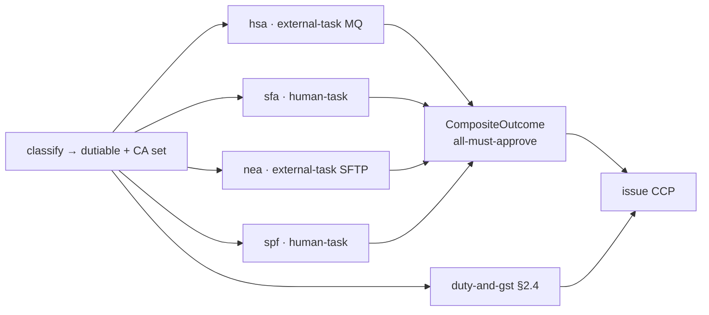

# Case study — a multi-authority customs declaration (Singapore Customs / TradeNet permit processing)

> _This is a **design-validation case study**, not a shipped product and not the canonical reference
> product. It deliberately models a **real, publicly documented** government trade system —
> **Singapore Customs' TradeNet** permit processing and the **National Single Window** its Competent
> Authorities (CAs) plug into — because customs clearance is one of the most **multi-authority,
> reference-data-heavy, integration-shaped** government decisions in the world, and therefore an honest,
> checkable stress-test of the ichiflow design. Every rule below is grounded in Singapore Customs'
> published procedures (cited inline); nothing here is invented policy._
>
> _**On the "no real government systems are named" rule (BRIEF §16).** That rule governs ichiflow's
> shipped **templates and reference product** — the canonical example stays the fictional municipal
> permit ([`../creating-a-permit-product.md`](../creating-a-permit-product.md)). This document is a
> different artifact class: an **external validation fixture** whose rules are a matter of public record,
> used to pressure-test the framework the way a compiler team tests against a published language spec. It
> ships as documentation, never as an onboarding template. The distinction is restated in [GAPS](#gaps)._
>
> _Consistent with the sibling case studies, this is **design fiction grounded in the real design**:
> every artifact is written to be consistent with [`../../architecture/BRIEF.md`](../../architecture/BRIEF.md)
> and docs `00`–`13`. The Document / doctemplate / issue-document nouns are the capability a sibling
> design is specifying; they are used here as settled vocabulary. Real published facts (declaration types,
> the four dutiable categories, CA scopes, the 9% GST rate) are cited. **TradeNet permit condition codes
> are handled two ways:** the well-known code IDs (Z-class prior-approval / audit-retention codes) are
> public; their **exact wording and any 48-hour timings are synthesized-realistic and marked** — Customs
> publishes the operative meanings inside message-implementation guides, not as an open feed._

---

## 1. Why this case, and what it stresses

A TradeNet declaration is a **single-window** submission: the declarant (importer/exporter or their
appointed freight forwarder) files **one** permit application, and TradeNet routes it to **every**
Competent Authority whose controls the goods touch. The permit issues only when **Customs and all
applicable CAs** clear it.[^tn][^ca] That shape — one Case, many independent authorities, each with its
own rules and its own turnaround — is precisely what ichiflow's `CompositeOutcome` + parallel-fan-out +
per-authority clocks exist for.

The declaration carries a **declaration type** (In-Payment / In-Non-Payment / Out / Transhipment), one or
more **HS codes**, and, where the HS code is controlled, **CA product codes** naming the regulating
authority.[^permits][^ca] Classification drives everything downstream: whether the goods are **dutiable**
(only four categories are — intoxicating liquors, tobacco, motor vehicles, petroleum/biodiesel),[^duty]
whether **GST** (9% since 1 Jan 2024, on CIF + duties) is payable,[^gst] and **which CAs** must approve.
Every later section exercises one stress dimension, stated up front:

- **(S1) Multi-authority composition.** One declaration is decided by **Customs + N CAs** (this build
  models four concretely: **HSA** pharmaceuticals/poisons, **SFA** food, **NEA** hazardous substances,
  **SPF-GEWD** weapons).[^hsa][^sfa][^nea][^spf] *All must approve.* This is `CompositeOutcome`
  `all-must-approve` with per-member attribution ([03 §2.3](../../architecture/03-decision-layer.md)) at
  its hardest.
- **(S2) Heterogeneous CA integration.** Some CAs review through **internal human Tasks** (their officers
  work in the Customs casework Portal); others are **external legacy licensing systems** answering via
  **`external-task`** — one over **message-queue request-reply**, one over an **SFTP batch round-trip**
  ([04 §2.8](../../architecture/04-flow-and-case-layer.md), [05 §11](../../architecture/05-adapters.md)).
- **(S3) Interdependent reference data.** HS code → controlled-goods flag → CA-requirement rows → duty/GST
  rate tables → condition/reason codes form a **`codeRef` dependency graph** across CodeSets, each owned by
  a different Team ([02 §9.4](../../architecture/02-schema-foundation.md)).
- **(S4) Conditional approval with blocking + post-approval obligations.** A CA can clear **subject to a
  Z06-class prior-approval condition** and a **48-hour document return**; a permit can issue with
  **post-approval obligations** (retain documents 5 years, present for inspection).[^cond]
- **(S5) A machine-readable entitlement.** On clearance a **Customs Clearance Permit (CCP)** issues via
  `issue-document` — **API-first**, reissued **v2** on amendment (v1 retained + superseded), **revoked** on
  cancellation, and **verified at the checkpoint** as a query, not a paper scan.
- **(S6) Checks and balances across organizations.** CAs are **independent authorities**; freight
  forwarders are **external partner orgs** on partner Portals; **four-eyes** guards CA rule changes. All of
  it runs through the one PDP + owning-Team model ([06 Part 4](../../architecture/06-identity-and-access.md)).

---

## 2. Artifacts

### 2.1 Schema — the Declaration

The application is one canonical Schema named in domain terms — **`Declaration`** (TypeSpec-authored,
JSON-Schema artifact; [02 §1](../../architecture/02-schema-foundation.md)). Its shape encodes declaration
type, line items with HS codes, and the controlled-goods facts each CA reads.

```typespec
// contracts/src/declaration.tsp
@jsonSchema
@doc("A TradeNet-style customs declaration flowing through the declaration-processing Flow.")
model Declaration {
  @doc("Global correlation id; the Case carries this as case_id. TradeNet's URN maps here.") id: string;
  declarationType: DeclarationType;            // IN_PAYMENT | IN_NON_PAYMENT | OUT | TRANSHIPMENT
  messageType: MessageType;                     // GST | DNG | APS | GTR | REX | ...  (codeRef → declaration-message-types)
  declarant: Declarant;                         // importer/exporter OR appointed freight forwarder (partner org)
  consignee: Party;
  originCountry: string;                        // ISO-3166 — feeds FTA / PIC-consent logic
  destinationCountry: string;
  lineItems: LineItem[];                        // one or more; classification is per line
  certificateOfOrigin?: CertificateOfOrigin;    // for preferential-tariff claims on dutiable lines
  incoterm: string;                             // drives customs value (CIF) assembly
}

model LineItem {
  hsCode: string;                               // 8-digit HS; codeRef → hs-controlled-goods (§2.2)
  caProductCodes: string[];                     // HSAHP | SFA... | NEA... | GEW...  (codeRef → ca-product-codes)
  goodsDescription: string;
  quantity: float32;  unitOfQuantity: string;   // e.g. litres, kg, units — NEA/duty math reads these
  customsValueSgd: int32;                        // CIF value in SGD; GST base
  dutiable: boolean;                             // DERIVED at classify (§2.3), not attested
  // dutiable-only facts (elided): alcoholStrengthPct, litresOfAlcohol, tobaccoWeightG, ...
  caFacts?: Record<unknown>;                     // per-CA attested facts (licence no, PIC ref, end-user cert ref)
}

enum DeclarationType { inPayment: "IN_PAYMENT", inNonPayment: "IN_NON_PAYMENT",
                       out: "OUT", transhipment: "TRANSHIPMENT" }   // published TradeNet types[^permits]
```

The `hsCode` on each line is the single fact the whole downstream graph pivots on: Singapore Customs'
guidance is literally *"classify your product into the correct HS code, and based on the HS code identify
whether it is controlled and who the CA is."*[^ca] So `dutiable` and the CA set are **derived at classify
time** (§2.3), never trusted from the declarant — modelling them as attested inputs would be the classic
"let the applicant self-assess the rule" mistake.

### 2.2 CodeSets — the interdependent reference tables, with owning Teams

Every classification and rate table is a **governed CodeSet** ([02 §9.1](../../architecture/02-schema-foundation.md)):
schema'd, semver-versioned, effective-dated, per-audience display metadata, **owned by a Team with named
stewards**. The heart of **(S3)** is that they **`codeRef` each other** — the HS table points at CA
requirements, the CA-requirement rows point at condition codes, condition codes point at reason text —
and that whole graph is publish-time integrity-checked ([02 §9.4](../../architecture/02-schema-foundation.md)).

```yaml
# codesets/hs-controlled-goods.yaml — HS code → controlled flag → which CAs → dutiable flag
kind: CodeSet
metadata:
  id: hs-controlled-goods
  version: 2026.2.0
  governanceState: released
  owningTeam: trade-policy                  # the trade-policy Team owns the HS→control mapping (S6)
  effective: { from: 2026-07-01, to: null }
  provenance: { source: "Singapore Customs HS/CA control list, 2026 revision" }
schema: contracts/jsonschema/HsControlRow.json
rows:
  # codeRef columns are FK-like references into other CodeSet@version (doc 02 §9.4)
  - hsCode: "30049099"  desc: "Other medicaments"           dutiable: false
    controlledBy: [ HSA ]        caReqRef: { ca-requirements: "HSA/therapeutic-products" }
  - hsCode: "02013000"  desc: "Bovine meat, boneless, fresh" dutiable: false
    controlledBy: [ SFA ]        caReqRef: { ca-requirements: "SFA/meat-products" }
  - hsCode: "38220090"  desc: "Hazardous chemical reagents"  dutiable: false
    controlledBy: [ NEA ]        caReqRef: { ca-requirements: "NEA/hazardous-substances" }
  - hsCode: "93040000"  desc: "Other arms (e.g. air guns)"   dutiable: false
    controlledBy: [ SPF_GEWD ]   caReqRef: { ca-requirements: "SPF/arms" }
  - hsCode: "22083000"  desc: "Whiskies"                     dutiable: true    # intoxicating liquor[^duty]
    controlledBy: [ ]            dutyRateRef: { duty-rate-table: "SPIRITS" }
  # ... ~10k rows elided; a line may be controlled by MORE THAN ONE CA (multi-control) ...
```

```yaml
# codesets/ca-requirements.yaml — each CA team OWNS its own requirement rows (S6 checks-and-balances)
kind: CodeSet
metadata: { id: ca-requirements, version: 2026.4.0, governanceState: released, owningTeam: customs-registry }
# NB: rows are ATTRIBUTED to and edited by the owning CA Team via row-level ownership (doc 06 §4.3);
#     customs-registry is the CodeSet custodian, NOT the rule author. Four-eyes per CA (§3).
rows:
  - key: "HSA/therapeutic-products"  owningTeam: hsa-controls
    requires: [ "valid-HSA-licence", "product-code-HSAHP" ]     # HSA registered therapeutic products[^hsa]
    conditionOnApprove: { codeRef: { condition-codes: "Z06" } } # prior CA approval condition
  - key: "SFA/meat-products"         owningTeam: sfa-controls
    requires: [ "SFA-import-licence", "accredited-source-establishment" ]   # SFA meat rules[^sfa]
    reviewMode: internal-human-task                             # SFA officers review in the Customs Portal
  - key: "NEA/hazardous-substances"  owningTeam: nea-controls
    requires: [ "NEA-HS-licence", "PIC-consent-if-listed", "ODS-quota-if-applicable" ]   # NEA HS/PIC/ODS[^nea]
    reviewMode: external-task-sftp                              # NEA legacy licensing system, SFTP batch
  - key: "SPF/arms"                  owningTeam: spf-gewd-controls
    requires: [ "GEW-licence", "end-user-certificate" ]         # SPF GEWD arms[^spf]
    reviewMode: internal-human-task
```

```yaml
# codesets/condition-codes.yaml — TradeNet-style permit condition codes, DUAL-AUDIENCE display
kind: CodeSet
metadata: { id: condition-codes, version: 1.4.0, governanceState: released, owningTeam: trade-policy }
rows:
  # Code IDs (Z06 / A5 / Z18) are the public TradeNet condition-code shape; the exact wording and the
  # 48h timing below are SYNTHESIZED-REALISTIC (Customs publishes operative text in message guides)[^cond].
  - code: Z06   kind: blocking            dueWithin: PT48H     # 48h supporting-document return
    codeRef: { reason-codes: "PRIOR_CA_APPROVAL_PENDING" }
    display: { professionalLabel: "Prior Competent Authority approval pending — submit supporting docs within 48h",
               plainLanguage: { en: "The regulator needs approval documents from you within 48 hours." } }
  - code: A5    kind: post-approval-obligation   retainFor: P5Y
    display: { professionalLabel: "Retain supporting documents for audit (5 years)",
               plainLanguage: { en: "Keep your invoices and permits for 5 years in case of an audit." } }
  - code: Z18   kind: post-approval-obligation
    display: { professionalLabel: "Goods must be presented for inspection at checkpoint",
               plainLanguage: { en: "Your goods may be inspected — have them ready at the checkpoint." } }
---
# codesets/reason-codes.yaml — denial/refer reasons, codeRef'd by condition-codes and CA outcomes
kind: CodeSet
metadata: { id: reason-codes, version: 1.2.0, owningTeam: trade-policy, governanceState: released }
rows:
  - code: HS_UNCLASSIFIED          kind: reason  display: { professionalLabel: "HS code not classifiable / not found" }
  - code: CA_LICENCE_INVALID       kind: reason  display: { professionalLabel: "Required CA licence missing or expired" }
  - code: PRIOR_CA_APPROVAL_PENDING kind: reason display: { professionalLabel: "Awaiting CA prior approval" }
  - code: PIC_CONSENT_MISSING      kind: reason  display: { professionalLabel: "Prior Informed Consent not on file (PIC chemical)" }
```

Cross-CodeSet **`codeRef`** integrity is validated at publish: `ca-requirements` points at `condition-codes`,
which points at `reason-codes`; the `hs-controlled-goods` rows point at `ca-requirements` and `duty-rate-table`.
Deprecating a reason-code row triggers publish-time impact analysis across every dependent CodeSet,
DecisionModel and Flow before it can retire ([03 §5.8](../../architecture/03-decision-layer.md)). The
dependency graph is queryable ("what depends on `Z06`?") by humans and `ichiflow-mcp`
([02 §9.4](../../architecture/02-schema-foundation.md)).

### 2.3 DecisionModels — classification, the CA decisions, and the composite

**Classification first.** A `classify` Decision reads `hs-controlled-goods@<pinned>` per line item and
emits both the `dutiable` flag and the **CA set** — *which authorities apply is itself a routing Decision
over a CodeSet*, exactly the stance [03 §2.3](../../architecture/03-decision-layer.md) prescribes (not
hard-wired). The CA set drives the Flow fan-out (§2.5) and the `CompositeOutcome` membership:



Each CA emits an ordinary per-authority `Outcome` `{type, reasons[], conditions[], authority}`. The
**join** is a canonical `CompositeOutcome` under `policy: all-must-approve` — the permit issues only when
every member approves; any member's `deny` blocks the whole, and a `conditional-approve` carries its
conditions forward, each **attributed to its originating CA** all the way into the DecisionRecord
([03 §2.3](../../architecture/03-decision-layer.md), [08 §1](../../architecture/08-audit-and-observability.md)).

**The genuinely gnarly one — NEA hazardous substances** (multi-input, BKM invocations, FEEL context nodes;
authored in **decision source**, which projects the full DMN 1.6 surface, not tables only —
[03 §2.6](../../architecture/03-decision-layer.md)). NEA controls hazardous substances, **PIC** (Prior
Informed Consent) chemicals, and **ozone-depleting substances** with quotas — three interacting gates over
one line item.[^nea]

```text
# decisions/nea-clearance.decision-source   (authored-in: decision-source → nea-clearance.dmn)
# --- item definitions ---
inputs:
  licenceNo         : string          # caFacts.NEA_HS_licence
  licenceValidTo    : date            # from NEA licence registry (feature-fetched, see BKM)
  hsCode            : string
  quantityKg        : number
  destinationCountry: string
  picConsentRef     : string?         # Prior Informed Consent reference, if the substance is PIC-listed

# --- BKMs (business knowledge models — invoked, not inlined) ---
bkm schedule(hsCode)        = lookup(nea-substance-schedule, hsCode).class     # HS | PIC | ODS | none
bkm odsQuotaRemaining(lic)  = feature://nea/ods-quota-remaining@2(lic)         # typed feature fn (doc 03 §2.4)
bkm picListed(hsCode)       = schedule(hsCode) = "PIC"

# --- context node: derive the three gate booleans, then a decision table over them ---
context nea-eval:
  licenceOk   : licenceNo != null and licenceValidTo >= today()
  picOk       : if picListed(hsCode) then picConsentRef != null else true     # PIC needs consent on file
  odsOk       : if schedule(hsCode) = "ODS"
                  then quantityKg <= odsQuotaRemaining(licenceNo)             # within remaining ODS quota
                  else true
  decision    : neaTable(licenceOk, picOk, odsOk)

# --- decision table neaTable (hit policy FIRST) ---
| # | licenceOk | picOk | odsOk | Outcome                                                             |
|---|-----------|-------|-------|---------------------------------------------------------------------|
| 1 | false     | -     | -     | deny   reasons:[CA_LICENCE_INVALID]           authority: NEA         |
| 2 | true      | false | -     | deny   reasons:[PIC_CONSENT_MISSING]          authority: NEA         |
| 3 | true      | true  | false | refer  reasons:[ODS_QUOTA_EXCEEDED]           authority: NEA         |
| 4 | true      | true  | true  | conditional-approve conditions:[Z06]          authority: NEA         |
```

The three gates are **not independent columns of one flat table**: `picOk` and `odsOk` each depend on a
**BKM lookup keyed on the same `hsCode`**, and `odsQuotaRemaining` is a **typed feature function** over
data ichiflow does not hold (NEA's live quota ledger) — computation, not a rule, so it sits in a schema'd
`ref` and its output is snapshotted into the trace ([03 §2.4](../../architecture/03-decision-layer.md)).
This is the shape decision tables alone cannot express and the decision-source projection must cover:
**context node + BKM invocations + a small table over the derived booleans**. The simpler CAs (SFA, SPF)
are single-table licence checks; HSA is a table plus an external licence-validity round-trip (§2.5).

### 2.4 Fee computation — duty + GST over versioned rate tables

Fee/tariff/tax is an **ordinary Decision over governed rate-table CodeSets**, not inlined
([03 §2.4](../../architecture/03-decision-layer.md)). Only four categories are dutiable; everything else is
**GST-only** (9% on CIF + duties).[^duty][^gst] Duty math is a **BKM per category** because the base
differs — liquor is *per litre of alcohol* (volume × strength), tobacco *per stick/gram*, motor vehicles
*% of customs value*, petroleum *per dal*.[^duty]

```text
# decisions/duty-and-gst.decision-source   (rates read from duty-rate-table@<pinned>, GST from gst-rate@<pinned>)
bkm dutySpirits(litres, abv)  = litres * abv * lookup(duty-rate-table, "SPIRITS").perLitreAlcohol   # illustrative
bkm dutyTobacco(sticks)       = sticks * lookup(duty-rate-table, "CIGARETTES").perStick
bkm dutyMotor(customsValue)   = customsValue * lookup(duty-rate-table, "MOTOR_VEHICLE").pctOfValue    # 20%[^duty]
context fee:
  duty : if not dutiable then 0
         else if category = "SPIRITS"        then dutySpirits(litresOfAlcohol, alcoholStrengthPct)
         else if category = "CIGARETTES"     then dutyTobacco(sticks)
         else if category = "MOTOR_VEHICLE"  then dutyMotor(customsValueSgd)
         else dutyPetroleum(dal)
  gst  : (customsValueSgd + duty) * lookup(gst-rate, "PREVAILING").rate          # 9% since 1 Jan 2024[^gst]
  processingFee : lookup(fee-table, "PERMIT").amount                              # ~S$3.19 per permit[^fee]
  payable : duty + gst + processingFee
```

```yaml
# codesets/duty-rate-table.yaml — the four dutiable categories; dollar figures ILLUSTRATIVE (published in the
# Customs "list of dutiable goods"; the effective-dated per-category SHAPE is what is load-bearing — see GAPS)[^duty]
kind: CodeSet
metadata: { id: duty-rate-table, version: 2026.1.0, owningTeam: trade-policy, governanceState: released,
            effective: { from: 2026-01-01, to: null } }
rows:
  - category: SPIRITS        perLitreAlcohol: 60.00   # S$/litre of alcohol (excise, illustrative)
  - category: CIGARETTES     perStick: 0.589          # S$/gram per stick (illustrative)
  - category: MOTOR_VEHICLE  pctOfValue: 0.20         # 20% of customs value (excise, illustrative)
  - category: PETROLEUM      perDal: 7.90             # S$/dal, unleaded motor spirit (illustrative)
```

The **rate-table version used** is pinned into the DecisionRecord alongside the computed amount
([03 §2.4](../../architecture/03-decision-layer.md), [08 §1.5](../../architecture/08-audit-and-observability.md)),
so a fee is reconstructable as of the rates in force at declaration time — the same effective-dating
discipline as any reference table.

### 2.5 Flow — `declaration-processing` (fan-out, external-task, conditions, ops)

The Flow wires validate → classify → **parallel CA fan-out** → composite join → fee → **issue CCP**, with
CA members reviewing **either** as internal human Tasks **or** as `external-task` delegations. Per-authority
SLA clocks run **independently** ([04 §5.7](../../architecture/04-flow-and-case-layer.md)): one CA's
request-for-documents does not pause another CA's clock.

```yaml
# flows/declaration-processing.flow.yaml  (authored-in: yaml; canonical Flow JSON is the executed artifact)
id: declaration-processing
case: Declaration
steps:
  - { id: validate, type: validate, schema: schema://customs/Declaration/1 }
  - id: classify
    type: decision-eval
    model: classify@2026.2.0                        # HS → dutiable + CA set (routing Decision, §2.3)
  - id: fee
    type: decision-eval
    model: duty-and-gst@2026.1.0                    # runs in parallel with the CA fan-out (§2.4)
  - id: ca-fanout
    type: parallel                                   # one branch PER CA in classify.caSet (doc 04 §2.3, §5.7)
    join: composite                                  # emits CompositeOutcome, policy: all-must-approve
    policy: all-must-approve
    branches:
      HSA:                                           # EXTERNAL legacy system — MQ request-reply (profile d)
        - id: hsa-clearance
          type: external-task                        # doc 04 §2.8
          request:  { schema: schema://hsa/LicenceCheck/1,  adapter: adapter://hsa/mq-submit }   # outbound MQ
          response: { schema: schema://hsa/LicenceResult/1, inbound: adapter://hsa/mq-reply }     # inbound MQ
          correlation: { inject: { as: header, name: x-correlation-id, from: "case_id & '/HSA'" },
                         extract: "response.correlationId" }              # MQ correlation-id header (05 §11.2d)
          sla: { budget: P3D, onTimeout: chain/hsa-esc }                  # HSA's own turnaround; clock runs
          onNegativeAck: compensate
          onMalformed: dlq
      NEA:                                           # EXTERNAL legacy system — SFTP batch round-trip (profile e)
        - id: nea-clearance
          type: external-task
          request:  { schema: schema://nea/HsBatchRow/1,  adapter: adapter://nea/sftp-drop }      # outbound file
          response: { schema: schema://nea/HsBatchResult/1, inbound: adapter://nea/sftp-return }  # inbound file
          mode: batch                                                     # record-level correlation (05 §11.1)
          correlation: { inject: { as: filenameToken, from: "case_id & '/NEA'" },
                         extract: "row.correlationId" }
          sla: { budget: P5D, onTimeout: chain/nea-esc }                  # batch cadence — designed now, built post-v1
          onMalformed: dlq
      SFA:                                           # INTERNAL — SFA officers review in the Customs Portal
        - id: sfa-review
          type: human-task
          assignBy: assign-sfa-officer@1.0.0                              # routing is a Decision (doc 04 §5.3)
          team: sfa-controls                                              # owning Team drives the inbox (06 §4)
          sla: { budget: P3D }
      SPF:                                           # INTERNAL — SPF-GEWD officers review end-user certificate
        - id: spf-review
          type: human-task
          assignBy: assign-spf-officer@1.0.0
          team: spf-gewd-controls
          sla: { budget: P5D }                                            # SPF arms: ~5 working days[^spf]
  - id: conditions-gate
    type: condition-gate                                                  # blocking conditions must clear first
    on: "composite.conditions[kind='blocking'].anyPending"
    whilePending:
      - id: doc-return
        type: human-task
        subState: awaiting-applicant                                      # clock-stops while awaiting declarant
        sla: { budget: PT48H }                                            # Z06 48h document return (§2.2)
  - id: issue-ccp
    type: issue-document                                                  # doctemplate → Document (§2.6)
    template: ccp@2.0.0
    binds: { declaration: "${case}", outcome: "${composite}", fee: "${fee}", decisionRecord: "${case.decisionRecord}" }
# Post-submission operations (amend / cancel) are Case operations on the closed Case (doc 04 §5.6), see Trace C.
```

Two integration shapes are deliberately different. **HSA is MQ request-reply** (profile (d),
[05 §11.2](../../architecture/05-adapters.md)): submit to a request queue with reply-to + correlation-id
headers, consume the correlated reply — its SLA measures HSA's own turnaround and does **not** pause while
HSA works ([04 §5.8](../../architecture/04-flow-and-case-layer.md)). **NEA is an SFTP batch round-trip**
(profile (e), *designed now, implemented post-v1*): a request file drops, a response file appears later,
with **record-level correlation** so each line's result matches its request row. Government CA integrations
are frequently batch/file based, so this profile is load-bearing here even though it lands after v1. The
**48-hour document return** (`doc-return`) is a **clock-stop** Task — `awaiting-applicant` excludes
declarant wait from the SLA ([04 §5.7](../../architecture/04-flow-and-case-layer.md)).

### 2.6 Issuance — the Customs Clearance Permit (CCP) via `issue-document`

On a positive `CompositeOutcome`, `issue-document` binds the **CCP doctemplate** to the Declaration, the
CompositeOutcome, the fee, and the DecisionRecord, producing a governed **Document**. Conditions print with
**CodeSet display text** (professional label for officers, plain-language for the trader — the same
dual-audience rendering as the permit product, [07 §4.1](../../architecture/07-ui-and-portals.md)).

```yaml
# doctemplates/ccp.doctemplate.yaml — the Customs Clearance Permit
kind: doctemplate
metadata: { id: ccp, version: 2.0.0, governanceState: released, owningTeam: trade-policy }
binds:
  permitNumber:   "${issue.documentId}"                         # the CCP number of record
  declarationRef: "${declaration.id}"                            # ↔ TradeNet URN
  declarationType:"${declaration.declarationType}"
  lines:          "${declaration.lineItems}"                     # HS codes + descriptions + quantities
  caApprovals:    "${outcome.members[*]{authority, type}}"       # per-CA attribution printed (S1)
  conditions:     "${outcome.conditions}"                        # Z06 / A5 / Z18 with CodeSet display text (§2.2)
  payable:        "${fee.payable}"                               # duty + GST + processing fee (§2.4)
  verification:   "${issue.verificationHash}"                    # QR encodes a verify query, not the payload (S5)
copyset: customs-copy@1.0.0                                      # translator-friendly microcopy (doc 07 §13)
```

The CCP is **API-first** (BRIEF §19): the entitlement of record is the **Document + its verify API**, and
the portal PDF download is *a client* of that API, not the source of truth. Three lifecycle operations
follow from the Case operations ([04 §5.6](../../architecture/04-flow-and-case-layer.md)):

- **Reissue on amendment** → a permit amendment (Trace C) produces **CCP v2**; **v1 is retained and marked
  superseded** (artifact-versioning with DecisionRecord continuity, [04 §5.1/§5.6](../../architecture/04-flow-and-case-layer.md)).
- **Revoke on cancellation** → a `cancel` Case with a `cancellation-reasons` codeRef terminates the CCP
  Document; the verify API then answers **revoked**, not just absent.
- **Checkpoint presentation is a verification query**, not a paper scan: the QR/`verificationHash` resolves
  to a **read-only verify call** returning `{ permitNumber, status, version, conditions, lines }` — so a
  revoked or superseded permit is detected at the checkpoint by asking the system, exactly what an API-first
  entitlement buys (Trace A shows the query).

---

## 3. Teams & checks-and-balances

Four kinds of principals touch one Case, each a first-class **Team** (sub-structure of the one deployed
org — [06 Part 4](../../architecture/06-identity-and-access.md)), all resolved through the **one PDP**:

```text
FREIGHT FORWARDER (partner org)        CUSTOMS OFFICER (internal)        CA OFFICER (internal, per-CA)
  Team: ff-acme-logistics                Team: customs-officers            Teams: sfa-controls / spf-gewd-controls
  partner Portal + partner IdP (06 §1.5) back-office Portal                CA back-office inbox (their branch only)
  files/amends on behalf of importer     oversees the Case, fee, CCP       reviews ONLY their CA's clearance step
  sees only its own declarations         sees the whole Case               cannot see another CA's internal notes
```

- **CA independence.** Each CA Team `owns` its `ca-requirements` rows (row-level ownership,
  [06 §4.3](../../architecture/06-identity-and-access.md)) and its clearance DecisionModel. HSA/NEA are
  *external systems*; SFA/SPF are *internal review Teams* — but neither Customs nor another CA can edit a
  CA's rules. The `all-must-approve` policy makes this structural: no authority can be over-ridden by
  another at the join.
- **Freight forwarders are external partner orgs.** A forwarder is a Team whose members federate through a
  **partner IdP** and reach **only** the declarations their Team owns or is assigned — cross-team leakage is
  impossible by construction, not convention ([06 §4.3](../../architecture/06-identity-and-access.md)). The
  importer is the principal; the forwarder acts *on behalf of*, with field provenance recording who filed.
- **Four-eyes on CA rule changes.** A change to `nea-clearance` or an `hs-controlled-goods` row is a
  governed artifact change → an **approval Case routed to the owning Team's `approver`/`steward` relations**
  ([03 §5.8](../../architecture/03-decision-layer.md), [06 §4.3](../../architecture/06-identity-and-access.md));
  the author cannot self-approve. Version control is the write path (BRIEF §21).
- **CodeSet change rights are scoped by ownership.** `trade-policy` owns HS mappings + duty/GST rate tables
  + condition/reason codes; each CA Team owns its requirement rows; `customs-registry` is CodeSet custodian
  but not rule author. A rate-table bump is an approval Case, not a spreadsheet edit.

---

## 4. Three end-to-end walkthrough traces

### Trace A — clean approval → CCP issued

A freight forwarder (`ff-acme-logistics`) files an **In-Payment (DNG)** declaration for one line:
whisky, HS `22083000`, 1,000 L at 40% ABV, customs value S$50,000.

| Step | Artifact consulted | Data flowing | Outcome / trace | Who sees / does |
|---|---|---|---|---|
| `validate` | `Declaration/1` schema | line item, quantities | schema-valid | forwarder Portal confirms filing |
| `classify` | `hs-controlled-goods@2026.2.0` | `22083000` → `dutiable:true`, `controlledBy:[]` | `caSet:[]`, `category:SPIRITS` | auto (Tier-0) |
| `fee` | `duty-and-gst@2026.1.0`, `duty-rate-table@2026.1.0`, `gst-rate` | 1000 L × 40% × 60.00; GST 9% | `duty≈24,000`, `gst≈6,660`, `fee 3.19` | fee shown to forwarder |
| `ca-fanout` | — | empty CA set → **no CA branches** | trivial `CompositeOutcome{approve, members:[]}` | auto |
| `issue-ccp` | `ccp@2.0.0` doctemplate | declaration + outcome + fee | **CCP #SG-CCP-88213 v1** issued | forwarder downloads via API-client PDF |

```jsonc
// get_case_trace("DEC-88213") → Tier-0, auto (excerpt)
{ "case_id": "DEC-88213", "declarationType": "IN_PAYMENT",
  "classify": { "caSet": [], "lines": [ { "hs": "22083000", "dutiable": true, "category": "SPIRITS" } ],
                "pins": { "hs-controlled-goods": "2026.2.0" } },
  "fee": { "duty": 24000, "gst": 6660, "processingFee": 3.19, "payable": 30663.19,
           "pins": { "duty-rate-table": "2026.1.0", "gst-rate": "2024.0.0" } },
  "composite": { "type": "approve", "policy": "all-must-approve", "members": [] },
  "issue": { "documentId": "SG-CCP-88213", "version": 1, "verificationHash": "sha256:9f2c…" } }
```

**Checkpoint query** (S5): the haulier presents the CCP QR at the checkpoint; the checkpoint calls the
verify API, not a scanner-of-paper:

```jsonc
// verify_permit("SG-CCP-88213") → read-only, public-scoped
{ "permitNumber": "SG-CCP-88213", "status": "valid", "version": 1,
  "lines": [ { "hs": "22083000", "qty": 1000, "uom": "L" } ], "conditions": [] }
```

Non-controlled dutiable goods clear with **no CA in the loop** — the fan-out is empty, the composite is
trivially positive, the CCP issues. This is the common TradeNet case (immediate approval for uncontrolled
goods)[^tn], and the design produces it with zero special-casing: an empty CA set is just an
`all-must-approve` over zero members.

### Trace B — conditional approval: NEA external-task round-trip + Z06 + 48h doc return → CCP after conditions clear

An **In-Payment (GST)** declaration for hazardous chemical reagents, HS `38220090`, 500 kg, destination
being an ODS-listed substance; NEA HS licence on file, **PIC consent reference missing on first pass**.

| Step | Artifact | Data flowing | Outcome / trace | Who / where |
|---|---|---|---|---|
| `classify` | `hs-controlled-goods@2026.2.0` | `38220090` → `controlledBy:[NEA]` | `caSet:[NEA]` | auto |
| `nea-clearance` | `external-task` → `adapter://nea/sftp-drop` | batch row: licence, qty, hsCode, `picConsentRef:null` | request file dropped, awaiting return | NEA legacy system (external) |
| ↳ NEA returns | `nea-clearance.decision-source` (NEA-side) | row 2 fires (`picOk:false`) | member `conditional-approve` + `Z06` **and** a doc request | NEA's system, correlated reply |
| `conditions-gate` | `condition-codes@1.4.0` (`Z06`, `PT48H`) | blocking condition pending | Case pauses at `doc-return` | — |
| `doc-return` | `human-task` `awaiting-applicant` | PIC consent doc uploaded within 48h | **clock-stopped** interval recorded | forwarder Portal (plain-language Z06) |
| ↳ NEA re-eval | `external-task` resubmit | `picConsentRef` now present → row 4 | NEA member → `conditional-approve` cleared | NEA system |
| `issue-ccp` | `ccp@2.0.0` | outcome + `A5`/`Z18` post-approval obligations | **CCP #SG-CCP-90114 v1** | forwarder |

```jsonc
// get_case_trace("DEC-90114") → shows the CA member, the condition lifecycle, and the clock-stop
{ "case_id": "DEC-90114",
  "composite": { "type": "conditional-approve", "policy": "all-must-approve",
    "members": [ { "authority": "NEA", "type": "conditional-approve",
                   "conditions": [ { "code": "Z06", "kind": "blocking", "state": "pending", "dueWithin": "PT48H" } ],
                   "why": "PIC-listed substance, picConsentRef missing → table row 2 (deny) on first pass",
                   "pins": { "nea-substance-schedule": "2026.3.0" } } ] },
  "external_task": { "step": "nea-clearance", "transport": "sftp-batch", "mode": "batch",
                     "submitted": "2026-07-06T02:00:00Z", "responded": "2026-07-06T20:00:00Z",
                     "correlation": "DEC-90114/NEA", "sla": { "budget": "P5D", "paused": false } },
  "condition_lifecycle": [ { "code": "Z06", "pending": "2026-07-06T20:05Z", "fulfilled": "2026-07-07T09:10Z",
                             "via": "doc-return", "clockStop": { "reason": "awaiting-applicant", "excludedFromSla": "PT13H" } } ],
  "issue": { "documentId": "SG-CCP-90114", "version": 1,
             "printedConditions": [ "A5 (retain 5y)", "Z18 (present for inspection)" ] } }
```

**What Trace B exercises:** the **NEA external-task over SFTP batch** with record-level correlation and its
own P5D clock that does **not** pause while NEA works; a **Z06 blocking condition** whose 48h document
return is a **clock-stopped** `awaiting-applicant` Task (the 13h the declarant took is *excluded* from the
SLA and recorded distinctly, [04 §5.7](../../architecture/04-flow-and-case-layer.md)); the condition
**lifecycle** `pending → fulfilled` on the Outcome's typed `conditions[]`; and the CCP printing two
**post-approval obligations** (A5, Z18) with dual-audience CodeSet text. The DecisionRecord accumulates the
NEA member Outcome, its pinned substance-schedule version, the external-task submit/respond envelope, the
condition transitions, and the issuance.

### Trace C — rejection → amendment → resubmit → CCP reissue (v2)

A declaration for boneless beef, HS `02013000` (SFA-controlled), where the declarant put the **wrong HS
code** (`02023000`, a different tariff line) and named a **non-accredited source establishment**. SFA
(internal human Task) **denies**.

```jsonc
// explain_decision("DEC-91050") → the denial, per-CA attributed
{ "answer": "Denied by SFA: source establishment not on the accredited list for meat products; and the
   declared HS 02023000 does not match the goods (frozen vs fresh). Customs + no other CA objected.",
  "composite": { "type": "deny", "policy": "all-must-approve",
    "members": [ { "authority": "SFA", "type": "deny",
                   "reasons": [ "CA_LICENCE_INVALID", "HS_MISMATCH" ],
                   "pins": { "ca-requirements": "2026.4.0" } } ] },
  "cites": [ "sfa-review (human-task)", "ca-requirements@2026.4.0 (SFA/meat-products)" ] }
```

The forwarder files an **amendment**. HS code is a **non-amendable field** (it changes the tariff line and
the CA set), so per the field-amendability rule this forces a **cancel-and-resubmit**, not an in-place
mutation ([04 §5.6](../../architecture/04-flow-and-case-layer.md)) — a **correlated child Case** referencing
the parent's DecisionRecord. The corrected declaration carries HS `02013000` (fresh, accredited source):

```jsonc
// get_case_trace("DEC-91050-COR") → child correction Case
{ "parent": "DEC-91050", "kind": "correct",
  "classify": { "caSet": [ "SFA" ], "lines": [ { "hs": "02013000", "dutiable": false } ] },
  "composite": { "type": "approve", "policy": "all-must-approve",
    "members": [ { "authority": "SFA", "type": "approve",
                   "why": "accredited source + HS matches goods → SFA meat rule satisfied",
                   "pins": { "ca-requirements": "2026.4.0" } } ] },
  "issue": { "documentId": "SG-CCP-91050", "version": 2, "supersedes": "SG-CCP-91050@v1(never-issued)" } }
```

Because the parent never issued a CCP, the child's CCP is **v1** in practice; but where an amendment
follows a *successful* first issuance (e.g. correcting quantity on an already-cleared permit), the reissue
is **CCP v2** and **v1 is retained + marked superseded** — the verify API answers `superseded` for v1 and
`valid` for v2 ([04 §5.1](../../architecture/04-flow-and-case-layer.md)). Either way: the parent Case stays
closed-and-attributed, the child carries its own DecisionRecord, and the two are linked in one correlation
lineage. Explainability spans both — the delta (SFA deny → approve) is attributable to the **specific
corrected facts** (HS code + source), not to any rule change, because both Cases pin the same
`ca-requirements@2026.4.0`.

---

## 5. Checks-and-balances verification table

| Control / duty | Enforcement mechanism | Verified / gap |
|---|---|---|
| **(S1)** all CAs must clear | `CompositeOutcome` `all-must-approve`; any member `deny` blocks; members CA-attributed ([03 §2.3](../../architecture/03-decision-layer.md)) | **Verified** — Trace A (empty), B (NEA condition), C (SFA deny) |
| **(S1)** which CAs apply | routing `classify` Decision over `hs-controlled-goods` CodeSet, not hard-wired | **Verified** — `caSet` derived per line |
| **(S2)** external CA integration | `external-task` — HSA over **MQ request-reply**, NEA over **SFTP batch** ([04 §2.8](../../architecture/04-flow-and-case-layer.md), [05 §11](../../architecture/05-adapters.md)) | **Verified (design)** — SFTP profile is *designed now, built post-v1* |
| **(S2)** internal CA review | `human-task` per CA Team (SFA, SPF) with owning-Team inbox routing ([04 §5.3](../../architecture/04-flow-and-case-layer.md)) | **Verified** — Trace C SFA officer |
| **(S2)** per-CA independent clocks | composite per-authority SLA clocks; one CA's RFI does not pause another's ([04 §5.7](../../architecture/04-flow-and-case-layer.md)) | **Verified** — Trace B NEA P5D isolated |
| **(S3)** interdependent reference data | `codeRef` graph HS→CA-req→condition→reason; publish-time integrity + impact analysis ([02 §9.4](../../architecture/02-schema-foundation.md)) | **Verified** — deprecation impact fan-out |
| **(S3)** rate-table correctness | duty/GST over versioned `duty-rate-table`/`gst-rate`; version pinned in DecisionRecord ([03 §2.4](../../architecture/03-decision-layer.md)) | **Verified** — Trace A fee pins |
| **(S4)** blocking condition + 48h return | `Z06` blocking condition → `condition-gate` → `awaiting-applicant` clock-stop Task | **Verified** — Trace B (13h excluded) |
| **(S4)** post-approval obligations | typed `conditions[kind=post-approval-obligation]` (A5/Z18) tracked after close ([02 §9.3](../../architecture/02-schema-foundation.md)) | **Minor gap** — obligation *monitoring* Flow not shown (§GAPS) |
| **(S5)** CCP is API-first entitlement | `issue-document` Document + verify API; portal PDF is a client (BRIEF §19) | **Verified** — Trace A checkpoint query |
| **(S5)** reissue / revoke | amendment → v2 (v1 superseded); cancel → revoked; verify API reflects both ([04 §5.6](../../architecture/04-flow-and-case-layer.md)) | **Verified** — Trace C |
| **(S6)** CA rule independence | row-level CA ownership on `ca-requirements`; `all-must-approve` prevents override ([06 §4.3](../../architecture/06-identity-and-access.md)) | **Verified** |
| **(S6)** four-eyes on rule changes | governed artifact change → approval Case to owning Team `approver`/`steward`; no self-approve ([03 §5.8](../../architecture/03-decision-layer.md)) | **Verified** |
| **(S6)** forwarder partner isolation | partner-org Team + partner IdP; ReBAC filter Team-scoped ([06 §4.3](../../architecture/06-identity-and-access.md)) | **Verified** |

---

## GAPS

**Blocking — none.** Every mechanism the case needs exists. The multi-authority composite, heterogeneous
CA integration (internal Task vs external-task over MQ/SFTP), the `codeRef` reference-data graph,
conditional approval with clock-stop, and API-first issuance/reissue/revoke all map onto existing artifacts.

**Framing (must-state, non-technical).** This case **names a real government system, which the shipped
product must not** (BRIEF §16). It is admissible **only** as an external validation fixture in
documentation, on the strength of its rules being public — never an onboarding template, ADR example, or
the reference product (the fictional permit remains canonical). If it risks being read as "ichiflow ships a
Singapore-Customs template," move or retitle it. **A governance guardrail, not a technical gap.**

**Minor (design-level, worth an ADR or a doc note).**

1. **The SFTP file-round-trip transport is designed-only in v1.** NEA's clearance in Trace B relies on the
   `external-task` **SFTP batch** profile, which [05 §11.2](../../architecture/05-adapters.md) marks *design
   now, implement post-v1* (ADR-0028). Real CA integrations are frequently batch/file based, so a v1
   deployment of *this* domain would fall back to MQ/HTTP for every CA or wait for the profile. The interface
   is fixed, so a v1 Flow can **declare** the SFTP delegation against a stable contract — but the case honestly
   depends on a post-v1 binding. **Not blocking for the paper build; load-bearing for a real deployment.**
2. **No typed `feeBreakdown[]` on `Outcome` — the duty/GST amounts ride the trace.** Like the sibling
   COMPASS finding on `scoreBreakdown[]`, the per-line duty + GST + processing-fee breakdown lives in the
   fee Decision's **DecisionTrace** intermediate values, not as a first-class typed structure on the
   `Outcome`/CompositeOutcome contract ([02 §9.3](../../architecture/02-schema-foundation.md)). For a permit
   whose payable amount is legally operative and itemized on the CCP, a typed `feeBreakdown[]`
   (line, category, base, dutyRatePin, duty, gst, fee) would make the amount a **contract**, not an
   audit-time reconstruction. Recommend an `Outcome.feeBreakdown?` extension shared with the points-based
   `scoreBreakdown?` proposal.
3. **Post-approval-obligation *monitoring* is out of scope of the Flow shown.** The CCP prints A5 (retain
   5 years) and Z18 (present for inspection) as `post-approval-obligation` conditions, but obligations are
   **deadline-bearing and tracked after the Case closes** ([BRIEF Condition](../../architecture/BRIEF.md),
   [04 §5.5](../../architecture/04-flow-and-case-layer.md)); the audit-retention obligation is a 5-year clock
   with no active Flow in this study. The primitive exists (obligation state `pending→fulfilled/breached`);
   what is unmodelled here is the **long-horizon obligation-tracking Flow** that would fire on breach. Worth
   an explicit note that issuance and obligation-monitoring are two Flows, not one.
4. **Multi-control lines (two CAs on one HS code) are supported but under-exercised.** `hs-controlled-goods`
   rows allow `controlledBy: [HSA, NEA]` (e.g. a controlled-drug precursor that is also a hazardous
   substance), and `all-must-approve` handles it — but each trace shows a single controlling CA. The
   two-CA line (one internal Task + one external-task on the *same* line, two independent clocks, two
   conditions) is the sharper stress; modelled correctly, just not walked.
5. **Condition-code semantics are partly synthesized.** The Z-/A-class **code IDs** are the public TradeNet
   shape; their **exact wording and the 48h Z06 timing** are synthesized-realistic (Customs publishes them
   in message guides, not an open feed)[^cond]. The CodeSet **shape** — governed, effective-dated,
   dual-audience, `codeRef`'d to reason text — is load-bearing; a real deployment ingests the operative
   meanings through a **governed ingestion step** (guide → reviewed rows → approval Case), the same reality
   the sibling work-pass study flags for annually-released benchmark PDFs.
6. **Duty-base heterogeneity leans on the non-table decision surface.** Duty per *litre of alcohol* vs per
   *stick* vs *% of value* vs per *dal* is why the fee Decision uses **BKM invocations**, not one flat table
   — a good stress on the decision-source projection ([03 §2.6](../../architecture/03-decision-layer.md)).
   A strength, but the fee model's correctness depends on the projection-coverage harness (doc 13) proving
   BKM + context nodes are covered faithfully.

**Does the Document / issuance model strain anything?** Mildly, in one honest place. The CCP as an
`issue-document` Document with **v2-supersedes-v1** and **revoke-on-cancel** fits cleanly, and API-first
verification is a natural fit for the checkpoint query. The strain is that a customs permit's **conditions
and fee are the operative content**, yet — per (2) and (3) — both ride the DecisionRecord/trace rather than
typed Outcome fields. The doctemplate `binds` reach *into* the trace (`outcome.conditions`, `fee.payable`)
and render fine, but issuance would be sturdier if the amounts and itemized conditions were **typed on the
Outcome** the Document binds, not reconstructed from binding expressions over trace internals — the same
minor gap the sibling study raised, surfacing again from the issuance side.

---

### Where to go deeper

- `CompositeOutcome` + composition policies, routing-is-a-Decision, fee/rate-table decisions, decision
  source (BKM + context nodes), governance + impact analysis —
  [`03-decision-layer.md`](../../architecture/03-decision-layer.md) §2.3–§2.6, §5.8; CodeSets, `codeRef`
  integrity + dependency graph, `Outcome`/`Condition` contracts —
  [`02-schema-foundation.md`](../../architecture/02-schema-foundation.md) §9.
- `external-task`, parallel fan-out + composite per-authority clocks, clock-stop SLAs, Case operations,
  `issue-document` — [`04-flow-and-case-layer.md`](../../architecture/04-flow-and-case-layer.md) §2.3, §2.8,
  §5.5–§5.8; MQ / SFTP request-reply transport profiles —
  [`05-adapters.md`](../../architecture/05-adapters.md) §11.
- Teams, row-level ownership, four-eyes, partner-org isolation, one PDP —
  [`06-identity-and-access.md`](../../architecture/06-identity-and-access.md) Part 4.
- Canonical (fictional) reference product this case is measured against —
  [`../creating-a-permit-product.md`](../creating-a-permit-product.md); sibling fixtures —
  [`./work-pass-compass.md`](./work-pass-compass.md), [`./motor-insurance-claim.md`](./motor-insurance-claim.md),
  [`./public-housing-ballot.md`](./public-housing-ballot.md).

---

<!-- Sources — Singapore Customs and Competent Authority public references (accessed July 2026) -->

[^tn]: Singapore Customs, "What You Need to Know about TradeNet" — TradeNet = National Single Window; single
    submission routed to relevant agencies; Approved/Pending/Rejected; Unique Reference Number (URN) per
    application. https://www.customs.gov.sg/doing-business/quick-links-for-traders/tradenet/what-you-need-to-know-about-tradenet/
    · portal https://www.tradenet.gov.sg/
[^ca]: Singapore Customs, "Competent Authorities' Requirements for Controlled Items — Overview" — classify
    into the correct HS code; the HS code identifies whether goods are controlled and which CA(s) regulate
    them. https://www.customs.gov.sg/businesses/national-single-window/overview/competent-authorities-requirements/
[^permits]: Singapore Customs, "Types of Import Permits" — declaration/message types (In-Payment GST/DNG;
    In-Non-Payment APS/SFZ/GTR/TCS/TCO/TCR/TCI/TCE/DES/REX/SHO); Guide to Customs' Procedures Module 5.
    https://www.customs.gov.sg/doing-business/import-operations/import-procedures/types-of-import-permits/
[^duty]: Singapore Customs, "Duties and Dutiable Goods — Overview" — four dutiable categories (intoxicating
    liquors, tobacco, motor vehicles, petroleum/biodiesel); rates per litre of alcohol / per stick-gram /
    % of customs value / per dal are illustrative, see the official list of dutiable goods.
    https://customs.gov.sg/businesses/valuation-duties-taxes-and-fees/duties-and-dutiable-goods/
[^gst]: Singapore Customs, "Goods and Services Tax (GST)" — GST on CIF value plus duties; 9% since 1 Jan
    2024. https://www.customs.gov.sg/doing-business/valuation-duties-and-fees/goods-and-services-tax-gst/
[^fee]: Singapore Customs, "Permits, Documentation and Other Fees" — a TradeNet permit application costs
    ~S$3.19 incl. statutory + processing charges, excl. service-provider fees.
    https://www.customs.gov.sg/businesses/valuation-duties-taxes-fees/permits-documentation-and-other-fees/
[^hsa]: Singapore Customs / HSA — regulates therapeutic products, medical devices, cell/tissue/gene therapy
    products, Chinese proprietary medicines, controlled drugs & psychotropic substances, poisons, active
    ingredients; product codes HSAHP / HSAPOIS / HSACDPSY / HSAIPU / HSAIFRSA.
    https://www.customs.gov.sg/doing-business/quick-links-for-traders/tradenet/competent-authorities-requirements-for-controlled-items/health-sciences-authority/
[^sfa]: Singapore Customs / SFA — import/export/transhipment of meat, fish, fruits, vegetables, eggs,
    processed food, rice, food appliances requires a TradeNet permit before goods move.
    https://www.customs.gov.sg/doing-business/quick-links-for-traders/tradenet/competent-authorities-requirements-for-controlled-items/singapore-food-agency/
[^nea]: Singapore Customs / NEA — hazardous substances & chemicals incl. PIC chemicals, ozone-depleting
    substances, HFCs, hazardous/non-hazardous wastes, radioactive materials, irradiating apparatus.
    https://www.customs.gov.sg/doing-business/quick-links-for-traders/tradenet/competent-authorities-requirements-for-controlled-items/national-environment-agency/
[^spf]: Singapore Police Force, "Information on TradeNet Application Requirement" — GEWD regulates guns,
    explosives, explosive precursors, weapons, noxious substances (Guns, Explosives and Weapons Control Act
    2021) + ballistic clothing, combat helmets, replica firearms, handcuffs; needs GEW Licence number +
    CA/SC product code (MISC for non-controlled); ~5 working days.
    https://www.police.gov.sg/Business-E-Services/Apply-for-Gun-Licence/Information-on-TradeNet-Application-Requirement
[^cond]: TradeNet permit condition codes — the Z-/A-class code IDs (Z06 prior-CA-approval, A5 retain-for-
    audit, Z18 present-for-inspection) are the public condition-code shape; exact wording and any 48h timing
    are **synthesized-realistic** for this fixture (Customs publishes operative meanings in message-
    implementation guides, not an open feed). Third-party trade-agent summary:
    https://declarators.com.sg/understanding-singapore-customs-permit-conditions-what-a5-z18-and-others-mean/
