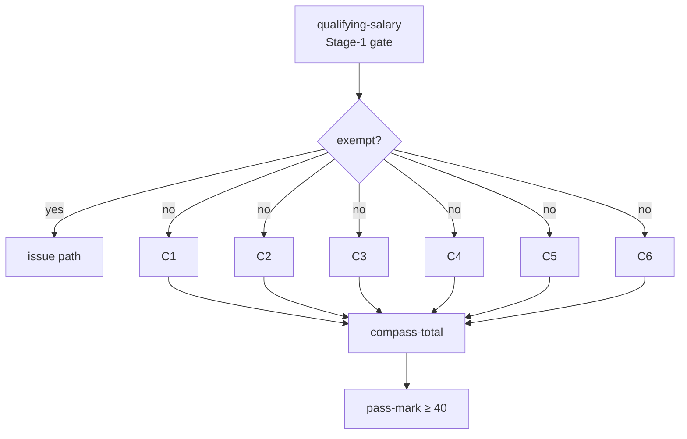

# Case study — a points-based work-pass decision (Singapore Employment Pass / COMPASS)

> _This is a **design-validation case study**, not a shipped product and not the canonical reference
> product. It deliberately models a **real, publicly documented** government decision system —
> Singapore's Ministry of Manpower (MOM) **Employment Pass (EP)** under the **COMPASS** points
> framework — because it is one of the most **deeply and openly published** points-based government
> decisions in the world, and therefore an honest, checkable stress-test of the ichiflow design. Every
> rule below is grounded in MOM's published framework (cited inline); nothing here is invented policy._
>
> _**On the "no real government systems are named" rule (BRIEF §16).** That rule governs ichiflow's
> shipped **templates and reference product** — the canonical example stays the fictional municipal
> permit ([`../creating-a-permit-product.md`](../creating-a-permit-product.md)). This document is a
> different artifact class: an **external validation fixture** whose rules are a matter of public
> record, used to pressure-test the framework the way a compiler team tests against a published
> language spec. It ships as documentation, never as an onboarding template. The distinction is called
> out again in [GAPS](#gaps)._
>
> _Consistent with the sibling case studies, this is **design fiction grounded in the real design**:
> every artifact is written to be consistent with [`../../architecture/BRIEF.md`](../../architecture/BRIEF.md)
> and docs `00`–`13`. The Document / doctemplate / issue-document nouns are the capability a sibling
> design is specifying; they are used here as settled vocabulary. Policy figures are cited; where MOM
> publishes a value only inside an annually-released PDF (the per-sector dollar benchmarks), the number
> is marked **illustrative** and the **shape** — an effective-dated table — is what is load-bearing._

---

## 1. Why this case, and what it stresses

The Employment Pass decision is a two-stage test that MOM documents in full public detail:

1. **Stage 1 — qualifying salary.** The candidate's **fixed monthly salary** must meet a floor that
   **rises with age** and **differs by sector** (higher for Financial Services). From 1 Jan 2025 the
   floor is **S$5,600/month** (general) and **S$6,200/month** (Financial Services) for the youngest
   applicants, rising progressively to roughly **S$10,700 / S$11,800** by the mid-40s; both floors rise
   again to **S$6,000 / S$6,600** from 1 Jan 2027.[^edb][^mom-ep]
2. **Stage 2 — COMPASS.** If Stage 1 is cleared (and the application is not exempt), the candidate is
   scored on the **Complementarity Assessment (COMPASS)** points system and must reach **≥ 40
   points**.[^mom-compass]

COMPASS has **four foundational criteria** (each scores **0 / 10 / 20**) and **two bonus criteria**:

| Criterion | What it measures | Attribute of | Bands (published) |
|---|---|---|---|
| **C1 Salary** | Fixed monthly salary vs local-PMET **sector benchmark** | individual | ≥ 90th pct → 20 · 65th–<90th → 10 · else 0[^mom-c1] |
| **C2 Qualifications** | Degree standing / awarding institution | individual | Top-tier institution → 20 · degree-equivalent → 10 · else 0[^mom-compass] |
| **C3 Diversity** | Candidate's nationality **share of the firm's PMETs** | firm | < 5% → 20 · 5–<25% → 10 · ≥ 25% → 0[^mom-compass] |
| **C4 Support for local employment** | Firm's **local-PMET share** vs sector peers | firm | ≥ 50th pct → 20 · 20th–<50th → 10 · < 20th → 0 (firms ≥ 70% local PMET floor at 10)[^mom-compass] |
| **C5 Skills bonus** | Role on the **Shortage Occupation List (SOL)** | firm+role | up to **20** (10 if candidate nationality ≥ ⅓ of firm PMETs)[^mom-sol] |
| **C6 Strategic economic priorities** | Firm's investment / innovation commitments | firm | up to **10**[^mom-compass] |

**Exemptions** skip COMPASS entirely (Stage 1 still applies): fixed monthly salary **≥ S$22,500**, roles
of **one month or less**, and certain **overseas intra-corporate transferees**.[^mom-compass]

This case study states its stress dimensions **up front**, and every later section is written to exercise
one of them:

- **(S1) Points scoring over published, effective-dated benchmark tables updated annually.** The C1
  sector benchmarks and the SOL are **re-released every August** and take effect on published dates
  (the **Aug-2024** release governs applications dated **Jan–Dec 2025**; the **Aug-2025** release governs
  **new applications from 1 Jan 2026** and **renewals of passes expiring from 1 Jul 2026**).[^mom-c1] This
  is CodeSet **versioning + effective-dating + as-of evaluation** at its hardest.
- **(S2) Dual-party Cases across two Portals.** One Case is touched by **two parties on two Portals** —
  the **employer** files and attests firm-level facts (C3/C4/C6); the **candidate** supplies personal
  documents and evidences C1/C2. Neither owns the whole Case.
- **(S3) Long-lived entitlements + renewal under changed rules.** A pass is issued for **N years**; the
  **renewal** is a fresh determination against the **current** year's benchmarks — so the same worker at
  the same salary can score **differently on renewal**. This is a **bitemporal as-of** stress.
- **(S4) Explainability duty.** A rejected employer is entitled to the **exact per-criterion points
  breakdown**. Does the canonical `CompositeOutcome` express per-criterion scores well — or does it
  strain? (Answered honestly in [§2.3](#23-decisionmodels-in-decision-source-form) and [GAPS](#gaps).)

---

## 2. Artifacts

### 2.1 Schema — one Case, two parties

The application is one canonical Schema (TypeSpec-authored, JSON-Schema artifact; doc 02 §1). Its shape
encodes the dual-party reality: an `employer` block (firm-level facts feeding C3/C4/C6) and a
`candidate` block (individual facts feeding C1/C2), each **attributable to the party who attested it**.

```typespec
// contracts/src/employment-pass.tsp
@jsonSchema
@doc("An Employment Pass application flowing through the work-pass Flow. Two parties attest disjoint blocks.")
model EmploymentPassApplication {
  @doc("Global correlation id; the Case carries this as case_id.") id: string;
  intent: PassIntent;                          // NEW_APPLICATION | RENEWAL
  priorPassId?: string;                        // set on RENEWAL — links the entitlement lifecycle (§2.5)
  sector: SectorCode;                          // codeRef → compass-c1-benchmarks + qualifying-salary-benchmarks
  candidate: Candidate;                        // attested by the CANDIDATE portal
  employer: Employer;                          // attested by the EMPLOYER portal
  role: RoleDetails;                           // job title, SSOC occupation code (codeRef → shortage-occupation-list)
}

model Candidate {
  fullName: string;
  @doc("Age in years at application date — drives the qualifying-salary floor.") age: int32;
  @doc("Fixed monthly salary in SGD: basic pay + fixed monthly allowances (MOM definition).")
  fixedMonthlySalary: int32;
  qualification: QualificationClaim;           // institution + degree — evidences C2
  nationality: string;                         // ISO-3166; feeds C3/C5 (share-of-PMET math)
}

model Employer {
  uen: string;                                 // firm identifier
  sector: SectorCode;
  @doc("Firm PMET headcount by nationality — the C3 diversity + C5 denominator.") pmetByNationality: Record<int32>;
  @doc("Firm local-PMET share, benchmarked vs sector peers for C4.") localPmetShare: float32;
  strategicPriorities?: StrategicPriorityClaim[]; // C6 — investment/innovation commitments (evidenced)
}

enum PassIntent { newApplication: "NEW_APPLICATION", renewal: "RENEWAL" }
```

The `pmetByNationality` map is the single fact that both **C3** (candidate's share of firm PMETs) and
**C5**'s reduction test (nationality ≥ ⅓ of firm PMETs) read — modelling it once keeps the two criteria
consistent. Field-level provenance (which party attested which field) rides on the Case, so the
DecisionRecord can attribute a firm-level fact to the employer and a personal fact to the candidate
(doc 08 §1); this is what makes **(S2)** auditable rather than a UI convenience.

### 2.2 CodeSets — the effective-dated reference tables, with owning Teams

Every number MOM re-releases annually is a **governed CodeSet** (doc 02 §9.1): schema'd, row-structured,
semver-versioned, **effective-dated**, carrying per-audience display metadata, and **owned by a Team with
named stewards** (doc 06 Part 4; ADR-0025). Decisions reference them by `id@version`; nothing is inlined
(doc 03 §2.2). This is the heart of **(S1)**.

```yaml
# codesets/compass-c1-benchmarks.yaml — the annually-released C1 sector salary benchmarks
kind: CodeSet
metadata:
  id: compass-c1-benchmarks
  version: 2026.0.0                     # the "Aug-2025 release" version line
  governanceState: released
  owningTeam: work-pass-policy          # steward: named policy officers (doc 06 Part 4)
  effective: { from: 2026-01-01, to: null }   # new apps from 1 Jan 2026; renewals expiring from 1 Jul 2026
  provenance: { source: "MOM C1 salary benchmarks, Aug-2025 release" }   # citation on the artifact itself
schema: contracts/jsonschema/C1Benchmark.json
rows:
  # value_10 = 65th-percentile local-PMET salary; value_20 = 90th percentile — BOTH per sector.
  # Dollar figures below are ILLUSTRATIVE (MOM publishes them only inside the release PDF); the
  # effective-dated, per-sector SHAPE is the load-bearing part (see GAPS).
  - sector: FINANCIAL_SERVICES        value_10: 7500   value_20: 12500
  - sector: INFOCOMM                  value_10: 6800   value_20: 11500
  - sector: PROFESSIONAL_SERVICES     value_10: 6500   value_20: 11000
  - sector: MANUFACTURING             value_10: 6000   value_20: 10500
---
# codesets/compass-c1-benchmarks.yaml @ 2025.0.0 (the PRIOR "Aug-2024 release") stays checked in,
# effective: { from: 2025-01-01, to: 2025-12-31 } — this is what a renewal's as-of query resolves against.
```

```yaml
# codesets/qualifying-salary-benchmarks.yaml — Stage-1 floor by (age band × sector)
kind: CodeSet
metadata: { id: qualifying-salary-benchmarks, version: 2025.0.0, governanceState: released,
            owningTeam: work-pass-policy, effective: { from: 2025-01-01, to: null } }
rows:                                    # illustrative interior; endpoints are the published anchors
  - { sector: GENERAL,            ageBand: "20-22", floor: 5600 }    # published floor[^edb]
  - { sector: GENERAL,            ageBand: "45+",   floor: 10700 }   # published upper anchor[^mom-ep]
  - { sector: FINANCIAL_SERVICES, ageBand: "20-22", floor: 6200 }    # published floor[^edb]
  - { sector: FINANCIAL_SERVICES, ageBand: "45+",   floor: 11800 }   # published upper anchor[^mom-ep]
# A future release codesets/qualifying-salary-benchmarks.yaml @ 2027.0.0 sets GENERAL 20-22 → 6000,
# FINANCIAL_SERVICES 20-22 → 6600, effective: { from: 2027-01-01 } — merged now, activates then (S1).
```

```yaml
# codesets/shortage-occupation-list.yaml — the SOL that C5 reads (also re-released annually)
kind: CodeSet
metadata: { id: shortage-occupation-list, version: 2025.0.0, governanceState: released,
            owningTeam: work-pass-policy, effective: { from: 2025-01-01, to: null } }
schema: contracts/jsonschema/SolEntry.json
rows:                                    # 2025 release added e.g. semiconductor/instrumentation/production engineers[^mom-sol]
  - occupationCode: "2144-SEMI"   title: "Semiconductor engineer"   addedIn: "2025-release"
  - occupationCode: "2144-INST"   title: "Instrumentation engineer" addedIn: "2025-release"
```

```yaml
# codesets/compass-outcome-codes.yaml — reasons + conditions + exemptions, with codeRef cross-links
kind: CodeSet
metadata: { id: compass-outcome-codes, version: 1.0.0, governanceState: released, owningTeam: work-pass-policy }
rows:
  - code: STAGE1_SALARY_BELOW_FLOOR   kind: reason
    codeRef: { qualifying-salary-benchmarks: "by (sector,ageBand)" }   # cross-CodeSet FK (doc 02 §9.4)
    display: { professionalLabel: "Fixed salary below qualifying-salary floor for age/sector",
               plainLanguage: { en: "The salary offered is below the minimum for this age and sector." } }
  - code: COMPASS_BELOW_40            kind: reason
    display: { professionalLabel: "COMPASS total below 40-point pass mark",
               plainLanguage: { en: "The application did not reach the 40-point COMPASS pass mark." } }
  - code: EXEMPT_HIGH_SALARY          kind: exemption
    display: { professionalLabel: "COMPASS-exempt: fixed salary ≥ S$22,500" }
  - code: MED_EXAM_REQUIRED           kind: blocking      dueWithin: P30D
    display: { professionalLabel: "Medical examination required before issuance",
               plainLanguage: { en: "You must complete a medical examination before the pass is issued." } }
  - code: IPA_ISSUED                  kind: post-approval-obligation
    display: { professionalLabel: "In-Principle Approval issued; candidate must enter & complete formalities" }
```

Cross-CodeSet **`codeRef`** integrity is validated at publish (doc 02 §9.4): `compass-outcome-codes`
points at `qualifying-salary-benchmarks`, so **deprecating** an age-band row triggers publish-time impact
analysis on every dependent DecisionModel and Flow before it can retire (doc 03 §5.8). Owning-Team
ownership means a benchmark bump is an **approval Case routed to the `work-pass-policy` stewards** (doc 03
§5.8, doc 06 Part 4), not a spreadsheet edit.

### 2.3 DecisionModels in decision-source form

COMPASS is authored as a **DRD** (Decision Requirements Diagram) — the full-DMN feature set the decision
source projects one-way to DMN 1.6 XML (doc 03 §2.6). C1–C6 are **decision nodes** feeding a **total**
node feeding a **pass/fail** node. This DRD shape is the whole answer to the (S4) explainability question,
and it is deliberately **not** a `CompositeOutcome` — see the analysis after the artifacts.



**C1 — salary vs sector benchmark** (a decision table reading the effective-dated CodeSet, hit policy
`FIRST`):

```text
# decisions/compass-c1.decision-source (rendered table view; references compass-c1-benchmarks@<pinned>)
inputs:  fixedMonthlySalary : number      # candidate.fixedMonthlySalary
         v10 = lookup(compass-c1-benchmarks, sector).value_10     # 65th pct  (BKM invocation)
         v20 = lookup(compass-c1-benchmarks, sector).value_20     # 90th pct
| # | when                              | c1Points |
|---|-----------------------------------|----------|
| 1 | fixedMonthlySalary >= v20         | 20       |
| 2 | fixedMonthlySalary >= v10         | 10       |
| 3 | otherwise                         | 0        |
```

**C2 — qualifications**, **C3 — diversity**, **C4 — support for local employment** as decision-source
tables (each emitting a bare point score, attributed to its criterion):

```text
# decisions/compass-c2.decision-source
| institutionTier                     | c2Points |
| "top-tier" (codeRef top-tier-list)  | 20       |
| "degree-equivalent"                 | 10       |
| otherwise                           | 0        |

# decisions/compass-c3.decision-source   (candShare = candidate.nationality count / firm PMET total)
| when candShare               | c3Points |
| candShare < 0.05             | 20       |
| candShare < 0.25             | 10       |
| otherwise                    | 0        |

# decisions/compass-c4.decision-source   (hit policy FIRST; ≥70%-local is a MINIMUM floor, so it sits
#                                          AFTER the percentile rows — a ≥70% firm still scores 20 at ≥50th pct)
| when                                          | c4Points |
| localPmetPercentileVsSector >= 0.50           | 20       |
| localPmetPercentileVsSector >= 0.20           | 10       |
| employer.localPmetShare >= 0.70               | 10       |   # ≥70%-local floor: minimum 10 even if <20th pct
| otherwise                                     | 0        |
```

**C5/C6 bonus** and the **total + pass-mark**, expressed as decision-source literal-FEEL / context nodes
(not tables) — exactly the "full DMN surface, not tables only" the projection guarantees (doc 03 §2.6):

```text
# decisions/compass-total.decision-source  (a FEEL context node feeding the pass-mark node)
context:
  c5Points : if role.occupationCode in shortage-occupation-list.codes
               then (if candShare < 0.3333 then 20 else 10) else 0     # SOL bonus w/ nationality reduction
  c6Points : if employer.strategicPriorities != null then 10 else 0
  total    : c1Points + c2Points + c3Points + c4Points + c5Points + c6Points
  breakdown: { c1: c1Points, c2: c2Points, c3: c3Points, c4: c4Points, c5: c5Points, c6: c6Points }
# decisions/compass-passmark.decision-source
outcome: if total >= 40 then Outcome{type:"approve"} else Outcome{type:"deny", reasons:[COMPASS_BELOW_40]}
```

**The two-stage test as a governed gate.** Stage 1 and Stage 2 compose sequentially — Stage 1 is a
`blocking` gate; if it denies, COMPASS never runs. This is a **`condition-gate` chain in the Flow**
(doc 04 §5.5), not a cross-authority composition, because **both stages are the same authority (MOM)**.

**Does `CompositeOutcome` express per-criterion scores? — the honest finding.** `CompositeOutcome`
aggregates **N Outcomes from N authorities** under a composition policy (all-must-approve / any-blocks /
quorum / weighted; doc 03 §2.3). COMPASS is **one authority (MOM)** computing **one weighted tally over
six criteria** — that is a **single DecisionModel with a DRD**, not a multi-authority composite. Forcing
COMPASS into `CompositeOutcome` with `policy: weighted` would **misattribute** each criterion as an
"authority," which it is not, and would smuggle the 40-point threshold into a composition policy that was
designed for approve/deny votes, not integer sums. So the design's own guidance is followed: **governed
business logic with a numeric threshold → a Decision (DRD), not a composition policy.** The per-criterion
breakdown is a **first-class part of the DecisionTrace** — the DRD's six sub-decision results are
snapshotted per node into the DecisionRecord (doc 03 §7; doc 08 §1.5), so the "exact points breakdown"
the (S4) duty requires is reconstructable per criterion, per pinned benchmark version. **Where it
strains** — and this is a real, minor gap — is that the canonical `Outcome` carries `reasons[]` and
`conditions[]` but **no typed `scoreBreakdown[]`**; today the numeric per-criterion attribution rides in
the trace's intermediate values rather than in the Outcome contract itself. That is enough for audit, but
a rejected employer's statutory breakdown arguably deserves to be **first-class on the Outcome**, not
reconstructed from trace internals. Flagged in [GAPS](#gaps).

### 2.4 Flow — verification, external-task, and issuance

The Flow wires validation → Stage-1 gate → exemption branch → COMPASS DRD → medical/verification →
issuance. Verification of firm-level facts (C3/C4 headcount) and the candidate's credential check are
**`external-task` delegation steps** (doc 04 §2.8): submit through an outbound Adapter, await a
**correlated** inbound reply under a **pausable SLA**, validate against a response schema, resume.

```yaml
# flows/work-pass.flow.yaml  (authored-in: yaml; canonical Flow JSON is the executed artifact — doc 04 §2.5)
id: work-pass
case: EmploymentPassApplication
steps:
  - { id: validate, type: validate, schema: schema://work-pass/EmploymentPassApplication/1 }
  - id: stage1, type: decision-eval, model: qualifying-salary@2025.0.0     # Stage-1 floor gate
  - { id: gate1, type: condition-gate, on: "stage1.type == 'deny'", deny: emit-rejection }
  - id: exempt, type: decision-eval, model: compass-exemption@1.0.0        # ≥$22,500 / ≤1mo / ICT
  - id: route, type: branch, on: "exempt.type"
    exempt: goto: issue                                                    # skip COMPASS entirely
    scored: seq:
      # firm-level facts are verified against the employer's records before scoring C3/C4
      - id: verify-firm-pmet
        type: external-task                                               # doc 04 §2.8, §5.8
        request:  { schema: schema://vetting/FirmPmetCheck/1,  adapter: adapter://vetting/pmet-submit }
        response: { schema: schema://vetting/FirmPmetResult/1, inbound: adapter://vetting/pmet-reply }
        correlation: { inject: { as: header, name: x-correlation-id, from: "case_id & '/' & step.id" },
                       extract: "response.correlationId" }
        sla: { budget: P5D, onTimeout: chain/vetting-esc-1 }              # pausable clock (doc 04 §5.7)
        onMalformed: dlq
      - id: compass, type: decision-eval, model: compass@2026.0.0         # the C1–C6 DRD (§2.3)
      - id: gate2, type: condition-gate, on: "compass.type == 'deny'", deny: emit-rejection
  - id: medical
    type: human-task                                                      # MED_EXAM_REQUIRED blocking condition
    assignBy: assign-med-officer@1.0.0                                    # routing is a Decision (doc 04 §5.3)
    sla: { budget: P30D }
  - id: issue-ipa
    type: issue-document                                                  # doctemplate → Document (§2.5)
    template: ipa-letter@1.0.0
    binds: { decisionRecord: "${case.decisionRecord}", applicant: "${case.candidate}" }
  - id: await-entry, type: human-task, subState: awaiting-applicant       # candidate enters SG; clock-stops
  - id: issue-pass
    type: issue-document
    template: employment-pass@1.0.0
    validity: { years: 2, from: "${today}" }                             # long-lived entitlement (§2.5, S3)
```

The `external-task` on `verify-firm-pmet` measures the **vetting system's own turnaround** (its SLA does
not pause while that system works; doc 04 §5.8). By contrast the `await-entry` Task **clock-stops** while
waiting on the candidate — an `awaiting-applicant` sub-state that excludes applicant wait from the SLA
(doc 04 §5.7). Transport under the `external-task` is pluggable: HTTP sync/callback/polling and MQ
request-reply in v1, with an SFTP file round-trip **designed now, implemented post-v1** (doc 05 §11;
ADR-0028) — relevant because government vetting integrations are frequently batch/file-based.

### 2.5 doctemplates — the IPA letter and the pass itself

Issuance is **`issue-document`** binding a **doctemplate** to Case data + the DecisionRecord, producing a
governed **Document** (now normatively owned by [ADR-0029](../../adr/0029-document-issuance.md) /
[04 §2.9](../../architecture/04-flow-and-case-layer.md) / [07 §15](../../architecture/07-ui-and-portals.md)).
Two are issued in sequence: the **In-Principle Approval
(IPA)** letter, then — after entry and medical clearance — the **Employment Pass** itself, a long-lived
entitlement Document with a validity window.

```yaml
# doctemplates/ipa-letter.doctemplate.yaml
kind: doctemplate
metadata: { id: ipa-letter, version: 1.0.0, governanceState: released, owningTeam: work-pass-policy }
binds:
  applicantName:  "${candidate.fullName}"
  compassTotal:   "${decisionRecord.compass.breakdown.total}"       # per-criterion breakdown available
  benchmarkAsOf:  "${decisionRecord.compass.pins['compass-c1-benchmarks']}"   # which table version applied
  conditions:     "${outcome.conditions}"                           # MED_EXAM_REQUIRED etc., dual-audience
copyset: work-pass-copy@1.0.0                                       # translator-friendly microcopy (doc 07 §13)
---
# doctemplates/employment-pass.doctemplate.yaml — the entitlement Document
kind: doctemplate
metadata: { id: employment-pass, version: 1.0.0, governanceState: released, owningTeam: work-pass-policy }
binds:
  passId:      "${issue.documentId}"
  holder:      "${candidate.fullName}"
  validFrom:   "${validity.from}"
  validTo:     "${validity.from + validity.years}"                  # the N-year entitlement window (S3)
  renewableFrom: "${validTo - P6M}"                                 # renewal window opens before expiry
```

The pass Document is the **entitlement of record**: its validity window and `passId` are what a **renewal**
Case (`intent: RENEWAL`, `priorPassId`) links back to in §3 Trace C. Cancellation/revocation operate on
this Document — a **cancel** Case with a `cancellation-reasons` codeRef terminates it (doc 04 §5.6).

---

## 3. Three end-to-end walkthrough traces

### Trace A — pass at **exactly 40 points**, with per-criterion breakdown

A 2025 new application: an INFOCOMM firm files for a 34-year-old candidate, fixed salary
**S$11,600/month**, top-tier degree, at a firm where the candidate's nationality is 18% of PMETs and
local-PMET share sits **below the sector's 20th percentile**; the role is **not** on the SOL and the firm
claims no strategic priorities.

```jsonc
// get_case_trace("EP-4471") → Tier-0, auto (excerpt: the COMPASS DRD result + DecisionRecord)
{ "case_id": "EP-4471", "stage1": { "type": "approve",
    "floor": 8900, "salary": 11600, "pins": { "qualifying-salary-benchmarks": "2025.0.0" } },
  "compass": { "type": "approve", "total": 40,
    "breakdown": { "c1": 10, "c2": 20, "c3": 10, "c4": 0, "c5": 0, "c6": 0 },
    "pins": { "compass-c1-benchmarks": "2025.0.0", "shortage-occupation-list": "2025.0.0" },
    "why": {
      "c1": "11600 ≥ v10(6800) but < v20(12000) for INFOCOMM → 10",
      "c2": "top-tier institution → 20",
      "c3": "candidate nationality 18% of firm PMETs (5–<25%) → 10",
      "c4": "local-PMET below 20th sector pct, not ≥70% floor → 0",
      "c5": "role not on SOL 2025.0.0 → 0",  "c6": "no strategic-priority claim → 0" } } }
```

**What the trace shows:** `10 + 20 + 10 + 0 + 0 + 0 = 40` — a pass at the **exact pass mark**, with each
criterion's contribution, the **rule** that produced it, and the **pinned benchmark version** it read.
Change C1's benchmark and the pass flips — so pinning `compass-c1-benchmarks@2026.0.0` into the
DecisionRecord is what makes the "why 40" answer reproducible forever (doc 03 §7). The IPA is then issued
with `MED_EXAM_REQUIRED` as a blocking condition gating `issue-pass`.

### Trace B — fail, then **appeal with added evidence**

The same firm files for a second candidate who scores **30** (C1 10, C2 0 — the institution was not on
the top-tier list, C3 10, C4 10). COMPASS denies with `COMPASS_BELOW_40`. The employer receives the
**per-criterion breakdown** and sees the gap is C2.

```jsonc
// explain_decision("EP-4478") → Tier-0, auto
{ "answer": "Denied at COMPASS: total 30 < 40. Gap is C2 (qualifications): the awarded 0 because the
   institution 'Northgate Institute' was not found on top-tier-institutions@2026.0.0. C1/C3/C4 = 10 each.",
  "breakdown": { "c1":10, "c2":0, "c3":10, "c4":10, "c5":0, "c6":0, "total":30 },
  "cites": [ "compass-c2@1.0.0", "top-tier-institutions@2026.0.0" ] }
```

The employer lodges an **appeal** (doc 04 §5.6) — a **correlated child Case** referencing the parent's
DecisionRecord, reason-coded from an `appeal-reasons` CodeSet — supplying **added evidence**: the
candidate in fact holds a **second** degree from a top-tier institution not declared in the original
filing. The appeal Case re-evaluates `compass@2026.0.0` **against the same pinned benchmark versions as
the parent** (an appeal contests the original determination, so it must be judged on the rules in force
**then** — a within-Case as-of, doc 03 §5.7), with the corrected `qualification` fact:

```jsonc
// get_case_trace("EP-4478-APL") → child appeal Case
{ "parent": "EP-4478", "kind": "appeal",
  "compass": { "type": "approve", "total": 50,
    "breakdown": { "c1":10, "c2":20, "c3":10, "c4":10, "c5":0, "c6":0 },
    "pins": { "compass-c1-benchmarks": "2026.0.0" },   // SAME pins as parent — as-of the original filing
    "why": { "c2": "added evidence: top-tier institution 'Meridian University' → 20 (was 0)" } } }
```

**What this exercises:** the appeal is not a mutation of the closed parent Case — it is a governed child
Case with its own DecisionRecord, judged **as-of the parent's pinned rules**, and the delta (C2 0 → 20) is
attributable to the **specific added fact**, not to a rule change. The parent stays denied-and-superseded;
the child approves. Explainability spans both.

### Trace C — **renewal under newer benchmarks**: the same worker scores differently

Trace A's candidate holds a pass issued in **2025** under the **Aug-2024 (2025.0.0)** benchmark line,
coming up for renewal in 2026. Because the pass **expires after 1 Jul 2026**, the renewal — a Case with
`intent: RENEWAL`, `priorPassId` linking the entitlement Document (§2.5) — falls under MOM's rule that
**renewals of passes expiring from 1 Jul 2026 use the Aug-2025 (2026.0.0) benchmarks**.[^mom-c1] Nothing
about the candidate changed: same **S$11,600** salary, same firm. But the C1 benchmark for INFOCOMM
**rose**, and the renewal is a **fresh determination under the current rules**:

```jsonc
// get_case_trace("EP-4471-RNW") → renewal child Case
{ "intent": "RENEWAL", "priorPassId": "EP-4471-PASS",
  "compass": { "type": "deny", "total": 30,
    "breakdown": { "c1": 0, "c2": 20, "c3": 10, "c4": 0, "c5": 0, "c6": 0 },
    "pins": { "compass-c1-benchmarks": "2026.0.0" },        // CURRENT release governs a renewal
    "why": { "c1": "under 2026.0.0 INFOCOMM v10 rose to 12000 → 11600 < 12000 → 0 (was 10 under 2025.0.0 v10=6800)",
             "delta": "C1 10 → 0: the benchmark moved, the worker did not" } },
  "reasons": [ "COMPASS_BELOW_40" ] }
```

**The bitemporal as-of reasoning, made explicit.** Two questions have two different, both-correct answers:

- _"As of the **original** issuance (2024), which rule applied and why did the worker pass?"_ →
  `compass-c1-benchmarks@2025.0.0`, effective `2025-01-01..2025-12-31`, INFOCOMM `v10 = 6800` →
  `11600 ≥ 6800` → C1 = 10 → total 40 → **approve**.
- _"As of the **renewal** (2026), which rule applies and why does the same worker now fail?"_ →
  `compass-c1-benchmarks@2026.0.0`, effective `2026-01-01..`, INFOCOMM `v10 = 12000` (illustrative) →
  `11600 < 12000` → C1 = 0 → total 30 → **deny**.

The DecisionRecord for each Case pins the benchmark version **that was effective as of that Case's
evaluation** — not the version the entitlement was originally granted under (doc 03 §2.2, §5.7). ichiflow's
bitemporal as-of support (BRIEF §9) answers **both** questions from the audit spine: the original Case is
frozen against `2025.0.0`; the renewal Case is frozen against `2026.0.0`; the "why did the same worker
pass then and fail now" answer is **"the benchmark moved, the worker did not,"** and the why API can prove
it by diffing the two pins. This is (S1) and (S3) meeting head-on — and the design holds because
**activation-time (effective-dating) is decoupled from evaluation-time (which Case, as-of when)**.

---

## 4. Dual-party across two Portals — how one Case has two front doors

Two **Portals** (doc 07 §5) touch **case_id EP-4471**, each with its own IdP config and entitlements
(doc 06), each scoped to the block its party may see and attest:

```text
EMPLOYER PORTAL (firm HR user)                      CANDIDATE PORTAL (the worker)
  • files the application, opens the Case             • supplies passport, qualification certs
  • attests employer.* (C3/C4/C6 facts)               • attests candidate.* (C1 salary, C2 qual)
  • sees firm-level breakdown (C3/C4/C6)              • sees personal-status + "what you must still do"
  • CANNOT see the candidate's other-employer data    • CANNOT see firm PMET headcount internals
```

Row/field-level entitlements from the **same PDP** (BRIEF §8; OpenFGA) drive both the generated API and
the generated UI, so the employer never sees the candidate's private documents and the candidate never
sees firm headcount internals — **one Case, one DecisionRecord, two authorization projections**. Field
provenance (§2.1) records which party attested which fact, so an appeal (Trace B) can attribute a
corrected fact to the party who supplied it. The blocking `MED_EXAM_REQUIRED` and the entry step surface
on the **candidate** Portal in plain language; the per-criterion breakdown surfaces on the **employer**
Portal in technical form — the same dual-audience CodeSet rendering as the permit product (doc 07 §4.1).

---

## 5. Checks-and-balances verification table

| Stress / duty | ichiflow mechanism | Where it lands in the audit spine |
|---|---|---|
| **(S1)** annual benchmark tables | `compass-c1-benchmarks` / `shortage-occupation-list` / `qualifying-salary-benchmarks` as **effective-dated CodeSets**, released by git merge + future `effective.from` (doc 03 §5.7) | pinned `codeSet@version` in each DecisionRecord (§7) |
| **(S1)** as-of correctness | evaluation resolves the version **effective as of the Case**, not "latest" | Trace C two-pin diff via why API |
| **(S2)** dual party | two Portals + one Schema with attributed blocks; same PDP, two projections (doc 06/07) | field-level provenance on the Case (doc 08 §1) |
| **(S3)** long-lived entitlement | pass as an `issue-document` **Document** with validity window; renewal is a correlated child Case | `priorPassId` linkage; per-Case pins |
| **(S3)** renewal under new rules | renewal Case pins **current** benchmarks; original Case stays frozen | bitemporal as-of (BRIEF §9) |
| **(S4)** per-criterion breakdown | COMPASS as a **DRD** (single authority), six sub-decision results snapshotted | DecisionTrace `breakdown{}` + per-node `why` (doc 03 §7) |
| exemptions | `compass-exemption` Decision short-circuits the COMPASS branch | `EXEMPT_HIGH_SALARY` reason recorded |
| verification | firm-PMET + credential checks as **`external-task`** with pausable SLA + DLQ (doc 04 §2.8/§5.8) | submitted/ack'd/responded trace (doc 04 §7) |
| medical / applicant wait | `human-task` with **clock-stop** `awaiting-applicant` (doc 04 §5.7) | distinct clock-stop event |
| appeal | correlated child review Case, `appeal-reasons` codeRef, judged **as-of parent pins** (doc 04 §5.6) | parent↔child DecisionRecord link |
| cancellation / revocation | **cancel** Case over the pass Document with `cancellation-reasons` codeRef (doc 04 §5.6) | terminal disposition + reason |
| benchmark deprecation | publish-time impact analysis + owning-Team approval fan-out (doc 03 §5.8) | impact set + approvals on the spine |
| governance of a rule change | benchmark bump = approval Case routed to `work-pass-policy` stewards (doc 06 Part 4) | approval-Flow record |

---

## GAPS

**Blocking — none.** Every mechanism the case needs exists in the current design; the case study did not
require inventing a new primitive.

**Framing (must-state, non-technical).**

- **This case names a real government system, which the shipped product must not** (BRIEF §16). It is
  admissible **only** as an external validation fixture in documentation, on the strength of its rules
  being fully public. It must never be reused as an onboarding template, an ADR example, or the reference
  product — the fictional permit remains canonical. If this document ever risks being read as
  "ichiflow ships a Singapore-EP template," it should be moved or retitled. **This is a governance
  guardrail, not a technical gap.**

**Minor (design-level, worth an ADR or a doc note).**

1. **No typed `scoreBreakdown[]` on `Outcome`.** COMPASS's per-criterion scores currently live in the
   **DecisionTrace** intermediate values, reconstructable but **not first-class on the `Outcome`
   contract** (doc 02 §9.3). For a decision whose explainability duty is a *statutory per-criterion
   breakdown to a rejected party*, a typed, ordered `scoreBreakdown[]` (criterion, points, band, reason,
   pinned-benchmark) on the Outcome would make the breakdown a **contract**, not an audit-time
   reconstruction. Recommend an `Outcome.scoreBreakdown?` extension for points-based decisions.

   **Resolved (2026-07 gap-fix round):** typed **`Outcome.scoreBreakdown[]`** (`ScoreLine = { criterion,
   points, band, whyRef }`) is now first-class in [02 §9.3](../../architecture/02-schema-foundation.md) and
   survives `CompositeOutcome` composition — so a rejected employer's per-criterion breakdown is a typed
   contract on the Outcome, not an audit-time reconstruction from the DecisionTrace.
2. **`CompositeOutcome` is the wrong tool for single-authority multi-criterion scoring — say so
   explicitly.** The analysis in §2.3 concludes COMPASS is a DRD, not a composite. This is the **right**
   outcome, but the composition-policy table (doc 03 §2.3) invites the mistake because `weighted` looks
   superficially applicable. A one-line note in doc 03 — _"per-criterion scoring within one authority is a
   DRD, not a `CompositeOutcome`; composition is across authorities"_ — would prevent authors from
   modelling points systems as fake multi-authority composites.

   **Resolved (2026-07 gap-fix round):** [03 §2.3](../../architecture/03-decision-layer.md) now carries the
   two-level composition modelling rule with the explicit misuse warning — *single authority scoring N
   criteria = a DRD (not a `CompositeOutcome`); N independent authorities = a `CompositeOutcome`; a review
   panel = a DRD-per-reviewer composed across reviewers* — and notes that `weighted` looks superficially
   applicable to a single-authority points tally but misattributes each criterion as an "authority." The
   grants case is the design's first correct exercise of the composite across genuine N authorities.
3. **Per-sector benchmark dollar values are not machine-public.** MOM publishes C1's per-sector figures
   only inside an annually-released **PDF**, not as a structured feed. The CodeSet **shape** is correct and
   the **percentile bands, qualifying salaries, and exemptions are public and cited**; but a real
   deployment would need a **governed ingestion step** (PDF → reviewed CodeSet rows → approval Case) each
   August. This is an operational reality for any effective-dated reference table sourced from a
   human-readable release, and reinforces (S1)'s CodeSet-governance story rather than contradicting it.
   The dollar figures in §2.2/§3 are marked **illustrative** for exactly this reason.
4. **`localPmetPercentileVsSector` and the C1 percentile→dollar mapping are derived features.** C4's
   sector-percentile position and C1's percentile-to-benchmark conversion are MOM-internal computations
   over labour-force data ichiflow does not hold; modelled here as **inputs** the employer/MOM supply. A
   production integration would compute or fetch them via a **feature function / `external-task`** (doc 03
   §2.4), keeping the decision table itself clean — noted so the boundary is not mistaken for a rule.
5. **Renewal-timing rule is itself effective-dated policy.** "Renewals of passes expiring from 1 Jul 2026
   use the 2026 benchmarks" is a **cutover rule** that belongs in a small governed Decision (a feature-gate
   over `effectiveDate`, doc 03 §2.5), not hard-coded in the Flow. Modelled correctly here, but easy to
   accidentally inline.

---

### Where to go deeper

- CodeSets, effective-dating, `codeRef` integrity, the `Outcome`/`CompositeOutcome` contracts —
  [`../../architecture/02-schema-foundation.md`](../../architecture/02-schema-foundation.md) §9,
  [`../../architecture/03-decision-layer.md`](../../architecture/03-decision-layer.md) §2.2–§2.3.
- DRD authoring via decision source, governance dial, benchmark-change approval + impact analysis, the
  as-of / bitemporal story — [`../../architecture/03-decision-layer.md`](../../architecture/03-decision-layer.md)
  §2.6, §5.7, §5.8, §7.
- `external-task`, `human-task`, clock-stop SLAs, Case operations (appeal / cancel / correct),
  `issue-document` — [`../../architecture/04-flow-and-case-layer.md`](../../architecture/04-flow-and-case-layer.md)
  §2.8, §5.5–§5.8.
- Transport profiles under `external-task` (HTTP / MQ / SFTP) —
  [`../../architecture/05-adapters.md`](../../architecture/05-adapters.md) §11.
- Two-Portal dual-party authorization, owning Teams, per-audience rendering —
  [`../../architecture/06-identity-and-access.md`](../../architecture/06-identity-and-access.md) Part 4,
  [`../../architecture/07-ui-and-portals.md`](../../architecture/07-ui-and-portals.md) §4–§5.
- The canonical (fictional) reference product this case study is measured against —
  [`../creating-a-permit-product.md`](../creating-a-permit-product.md).

---

<!-- Sources — MOM and official Singapore government references (accessed July 2026) -->

[^mom-ep]: MOM, "Employment Pass eligibility" (qualifying salary rises with age, higher for Financial
    Services; upper anchors ~S$10,700 general / S$11,800 Financial Services).
    https://www.mom.gov.sg/passes-and-permits/employment-pass/eligibility
[^edb]: Singapore EDB, "Salary threshold for new Employment Pass applicants to be raised to $5,600 from
    2025" (S$5,600 general / S$6,200 Financial Services from 1 Jan 2025; new applicants 2025, renewals
    from the following year). https://www.edb.gov.sg/en/business-insights/insights/salary-threshold-for-new-employment-pass-applicants-to-be-raised-to-5600-from-2025.html
[^mom-compass]: MOM, "COMPASS — the Complementarity Assessment Framework" (two-stage test; four
    foundational criteria C1–C4 scored 0/10/20; bonus C5/C6; 40-point pass mark; exemptions ≥ S$22,500 /
    ≤ 1 month / certain intra-corporate transferees). https://www.mom.gov.sg/passes-and-permits/employment-pass/eligibility/compass
    and the COMPASS booklet https://www.mom.gov.sg/-/media/mom/documents/work-passes-and-permits/compass/compass-booklet.pdf
[^mom-c1]: MOM, "COMPASS C1. Salary benchmarks" (fixed monthly salary vs 65th/90th percentile of local
    PMET salaries by sector; benchmarks updated annually in August; Aug-2024 release applies to
    applications Jan–Dec 2025, Aug-2025 release applies to new applications from 1 Jan 2026 and renewals
    of passes expiring from 1 Jul 2026). https://www.mom.gov.sg/passes-and-permits/employment-pass/eligibility/compass-c1-salary-benchmarks
[^mom-sol]: MOM, COMPASS C5 Skills bonus and the Shortage Occupation List (SOL) — role on the SOL scores
    up to 20 bonus points, reduced to 10 if the candidate's nationality is ≥ ⅓ of the firm's PMETs; the
    2025 SOL added occupations including semiconductor, instrumentation, and production engineers.
    https://www.mom.gov.sg/passes-and-permits/employment-pass/eligibility/compass-c5-skills-bonus
